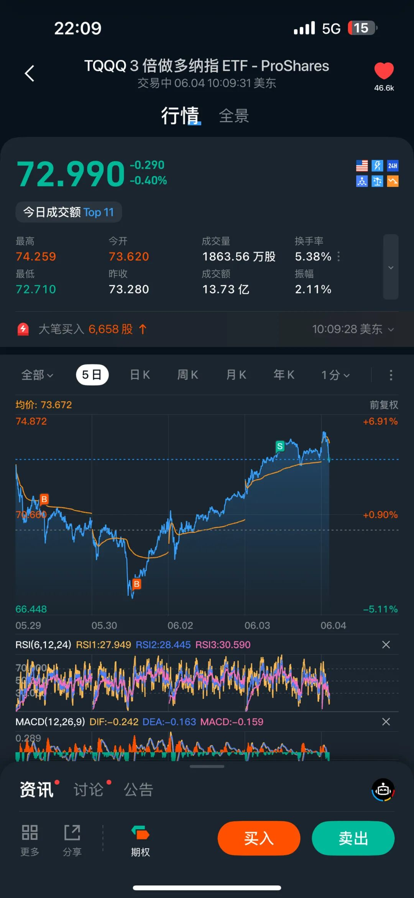
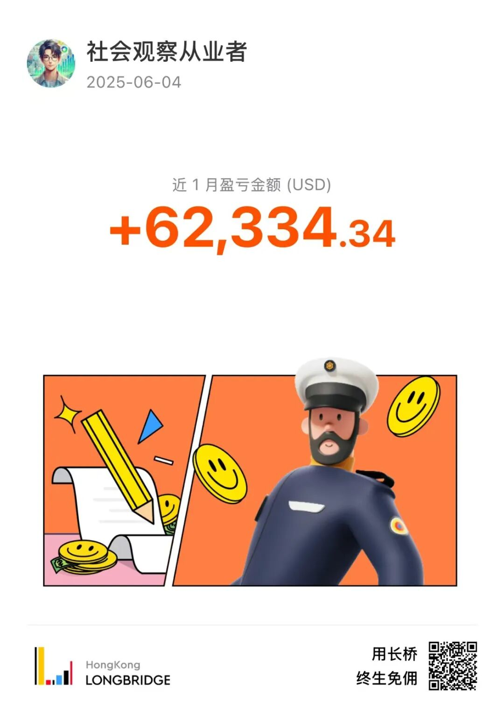

# 短线考虑大幅减仓，再次静待机会

**发布时间**: 2025-06-04 16:36:47

**原文链接**: [http://mp.weixin.qq.com/s?__biz=Mzk4ODc3ODgyOQ==&mid=2247483692&idx=1&sn=439de69c256936254c347c67d112db90&chksm=c581590ef2f6d01893bf2906da1f6d845c9014a75c9172e2f603a6e0171e2d4fc3a8aa882919#rd](http://mp.weixin.qq.com/s?__biz=Mzk4ODc3ODgyOQ==&mid=2247483692&idx=1&sn=439de69c256936254c347c67d112db90&chksm=c581590ef2f6d01893bf2906da1f6d845c9014a75c9172e2f603a6e0171e2d4fc3a8aa882919#rd)

---

这两天短线账户一直在做止盈，把持仓比例大幅度降了下来，一直以来的盘感告诉我最近将有调整，标普从 6000 回调到 5850，将是我重新抓短线的机会。  

  

  

当然，我也有理由了：

1\. 企业回购进入空窗期

5 月主要靠科技巨头回购，但进入 6 月中从银行开始，回购进入静默期，会缺乏支撑动能。

  

2\. 标普接近目标窗口价 6000 点

上篇文章提到，6000 点会是近期的乐观上限。

> 综合来看，主要投行对 S&P 500 的平均目标价约为 5993 点。
> 
> 公众号：社会观察从业者
> 
> [5 月到底为什么涨？（企业回购/CTA/标普窗口期）](https://mp.weixin.qq.com/s?__biz=Mzk4ODc3ODgyOQ==&mid=2247483687&idx=1&sn=29b6e328be99813b9f9f452f012ae81c&scene=21#wechat_redirect)

  

3\. 关税不确定性

Trump 抛出 50% 钢铁关税计划，并暗示扩大至其他商品，市场担忧中美、欧美贸易冲突再起。尽管有传言 G7 周五将通话，但我认为 CN 不会直接打电话。

  

 4\. 宏观数据走弱迹象增多

5 月 ADP 就业远低于预期，同时 ISM 非制造业 PMI 跌到 49.9。接下来的大非农、CPI、PPI 如果也继续疲软，可能引发市场对经济“硬着陆”的担忧，我不愿意重仓冒风险。

  

5\. 美联储 higher for longer 基调仍未松动

尽管市场押注 9 月开始降息，但多位官员仍表态需等待更多数据确认通胀持续回落。如果 6 月 FOMC 点阵图上调年底利率预期，市场估值会构成压力。

  

6\. 散户杠杆高企，脆弱性上升

科技股热度高涨，TQQQ、TSLL 等杠杆 ETF 交易活跃，VIX 长期低位徘徊。市场极度乐观时，容易因突发事件诱发技术性回调或清算踩踏。我们也可以参考 CNN 贪恐。

  

7\. 季度末再平衡压力

6 月是季度末，养老金、主权基金等大型资金可能进行股债再平衡，若股票仓位偏高，将存在被动减持压力。[美股今晚是否会有 Dip？（美国养老金&Rebalancing）](https://mp.weixin.qq.com/s?__biz=Mzk4ODc3ODgyOQ==&mid=2247483680&idx=1&sn=1bb6b960424c79a0750a5abfcaee8c00&scene=21#wechat_redirect)

  

最后的理由是，五月份短线收益不错，不需要贪最后一个铜板了。

长线账户依然持有正股，六月之后慢牛逻辑不变。

  

目前持有 Nvda Apple AMD Google C3 UNH CRM XPENG，静待花开🌸

  

5850 见🐒🎉