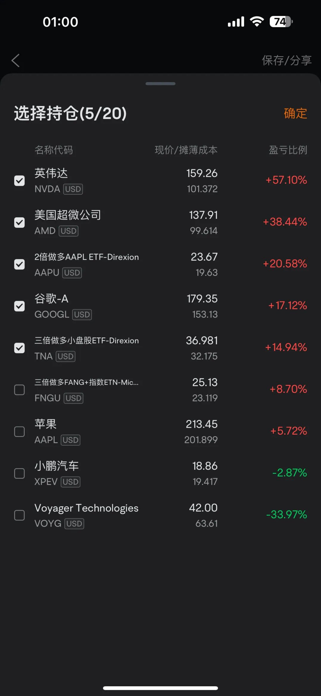

# 美股新高，阶段性止盈休息

**发布时间**: 2025-07-03 19:10:27

**原文链接**: [http://mp.weixin.qq.com/s?__biz=Mzk4ODc3ODgyOQ==&mid=2247483750&idx=1&sn=81e635a1001bc709b0c43aefe2ea30a1&chksm=c5815944f2f6d05219c0befb2d04c759029b4de3c1662f90072e58f4fcdb323d5276fdb527da#rd](http://mp.weixin.qq.com/s?__biz=Mzk4ODc3ODgyOQ==&mid=2247483750&idx=1&sn=81e635a1001bc709b0c43aefe2ea30a1&chksm=c5815944f2f6d05219c0befb2d04c759029b4de3c1662f90072e58f4fcdb323d5276fdb527da#rd)

---

  

伴随着非农数据继续强劲，美股继续新高，纳斯达克 22866，标普 6280。

  

只能说，无敌。

  

思考了一晚上，最后决定止盈，因为 CNN 贪恐到了极度贪婪，同时也是时候歇歇了，为 7.15 CPI 留出更多的现金仓位。

  

今天一点钟准时收盘，美股三天半长假。

  

顺便公布下持仓（止盈后的摊薄成本）吧，最后评论区互动一下，大家都吃到肉了吧😋🤪。

  

Cheers 🍻🥂

  

