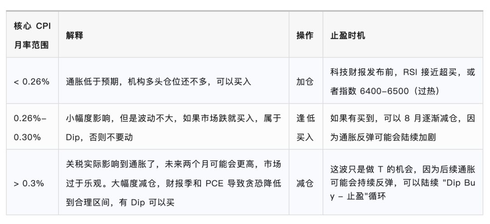

# 为什么本周二的 CPI 这么重要？

**发布时间**: 2025-07-14 18:00:00

**原文链接**: [http://mp.weixin.qq.com/s?__biz=Mzk4ODc3ODgyOQ==&mid=2247483768&idx=1&sn=46df729a8375f96ea449fc6b91940a87&chksm=c581595af2f6d04c4ccca0e920246b3adda32031df290c58f84451051e737bc66992a7f1560c#rd](http://mp.weixin.qq.com/s?__biz=Mzk4ODc3ODgyOQ==&mid=2247483768&idx=1&sn=46df729a8375f96ea449fc6b91940a87&chksm=c581595af2f6d04c4ccca0e920246b3adda32031df290c58f84451051e737bc66992a7f1560c#rd)

---

北京时间，周二晚上 8 点 30，全球市场将迎来至关重要的 CPI （消费者物价指数）数据。

那么为什么说这一次尤为重要呢？本号基于科普为目的，还是有新人不懂什么是 CPI，先啰嗦一下。

CPI 是啥？

消费者物价指数 CPI，是衡量城市消费者购买商品和服务价格随时间平均变化的指标，它反映了消费者在日常生活中所经历的通货膨胀水平。

用人话就是美国普通人平时买大米、猪肉、青菜、牛奶，还有他家的电费、水费、房租等等，一揽子算下来这个月花了多少钱，上个月又花了多少钱，政府帮你算一笔账，看老百姓的生活成本，这个月是多了还是少了。

主要组成和这次关注啥

住房（Shelter）

占比最大（约35%），主要包括租金和业主等价租金（OER）。对核心 CPI 影响最大，涨幅稳定但黏性高。

  

食品（Food）

占比约 14%，分为“在家吃”（超市食品）和“外出吃”（餐馆）。近期谷物和肉类价格回升，关注天气和农产品走势。

  

能源（Energy）

占比约 6%，包括汽油、电力和天然气。波动大，5月拉低头条 CPI，但未来可能因油价和关税回升。

  

核心商品（Core Goods）

剔除食品和能源后的商品类，如汽车、服装、电器。权重中等，目前通缩压力较大，多数月涨幅为负或持平。

  

非住房核心服务（Super-core Services, ex-shelter）

包括医疗、保险、交通服务等，与工资密切相关。其中机动车保险是通胀“钉子户”，涨幅持续高企，美联储重点关注。

  

本次报告主要关注关税对核心货物价格的传导效应，尽管核心货物价格可能因关税上涨，但房租和核心服务价格预计下降将抵消部分压力，使整体 CPI 保持温和。

懂了概念了，那为什么说这次尤为重要？

这主要影响了市场在纠结的三个方面走向：

1\. 关税政策的持续扰动与市场韧性

Trump 政府的关税政策持续施压，上周美国对加拿大等各国征收 35%，日韩 25%，东南亚等地区也是 20-30%。而周六突发，美国又计划对欧盟和墨西哥征收 30%，对巴西收高达 50% ，均高于 4 月 2 日水平，期限是 8.1 日。

尽管如此，上周和今天夜盘（周一）市场完全没恐慌，这可能源于市场已将关税视为谈判筹码而非单纯惩罚，从而维持了韧性，也就是彻底的认为 TACO（特朗普总是退却）。

当然，我认为欧盟、日本、印度最终还是会妥协，最后会互换筹码，降低最终执行关税，但我认为目前过于乐观了。

而中美沟通却传来好消息顺畅，领导人会面概率增加，也可能提振市场情绪。

2\. Mr.TooLate 鲍威尔与美联储独立性挑战

鲍爷正面临 Trump 的持续压力，后者借美联储总部翻修超预算（总预算 25 亿美元，超支 6 亿美元）一事，试图迫使其辞职 

\- 争议焦点在于鲍威尔在国会证词中否认奢华设计，而工程文件曾显示包含这些内容

\- 特朗普计划通过 OMB、NCPC、FHFC 等机构调查并施压

好处 Pros

\- 满足降息需求

\- 政策开关更加可控

  

坏处 Cons

\- 美债收益率可能走高，美股面临压力，投资者或减仓避险

\- 可能会威胁美联储独立性，市场更看重其稳定性和可预测性

我认为是短期利好，长期利空，美联储没有独立性经济会被玩坏。

3\. 指数高位，机遇和风险并存

读过我之前文章的都知道，当前市场指数处于高位，目前标普 500 已经 Price In 了 2026 年的价格。

> 目前是超过估值吗？
> 
>   
> 
> 
> 略微超过。标普 6270 是明年的 EPS，只有当下个财报季 AI 突破，才可以消除泡沫。
> 
> 美股观察员，公众号：社会观察从业者[美股进入震荡位，Leap Call 告一段落了](https://mp.weixin.qq.com/s/ljVnurLYo60j6lLod3JTYQ)

要继续破高，要具备以下因素：

\- 企业盈利水平。即将来的 Q2 财报季，各大公司超预期（可以重新 balance 标普价值）；

\- 宏观经济放水。经济数据好，美联储开始降息；

\- 政策宽松。政府对企业、科技的支持，开绿灯，减税等。

了解完以上，就知道为什么重要了：

如果 CPI 好，

\- 美国经济强韧，企业和科技发展可以继续加码

\- 预计 Q2 财报会因环境乐观而上调

\- 美联储没有不降息的理由

\- Trump Happy 不会继续威胁鲍爷和美联储独立性

\- 关税谈判会更加有空间和耐性

\- 机构目前持仓不多，还会加码买入

  

如果 CPI 不好，

\- 投资者对于目前标普的价格存疑，可能会卖出持仓

\- 继续施压鲍爷，可能会进一步推进国债收益率和导致投资者恐慌

\- Trump 不一定会 TACO

\- 其他国家看到美国经济不好，会更加有谈判筹码

\- 通胀反弹，会导致企业更加难发展

  

综上，给一些简单的操作建议。

数据哪里看最准？

当然是劳工处：https://www.bls.gov/cpi/

有什么数据做参考？

Adobe Digital Price Index（DPI）

以 Adobe Analytics 抓取美国线上 18 大品类逾 1 兆笔交易，按 Fisher 指数法编制，月初（通常在 BLS 公布 CPI 前 5-7 天）发布。

https://business.adobe.com/resources/digital-price-index.html

Truflation US Inflation Rate

把 30-60 家数据源的 1,300 万-3,000 万条日度价格喂进链下模型，每天出一次数，官网给出与官方 CPI 同步后的权重。

https://truflation.com/marketplace/us-inflation-rate

持仓需要乱动避险吗？我认为不需要，但一定需要有现金比例，最好大于两成。我持有些啥？目前短线仓位已经清空完 Leap Call，持仓 FNGU、GGLL、AAPU、 TNA。长线仓位 Nvdia/AMD/Google/XPeng/LuLuLemon。