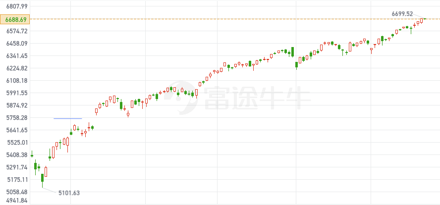

# 面对美股纷扰的消息，如何甄别有效信息构成投资机会？

**发布时间**: 2025-09-23 17:41:07

**原文链接**: [http://mp.weixin.qq.com/s?__biz=Mzk4ODc3ODgyOQ==&mid=2247484012&idx=1&sn=05c3d05864d784346bc8df9f4872a45b&chksm=c5815a4ef2f6d358305bbc0fb0e6df6aacb6646e2dfb3bf614f6b94215cd0e53d6f908a7274e#rd](http://mp.weixin.qq.com/s?__biz=Mzk4ODc3ODgyOQ==&mid=2247484012&idx=1&sn=05c3d05864d784346bc8df9f4872a45b&chksm=c5815a4ef2f6d358305bbc0fb0e6df6aacb6646e2dfb3bf614f6b94215cd0e53d6f908a7274e#rd)

---

\- 据英国《金融时报》报道，CN 互联网监管机构已指示阿里巴巴、字节跳动等公司终止对英伟达 RTX Pro 6000D 芯片的订单。

\- 据《The Information》报道，阿里巴巴与百度已经在人工智能模型训练中引入自研芯片，以部分替代英伟达的产品。

这两个消息，在 9 月 17 日导致英伟达 NVDA 日内跌幅达 4%，股价到了 168。

面对这种市场消息，普通人总是恐慌的，这时候有两类人：

一类人是持仓，不知道该不该止损；

另一类人是平日内等 Dip，但是消息出来的 Dip 完全不知道该不该捡。

所以我们需要学会如何快速对一件消息获取更多的判断面。

  

我来分享下一些简单的方法流。

第一步，找源头求证。

利用 AI 或者 Keyword Search，可以快速找到

https://www.ft.com/content/12adf92d-3e34-428a-8d61-c9169511915c

https://www.theinformation.com/articles/alibaba-baidu-adopt-ai-chips-major-shift-chinese-tech

当然了，如果找不到，那就肯定可以抄底了。

千万不要道听途说，吸收二手消息。

如果没时间，OK，那可以肯定这是 100% 不值得构成投资机会的。

第二步，自己读一次源头。

依然可以借助 AI，先读一下源头。

这时候会来第一个问题，这个 RTX Pro 6000D 跟正准备售卖到 CN 的 H20 有什么关系？

继续分析，不是同一回事，RTX Pro 6000D 是面向工作站的专业显卡，更偏向专业渲染，跟专为数据中心做推理和训练的 AI 芯片 H20 无关。

有什么类同点？

他们都是低配显卡，是符合 US 要求售卖到 CN 的。

那有什么关联危害？

这可能表示了 CN 这边的态度，结合同时炒作的阿里和字节的芯片，组合成一种“我不要外来货”的态度，情绪上看起来利空 Nvdia。

  

继续挖，我们来看看阿里和字节的这个所谓自研芯片，是否能短期威胁？

阿里的芯片叫 Zhenwu，百度的是 Kunlun P800，一个是 2025 年初就开始小规模替代 Nvdia 的芯片，另一个是在 2025 年 4 月在文心大模型上跑训练，已经投入使用。

但是这两家科技公司目前都被 Cuda 生态链卡脖子，依然在用 Nvdia 的芯片，而且因为上个季度无法买，目前都处于紧缺状态。

第三步，关联信息思考。

继续挖有没有更多周边的信息？

如果一直有关注的朋友应该记得，或者说不难挖到，在 8 月 12 日已经传出 BJ 要求大科技公司证明继续订购 H20 的合理性，威胁科技公司需要解释为什么不能用国产芯片代替？

https://www.ft.com/content/a29bab5e-7c2f-4487-b0a5-d594d577c73a

同时还炒作英伟达芯片是否有后门的事件。

对此，外交部已经回应过，没有直接干预企业的选择，这些消息自然都不证自败。

但我并不怀疑这是政府保持的合理态度，支持国产，摆脱依赖才是未来。

但我们正在分析是否实际利空的时候，不能把这些作为噪音，应该客观的思考：是否影响短期订单？

我们还可以关联搜到，上一个财报，英伟达的收入里没有包含 H20，而下一个 Q 的财报依然没有给予 H20 的销售指引。

第四步，整合资料，快速分析。

挖差不多了，其实用不到 10 分钟时间。

整个 Picture 出来了：

不怀疑目前 CN 以及科技公司都在努力摆脱外国芯片的依赖，毕竟被卡脖子并不是长久之策。但是短期内，依然需要用到 Nvdia 的基于 Cuda 的生态技术来发展应用，追赶差距。同时，Nvdia 的指引以及上季度财报，没有对 H20 进行过多计价，所以假设最坏情况真的不卖了，市级对公司的盈利影响并不大。

综上所述，买入，我在 CPI 踏空了现金，在 168-172 狠狠的加仓了正股。

\- 英伟达周四宣布，将向英特尔投资50亿美元，为这家处境艰难的美国芯片代工企业提供支持，但并未向英特尔授予关键的芯片制造订单。

新鲜滚热辣，另一个 Case，我依然用 Nvdia 做例子。

这个消息导致 AMD、AVGO 大跌 5%，Intel 涨 26%，Nvdia 涨 2.3%。

我们来继续分析：

第一步，找源头求证。

这个官方发的，很好找：

https://blogs.nvidia.cn/blog/nvidia-and-intel-to-develop-ai-infrastructure-and-personal-computing-products/

第二步，自己读一次源头。

消息具体拆解，是这样的：

Nvdia 宣布向 Intel 投资 50 亿美元，持有其约 4% 股权，双方将在 PC 和数据中心领域联合开发定制芯片。

毫无疑问，肯定是利好 Intel 的，因为这家公司已经在地板了。

我们需要关注什么？

主要考虑 Nvdia、AMD、TSM、Avgo、Arm。

首先，对 Nvdia 来说，50 亿占自由现金流不高，同时拥有 CPU 生产线的可能，还反过来拥有 Intel 数据中心芯片的订单，是好事，但是好的部分不多，因为 Intel 正在走下坡，订单未必能大。

同时，这次合作并未涉及将 Nvdia 的关键芯片制造订单交给 Intel 代工，所以 TSM 的合作关系不变，纯误伤。

对 Avgo 的利空，源自于这合作可能会增加对高速网络和定制芯片的需求，而这恰好是博通的强项。

对 AMD 的利空，是因为 Nvdia 可以持续竞争 GPU，而 Intel 可以重新抢回 CPU 的份额。

对 Arm 的利空，是因为 Intel 的 x86 一直是 Arm 的对手。

不过别忘了，这次的合作，没有这么大的规模，纯纯只是 50 亿资助以及联合发布新芯片的计划，计划没有明确时间节点，但至少说明在半年甚至一年内，都不会有什么突破性进展。

第三步，关联信息思考。

无论怎样，目前都无法摆脱 TSM，不用分析，纯误伤。

对 Nvdia 影响甚微，对 Intel 绝对是纯利好。

我们侧重分析，AMD or Intel 是否适合买？

首先，英特尔的 CPU 因为一直被 AMD 蚕食，自身的技术制程延误很大的关系，短期内无法追上。同时 Intel CEO 换任，外加财报糟糕，短期内难以解决问题。

AMD 在苏妈的带领下 CPU 和 GPU 能效和性能都在不断提高，所以大幅度抢占市场份额。在 AMD Advancing AI 大会上 Semi 也报道了 AMD 拿到了很多巨头的订单，本来就是正在上行发展的公司，财报也不差。

值得一提，特朗普代表的美国政府在 8 月 22 日拥有并控制英特尔 10% 的股份，这其实也侧面反映了 Trump 希望利用 Intel 做更多的美国制造代表，类似于波音和 Oracle，所以必然是个长线机会。

第四步，整合资料，快速分析。

与其说 Nvdia 想要拥有 CPU 合作，还不如说这 50 亿是为支持 Trump 的一个小举措，同时挽回一点护城河。本质上这次合作对 Nvdia 和 Intel 都没有太大的影响，至少下个 Q 才有所体现。

所以 Intel 买的可能是未来的机会，但是 AMD 这一个 Q 的确定性无疑更强。

对于这个事件跌到 149 左右的 AMD 来说，绝对是可以买入的。

于是乎，我在 150-152 之间买入了 AMD 和 AMDL。

  

而 TSM/AVGO/ARM 也是纯误伤，只是没有计划买入，但绝对是 Dip。

  

消息出来后我在跟朋友聊天，丢出了这几句话：

  

  

截至目前的价格，这两个消息带来的 Dip 收益都很显著，这就是两次成功的消息 Dip Buy。

下次估计各位也能试试对各种信息进行类似的快速判断。

最近的美股行情趋势比较无聊，但是基本面目前是健康的，我认为 Q4 会是慢牛行情，风险不大，没必要过度恐慌。

持仓依然是跟[《](https://mp.weixin.qq.com/s?__biz=Mzk4ODc3ODgyOQ==&mid=2247483936&idx=1&sn=e54d6cc08359c89703a8b83f04494bd1&scene=21#wechat_redirect)[美股九月看法 - 调仓计划 & 思考](https://mp.weixin.qq.com/s?__biz=Mzk4ODc3ODgyOQ==&mid=2247483936&idx=1&sn=e54d6cc08359c89703a8b83f04494bd1&scene=21#wechat_redirect)[》](https://mp.weixin.qq.com/s?__biz=Mzk4ODc3ODgyOQ==&mid=2247483936&idx=1&sn=e54d6cc08359c89703a8b83f04494bd1&scene=21#wechat_redirect)这里面说的一致，额外加了 Amazon 和 AMDL/MSFU。

最近的行情逻辑也是跟上一篇文章说的，数据不差，各种合作不断推高指数，最近的 OpenAI x Nvdia x Oracle 热火朝天。

> 因为目前 AI 的叙事十分强劲，美国 Q4 的行情一般是纳斯达克推动的，年底各大企业将会亮出更多的底牌，还有各种超乎想象的合作。
> 
> 没错，Oracle x OpenAI 只是第一步，昨天 CrowdStrike x Nvdia 等会越来越多，这都会继续推高指数。
> 
> 美股观察员，公众号：社会观察从业者[写在美联储 FOMC 会议前](https://mp.weixin.qq.com/s/DzO-PNrdG3c_RNTCQYMhqw)

GS Kostin 上调了 25 年目标价年底 6800，但我认为以 Q4 的热度，标普涨到 7000 也是没什么难度的（持续的合作没有 Price In 企业盈利）。

而高位可能每一天都会有个股的止盈下跌，但不要过分担心，别忘了指数的上涨过程中，有 40% 的日子都是绿的。

最近在美股群发现大部分人对卖飞或者踏空十分纠结，借此我想引用《对赌》的摘录来结尾。

炒股并不是容易的事情，但是市场选对了，剩下的就是如何提高你的判断率了，共勉。

接下来进入休假模式，国庆节快乐 🍻