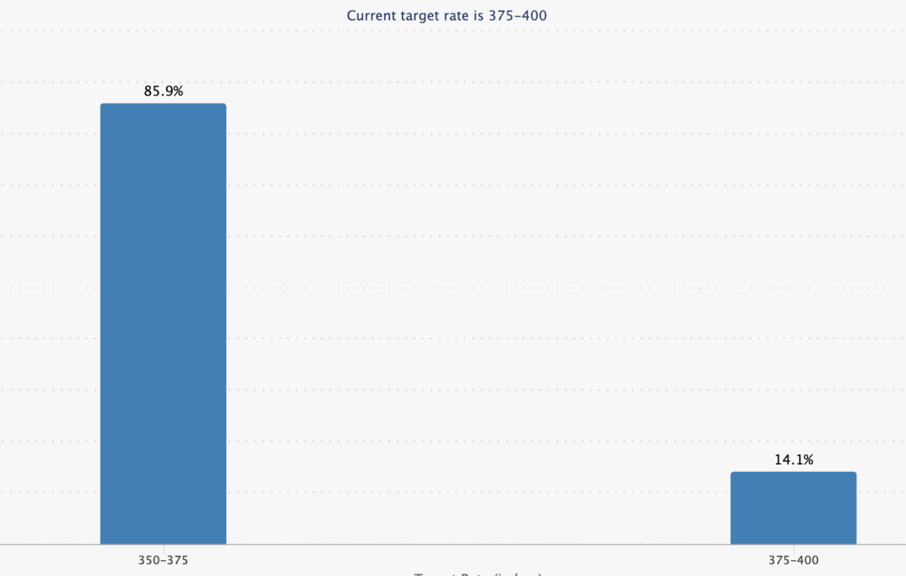
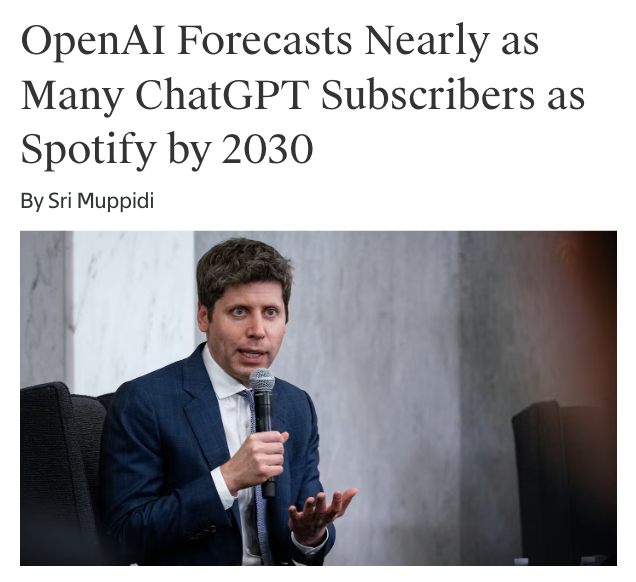
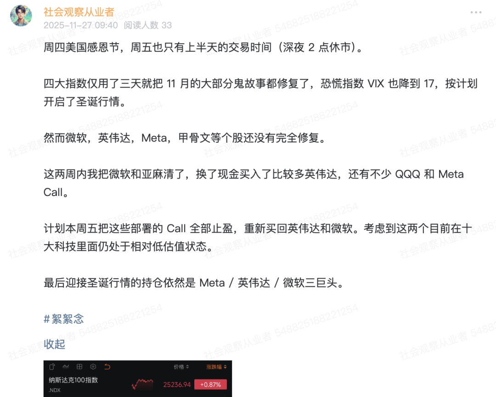

# 美股开启感恩节行情，十二月怎么操作？

**发布时间**: 2025-11-28 14:55:24

**原文链接**: [http://mp.weixin.qq.com/s?__biz=Mzk4ODc3ODgyOQ==&mid=2247484280&idx=1&sn=d18f23ea1222f673161d11a2aa8bf12a&chksm=c5815b5af2f6d24cff645dbf36915b70631cd8a03bcf4e26b1ba585a62615bfa12f426644a3e#rd](http://mp.weixin.qq.com/s?__biz=Mzk4ODc3ODgyOQ==&mid=2247484280&idx=1&sn=d18f23ea1222f673161d11a2aa8bf12a&chksm=c5815b5af2f6d24cff645dbf36915b70631cd8a03bcf4e26b1ba585a62615bfa12f426644a3e#rd)

---

经历了三周的华尔街鬼故事叙事，标普被硬生生砸到了 6521，然后快速反弹回 6832 附近，目前接近新高 6920 只差 1.2% 了。

体感上，我观察到中间恐慌和割仓的股友并不少，贪婪指数一度跌到 6，目前仅仅回升到 19。

可以说这是华尔街的一次大胜利了。

> 不得不说，华尔街太坏了。
> 
> 10 月巨头财报后，其实是个花街止盈的机会。
> 
> 刚好处于政府停摆，花街希望用这些无关紧要的叙事，严重化，复杂化，通过一层一层的加码，恐吓散户的带血筹码。
> 
> 美股观察员，公众号：社会观察从业者[华尔街太坏了 - 美股 11 月鬼故事行情复盘](https://mp.weixin.qq.com/s/Q9ZeRv70XmFiEKVWvNnIAw)

如果对 11 月做个简单的复盘，你就会发现矛盾频出：

\- 科技公司没现金，AI 纯泡沫论

但头部科技公司全部加大基建投资，AI 应用利好频出（Gemini3、Claude 4.5、Meta GEM3），甚至乎 Nvidia/AMD 的卡都不能满足 Meta，开始跟 Google 合作 TPU。而且巨头们没现金，纯属搞笑，还有 1 万亿的沙特和分别 5000 亿的日/韩/欧洲海外 AI 订单。

\- 资金流动性不足，抛压严重

但 12 月 1 日停止缩表，政府关门后巨量 TGA 流放市场，而且数据上 SOFR 也在转好。关键是 10 月停摆也不炒作，11 月准备开门才来炒？

\- 12 月不降息

但失业率 4.4%，通胀却不高，CME 观察的概率回到了 85.9%，用数据说话也是大概率降息。并且，哪怕 12 月因为数据不足而不降息，1 月也得降，因为这同时也是失业的工具箱之一，压根没那么重要。

\- 大空头 Michael Bury 看空英伟达 / PLTR

但这个更扯。上一篇有列举他的历史胜率并不高，同时他最后的做空证据被 Nvidia / 美国银行 / 郭明琪等多方打假。最后他关了基金，开了自媒体，开始吸金，但是显然已经信任崩塌了。

最讽刺的是

11 月期间传来了大量科技公司的炸裂业绩、划时代的新品发布、沙特大型订单合作、中美通话缓解地缘危机等等，全部被华尔街避而不谈。

最后带血的筹码在上周割得差不多了，华尔街就用尽手段抄底，一个堪称完美的剧本。

尤其值得一提，The Information 就是华尔街的舆论工具。

当他们走货了，就会不断传播怀疑论；当他们低位买差不多了，又开始一大波看好论。

这都属于 FUD：

**FUD**  是一个常见于投资、科技圈、加密圈的术语，意思是：**FUD = Fear, Uncertainty, Doubt（恐惧、不确定、怀疑）**

**通常指**通过散布负面消息、夸大风险或制造恐慌情绪** ，让大众对某个项目、公司、产品或市场失去信心。  **

**常见使用场景**  
****

****股市 / 加密市场** ：有人散布“利空传闻”让价格下跌，从而更低价买入。**  
****

****商业竞争** ：企业之间通过暗示对手产品不安全、不可靠来打击对方。**  
****

****舆论操控** ：媒体或社交平台上放大风险，让用户产生不安心感。**

之后是否就没问题了？

并不是，我认为目前还不算圣诞行情。

顶多属于 11 月“鬼故事后感恩节行情”，但是圣诞老人依然会来，在来之前，还可以做多一次操作。

核心原因是目前标普指数只差 1.2% 就到新高了，甚至很快摸到 7000 点。这其实是属于 2026 年的目标价格了，目前的标普 EPS 并不能支撑到这么高。

同时，还有一个悬而未决的事情，还是 12-9 的 FOMC。

但这次的重点并不是降不降息，目前大概率还是降息。但这一次降息，可能是“鹰派降息”。意思是这是一次美联储并不想成为罪人的预防性降息，对抗的依然是失业率严重的问题。所以才用先降息，再在未来三个月谨慎观察的操作。

看点依然是这一次降息之后的 2026 点阵图，还有鲍威尔的发言。

同时，感恩节这一个星期内，是属于没数据裸奔的，上周发出的经济数据全部是 9 月的，属于 outdated 没有时效性。

因此市场依然担心，通胀是否会反弹？出数据之前是否会避险，我认为必然的。

怎么做？

如果关注了本号或星球，或者有同样不相信华尔街鬼故事的人，在这两三周我相信已经狠狠的抄底了。

当然我也是买入了不少 QQQ/Meta 二月份的 Call，以及 Metu/Nvdl。

我觉得这一波可以在下周开始陆续止盈，锚点可以期待指数新高 6920，或者突破 7000。

在这些数据出来之前：

🗓 FOMC  12/9

🗓 非农 12/16

🗓 CPI 12/18

🗓 日本议息会议 12/18

🗓 科技公司回购结束 12/19

而我今晚会先把 Leap Call 吃掉，因为收益率已经达到 50% 了，十分可观，但我认为目前还可以期待指数新高，于是我会买入 Nvda / Meta / Msft，还有少量 Oracle（指标和消息的反弹形态出现）。

然而换仓的这部分，也会在上述时间周期逐渐止盈。

但是这一波止盈的比例我认为并不需要太多，因为最后持仓的这些股票目前都还处于低估，我对持仓有足够的信心。

只考虑看情况换取 3 成的现金，短线账户会相对更激进一些（买的也是两倍 ETF）。

核心逻辑只是避险，做多一次 T，不做也是可以的，接下来依然有圣诞行情。

圣诞行情什么时候来？

到时候将会另起一贴细聊，周期一般是在圣诞假期前 5 个交易日，到 1 月中，刚好就是在上述事件之后。

如果 12/9 - 12/18 之间止盈了现金，在市场回调的时候可以逢低捡货了。

这也刚好是美国投资者的计税周期，和 401K 养老金平衡的时间点（每个月月底）。

加上今年是 Trump 任职搞经济的一年，据闻还会在圣诞宣布新的美联储主席，我认为 Trump 一定会造势美股行情的。

更何况白宫最近才宣布了“创世纪计划”。

加上最近科技公司的合作、新品都让市场惊喜，全球投资者不会错过这一波热度爆炸的行情。

感恩节快乐

虽然感恩节已经是昨天，但是，anyway 啦。

感恩各位一直对本号的支持，祝各位今年收益最后一个月继续长虹，收益率饱饱的。

最后放多一波优惠券，一起来做观察者～

