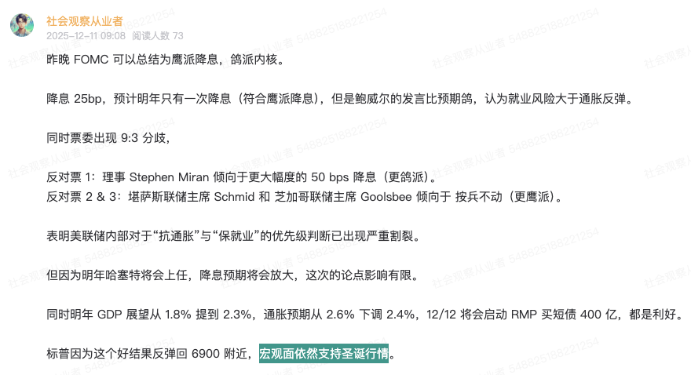
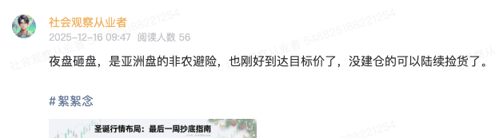

# 圣诞行情将来，美股可以抄底了

**发布时间**: 2025-12-16 17:01:29

**原文链接**: [http://mp.weixin.qq.com/s?__biz=Mzk4ODc3ODgyOQ==&mid=2247484363&idx=1&sn=30d44b81f36aa125771f464cacfd4138&chksm=c5815be9f2f6d2ff415910aaade83ed220c94b2d3b6928b739b8afaa23bf12691e4dab4daf80#rd](http://mp.weixin.qq.com/s?__biz=Mzk4ODc3ODgyOQ==&mid=2247484363&idx=1&sn=30d44b81f36aa125771f464cacfd4138&chksm=c5815be9f2f6d2ff415910aaade83ed220c94b2d3b6928b739b8afaa23bf12691e4dab4daf80#rd)

---

所谓圣诞行情，就是 Santa Claus Rally，是一个华尔街术语。指的是在圣诞前几天到一月中，一般股市行情都会不错，没错，时间就是从下周开始。我们来看一张图：

为什么圣诞行情还具备？我们就不得不看宏观影响圣诞行情的四个理由：FOMC 、大非农、 CPI 、日本加息。这也是之前文章里面说的避险区：

> 注意，这一次的止盈不是宏观经济出问题了，单纯是 fomc 和关键数据的资金避险。 资金足够，长线可以不操作。短线止盈机会，可以在这两周导致有 dip 重新 buy。
> 
> 美股观察员，公众号：社会观察从业者[感恩节行情止盈，备战 FOMC 和超级数据周](https://mp.weixin.qq.com/s/hsSiAsDHBfUhBHX4wcggdw)

那么现在来看看这几个点，是否解决了？1\. FOMC好消息居多，支持圣诞行情。

2\. 大非农中性偏好，一月降息概率提高，衰退还早。

3\. CPI虽然周四才发布，但是前瞻不错。

4\. 日本加息这个几乎已经确定了 +25bp，市场预期很充分了，恐慌不高。

综上，其实四个危险点都被市场消化了，最近肯定还会有 CPI 和 BOJ 的避险波动，但总体风险不大，那时候再买可能错失特价。于是乎，我认为现在可以把上周止盈的筹码，重新 Dip Buy 了。前几天做了张图，虽然有一定时效性丢失，但是买的筹码标的是一致的。

夜盘（北京时间 09:47）刚好遇到亚韭砸盘事件，对我们来说是个不错的买点，于是首先重新建仓了正股、两倍。后面在非农和 CPI 前瞻分析后也陆续加仓。

  
为什么只买这几个？理由是圣诞行情不需要持仓太复杂了，只选大蓝筹科技股 + 指数，一月中将会止盈，怎么简单怎么来。还有一点 SPY/QQQ 的 Leap Call，占总持仓不到 5%。Merry Christmas，祝大家赚更多认知内的钱！声明：NFA (Not Financial Advice)。本文仅为个人观点与经验分享，不构成任何投资建议。市场有风险，决策需独立。  
一起来玩：