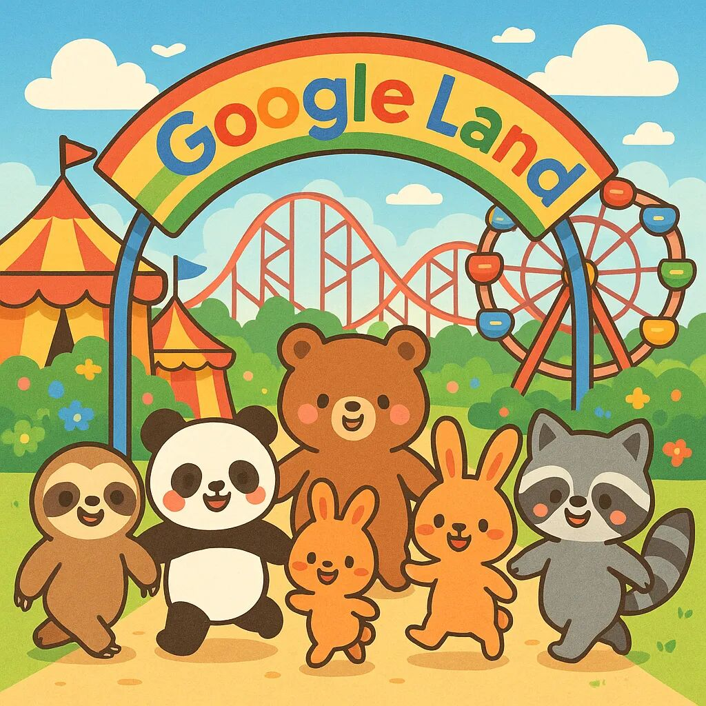

# 谷歌财报超预期，标普新高，短线开始止盈

**发布时间**: 2025-07-24 16:58:50

**原文链接**: [http://mp.weixin.qq.com/s?__biz=Mzk4ODc3ODgyOQ==&mid=2247483793&idx=1&sn=49fa727586201fbeca8e5666bc9eebad&chksm=c58159b3f2f6d0a56b9f0c3e9a97550beb986ac4e958db4ccc13b3b75d0214a36bd037360ff7#rd](http://mp.weixin.qq.com/s?__biz=Mzk4ODc3ODgyOQ==&mid=2247483793&idx=1&sn=49fa727586201fbeca8e5666bc9eebad&chksm=c58159b3f2f6d0a56b9f0c3e9a97550beb986ac4e958db4ccc13b3b75d0214a36bd037360ff7#rd)

---

狗爷（Google） 发财报了，毫无疑问依旧炸裂：  

  * 每股收益（EPS）：2.31 美元（预期为 2.27 美元）

  * 营收：964.3 亿美元（预期为 939.4 亿美元）

  * Google Cloud 营收：136.2 亿美元

  * 广告营收：713.4 亿美元

  * 搜索营收：541.9 亿美元

  * 营业利润率：32%

  * 净利润：282 亿美元

  

最重要的是 AI Capex 从 750 亿增长到 850 亿，全行业链路继续载歌载舞。

  

Cash Secured Strangle

注意到上次的文章有提到利用期权双 Sell 来做财报的额外收益，目的是为了吃 IV CRASH，也就是 Call Put 因为财报后 Vega 下降，所以导致同时跌。

> 因为财报前波动率大，财报后波动率会变少，就是所谓的 IV Crash，做期权卖方是很容易可以吃掉 IV Crash 的。
> 
> 公众号：社会观察从业者
> 
> [美股财报季，如何用 Cash Secured Strangle 获取更多收益？期权策略分享](https://mp.weixin.qq.com/s?__biz=Mzk4ODc3ODgyOQ==&mid=2247483788&idx=1&sn=b17d57cce41b03eb78c03435453b1144&scene=21#wechat_redirect)

文章例子用了我持仓的谷歌，果然我们就看到了经典的 IV CRASH 现象。

下图可以看到，Call 和 Put 齐跌，卖方是双吃，白嫖权利金的，也就是对应了我文章里第三种情况。

  

同时，标普也突破了 6350，来到了 6375。

  

按照计划，我的短线账户开始缓慢止盈 GGLL，FNGU，TNA，目的是留半仓以上现金，等待 PCE。

> 短线仓位，将会在这两周指数新高后（标普 6350）附近开始减仓，在 PCE 到来前仓位减到一半以下，优先处理杠杆 FNGU / GGLL / AAPU / TNA。
> 
> 公众号：社会观察从业者
> 
> [CPI 和 PPI 出来后，怎么操作？](https://mp.weixin.qq.com/s?__biz=Mzk4ODc3ODgyOQ==&mid=2247483776&idx=1&sn=9e6c2d3ce08b89c34c2d1688f646ed1c&scene=21#wechat_redirect)

感谢强劲的美股，祝大家继续吃大肉 🍻