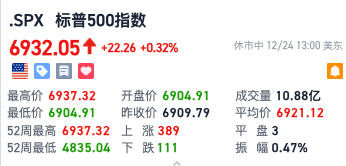
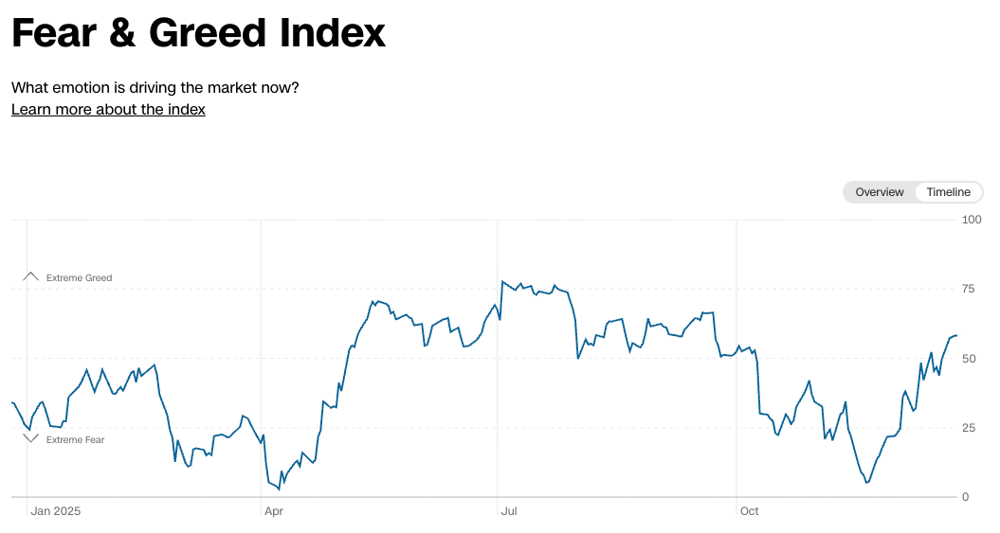
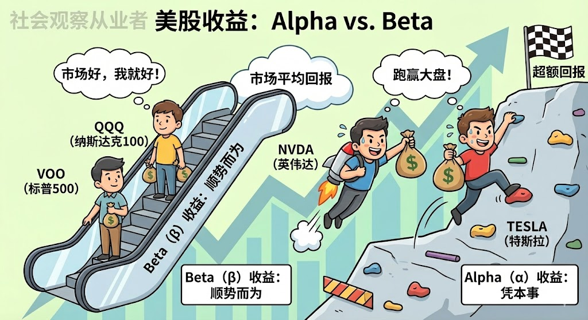
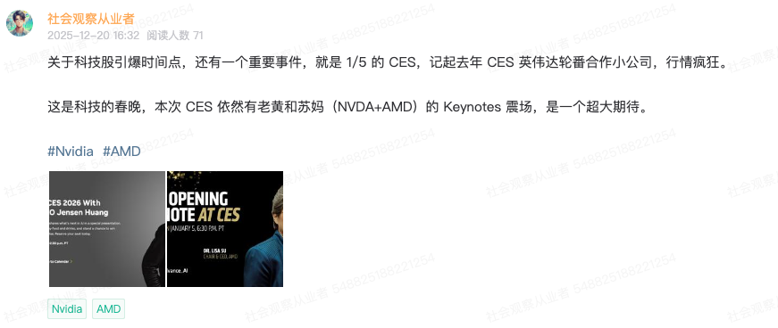
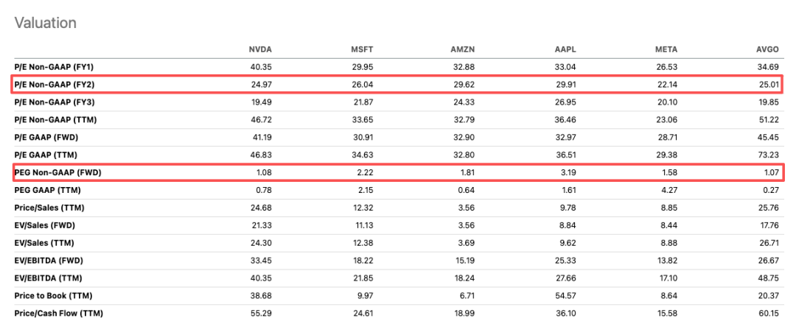

# 圣诞行情该什么时候止盈？

**发布时间**: 2025-12-25 08:40:22

**原文链接**: [http://mp.weixin.qq.com/s?__biz=Mzk4ODc3ODgyOQ==&mid=2247484377&idx=1&sn=879daad7f171fe3500e93f72b3470592&chksm=c5815bfbf2f6d2ed9973fdb02646aba35fbae6dbbfa42d1856a0a45f4914e584a2ca94495ec1#rd](http://mp.weixin.qq.com/s?__biz=Mzk4ODc3ODgyOQ==&mid=2247484377&idx=1&sn=879daad7f171fe3500e93f72b3470592&chksm=c5815bfbf2f6d2ed9973fdb02646aba35fbae6dbbfa42d1856a0a45f4914e584a2ca94495ec1#rd)

---

昨天美股如期借圣诞行情冲了新高，标普触达 6737 历史新高，而纳指还差 2% 就到新高。

同时，波动率 VIX 指数跌到了去年 12 月的低位，目前 13.47，VIX 指数表明目前宏观的事件几乎尘埃落定，没有太大的恐慌。

CNN 贪恐指数也回到了贪婪区间，目前 58，也就是 AI 怀疑论以前的水平。如无意外，圣诞行情还会持续到 1 月头，可能会冲击极度贪婪（大于 75）。循例我们来个 Recall：

> 综上，其实四个危险点都被市场消化了，最近肯定还会有 CPI 和 BOJ 的避险波动，但总体风险不大，那时候再买可能错失特价。
> 
> 于是乎，我认为现在可以把上周止盈的筹码，重新 Dip Buy 了。
> 
> 美股观察员，公众号：社会观察从业者[圣诞行情将来，美股可以抄底了](https://mp.weixin.qq.com/s/GkWT9tN2U2HdtcKoElhZMQ)

在上周三的夜盘，根据分析所有宏观危机都可控，圣诞行情具备，因此是个提钱的绝佳的抄底区间。也符合之前两篇文章所提到的预判点，[标普 6730 后反弹](https://mp.weixin.qq.com/s?__biz=Mzk4ODc3ODgyOQ==&mid=2247484341&idx=1&sn=738a90ba5363b7dbac00cdffa82042d6&scene=21#wechat_redirect)。

我也是按计划买入， 得到了不错的收益结果，下面是短线账户（没有正股）的截图，AMD 是昨天借 Intel 利空上车的。希望大家这一波也收获了丰厚。

可能会有人问，指数新高，我的账户还没有，怎么办？这里可以做个心理按摩。

从情绪面来说，当然每个人都希望买入的都是日内暴涨的，一年中也总有那么几次命中这种的机会。但这是结果，不是你选股的理由。

选股的核心还是你通过各项数据/消息分析出一个集合里面，你认为低估的，你才在当时买入。

这个低估肯定不一定是准确的，因为指标健康，不代表散户会买入，例如 Tesla/Rklb/小股等等，就明显是散户热度，涨很多，也不代表你再次选股能选中下一批，或者能够止盈在最高点。

理性上，如果一直寻求于“涨不够”这种情绪，还是考虑仓位多占一点 Beta 而非单纯 Alpha。

Alpha 收益，指的是超过大盘收益率的钱，例如这段时间大盘涨了 5%，而你收益率 10%，这证明你有一定的选股能力和资金流判断等等，是靠自己本事赚到的额外钱，意思是持有个股。

Beta 收益，指的是大盘好，你就好的收益率，例如大盘 5%，你涨 5% 就是刚好符合大盘收益，意思是持有指数 ETF。

之所以你觉得指数新高，而你的账户没有新高，是因为你在追随 Alpha 收益的过程中，被 Alpha 收益带来的风险（选错股）影响了，导致无法跑赢 Beta。

说人话

  

也就是最好 40% 仓位是指数 ETF，一揽子集合可以解决你选错股的问题。如果还是考虑个股，也至少要选择 4 个以上的不同领域的股票，互相制衡。

那么尘埃落定之后，我们来谈谈什么时候可以止盈？首先我们啰嗦一下圣诞行情的原因。

1\. 大盘基本面不差，宏观数据、个股业绩都得好，这是持有的信心

2\. 财政处于放水阶段，风险不高，目前都具备（Fed 注资，Trump 的 OBBB 等政策）

3\. 圣诞节，机构、银行大幅度休假，交易量减少，高频交易减少，自然对冲需求，做空机构也减少

4\. 剩下的 Long Only 例如 401k 养老金，核心 ETF 都会有年底买入的需求

5\. 散户大多是看多的，所以小幅度资金就可以拉高大盘（例如昨天的标普，是低成交下的新高）

这些构成了圣诞行情，整体会持续到一月头。

我预估大盘会突破 7000，甚至到 7150，但这只是纯数学的概率事件，不要期待某个数字会必然发生，也不要 Time the market，但这是一个可以用来止盈和喘息的锚点。另一个锚点是时间，有几个消息：1\. 1/5 会有 CES，也就是科技春晚，今年依然有老黄和苏妈的 Showcase，可以借力科技狂欢。

2\. 1/9 有大非农。本月出来的非农结果显示失业率太高，虽然也有 Trump 裁了 16.2 万政府人员的一次性影响，但硅谷大科技公司的陆续裁员其实不假，担忧依然存在。3\. 1/13 有 CPI 。本月的 CPI 出奇的炸裂，但是实际是用了 4 月的房租数据，所以失真，市场本来就对其怀疑，下个月怀疑点将会推高。所以，时间上可以利用这三个锚点。具体操作参考纯参考用，可以在大盘 7000 开始陆续止盈，优先 Leap Call，其次杠杆两倍 ETF，最后正股。如果更贪婪点，也可以借热度 1/5 的 CES 开始才降仓位，在 1/9 之前拿到更多的现金。注意，这只是止盈锚点，目前完全不具备任何市场利空或者恐慌，所以正股其实没必要卖而卖。相反，如果突发严重的利空，我们也需要提前止盈，具体每天需要关注的热点事件，我都会 Po 上星球。Anyway，目前市场还是十分健康的，还有比较多的公司还处于低估状态，正股和价值投资，不需要跟随这些波动和锚点，我说的逻辑都是短线操作为主。

Cheers，祝各位圣诞快乐 & 元旦快乐。声明：NFA (Not Financial Advice)。本文仅为个人观点与经验分享，不构成任何投资建议。市场有风险，决策需独立。一起来玩：