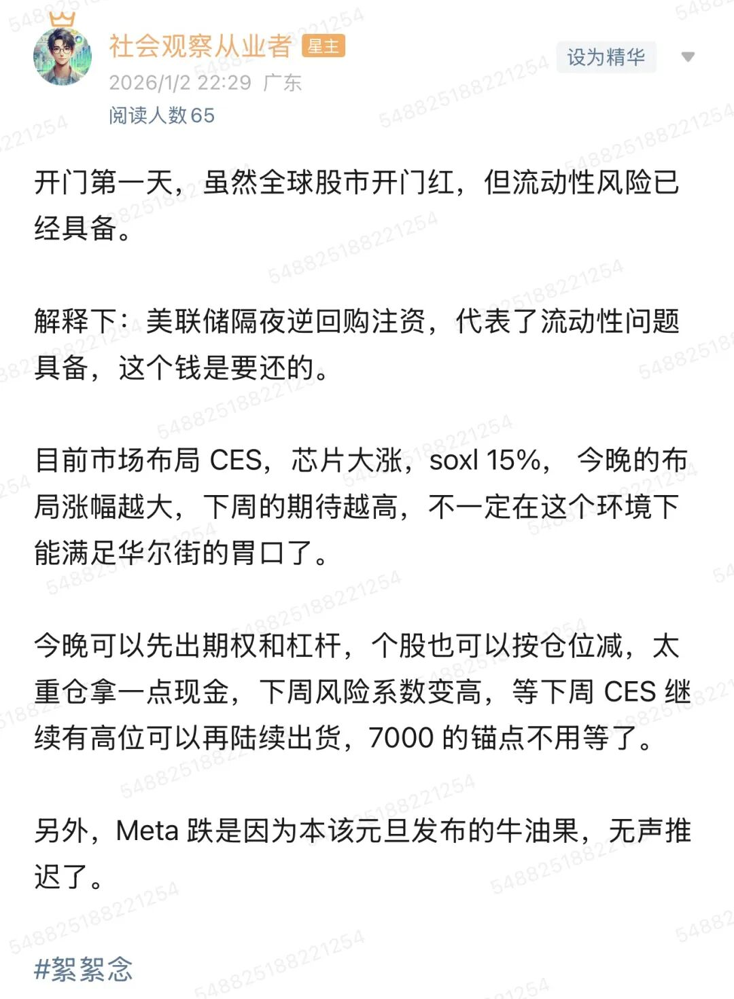

# 美股的圣诞老人没有如期到来

**发布时间**: 2026-01-03 04:17:38

**原文链接**: [http://mp.weixin.qq.com/s?__biz=Mzk4ODc3ODgyOQ==&mid=2247484386&idx=1&sn=11d74fe90665bf9dfac974a2b956ed36&chksm=c5815bc0f2f6d2d63b25facb6abf63994cfa63e325bc60f5b610ebbea383026bdfbe9b966760#rd](http://mp.weixin.qq.com/s?__biz=Mzk4ODc3ODgyOQ==&mid=2247484386&idx=1&sn=11d74fe90665bf9dfac974a2b956ed36&chksm=c5815bc0f2f6d2d63b25facb6abf63994cfa63e325bc60f5b610ebbea383026bdfbe9b966760#rd)

---

  

圣诞行情的标准七天里，只有第二天摸到了标普新高 6945，之后一直阴跌，圣诞行情的标准七天，只剩下下周一了，刚好也是 CES。

  

最终没有触及 7000 点，这也是 Time The Market 的风险，市场变数太大，但昨晚已经开始止盈了。

  

理由如下：

  

  

解释一下为什么 2026 刚到来，资本市场开始提前担忧，导致无法冲破 7000 点。  
  
12 月降息后，美元货币贬值。  
  
尽管如此，市场依然流动性缺乏，美联储于是逆回购，同时美联储被迫开始扩表（放水），这导致美元再次贬值，人民币等非美货币升值，已经跌破 7 了。  
  
当美元不仅变便宜了（降息），而且变多了（扩表）时，美国国内的资产（美股）如果已经处于估值高位，多出来的钱就会像溢出的水一样，顺着利差和估值差流向干涸的非美市场。  
  
美股不再是唯一选择，Q4 利好出尽，大科技合作、新品发布结束、企业回购暂停，好故事用完，这时候的美股高度拥挤，SPX/RSP 差值巨大，说人话就是 Mag7 占比过于高，同时外国人避税结束，2025 止盈会扣盈利税，一般只会卖出亏损，但昨天是 2026 了，可以重新止盈调整仓位。  
  
资金提前向非美市场（港股、A股、新兴市场）流出，本来这些就是价值洼地，短期寻找更高的回报，另一方面可以延缓货币贬值。  
  
与此同时，Q1 的美股会存在以下的怀疑叙事：怀疑美联储主席独立性，怀疑高规模 AI Capex 带来的经营利润的合理性，怀疑大科技比重 SPY/RSP 的聚拢性，怀疑基建的卡脖子，怀疑通胀反弹（CPI 失真），怀疑非农危机。  
  
没错，叙事还是这些叙事，只是在 Q4 暂缓了一口气。  
  
综上所述，上半年，1-4 月将会进入震荡行情。

  

下周 CES 可以借科技消息继续出货，减轻一下仓位比例，给自己休个假。

  

Q1 不适无脑大科技了，更多可以关注基建，能源，ROI 高的 AI 应用企业，之后我们再聊聊 Q1 的布局。

  

新年快乐，祝 2026 年大家都慢慢变富🍻。

  

感兴趣美股的，一起来玩：

  

