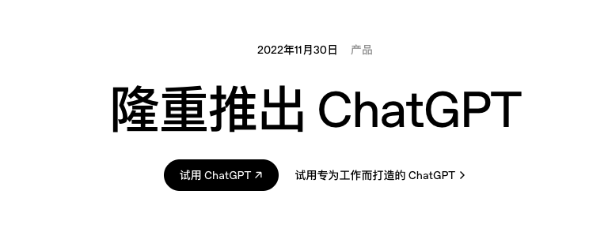
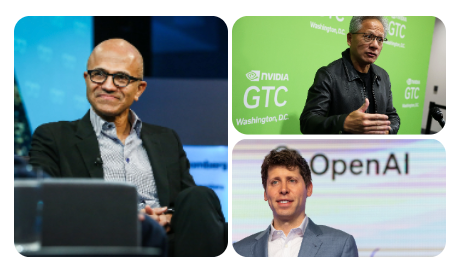
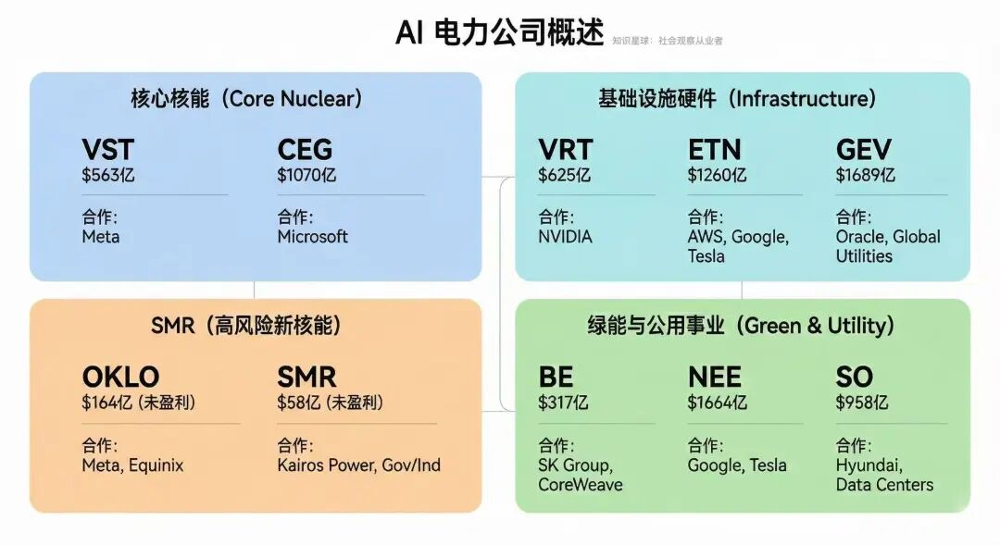
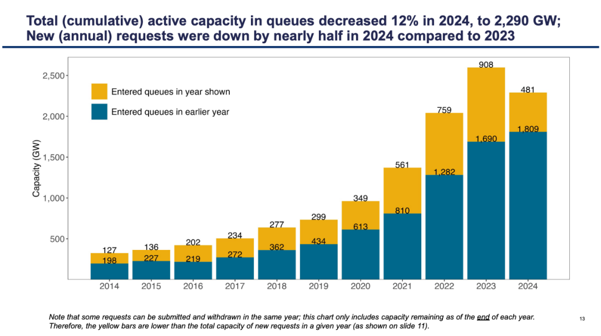
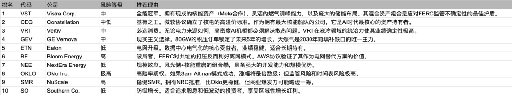

# AI 的尽头是电力

**发布时间**: 2026-01-10 12:09:47

**原文链接**: [http://mp.weixin.qq.com/s?__biz=Mzk4ODc3ODgyOQ==&mid=2247484424&idx=1&sn=b36d6c492d8a0d2e156ba249854ea495&chksm=c5815c2af2f6d53c1ee2be691d6affa83dee8e0cb86102ae2dc073b9bf9ab91a080ffd1ab710#rd](http://mp.weixin.qq.com/s?__biz=Mzk4ODc3ODgyOQ==&mid=2247484424&idx=1&sn=b36d6c492d8a0d2e156ba249854ea495&chksm=c5815c2af2f6d53c1ee2be691d6affa83dee8e0cb86102ae2dc073b9bf9ab91a080ffd1ab710#rd)

---

2022 年 OpenAI 年中发布了 ChatGPT 开启了 AI 元年，至此，已经是 AI 第三个发展年头，但其实 AI 真的引爆和广泛实用，其实还是在一年前。

但是在这一年内，已经面临了巨大的 AI 紧缺效应，包括储存的短缺，导致目前一条内存条差不多贵过一条旧版显卡的情况，美光、三星、海力士纷纷暴力涨价。之后炒作贵金属也属于 AI 材料，于是各种贵金属也跟着涨价。

当然，还有真正卖铲子的 GPU、芯片制造、光刻机等等等，也是一直在上调原材料供应价格。

步入 2026 年，微软 CEO Satya Nadella 在采访中说过一个关键点："我们现在的首要问题不是芯片短缺，而是电力。我有成堆的 GPU 库存，没有足够的电来运行，是没有意义的"。

OpenAI 的 Sam Altman 也提到过，"GPT-5及后续版本的训练需要前所未有的能源密度，传统电网难以支撑"。

与此同时，英伟达、谷歌、亚马逊、特斯拉、Meta 也在纷纷跟电力厂合作，例如昨天 Meta 与 Vistra、Oklo 及 TerraPower 签署核能供电协议。

**因此，今年缺电是主要题材，AI 的尽头是电力。**

我们有哪些机会？先说一下有哪些电力能源的公司。

**\- 核心发电商，大型核能与数据中心**

**VST（市值 563 亿）**  是德州最大的独立发电商。在收购 Energy Harbor 后，成为全美核电巨头。

2026 年初，Meta 宣布与 VST 签订了地标性的核电直供协议，为 Meta 的 AI 数据中心提供长期清洁能源。

**CEG（市值 1070 亿）  **拥有全美最大的商业核电站群。

与 Microsoft 签订了为期 20 年的购电协议，旨在重启三里岛核电站，专门支持微软的 AI 业务。

**\- 核能小公司（相对风险高，都没有盈利）**

**OKLO（市值 164 亿）** 由 Sam Altman 支持，开发快中子反应堆，并能回收核废料。

刚与 Meta 达成合作框架，为其超大规模数据中心园区规划电力部署。此外，它还与 Equinix 有合作协议， _但注意，这个公司也依然还没盈利_ 。

**SMR（市值 58 亿）** 唯一获得美国核管会设计认证的公司。

参与了多个政府及工业园区（如 Roane County 项目）的电力规划， _但这个目前没有实际盈利，也没有直接大厂订单_ ，谷歌是通过合作 Kairos Power 间接蹭到 SMR。

**\- 电力设备与基础设施（硬件部分，电力卖铲人）**

VRT（市值 625 亿）提供数据中心最紧缺的液冷系统和电源分配模块。

NVIDIA 的核心合作伙伴，专门为 Blackwell 系列及后续 AI 芯片提供定制冷却方案，其订单积压因 AI 需求已创历史新高。

**ETN（市值 1260 亿）** 变压器、断路器等配电设备巨头。

与 Amazon 和 Google 有长期电力架构供应合同，目前受益于美国电网现代化的海量订单，也是 Tesla 的超级充电站网络合作。

**GEV（市值 1689 亿）** 从 GE 分拆出的能源业务，管理着全球 30% 的电力供应。

近期获得多个跨国公用事业公司的风机与燃气轮机大单，并与 Oracle 在能源数字化管理软件方面深度合作。

\- 绿能与大型公用事业

**BE（市值 317 亿）** 提供不依赖电网的分布式燃料电池。

与 SK Group 在韩国有大规模部署协议。2025 年末与 CoreWeave 达成合作，为其数据中心提供现场发电方案。

**NEE（市值 1664 亿）** 拥有佛罗里达电力照明公司（FPL）和巨大的风能/太阳能组合，也是特斯拉 Megapack 的合作商。

与 Google 签订了大规模清洁能源购买协议，并正利用其电网优势为大型科技巨头提供“离网”能源解决方案。

**SO（市值 958 亿）** 刚刚完成了美国几十年来首个新核电站（Vogtle 3、4号机组）。

作为佐治亚州的主要供电商，它目前承担着该地区日益增长的 Hyundai 车厂和数据中心集群的供电任务。

Gemini 做了一张图，概括一下：

但注意了，以上这么多公司，并不是全部都能直接供电，被使用起来的。

这里面要提一下 **Interconnection Queue (并网队列)** 。

想象一下，美国的高压电网是一条也是唯一一条高速公路，发电厂（光伏、风电、核电、天然气）是想开上这条高速公路的各种车，数据中心（AI 算力） 是高速公路尽头急需货物的超级工厂，Interconnection Queue 就是这条高速公路的入口匝道收费站。

**现状是：这个收费站彻底堵死了。**

当一个新的发电项目（比如 NextEra 建了一个新光伏农场）想要把电卖给电网，或者一个超级数据中心想要接入电网取电时，它们不能直接连上。它们必须向当地的电网运营商（如 PJM, MISO, CAISO 等）提交申请，进入“排队系统”。

电网运营商必须进行复杂的工程研究，以确保新加入的“跑车”不会导致整条高速公路崩溃（比如引发停电、电压不稳）。

这里可以看到详细的 2025 报告：《Queued Up: 2025 Edition》

https://eta-publications.lbl.gov/sites/default/files/2025-12/queued_up_2025_edition_12.15.2025.pdf

理解了并网队列的拥堵，我们来看看把这些公司分为几类投资机会，就更清晰了。

**第一种，最大的受益者，已经在网的存量电厂。**

既然新电厂进不来，那么已经连在电网上的、又能稳定发电的老电厂，就成了极其稀缺的资产。

就是 Vistra (VST) 和 Constellation (CEG)，当微软、亚马逊急着要电，而新光伏项目还在排队时，大厂只能高价求购 VST 和 CEG 手里的存量电力，这就是它们能在 2025-2026 年签署高溢价 PPA（购电协议）的根本原因。

**第二种，绕过电网的赛道。**

有没有可能绕过高速公路，在家门口发电呢？这就是表后发电。

Bloom Energy (BE)，它的燃料电池箱可以直接放在数据中心园区内发电，完全不需要经过那个拥堵的并网队列。对于等不了 5 年的 AI 公司来说，这是救命稻草。

NextEra (NEE) 新玩法，离岛供电，他们开始与数据中心合作开发“孤岛微电网”，即在数据中心旁边建光伏+储能，直接供电，尽量减少对大电网的依赖。

**第三种，核电。**

OKLO 和 SMR，目前还在建厂阶段，有订单还没盈利，是不是很像 AI 算力中心的 Oracle？但核电能突破，能为未来 2-5 年提供更大的电力机会，但是短期内是没有盈利支撑的基本面。

**第四种，我啥都不选了，我选硬件。**

当然可以，Eaton (ETN）卖变压器，VRT（Vertiv）卖液冷，GEV（GE Vernova）卖天然气轮机和升级电网。

你不管怎么发展，离不开硬件，类似卖 AI 那边基建的 ASML、TSM、CLS、AMAT。

  

也给一个排序：

**如果你说，我不想选，我想要一些 ETF 可以吗？**

当然可以，电力能源相关的 ETF 有这些：NLR、 VPU、 XLU、 POWR/AIPO、 UTES。

☢️ **如果你追求“核能与 AI 售电”**  (CEG, VST, OKLO, SMR)

首选 NLR，这是唯一能同时覆盖成熟核电巨头（CEG, VST）和投机性小堆概念股（OKLO, SMR）的 ETF。

备选 UTES，如果你不想要高波动的 OKLO，只想吃 CEG 和 VST 这两块“肥肉”，UTES 的持仓比例通常比 XLU 高得多，弹性更强。

🏗️ **如果你追求“电网升级与基建硬件”**  (ETN, GEV, VRT)

选 POWR 或 AIPO，传统的电力 ETF (XLU/VPU) 不包含这些公司。ETN 和 GEV 是典型的工业设备商，它们受益于变压器和电网硬件的更新换代。

🛡️ **如果你追求“稳健收益与大盘同步”**  (NEE, SO)

选 XLU 或 VPU，NEE 和 SO 是这两只 ETF 的定海神针，占比极高。

如果你想要更纯粹的标普 500 蓝筹，选 XLU，而 UTSL 是它的三倍做多。

注：VRT 较少出现在这五只中，它更多被归类为 AI 硬件/半导体配套，建议看 SMH 或相关科技类 ETF。

最后，我的选择？

正如之前的文章有提到，我选了 XLU 做长线，短线目前只有 UTSL，但会考虑搞 NLR、CEG、VST。

下次有时间，我们再聊聊 CPU 紧缺的观察与机会。声明：NFA (Not Financial Advice)。本文仅为个人观点与经验分享，不构成任何投资建议。市场有风险，决策需独立。一起来玩：