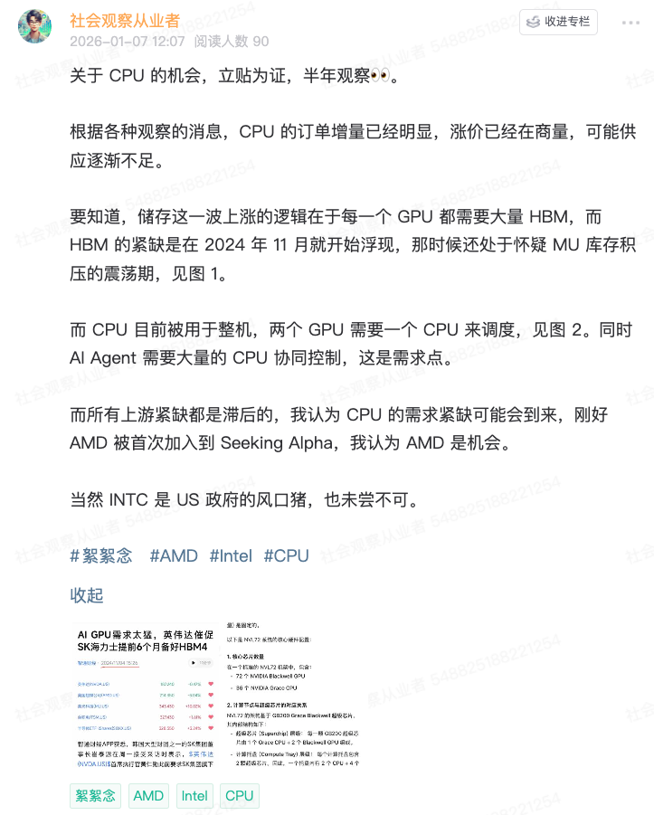
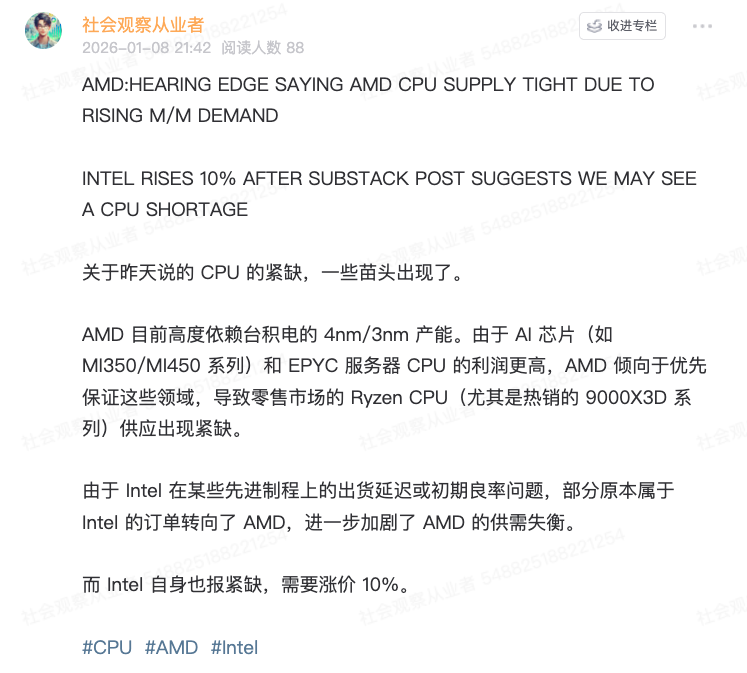
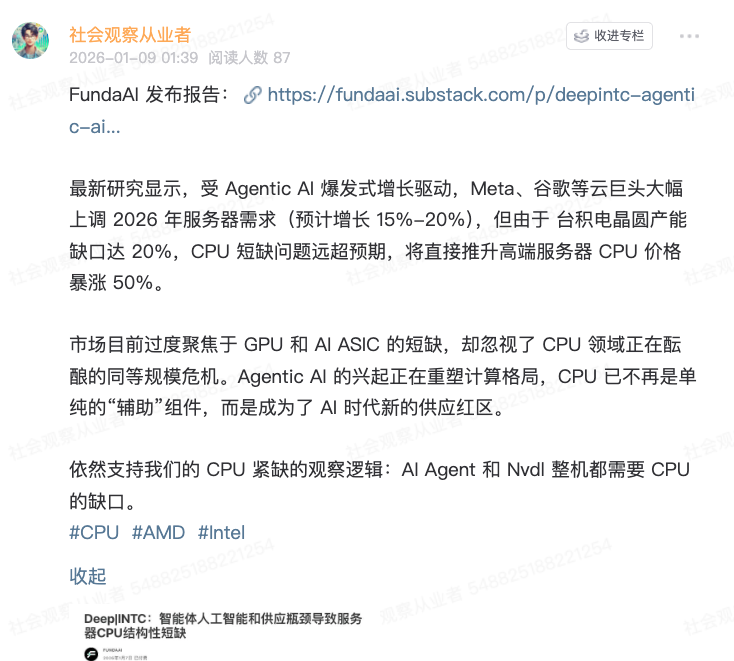
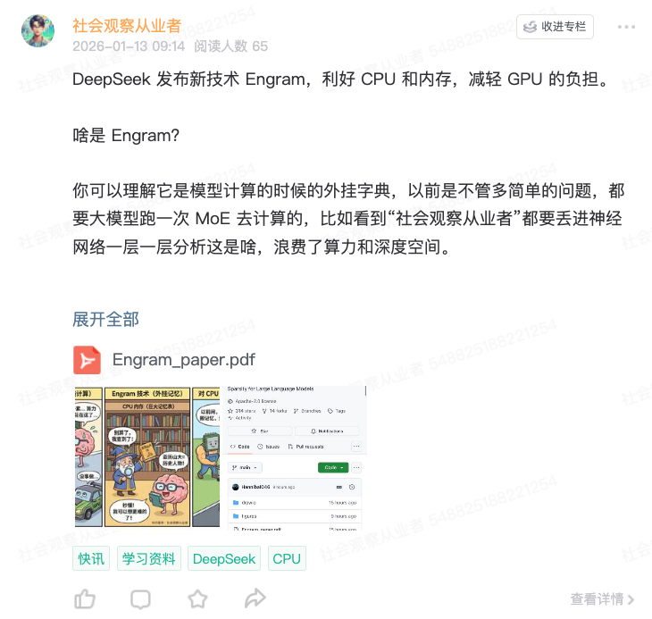
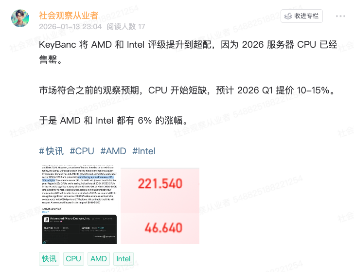
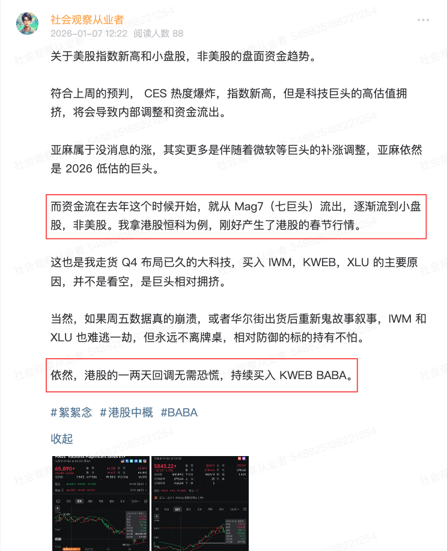
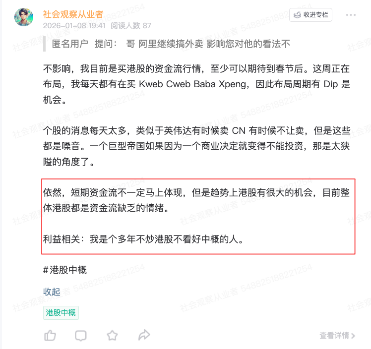
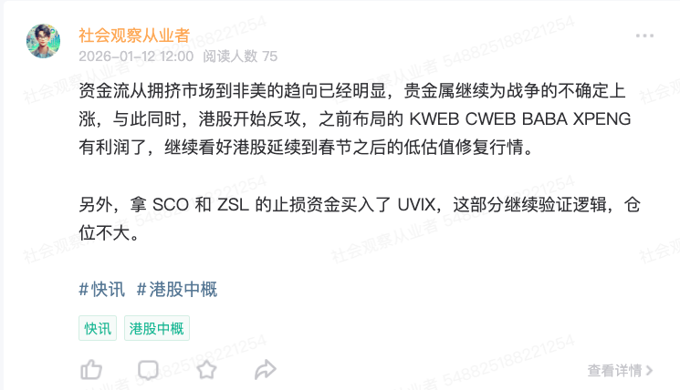
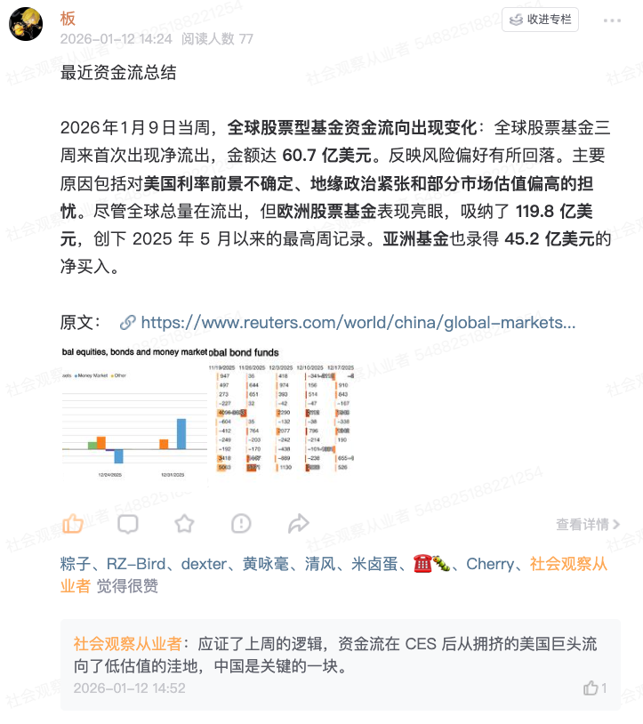

# 关于中概和 CPU 的机会是如何捕捉的？

**发布时间**: 2026-01-13 16:43:17

**原文链接**: [http://mp.weixin.qq.com/s?__biz=Mzk4ODc3ODgyOQ==&mid=2247484444&idx=1&sn=e9bef6fad8a0da278b1fc96c3331369d&chksm=c5815c3ef2f6d52858b7ef1c170d0602e8eeed586c0b18f245a053c54486775f148e2205c52f#rd](http://mp.weixin.qq.com/s?__biz=Mzk4ODc3ODgyOQ==&mid=2247484444&idx=1&sn=e9bef6fad8a0da278b1fc96c3331369d&chksm=c5815c3ef2f6d52858b7ef1c170d0602e8eeed586c0b18f245a053c54486775f148e2205c52f#rd)

---

在上一篇文章中，提到了我借着 CES 止盈，买入了中概、CPU、公共电力作为板块更换的资金流向，同时清仓了大科技。

> 但是我看到了另外的机会，就是 CPU 。
> 
> 美股观察员，公众号：社会观察从业者[2026 第一个月，拥挤，热闹，冷静，等待](https://mp.weixin.qq.com/s/EUXKG8gefWDYRwjcFveU_A?token=2030066057&lang=zh_CN)

> Q4 的科技财报，也可以看出，中概科技的 AI 效能提升相当明显，而在 A 股已经突破 4000，美股也突破 6950 的时候，港股还处于价值洼地，这是个重要的机会。
> 
> 美股观察员，公众号：社会观察从业者[2026 第一个月，拥挤，热闹，冷静，等待](https://mp.weixin.qq.com/s/EUXKG8gefWDYRwjcFveU_A?token=2030066057&lang=zh_CN)

昨天，中概大修复，购买的 BABA +10%，Xpeng +7.5%，Cweb + 8.5%。与此同时，今晚开始炒作 CPU 短缺，AMD +6%，Intel 历经了两天 10+% 今天继续 +6%。以下是星球时间线复盘下，我们怎么观察到 CPU 紧缺和中概行情？先说下 CPU。

1 月 7 日首先看到了 CPU 下游涨价的预期，然后复查到目前 AI Agent 需要大量 CPU。加上英伟达 CES 展示的 NVL72，每两个 GPU 都需要一个 CPU 调度，必然短缺。同时，英伟达的 HBM4 紧缺在 2024 年 11 月就开启了，但是内存缺乏的炒作是在今年 5 月才开启，延迟了半年，因此这几个月前的 CPU 涨价可能会导致延迟反应，可以布局。

接下来 1 月 8 日，AMD 和 Intel 都宣布了涨价，印证了紧缺的迹象。

接下来是 1 月 9 日 FundaAI 的报告，也表示 CPU 短缺问题开始严重。

最后发酵的时间是昨晚，DeepSeek 公布了 Engram 新技术，简单来说，是可以借助 CPU 和储存，减轻 GPU 算力的负担，因此可以让 CPU 继续助力 AI 推理和计算。

最后的版图由 KeyBanc 发酵，宣布上调到超配，2026 CPU 提前售罄，需要增产。以上，是整个观察的脉络，我也布局了不少 AMD 202 和 Intel 40.5 的仓位。再考虑到 AMD 被首次加入到 Seeking Alpha 2026 Top Picks，因此买入和持有的信心更加充分。  
  
之后聊聊中概是怎么观察的。  
首先，在 2026 年开年，高盛、摩根大通、美银都发了展望，认为 Q1 资金流有风险：  

GS 在 2026 展望的逻辑是：尽管美股基本面依然强劲，但高盛认为 2026 年的主题是“分散投资”。AI 的收益正在从头部的 7 家科技巨头扩散到更广泛的行业，而非美市场的估值调整使其具备更高的风险收益比。

  

JPM 表示 2026 年上半年虽有“金发姑娘”行情，但高昂的估值让“不含美国”的配置更具吸引力，认为欧洲央行的政策转向和财政韧性将支撑欧元资产；同时看好日本和中国在不同政策周期下的复苏机会。

  

BofA 表示 2026 年第一季度，资金正从硅谷（科技股）流向“主街”（能源、金融、工业等周期性板块）。这种轮动在地域上表现为从极致昂贵的美国科技股配置流向更具性价比的欧洲、日本和新兴市场。

  

考虑上科技的高估值 SPY/RSP > 3.5 十分拥挤，所以我选择了离场大科技，在 Q1 更换板块，而我认为港股在 10 月后的回调，都是资金流缺乏导致的机会，相反，A 股已经突破 4100 了，所以是价值洼地。

  

  

1 月 7 日，观察到资金流开始从非美流出，流入中国、日本、欧洲、墨西哥等市场，流动性增加加上外资的提前布局，预计港股会有行情。

  

  

1 月 8 日，资金流依然没有问题，趋向于港股。

  

这个过程港股出现了回调，因此我不断买入 BABA、Kweb、Xpeng、Cweb。

  

  

1 月 12 开始开始炒作 Trump 挑战鲍威尔和伊朗，贵金属依旧避险，但港股和 A 股却不断上涨，可以更加实锤这个趋势。

  

  

每一次的发酵，其实满场子都是机会，就看是否有足够的信息，可以拼凑起来了。

  

中概的行情我认为没多大问题，可以持续到春节后。

  

而 CPU，参考一下储存，今年大有可期。

  

其他大科技的机会，可能需要持续观察宏观和消息，才能决定重新布局。因为最近 Trump 开始挑战美联储独立性，刚搞完委内瑞拉，开始处理伊朗、格陵兰岛，我认为风险相当大。

  

为了中期选举，黄毛操碎了心。

  

  

  

  

声明：NFA (Not Financial Advice)。本文仅为个人观点与经验分享，不构成任何投资建议。市场有风险，决策需独立。一起来拼凑观察信息：

