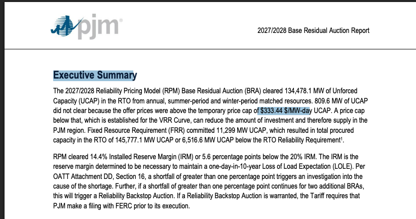
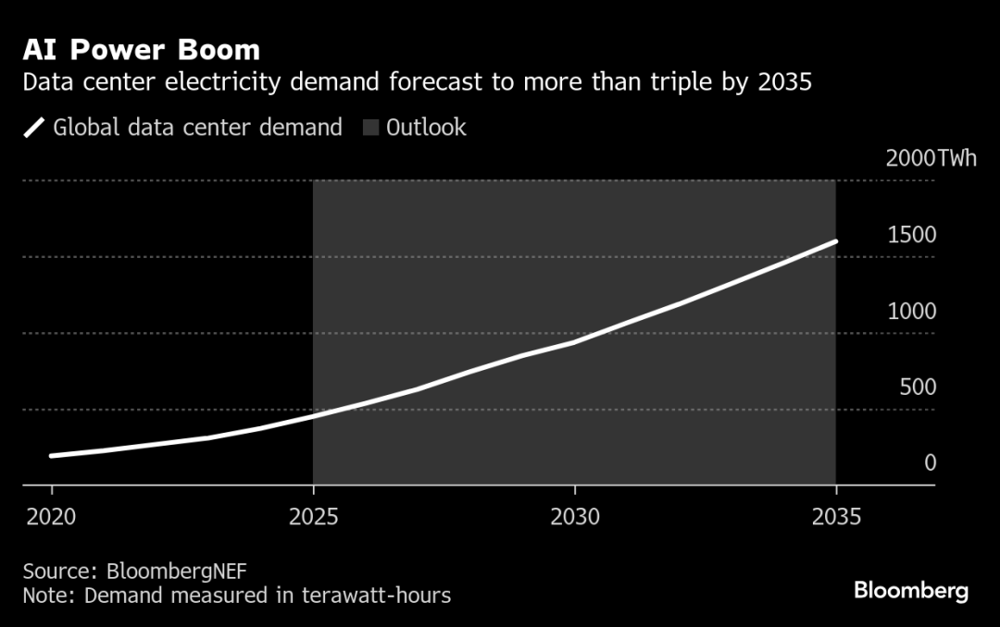
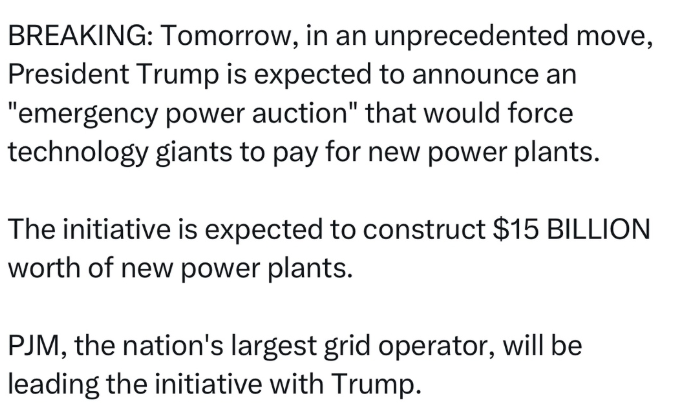
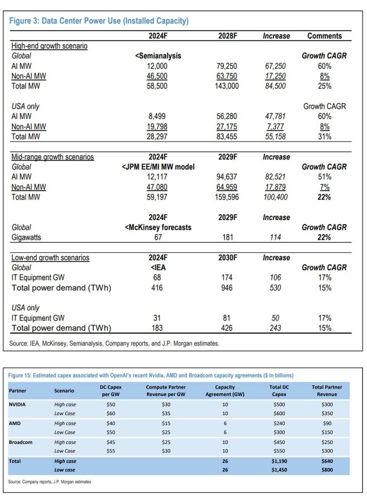
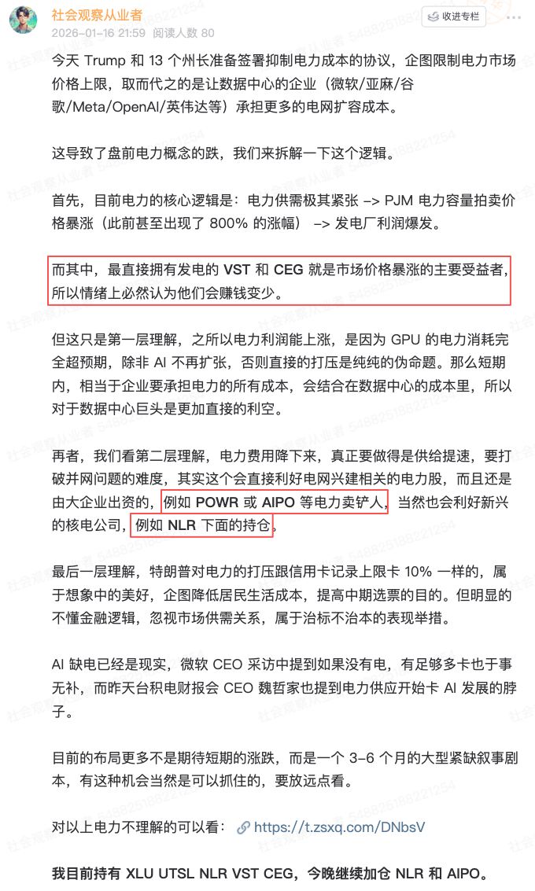
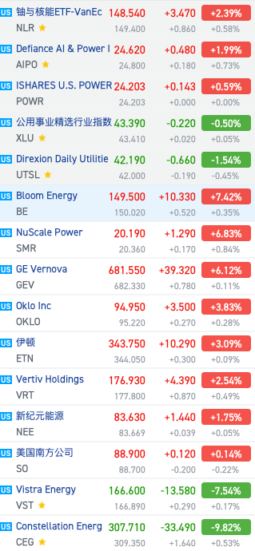

# 川川为何要干预电力

**发布时间**: 2026-01-17 09:43:10

**原文链接**: [http://mp.weixin.qq.com/s?__biz=Mzk4ODc3ODgyOQ==&mid=2247484462&idx=1&sn=0011479513aedeb8c335a9687202bb91&chksm=c5815c0cf2f6d51a675d2b7a36e636be270548fe02582d09af786d1787dbf31c1e229d4ab853#rd](http://mp.weixin.qq.com/s?__biz=Mzk4ODc3ODgyOQ==&mid=2247484462&idx=1&sn=0011479513aedeb8c335a9687202bb91&chksm=c5815c0cf2f6d51a675d2b7a36e636be270548fe02582d09af786d1787dbf31c1e229d4ab853#rd)

---

昨晚，电力相关股变成了市场热点。一切来源于，川川和 13 个州的州长准备签署抑制电力成本的协议，企图保护居民用电不受 AI 数据中心高价格的影响。是的没错，本文主要都是聊电力股的机会，如果没有做过功课，可以先看这篇文章：[《AI 的尽头是电力》](https://mp.weixin.qq.com/s?__biz=Mzk4ODc3ODgyOQ==&mid=2247484424&idx=1&sn=b36d6c492d8a0d2e156ba249854ea495&scene=21#wechat_redirect)我们回来看看川川这个政策：

逻辑要点其实只有两个：1\. 限制居民用电上限，要求供电企业不能无脑上涨电价，要求上限 $329/MW2. 催促 PJM 下一次电力拍卖，要求数据中心的企业签订跟供电企业的 15 年期长期合作订单，签订后哪怕以后不需要这么多电，也需要按月支付订单第一条，限制居民用电，怎么解读？现状是 PJM 拍卖结果，其实已经锁定了 2026-2028 上半年的电力了。

目前 2026/2027 的电力价格锁死了 $329.17/MW，而 2027/2028 锁死了 $333.44/MW。

https://www.pjm.com/-/media/DotCom/markets-ops/rpm/rpm-auction-info/2027-2028/2027-2028-bra-report.pdf

这个时间范围怎么理解？就是 2026 年下半年（6 月为分界），到 2028 年上半年，几乎居民用电的价格已经定死了。

那么 Trump 要求的 PJM 锁价格，其实是影响 2028-2029 的，拍卖时间是今年 6 月。

那有什么影响？

首先影响的是 VST 和 CEG，看一些图，数据中心的日益增长的电力需求，导致市场认为 2028 之后的价格甚至要飙升到 $400+/MW，所以预期本来就比较高。

而 Trump 的政策无疑是泼了一个冷水，意思是目前的价格可能就是上限了 ，让 2028 年的期待减少。

所以 VST 和 CEG，作为直接能供电的企业，就利空，股价出现了大跌。

第二条，催促企业合作，怎么解读？

现状是，需要数据中心的大科技微软 / 亚麻 / OpenAI / Meta 等已经跟大型电力企业签订了建厂订单，锁定了长期合作关系。

但是，JPM 发文表示巨头兴建数据中心的实际基建进度，赶不上计划投资的力度，吹牛为主（感谢这张图由星球友 @Iridescence 提供）。

而 Trump 的这个政策，意义在于：要求这些兴建电力中心的企业，要严格履行电力拍卖和建厂需求。如果签订了合同后，哪怕以后不需要这么多，依然要按月支付订单。

所以，相当于是政府官方催促和允许这类企业的合作，是利好。

因此，电力厂的卖铲人，例如 ETN / GEV / VRT 昨天也涨得不错，相关的 ETF POWR 和 AIPO 也是有不错的涨幅。

总结

所以，Full Picture 就很清晰了。

首先，数据中心导致的电力需求猛增，不止是数据中心，连卖卡的英伟达、博通、AMD 也在不断上涨电力需求。

这直接影响了居民用电，这是不合理的。

而 Trump 的目的是打压通胀，解决居民的生活负担，这既对 Make American Great Again 有利，也对自己中期选举有利。

因此，建立这一个行政命令，既保障居民用电，又能保障发电厂自己的盈利空间和订单，让数据中心自己为自己的需求买单，一切包含在 AI Capex 内，合情合理。

昨晚星球盘前的解读，也是比较快准狠的，今天的公众号是来补充更多的细枝末节。

电力板块最后的波动也是符合这个逻辑，预期直接盈利空间减少的 VST 和 CEG 大跌，而其他的兴建电力措施的核电和电力卖铲人概念股应声上涨。

我盘前就借 Dip 完成了电力布局，后续不再买了。

目前持有三大电力 ETF，分别是直接卖电的 XLU + 电力兴建用的硬件 AIPO + 核能 NLR，以及个股 VST 和 CEG。

解释：

XLU 是公共电力，所以是电力最平稳的中心，类似于标普，看好电力缺乏，这个必买。

其次是 AIPO，其实这个不纯粹，因为是 AI + PO(wer)，意思是包含了 AI（英伟达和博通）还有电力基建，其实更纯粹的 ETF 是 POWR，但我目前持仓没有什么大科技，而且我是跟着 AI 一起买的，所以选了这个。

最后是 NLR，从上文不难看出，电力分两部分，居民和 AI 用。居民用，被锁死了上限，虽然也有稳定的利润，但是空间不大。更多的紧缺是为数据中心服务的核能，其中，CEG 依然是核能巨头，也包含在这个 ETF 中，而且这个 ETF 里面还有 OKLO 和 SMR 等新的小公司，AI 企业几乎买单都是这些公司。

最后，是个股，我依然持有 VST 和 CEG，因为这两个属于电力市值最高的大企业，虽然期待差减少了，但是不影响企业合作的大头也是它们。而且 AI 的电力需求，主要看长线，我认为昨晚出现了超跌，问题不大。

再提醒一句，电力布局其实是买一个至少 3-6 个月的长期短缺叙事，不适合短炒。

各位要玩，也要注意仓位比例，减少一点短期的期待，而长期电力是卡所有 AI 的重头戏。

声明：NFA (Not Financial Advice)。本文仅为个人观点与经验分享，不构成任何投资建议。市场有风险，决策需独立。