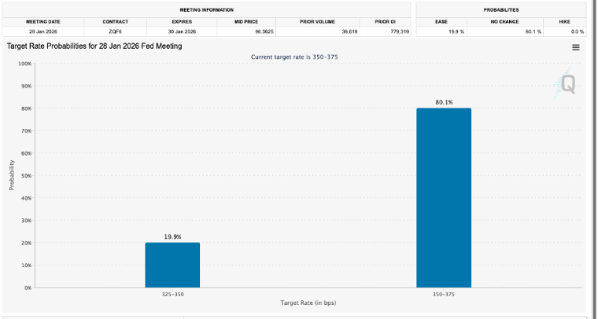
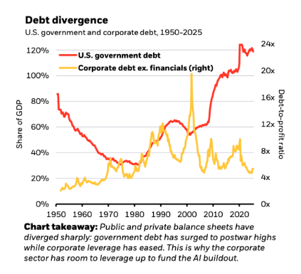

# 数据降温，不降息了？

**发布时间**: 2025-12-20 04:00:30

**原文链接**: [https://mp.weixin.qq.com/s/8I6D0PXTVYSpOb8ZbZFLhg](https://mp.weixin.qq.com/s/8I6D0PXTVYSpOb8ZbZFLhg)

---

👆点击蓝字，关注我们

**去监管 vs. 强监管**

今天先聊聊宏观和美联储。这周失业率超预期、CPI大降温，市场本能的反应是继续降息，因为现在不就是最好的降息环境吗？这该加快降息才对！但几位官员的讲话让现实变得异常寂静。

最先开这个头的是鲍威尔，他在上次会议结束后说了十几次Well Positioned，表示我们当前的位置相当好，完全不用着急。接着连大鸽派兼主席候选人沃勒也表示，虽然通胀在放缓，但目前的利率很合适，不用操之过急。

而纽约联储主席威廉姆斯今天也附议，他说我们现在位置很好不急于降息，况且11月就业通胀还很可能被扭曲了，要等接下来的数据再看情况。要知道，半个月前正是威廉姆斯把降息风头给带了起来，也是他扭转了市场预期。现在连他也觉得要歇一歇，这无疑是一个极其强烈的信号，意味着美联储内部对过早降息的担忧正在重新占据上风，市场之前那股过于乐观的情绪恐怕要面临修正了。

这样的表态也直接反映到了CME上，虽然1月降息概率始终未能超过50%，但一周前还有25%左右，而现在只有不到20%，这体现出交易员对继续降息的悲观预期。

另外还有一点，也许美联储现在最怕的不是少降一次，而是降太快又被迫回头。一旦市场把宽松预期打满，风险资产飙涨、信用扩张加速，那么通胀预期可能就会被重新点燃。到时候万一不得不加息的话，那么这个万亿级别的泡泡就很有可能被刺破了。

因此在下一次宏观数据出台前，市场就只能依靠事件和情绪来推动了。碰巧昨天盘后就出现了这么一个改变战局的关键事件，这点我们一会再会说，暂时先把目光转向主席大战这边。

这张图是Polymarket最新的预测，目前哈赛特以55%的概率遥遥领先；前不久短暂反超的沃什以21%位列第二；理事沃勒屈居第三。贝莱德高管里德则排名垫底。

虽然沃勒和里德理论上还有机会，而且今天白宫高级官员也声称面试沃勒非常成功，对他赞赏有加，但是无论从预测市场上的情况来看，还是从资本市场的风向上来看，最有可能当家美联储的人，还是那两个凯文，一个是凯文哈赛特，另一个是凯文沃什。而这两个人，虽然都是鸽派倾向，但还是有一个明显的区别，那就是去监管流派和强监管方向。

那么核心点就在于，川普希望监管朝着哪个方向演变？

简单说，川普当然希望去监管，这和他小政府、松监管的政策一脉相承。但是这会对整个金融体系造成什么深远的影响呢？这就要从38万亿美债说起了。

这张图来自于黑石2026年展望，里面提到美国政府债务占GDP的比例，该数据目前已经处在历史极高位，而私营部门债务却在历史低位，继续增加杠杆的空间还很大，这就是为什么今年各大公司都在争相发债加杠杆来支持数据中心的建设。

那么现在的问题是，政府债务如何转移到私营部门身上呢？又如何让整个国家的债务动态更加均衡呢？这时美联储和美国的大银行们，就会起到非常重要的作用了，

举个例子，财政扩张意味着继续发债，而为了避免支付昂贵的利息，政府需要把收益率压的足够低，最好能把实际利率压低为负值，也就是债券收益率减去通胀小于零。这就会让财政喘口气，不仅可以大规模借新债替旧债，真实支付的利息也变少了。

而能做到这一点的就是银行了，银行此时要站出来大规模购买国债。不过一旦如此，银行的资产负债表就会变得沉重起来。此时，为了避免让银行出现问题，美联储就必须放松监管，一方面是放松杠杆流动性约束，让银行更容易扩表持有国债；另一方面也要在适当的时候，通过RMP或者QE在二级市场上帮助银行一起吸纳国债。说白了，就是需要美联储去监管，银行则能大举花钱买国债，最终的目的就是压低国债收益率，让政府回口大血。

这套操作下来，还能带来一个意想不到的效果。那就是那些大举发债的科技公司会因此而受益。因为长期国债利率下行，也会同步压低企业们举债的成本。这样不仅国家付利息的压力减少了，还能促进私营部门的借贷，增加整个经济的动能。可谓一举两得。而所有这些的开端，都要源自于美联储对于金融行业的松绑，也就是上面所说的去监管。

因此，尽管沃什曾任美联储理事，也有应对金融危机的经验，并且还是摩根大通CEO戴蒙点名支持的对象。但由于哈赛特是川普的长期跟随者，参与了整个川普经济政策的制定，他是最能理解川普意图和政府规划的人，所以他的确是最可能接掌美联储的人，也是很可能打开监管大门，执行川普政策的人。

所以Jason认为，作为普通投资者，我们应该做的就是顺势而为。我认为美联储去监管是大势所趋，银行因此会收益。同时国债收益率曲线会被压低，高杠杆的企业或许会因此而释放一些风险。这些都是26年值得参考的投资趋势。

但是硬币总有两面，弹簧被压的越紧，反弹的动能就会越大。现在水能流出来是挺好，但大水漫灌也有巨大的风险。届时，水怎么流出来，就得怎么收回去，而这正是JP Morgan CEO戴蒙所担心的。Jason也会时刻为大家监控这个风险。

  

往期推荐

| **01**| [●](https://mp.weixin.qq.com/s?__biz=Mzg4NjIxNDkwNA==&mid=2247496730&idx=1&sn=b481f67a74603a2e2ded3221d8e272d8&scene=21#wechat_redirect)[ 英伟达最新财报](https://mp.weixin.qq.com/s?__biz=Mzg4NjIxNDkwNA==&mid=2247496730&idx=1&sn=b481f67a74603a2e2ded3221d8e272d8&scene=21#wechat_redirect)  
---|---  
[► 点击阅读](https://mp.weixin.qq.com/s?__biz=Mzg4NjIxNDkwNA==&mid=2247496730&idx=1&sn=b481f67a74603a2e2ded3221d8e272d8&scene=21#wechat_redirect)  
| **02**| [● ](https://mp.weixin.qq.com/s?__biz=Mzg4NjIxNDkwNA==&mid=2247496617&idx=1&sn=810f179dccbaf5cb968d9fbea327b7c0&scene=21#wechat_redirect)[掌握这套方法，即可安心投资！](https://mp.weixin.qq.com/s?__biz=Mzg4NjIxNDkwNA==&mid=2247496617&idx=1&sn=810f179dccbaf5cb968d9fbea327b7c0&scene=21#wechat_redirect)  
---|---  
[► 点击阅读](https://mp.weixin.qq.com/s?__biz=Mzg4NjIxNDkwNA==&mid=2247496617&idx=1&sn=810f179dccbaf5cb968d9fbea327b7c0&scene=21#wechat_redirect)  
| **03**| [● ](https://mp.weixin.qq.com/s?__biz=Mzg4NjIxNDkwNA==&mid=2247496428&idx=1&sn=b2a3cef4b611dfe77713c3ecca115bbe&scene=21#wechat_redirect)[川普关税的真正目的是什么？](https://mp.weixin.qq.com/s?__biz=Mzg4NjIxNDkwNA==&mid=2247496428&idx=1&sn=b2a3cef4b611dfe77713c3ecca115bbe&scene=21#wechat_redirect)  
---|---  
[► 点击阅读](https://mp.weixin.qq.com/s?__biz=Mzg4NjIxNDkwNA==&mid=2247496428&idx=1&sn=b2a3cef4b611dfe77713c3ecca115bbe&scene=21#wechat_redirect)  
| **04**| [● ](https://mp.weixin.qq.com/s?__biz=Mzg4NjIxNDkwNA==&mid=2247496223&idx=1&sn=e890061161e006fbae9839b2322d5b3a&scene=21#wechat_redirect)[定投真的适合散户吗？](https://mp.weixin.qq.com/s?__biz=Mzg4NjIxNDkwNA==&mid=2247496223&idx=1&sn=e890061161e006fbae9839b2322d5b3a&scene=21#wechat_redirect)  
---|---  
[► 点击阅读](https://mp.weixin.qq.com/s?__biz=Mzg4NjIxNDkwNA==&mid=2247496223&idx=1&sn=e890061161e006fbae9839b2322d5b3a&scene=21#wechat_redirect)  
  
  

**联系我们**  

  

想在订阅美投Pro前了解具体服务内容？可邮件我们了解详情：info@jdbinvesting.com

  

https://www.jdbinvesting.com/