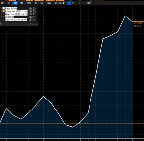

# 甲骨文绝境反转？

**发布时间**: 2025-12-20 04:00:30

**原文链接**: [https://mp.weixin.qq.com/s/axx5CpSNpuKx1oYV57EicA](https://mp.weixin.qq.com/s/axx5CpSNpuKx1oYV57EicA)

---

👆点击蓝字，关注我们

**美股大科技集体回血！**

昨天盘后两则重磅新闻让甲骨文和CoreWeave回了口大血，或多或少也带动了今天的市场情绪。它们是什么呢？我们一起来回顾一下。

据华尔街日报报道，OpenAI正计划筹集高达1000亿美元的资金，预计将寻求阿联酋主权财富基金的投资。报道指出，包括阿联酋主权财富基金、软银、亚马逊等投资者都将会支持这一融资计划，而阿联酋预计将成为本轮融资的核心力量。

华尔街日报表示，此轮融资对产业链具有显著的提振效应。OpenAI所获资金将主要用于支付算力成本，这意味着像甲骨文这类数据中心将获得持续且稳定的收入来源。这笔融资的意义远超OpenAI本身，因为它直接关系到甲骨文等关键供应商的资产负债表健康度。

此外，鉴于此前已投入的巨额资金，包括阿联酋、软银等资本此时选择继续注资，在某种程度上反映了OpenAI已经变得大而不能倒的逻辑，就好比2008时代的金融机构一样，如今的人工智能龙头企业也必须维持运转。

除此之外还有一则好消息，而它几乎是在同一时间放了出来。

据彭博、CNBC等多家媒体报道，TikTok正式签署了合作协议，将美国业务拆分并装入美国控制的一家合营企业里。在新企业的股权结构上，字节跳动持有20%股权，银湖、阿联酋资本及其他联合方合计持有35%，甲骨文持有15%，现有投资者持有30%。

据Axios援引知情人士消息，此次剥离美国业务的交易作价仅为区区的140亿美元。

如果我们参考Meta约10倍的市销率，并结合此前TikTok美国业务年收入超100亿美元的估算，那么它的正常估值应该在1000亿左右，远高于此。

更有趣的是，恰好就在今天，市场传出字节跳动今年整体利润将超500亿美元的消息。我不知道在这个敏感的时间点，流出这个数据是否是有意为之，但它无疑与美国业务的贱卖，形成了极具冲击力的反差。这仿佛是一种无声的呐喊，字节在向世界展示：看吧，美国政府是如何在光天化日之下瓜分我的资产的。

当然了，瓜分资产必然有利益驱使，而甲骨文正是最大受益者之一。因为它不仅承担TikTok美国数据的承载分发存取职责，收取服务费用。并且还以极低的价格持有15%的股权。试想一下，假设甲骨文哪一天真缺钱了，这笔股权不正好可以质押出去，甚至处置一部分呢？当然了，字节的股权相对比较敏感，也不是什么公司都能承接的，但终归给甲骨文增添了不少信用分。

Jason认为，OpenAI融资和TikTok落地都给市场，都给甲骨文回了一口大血，增加了不少信心。

但这阵兴奋感似乎并未传导至更敏感的债券市场。甲骨文的信用违约互换CDS仅从156个基点的高位，微弱收窄到了154，变化没有想象中的大。当然，也许下周它还会继续发酵，CDS也可能会继续回落，但就目前而言，今天债市投资者似乎认为，这两笔交易没有反转故事，只是改善了一些预期而已。

再者，OpenAI融来的钱有多少是分给甲骨文的？要知道，甲骨文只是OpenAI诸多供应商之一，而后者的投资是以万亿级计算的，横跨了几乎所有科技巨头。况且，OpenAI和甲骨文的合约都是几年后才生效，短期也无法解决甲骨文的现金流问题。这恐怕也解释了一部分为什么甲骨文CDS没有显著变化的原因。

最后市场对甲骨文此前的担忧，还有一点是来自于数据中心的延迟交付。换句话说，即便OpenAI把钱给准备好了，但是数据中心迟迟无法交付，那么甲骨文也无法按期收回款项，这个期间要拉长的话，那它还能撑得住吗？

因此我认为，无论是TikTok的落地还是OpenAI的融资，他们的作用在长期，短期更多是提振AI整体的信心。但对于现阶段的甲骨文来说，风险仍然没有完全释放。这点需要投资者分清。

  

往期推荐

| **01**| [●](https://mp.weixin.qq.com/s?__biz=Mzg4NjIxNDkwNA==&mid=2247496730&idx=1&sn=b481f67a74603a2e2ded3221d8e272d8&scene=21#wechat_redirect)[ 英伟达最新财报](https://mp.weixin.qq.com/s?__biz=Mzg4NjIxNDkwNA==&mid=2247496730&idx=1&sn=b481f67a74603a2e2ded3221d8e272d8&scene=21#wechat_redirect)  
---|---  
[► 点击阅读](https://mp.weixin.qq.com/s?__biz=Mzg4NjIxNDkwNA==&mid=2247496730&idx=1&sn=b481f67a74603a2e2ded3221d8e272d8&scene=21#wechat_redirect)  
| **02**| [● ](https://mp.weixin.qq.com/s?__biz=Mzg4NjIxNDkwNA==&mid=2247496617&idx=1&sn=810f179dccbaf5cb968d9fbea327b7c0&scene=21#wechat_redirect)[掌握这套方法，即可安心投资！](https://mp.weixin.qq.com/s?__biz=Mzg4NjIxNDkwNA==&mid=2247496617&idx=1&sn=810f179dccbaf5cb968d9fbea327b7c0&scene=21#wechat_redirect)  
---|---  
[► 点击阅读](https://mp.weixin.qq.com/s?__biz=Mzg4NjIxNDkwNA==&mid=2247496617&idx=1&sn=810f179dccbaf5cb968d9fbea327b7c0&scene=21#wechat_redirect)  
| **03**| [● ](https://mp.weixin.qq.com/s?__biz=Mzg4NjIxNDkwNA==&mid=2247496428&idx=1&sn=b2a3cef4b611dfe77713c3ecca115bbe&scene=21#wechat_redirect)[川普关税的真正目的是什么？](https://mp.weixin.qq.com/s?__biz=Mzg4NjIxNDkwNA==&mid=2247496428&idx=1&sn=b2a3cef4b611dfe77713c3ecca115bbe&scene=21#wechat_redirect)  
---|---  
[► 点击阅读](https://mp.weixin.qq.com/s?__biz=Mzg4NjIxNDkwNA==&mid=2247496428&idx=1&sn=b2a3cef4b611dfe77713c3ecca115bbe&scene=21#wechat_redirect)  
| **04**| [● ](https://mp.weixin.qq.com/s?__biz=Mzg4NjIxNDkwNA==&mid=2247496223&idx=1&sn=e890061161e006fbae9839b2322d5b3a&scene=21#wechat_redirect)[定投真的适合散户吗？](https://mp.weixin.qq.com/s?__biz=Mzg4NjIxNDkwNA==&mid=2247496223&idx=1&sn=e890061161e006fbae9839b2322d5b3a&scene=21#wechat_redirect)  
---|---  
[► 点击阅读](https://mp.weixin.qq.com/s?__biz=Mzg4NjIxNDkwNA==&mid=2247496223&idx=1&sn=e890061161e006fbae9839b2322d5b3a&scene=21#wechat_redirect)  
  
  

**联系我们**  

  

想在订阅美投Pro前了解具体服务内容？可邮件我们了解详情：info@jdbinvesting.com

  

https://www.jdbinvesting.com/