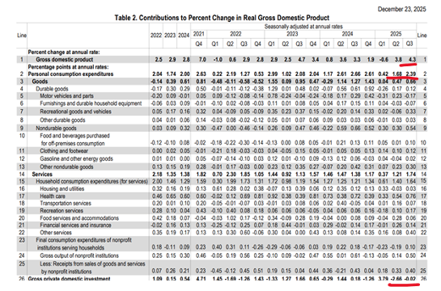
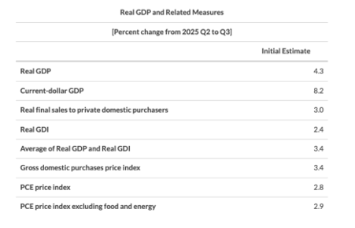

# 疯狂的GDP

**发布时间**: 2025-12-24 04:01:27

**原文链接**: [https://mp.weixin.qq.com/s/MqeH2Ab62eHyFSoptX8X2A](https://mp.weixin.qq.com/s/MqeH2Ab62eHyFSoptX8X2A)

---

👆点击蓝字，关注我们

**黄金上涨的真相**

4.3%的GDP是什么水平？作为对比，东方大国三季度GDP为4.8%，印度为6.2%，欧盟和英国只有1%左右，这么看来，美国的确像川普说的那样，它不是发达国家，而是一个发展中国家才对。不过，面对火热的GDP与2.4%的收入增长，这种落差和脱节似乎又暗示，美国经济好像并没有看起来的那般繁荣？

结合数据表我们发现，推动三季度GDP的核心动力主要来自增长的居民消费和净出口所带动。

特别是消费者支出，它从Q2的1.69%大幅拉升到Q3的2.39%，变化幅度达0.7%。这里面商品端贡献了约0.2%，剩余的0.5%都来自服务端的消费。服务消费的激增，一方面说明美国经济有韧性，居民在经济复杂的背景下持续消费。但另一方面又会导致通胀粘性，这也解释了为什么三季度通胀都难以降温。

另一边进口数据的下降，在GDP核算公式中起到了正向推升的作用，进一步巩固了最终的读数。

而在投资方面，它虽然依然出现了0.02%的微幅下滑，但与二季度的2.66%相比，这个度已经明显地收窄了，不再是拖累经济的主要因素。

最后财政支出也逆转了颓势，从二季度的萎缩0.01%大幅转变为三季度的增长0.39%。

综合来看，三季度不仅消费内需和政府支出共同驱动了增长，投资萎缩也大幅放缓减轻了拖累，整体显示出美国经济的基本面依然保持着较强的活力。

同时，微观层面的企业经营状况也传来了积极信号。报告中提到，三季度，来自当前生产的企业利润大幅增加了1661亿美元。这是一个什么水平呢？

二季度这一指标仅微增了68亿美元。三个月过后便从不足百亿跃升到千亿级别。这说明美国企业在面对通胀和成本压力时，依然拥有强大的定价权和成本控制能力，并且能够有效地将营收转化为实实在在的利润。

不过，随着经济活动的加速，尤其是居民消费的增长，通胀压力也再次显现。三季度PCE上涨了2.8%，剔除食品和能源的核心PCE更是上涨了2.9%，这两个数据均高于二季度，并且叠加上超预期的GDP，也给市场和降息预期带来不少压力。

最后衡量经济健康程度国内总收入GDI，它在三季度仅增长了2.4%。GDP与GDI之间有了将近2%的差异，这提示我们美国当前经济和收入增长并不匹配，并且结合通胀居高不下的大背景，可能会使得GDP在一定程度上高估了实际体感。

而这个体感正好被今天CB消费者信心报告所解释了。

报告显示，12月消费综合指数已跌至89.1的低位，追平了2008年金融危机以来的最长连跌记录，其中衡量当前状况的分项指数更是骤降至2021年2月以来的最低水平。

报告提到，就业增长乏力配合失业率上升，以及仍高于美联储目标的通胀水平是目前压制信心的核心因素。

调查显示，目前认为工作“充足”的消费者占比下滑，而认为工作“难找”的比例有所提升，一升一降双边收窄导致居民对就业市场加剧紧张。

Jason认为，今天股市低开可能是因为超预期的GDP和强劲的居民消费，市场担心这样的好消息会抑制降息预期。

但是这毕竟是三季度的情况。包括10月政府创纪录的停摆，四季度的裁员潮，还有近几个月的悲观消费预期都暗示，美国四季度GDP大幅放缓的可能性并不低，尤其是消费，它可能是推动经济放缓的主要推手。

因此我认为，暂时不必纠结三季度的好消息，它对市场和美联储降息的影响都不是很显著。而下次FOMC会议前还有12月的非农和CPI，这两个数据更重要，也更能厘清美联储的政策路径。

最后再提一嘴，贝森特在今天接受采访时表示，可以讨论将美联储的通胀目标从单一数值转变为一个区间，比如从2%的目标转为1%到3%。同一时间，川普也再次强调任何不同意我意见的人，都无法担任美联储主席。

总统和首席内阁的共同发言似乎是在说，接下来白宫可能会推动美联储拉宽通胀目标区间，并推动继续降息。

如此一来，从积极的角度看，更宽的目标通胀的确给美联储更多的灵活度，降息与加息的理由都变多了。那么在当下降息的这个阶段里，也确实会给市场带来乐观情绪。

但从消极的角度说，未来通胀可能会长期锚定在2.5%左右，而政策利率又会在这个通胀水平下继续下降。那么这种宽通胀容忍度叠加降息的做法，或许会让30年期收益率继续上涨，造成曲线进一步熊陡。这可能会让更关键的10年期收益率不随着降息下降，反而随着长端一齐上行，从而压缩估值。这是一个可能的情形，需要保持关注，盯紧债市异动。

  

往期推荐

| **01**| [●](https://mp.weixin.qq.com/s?__biz=Mzg4NjIxNDkwNA==&mid=2247496730&idx=1&sn=b481f67a74603a2e2ded3221d8e272d8&scene=21#wechat_redirect)[ 英伟达最新财报](https://mp.weixin.qq.com/s?__biz=Mzg4NjIxNDkwNA==&mid=2247496730&idx=1&sn=b481f67a74603a2e2ded3221d8e272d8&scene=21#wechat_redirect)  
---|---  
[► 点击阅读](https://mp.weixin.qq.com/s?__biz=Mzg4NjIxNDkwNA==&mid=2247496730&idx=1&sn=b481f67a74603a2e2ded3221d8e272d8&scene=21#wechat_redirect)  
| **02**| [● ](https://mp.weixin.qq.com/s?__biz=Mzg4NjIxNDkwNA==&mid=2247496617&idx=1&sn=810f179dccbaf5cb968d9fbea327b7c0&scene=21#wechat_redirect)[掌握这套方法，即可安心投资！](https://mp.weixin.qq.com/s?__biz=Mzg4NjIxNDkwNA==&mid=2247496617&idx=1&sn=810f179dccbaf5cb968d9fbea327b7c0&scene=21#wechat_redirect)  
---|---  
[► 点击阅读](https://mp.weixin.qq.com/s?__biz=Mzg4NjIxNDkwNA==&mid=2247496617&idx=1&sn=810f179dccbaf5cb968d9fbea327b7c0&scene=21#wechat_redirect)  
| **03**| [● ](https://mp.weixin.qq.com/s?__biz=Mzg4NjIxNDkwNA==&mid=2247496428&idx=1&sn=b2a3cef4b611dfe77713c3ecca115bbe&scene=21#wechat_redirect)[川普关税的真正目的是什么？](https://mp.weixin.qq.com/s?__biz=Mzg4NjIxNDkwNA==&mid=2247496428&idx=1&sn=b2a3cef4b611dfe77713c3ecca115bbe&scene=21#wechat_redirect)  
---|---  
[► 点击阅读](https://mp.weixin.qq.com/s?__biz=Mzg4NjIxNDkwNA==&mid=2247496428&idx=1&sn=b2a3cef4b611dfe77713c3ecca115bbe&scene=21#wechat_redirect)  
| **04**| [● ](https://mp.weixin.qq.com/s?__biz=Mzg4NjIxNDkwNA==&mid=2247496223&idx=1&sn=e890061161e006fbae9839b2322d5b3a&scene=21#wechat_redirect)[定投真的适合散户吗？](https://mp.weixin.qq.com/s?__biz=Mzg4NjIxNDkwNA==&mid=2247496223&idx=1&sn=e890061161e006fbae9839b2322d5b3a&scene=21#wechat_redirect)  
---|---  
[► 点击阅读](https://mp.weixin.qq.com/s?__biz=Mzg4NjIxNDkwNA==&mid=2247496223&idx=1&sn=e890061161e006fbae9839b2322d5b3a&scene=21#wechat_redirect)  
  
  

**联系我们**  

  

想在订阅美投Pro前了解具体服务内容？可邮件我们了解详情：info@jdbinvesting.com

  

https://www.jdbinvesting.com/