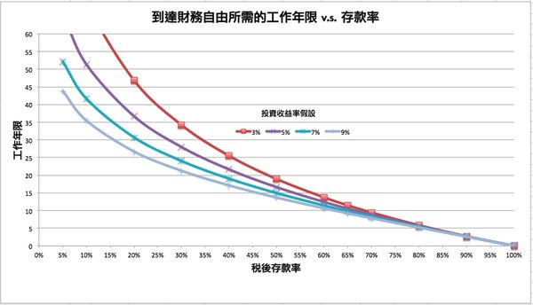

# 工资理财实现财务自由靠谱吗？

**发布时间**: 2018-12-31 07:10:43

**原文链接**: [http://mp.weixin.qq.com/s?__biz=MzUzNjE3NzQ3Nw==&mid=2247484340&idx=1&sn=c43d53927c63368672fb014b05c4f17b&chksm=fafb7d9ecd8cf488083831664abe95f6733a5598cb7e6c7710ca8ca77a58a77cc437b4d3ae8e#rd](http://mp.weixin.qq.com/s?__biz=MzUzNjE3NzQ3Nw==&mid=2247484340&idx=1&sn=c43d53927c63368672fb014b05c4f17b&chksm=fafb7d9ecd8cf488083831664abe95f6733a5598cb7e6c7710ca8ca77a58a77cc437b4d3ae8e#rd)

---

从 2017 年开始更新也谈钱的第一篇内容，到现在已经写了一年半、几十万字，顿时感慨时间过得好快。最近在做年度回顾，重读了自己当年的第一篇内容 [十年时间足够你财务自由](http://mp.weixin.qq.com/s?__biz=MzUzNjE3NzQ3Nw==&mid=2247483657&idx=1&sn=bc8657e8c95bd53205711569a560bc4e&chksm=fafb7f23cd8cf635298fefa71a826b9e9b78bfb170b7836da915c408874330cb96712da6bbd7&scene=21#wechat_redirect)，发现又有好多想说的。

**财务自由可以说是我们理财的最终目标** ，正好在 2019 年开始的前一天，重新认识一下这个“小”目标。

> 「财务自由」可以通俗的理解为，即使赋闲在家啥也不干，依然又足够的被动收入覆盖自己的开支，钱不会越花越少。来源可以是投资等不需要自己全程参与也能创造收益的工具。

当我们提到某某实现财务自由的时候，往往都会惯常地认为他做成了某笔买卖、押中了哪项投资，突然实现了巨大的成功或者收入相当高，才能实现财务自由。但是能够做成这些事的毕竟是少数人，大多数人过的还是平平常常的日子，难道财务自由注定和我们无缘吗？

我认为其实每个人都可以通过计划和努力，在**没有** 运气加成的情况下，实现财务自由。这就是我写公众号的初衷，希望在这记录和分享我的经历和思考，最终实证工资理财的可行性。

### 实现财务自由其实就俩要素

实现财务自由靠的就是 **钱**  + **收益率** ，最终「被动收入 = 钱 x 收益率」。只要我们积累下足够的本金，再通过合理的投资实现一个相对平均的收益率，获得可观的被动收入并不难。

> if 被动收入 > 开支 + 通货膨胀:
> 
>     实现财务自由
> 
> else:
> 
>     继续努力

那么要解决的第一个问题，可能也是最大的问题就是「钱在哪？」。个人认为创造本金远难于创造收益，对于大部分人来说，在当前的市场环境下取得一个整体平均的收益水平并不困难（持有指数基金就能轻松做到），但是存不下钱却是一个老大难的话题。  

## 本金的最有效来源

对于我们来说，积累本金最有效的方法就是八个字——**努力赚钱，认真存钱** 。大部分人都没有中彩票的运气（亲测过 😓），也没有继承巨额财产的投胎功底，最有效、最普遍的获得本金的方法其实就是**储蓄** 。

估计很多人看到这俩字已经分分钟失去兴趣了，因为储蓄常常被和省吃俭用、影响生活联系在一起，让人脑补出蹲在角落可怜地吃方便面的画面。

但是如果说，储蓄并不意味着生活质量下降，也不意味着必须省吃俭用，储蓄这件事就会变得容易很多。我们可以考虑一个问题——更少的时间一定意味着完成更少的任务吗？不一定吧，因为不同人的工作效率不同。

消费这件事也是一样，**更少的消费不意味着要降低生活质量和牺牲当下** ，因为我们还可以选择提升消费效率，让消费创造更多的价值。这个问题是我一直在思考的，我们有确定的方法做好时间管理，比如 GTD，那么我们就一定能找到确定的方法来做好消费管理，提高我们的消费效率、增加储蓄。关于这个问题我之前在 [控制消费一定会影响幸福感吗 ](http://mp.weixin.qq.com/s?__biz=MzUzNjE3NzQ3Nw==&mid=2247484260&idx=1&sn=95ec5581703d935ab2eb10c90cb1a126&chksm=fafb7d4ecd8cf4585411c4f423959036d19e23f24bd8243e1159616526c7d392e1af159cee93&scene=21#wechat_redirect)有过简单的讨论，后面我也会继续研究相关的思路和方法。

总而言之，就是一句话，**储蓄这件事有戏、可行！**

### 储蓄率是最重要的指标

窃以为，储蓄率才是影响财务自由进度的最重要指标。

👇 分享一张在博客 Winnie 发现的一张很直观的图。储蓄率对于实现财务自由所需时间的影响是指数级的，而且相比于收益率而言，大幅提高储蓄率要容易得多。我们可以很容易的实现从 10% 储蓄率到 50% 储蓄率，但是投资收益率从 10% 提升到 20% 却难如登天。

这个博客的作者就是之前我推荐的书《不上班也有錢》的作者，她和老公经过十年的努力，顺利通过工资实现财务自由并开始环球旅行的。

另外，我在之前的内容 [十年实现财务自由](http://mp.weixin.qq.com/s?__biz=MzUzNjE3NzQ3Nw==&mid=2247483657&idx=1&sn=bc8657e8c95bd53205711569a560bc4e&chksm=fafb7f23cd8cf635298fefa71a826b9e9b78bfb170b7836da915c408874330cb96712da6bbd7&scene=21#wechat_redirect) 中有过简单的计算，大家感兴趣可以跳转过去看看。

## 散户能不能赚钱

说完了储蓄再看看投资收益的问题，前面简单提了一嘴，获得与市场平均的收益率并不困难。

关于散户到底能不能赚到钱，结论其实已经很明显了，因为已经有太多的成功经验。而且很多成功的投资者还在分享自己的投资方法和公布投资计划，方便大家参考、跟投。如果这样依然赚不到钱实在是不应该。 _（关于收益的讨论，我是放在五年以上的视角来看，一年的盈亏意义不大。）_

当然如同投资理财会有坑，跟投的坑也不少，我在之前的 基金跟投靠谱吗 里面有过比较详细的讨论。跟投之前也要有所选择，有所判断，不要盲目。但是如果决定开始跟投、决定相信人家，那就尽量 100% 的复制执行，少一些自行判断（因为多半会是错的）。

## 靠谱但并不容易

总而言之，靠工资理财实现财务自由这事很靠谱，我们只要制定好并执行自己的消费储蓄计划，并选择一个相对保守合理的投资渠道，最终就能实现。

但是靠谱也不等于很容易，事是这么个事，但是坚持却又是另一回事，因为诱惑实在太多。我又要举那个老生常谈的例子了，一直认为理财投资和减肥的过程很像，道理说出来都很简单，但是过程中所需的坚持和努力却很难言说。

2018 年的最后一天啦，预祝大家新年快乐 ☺️。