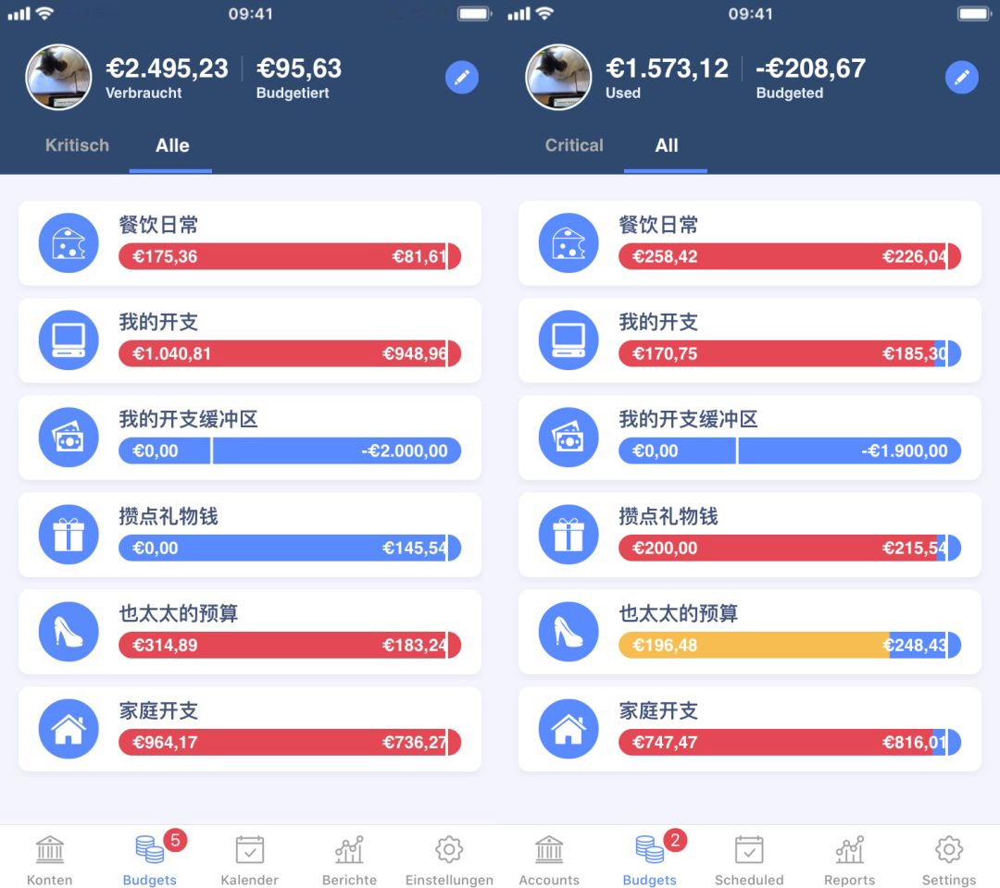
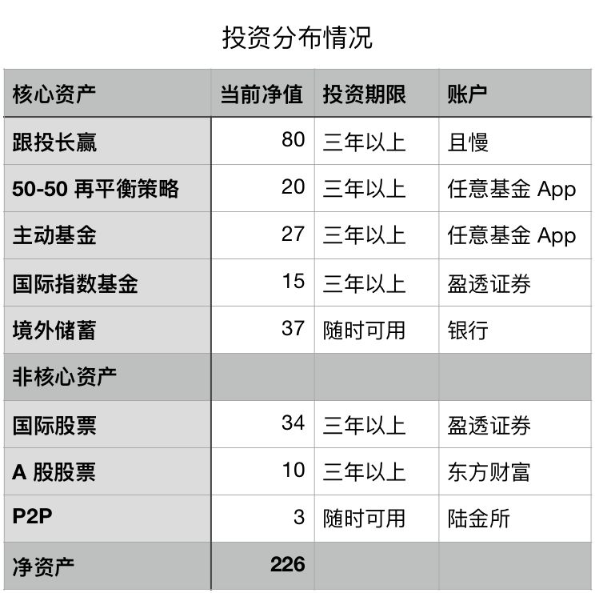

# 财务自由实证 #2 | 坐了一把过山车

**发布时间**: 2019-05-06 07:00:00

**原文链接**: [http://mp.weixin.qq.com/s?__biz=MzUzNjE3NzQ3Nw==&mid=2247484707&idx=1&sn=91f60dc7c5285e77e734a8e91bd1f20d&chksm=fafb7b09cd8cf21f13e49801c40f778f45a68e5452ad9a8b0a28be598c9b2b3d96836925738d#rd](http://mp.weixin.qq.com/s?__biz=MzUzNjE3NzQ3Nw==&mid=2247484707&idx=1&sn=91f60dc7c5285e77e734a8e91bd1f20d&chksm=fafb7b09cd8cf21f13e49801c40f778f45a68e5452ad9a8b0a28be598c9b2b3d96836925738d#rd)

---

4 月份的行情完美地演绎了什么叫「别高兴得太早」，话说月中的时候标题都想好了「三个月赚出了两年的积蓄」。结果，4 月份下半个月把前面的涨幅全跌回去了…… 怎么办，只能灰溜溜的改标题呗。

市场强势打脸再一次证明初期稳定现金流的重要性，还是回去老老好好搬砖、努力赚钱。

这次回调也完美的演绎了一个投资心理周期的微缩版，4 月初的时候大家都在关心怎么入市、怎么别超过这几年一遇的“改变人生的计划”，然后 4 月末就改为讨论，应该什么时候止盈卖出了。大家的情绪翻篇未免太快了点 😂，措手不及啊。

## 实证目标

为了方便新朋友阅读，简单重复一下实证的目标和方法，老朋友可以跳过这一节。

这个系列实证是我个人财务计划的公开，最终目标只为一个——工资理财实现财务自由，F.I.R.E （Financial Independence and Early Retirement）。不追求大富大贵，但求能够不再担心生计问题，更有底气**把时间“浪费”在美好的事物上，放心做那些自己喜欢，却不一定能够养活自己的事情。**

有兴趣参考这个实证的朋友建议先看看之前的引导篇，[#0 | 制定你自己的财务自由计划](https://mp.weixin.qq.com/s?__biz=MzUzNjE3NzQ3Nw==&mid=2247484500&idx=1&sn=c04c3de1a1231bef25bb4cda773c00ff&scene=21#wechat_redirect)、[和我一起财务自由](https://mp.weixin.qq.com/s?__biz=MzUzNjE3NzQ3Nw==&mid=2247484480&idx=1&sn=258e8dd4976c7d3c324ed89b90904d14&scene=21#wechat_redirect)，对于理解实证会有很大帮助。

我给自己定下的目标是积累 500 万人民币净金融资产。

## 实证第 2 期

截至 4 月底，计划完成度 47.59%。

4 月完成度增加 **0.59%** ，其中 0.58% 增量来自储蓄，0.01% 增量来自投资收益，坐了一次过山车，没留下什么实质性的收益。

最新净值

### 预算及储蓄情况

对于 F.I.R.E 而言，我认为积累本金比投资本身更重要，因为这会从底层改变我们对于财富的看法。所以我把消费和储蓄部分放在实证的第一部分来写。

4 月实现**  71% **储蓄率，几乎完美执行预算。下图是家庭预算使用情况，左边是 3 月的截图，右边是 4 月的情况（单位欧元，软件 MoneyWiz）。

预算情况，3 月（左），4 月（右）

简要盘点一下：

  * 餐饮预算超支一点点，问题不大，下个月大概率会有盈余；

  * 这个月购入了 AirPods 和一个按摩椅，稍后会写；

  * 「我的开支缓冲区」是用来摊销之前超支的，这个月还掉了 100，还剩 1900，路漫漫；

  * 「攒点礼物钱」和「也太太的预算」和我关系不大，都是给也太的，都挺好，都挺好（预算盘点 之 不敢评价系列 🥺）

关于预算的具体规划，可以参考[实证 #1](https://mp.weixin.qq.com/s?__biz=MzUzNjE3NzQ3Nw==&mid=2247484561&idx=1&sn=a192a2b84ab759ab913c8c5554be1f65&scene=21#wechat_redirect)。

### 愿望清单复盘

当我们面对一个单独的消费需求时，往往很难直接评判需求的必要性。但是当我们把所有愿望列在一起时，哪个重要、哪个次要也就一目了然了。再配合上有效的预算规划，基本能保证买入的都是能够有效改善生活的好东西。

AirPods 就不多说了，谁用谁知道，真香。

这个月停掉了 Evernote 会员，用了一年发现根本没用上啥高级功能，免费版已经完全够用了，给 AirPods 让道（预算实在有限）。

按摩椅 Medisana MC 825 我们在 2017 年时就已经想入了。结果我和也太都太抠门，一直要等打折，结果硬是等了两年…… 没等来打折，倒是等来了换新款，然后我们就开心地买了降价老款。使用体验爽的不要不要的。

> 关于预算和愿望清单的思考，可以在公众号回复「gtb」，我有系统写过。

### 当前投资持仓情况

本月执行的操作不多，国际部分和上个月一样，定投了 VGK、SPEM、IAU（欧洲、新兴市场、黄金指数基金）。

国内投资没什么变化，就是简单跟投，我在跟的策略在下文有附图。

投资其实很简单，收益不是靠频繁买入卖出挣来的，而是你老老实实地什么也不干、**躺着赚来的** ，散户躺着赚钱其实不难。

#### 跟投建议

国际部分**仅供参考** ，因为我自己生活在德国，手里的外汇需要个出口。个人认为当前新兴市场和欧洲还是整体低估的水平。

对于国内的朋友，建议还是好好抓住这波机会，这段时间的回调正好带来了买入机会，**新增资金** 主要有几个出口：

  * 二八轮动，趋势策略，可以用且慢跟；

  * 螺丝钉定投，可以用蛋卷基金跟，参考公众号「定投十年赚十倍」；

  * 精选几只老牌且业绩可靠的主动基金来定投。

#### 投资策略分布情况

在这里我统计了各个策略的资金分配情况，并附上我的建议账户。

因为当初没有做好规划，而且策略本身也在不断迭代，我的实际账户比较碎片化，给统计带来了不小的麻烦。如果你发现这个策略资金总和与文初的个人净资产有出入，实属正常，而且日常开支账户在这里也没有考虑。

50-50 策略稍微抽象一点，单独提一嘴，可以看我之前的推文 [傻瓜式投资](https://mp.weixin.qq.com/s?__biz=MzUzNjE3NzQ3Nw==&mid=2247483779&idx=1&sn=edc3812866ff62b6d570c9e4a5c3c706&scene=21#wechat_redirect)，里面有详解。简单而言就是股债五五分成（指数基金 - 债券基金），优势是稳健，而且其中的债券部分还可以作为紧急备用金来看待。

## 总结

尴尬了…… 不知道要总结啥，好像该写的都写了，但是又不能不总结，咔嚓一下就没了弄地像文章只传了一半似的。

为了显得我们的结尾更加“丰满”，给你们分享一个关于小号的糗事吧。我有时候会在公众号的留言区更新一下评论和动态，不想用个人微信，就注册了一个同名的微信号。结果，刚发了一贴就被微信给封了，估计水军特征太明显，还非让我发短信解锁（是发，不是收）。国际漫游发出去哪是短信，分明是哗哗的人民币，感觉心都在滴血。而且，两次……