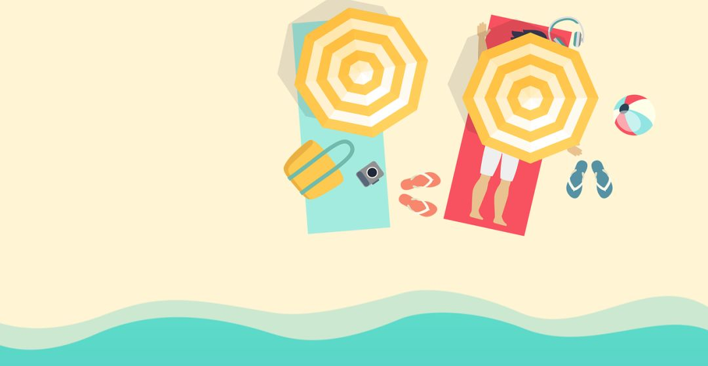

# 如果真财务自由，大家都打算干点啥

**发布时间**: 2019-05-13 07:00:00

**原文链接**: [http://mp.weixin.qq.com/s?__biz=MzUzNjE3NzQ3Nw==&mid=2247484719&idx=1&sn=79783366abdc43226d4088dc1d58ef6c&chksm=fafb7b05cd8cf213a4413b2663ffdd77c4d8f4a52f74fa7b4b12952fb52cb071d7061957ad27#rd](http://mp.weixin.qq.com/s?__biz=MzUzNjE3NzQ3Nw==&mid=2247484719&idx=1&sn=79783366abdc43226d4088dc1d58ef6c&chksm=fafb7b05cd8cf213a4413b2663ffdd77c4d8f4a52f74fa7b4b12952fb52cb071d7061957ad27#rd)

---

财务自由之后打算干点啥呢？虽然财务自由是个长远的计划，真实现可能要多年以后，但是这并不妨碍我们给自己树立目标，万一真实现了呢？当我们不再仅仅把赚钱作为第一目标后，我们想做的事情，往往才是自己的真爱。

比较好奇大家对于财务自由之后生活的想法，所以周六组织了一波讨论，收集了一下大伙的想法（后面有摘录）。稍微做了一下总结，发现这些愿望基本都集中在这三个方面

  1. **选择** ，可以按照自己的本心来做事，拒绝不喜欢的事物。把时间浪费在美好的东西上。

  2. **提升** ，「学习」居然是高频词榜首。继续精进自己，但是不再为钱，而是为自己的人生和爱好

  3. **贡献** ，为家人、为社会。

比较意外的是，预料中的「再也不用工作」、「每天赖在家里」这类愿望实际上出现频率相当低，也许初期很爽，但是并不足以支撑生活本身。

想到了《被讨厌的勇气》中提到，幸福感很大的来源就是自立和贡献。当我们不再为钱，而只为开心、幸福而做事时，也会自然而然的回到自立和贡献者两个主题上。

## 摘录

收集了一些大家的发言，在内容和结构上略有调整。

### @Jeff Ma

第一反应还是继续工作（码农），可能是因为现在做的事情我觉得是有价值的，虽然有时比较累（996）。工作起码的可以获得两个成就：1. 收入非常高 2. 业务和技术上都有挑战，解决一个问题后比较有成就感。

目前每年正式的出外旅游大概10次，一到两次出国。每次时间都不长，因为一长就会有无聊和疲惫感，觉得还不如工作有意思。所以财务自由后长期旅游/退休应该是不太会考虑了。我从高中开始写程序到现在也十年左右了，不出意外会继续做下去。

### @Solomon

🙄 可能会兴奋一两下，但过后就会像学生时代的寒暑假假期一样了。

> PS：我觉得这个形容很有画面感，区别在于没有开学和假期作业了 😆。

### @胖丁

第一反应是创业，可以做一些不以赚钱为目的的事业，想做一些又是自己真正爱干并且擅长的事儿，并且能做公益的项目。

顺便刚刚问了一下男朋友（程序员）等我俩财务自由后他想干嘛，他说他想去山区里教小孩子编程，把一个村的人教到致富（我：exm？？？也不知道他是不是认真的哈哈哈），不过感觉找到了价值观相近的人呐。

### @单色彩虹

感觉能让家人生活的惬意才能真的自由。

### @Jess

推荐一本书，村上君的《假如真有时光机》，一本旅行随笔。更吸引我的其实是村上和太太在各地旅居的状态，他们俩在经常性在世界的某个国家各地呆上几个月或半年，日常工作（村上还是每天写写写跑跑跑，哈哈）生活都变化不大，只是地方、语言、饮食、文化等等变了。

这算是自由的很大一个方向，在家感受世界的丰富，日常都可以做，用身体用时间感受世界的丰富，就得以自由为基础。

### @车

  0. 闷头睡个 24 小时的大头觉。

  1. 安安心心的不带焦虑感的打一年半年的魔兽，或者一直玩腻了为止。

  2. 出去转转，住青旅，认识一下年轻的小朋友们，接着给朋友们寄明信片。

  3. 租个大学旁边的房子，去大学教室看书，顺便蹭蹭有意思的通识教育课.

  4. ……

> 一众程序员表示，从零开始排序，看着极度舒适。

### @Yue

结合自己目前的状态（毕业不久刚工作）和大家分享《不上班也有钱》的作者的博客中的一段话吧，和正在努力积累本金的大家共勉：

「如果能有時光機回到15年前，會不會很想搖醒大學剛畢業的自己，叫他不要亂花錢，這些錢在15年後都成為 2 倍的資產而且還在不斷幫你賺錢。而那些 15年 前花錢買的東西，早就變成垃圾污染環境。」

### @jsxf

我想到的是各种整理，看来是劳碌命。

> 这应该是全场最与众不同的回答，看来对整理是真爱，真想去参观膜拜一下。

### 我的回答

我自己平时会收集个清单，财务自由之后想要做的事情。其实很多愿望都是很小的，甚至是很无厘头，但是不知道为什么就是会觉得很爽

  1. 后台经常收到「有钱人才不需要理财」之类的评论，等财务自由之后，我就可以呵呵回去 😏。

  2. 记得一句话「你可以像猪一样懒，却没法想猪一样懒得心安理得」。实现财务自由之后，我要懒得心安理得，和两只猫一起同吃同睡一个月，他们睡我就睡，他们起来 happy 我就跟着起来疯，感受一把猫的世界观。

  3. 等休息好了，就回来继续写东西，不过到时候视角可能有新变化。

### 一夜回到解放前？

另外，也有朋友表示担心，等到财务自由之后，会不会一得瑟把钱又浪没了，回到解放前。我觉得不存在这个问题，靠自己的计划和努力实现财务自由的，计划和理性往往已经内化成为生活的一部分，这个时候想要乱花钱反而是一件挑战的事情。