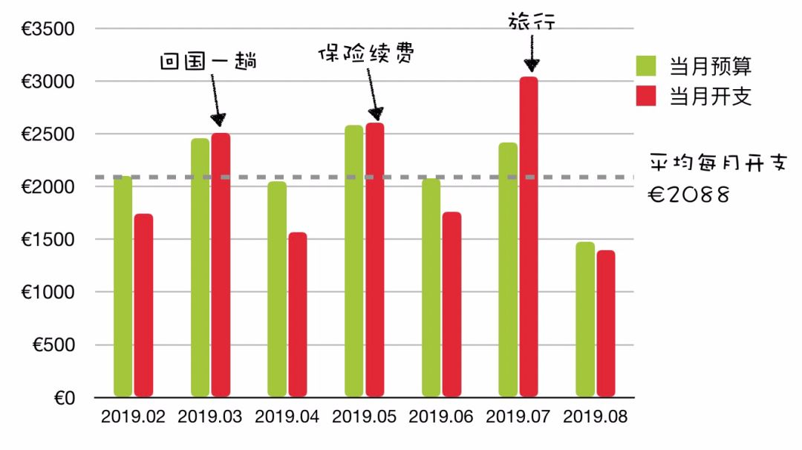
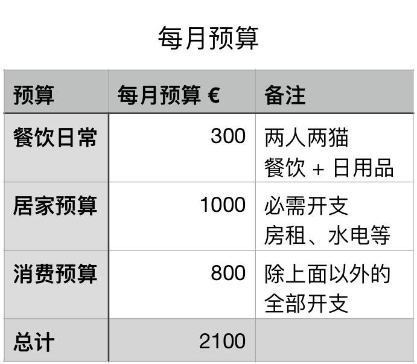
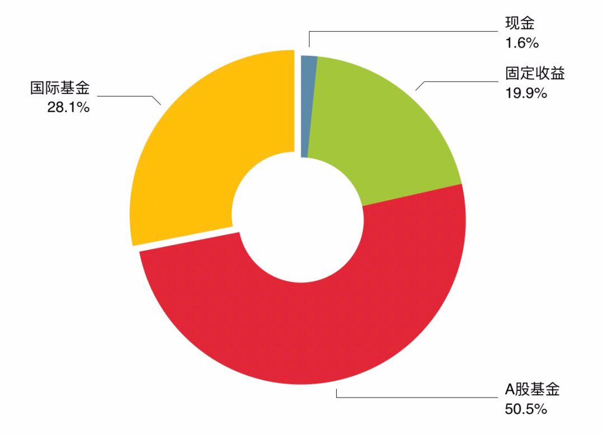

# 财务自由实证 #6 | 发现点好机会

**发布时间**: 2019-09-02 07:00:00

**原文链接**: [http://mp.weixin.qq.com/s?__biz=MzUzNjE3NzQ3Nw==&mid=2247484963&idx=1&sn=f8b2a6db7bf5d07bd887c06537b1f4ce&chksm=fafb7809cd8cf11fdfda79e79dd7f9efa7a7047c7b307e0bf4076d548b666c5908f8520e9cf4#rd](http://mp.weixin.qq.com/s?__biz=MzUzNjE3NzQ3Nw==&mid=2247484963&idx=1&sn=f8b2a6db7bf5d07bd887c06537b1f4ce&chksm=fafb7809cd8cf11fdfda79e79dd7f9efa7a7047c7b307e0bf4076d548b666c5908f8520e9cf4#rd)

---

过去的 8 月基本上算是有惊无险，略有小赚。

月初这么一大跌本来以为要回调一阵子，注定要小亏了。结果人算不如天算，下旬的反弹相当强劲，连带着从实证开始就浮亏的且慢小账本记录都跟着翻红了。

接近月末的时候意外地发现了一点投资机会，准备进行一小轮调整，具体说明见文末最后一节。

### 实证目标

为了方便新朋友阅读，简单重复一下实证的目标和方法，老朋友可以跳过这一节。

这个系列实证是我个人财务计划的公开，目标——工资理财实现财务自由，F.I.R.E （Financial Independence and Early Retirement）。不追求大富大贵，但求能够不再担心生计问题，更有底气**把时间“浪费”在美好的事物上，放心做那些自己喜欢，却不一定能够养活自己的事情。**

有兴趣参考这个实证的朋友建议先看看之前的引导篇，[#0 | 制定你自己的财务自由计划](https://mp.weixin.qq.com/s?__biz=MzUzNjE3NzQ3Nw==&mid=2247484500&idx=1&sn=c04c3de1a1231bef25bb4cda773c00ff&scene=21#wechat_redirect)、[和我一起财务自由](https://mp.weixin.qq.com/s?__biz=MzUzNjE3NzQ3Nw==&mid=2247484480&idx=1&sn=258e8dd4976c7d3c324ed89b90904d14&scene=21#wechat_redirect)，对于理解实证会有很大帮助。

我给自己定下的目标是 30 岁前积累 500 万人民币金融资产。

## 实证第 6 期

截至 8 月底，计划完成度 50.95%（当前资产 ÷ 目标资产），计划头一次完成过半了。

这个月度，计划完成度增加 **1.36 个百分点** ，0.6 的增量来自储蓄，0.76 的增量来自投资收益。下图是我用且慢小账本记录的总资产变动。

从开始用小账本一来就持续浮亏，8 月可算是扬眉吐气，总算翻红了。

### 预算及储蓄

我把预算图大幅度改版了，新版的预算图清晰了不少，也能清晰的看出预算的过往记录和波动。说起来有点尴尬，之前的旧版预算图用了都 5 个月，我居然还没能和也太解释清楚这张图的信息和原理，估计你们更是一头雾水了，希望新版能直观一些。

我们的计划每月预算是 2100 欧元，当月的节余或者超支会累加到下个月的预算中。这个预算和开支图包括了我们生活的每一笔开支，包括意外开支。我在上图中也对异常的月份做了备注，方便大家理解。👇

8 月基本上就是开启还债模式。7 月旅行大比例超支，压缩了 8 月预算，不过好在经过努力预算又回到了正轨。

下图是我们的具体预算分配，也会根据实际情况进行调整，但是总额上限 2100 欧元是固定不动的。

> 财富的积累就是把宏大的目标拆成可执行的每个小目标，财务自由始于最初简单的预算制定和储蓄。

### 愿望清单

如上一节所说，这个月开启还债模式，没有买东西也没有新增项目。但是 9 月就要发布新的 Apple Watch 了，从最初把它加进愿望清单居然都过了快两年（中间删掉过，后来又加回来了）。坐等 11 日的发布会，到底是买新款还是老款，下个星期就有定论了，有点小期待。

> 关于愿望清单的用法，可以公众号回复「gtb」，我有系统写过。自从开始使用愿望清单，我发现真正必需并且能提升生活品质的消费其实并不多，砍掉了没啥意义的浪费，在必需品上多投入，总消费越来越少，生活幸福感却越来越强，储蓄也跟着不断攀升。

### 资产配置

上个月偶然发现了几个投资机会，打算做一点调仓，**调仓部分预计能至少增加 5% 的年化收益** 。由于是调仓，整体资产配置比例还是没什么大变化，我就继续偷懒用旧图啦。留了这么大比例的固定收益仓位，完全是一个进可攻退可守的状态，永远有钱加仓，用 E大 的话说就是「非常舒服」。

 _注：因为我在国外工作，所以有配置国际基金，这部分也可以直接用 A 股基金代替。_

下面说说我的调仓安排

  * 把手里的 **场内** 沪深300 都换成 兴全合宜。

  * 把债券基金换成已经被遗忘很久的战略配售基金。

  * 开始定投港股恒生指数。

前两条调仓的关键词是**场内折价 + 超额收益** ，受限于篇幅这里就不展开了，明后两天我会具体说说。别着急，这两个都是慢机会，跑不了的，因为吃到这个超额收益的前提是长线投资。大家都想着赚快钱，反而把这些长期的好机会留给了我们。

港股恒生指数没啥好说的，又一次接近了低估区，很庆幸在牛市来临之前还能有不错的上车机会。虽然距离历史低估区还有点距离，但是定投已经可以开始了，**抄底抄的是区间，不是点位** 。

我的部分结束了，登场的机会交给大家，留言区见 👇。