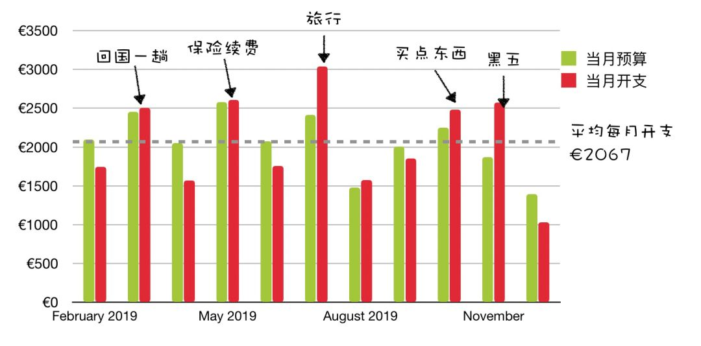

# 财务自由实证 #10 | 躺赚 2019，50%

**发布时间**: 2020-01-01 06:00:00

**原文链接**: [http://mp.weixin.qq.com/s?__biz=MzUzNjE3NzQ3Nw==&mid=2247485694&idx=1&sn=74c5d27119f4f694815b46e222b724c3&chksm=fafb76d4cd8cffc2c24f1b990e6a95931862b203641f7d69fc4ddcebe14adbc6e9e4a551afe3#rd](http://mp.weixin.qq.com/s?__biz=MzUzNjE3NzQ3Nw==&mid=2247485694&idx=1&sn=74c5d27119f4f694815b46e222b724c3&chksm=fafb76d4cd8cffc2c24f1b990e6a95931862b203641f7d69fc4ddcebe14adbc6e9e4a551afe3#rd)

---

写实证我憋屈很久了，因为 2019 年的下半年整个一震荡市行情，市场没啥涨幅，账户净值上涨基本靠攒。所以每次晒实证总被留言 diss，「投资没啥用，没啥收益，全靠储蓄硬撑」。

我知道有些人注定理解不了市场行情的不确定性，总是带着线性思维看待未来，讲道理是没用的，必须拿事实说话。所以一直忍着没说，耐心等一个机会拿事实怼回去，一等居然就到了年底，12 月的行情可算有了底气，投资的坚持带来了回报，可算可以怼回去了。而且未来大概率可以越怼越爽。

### 躺赚 2019

我盘点了三个收益导向的投资账户——主动基金、跟投长赢指数计划和国际账户。

**2019 年全年，主动基金账户收益 51.29%，长赢策略收益 23%，国际账户收益 25.35%** 。同期 A 股大盘沪深 300 整体上涨 32.55%，MSCI World 上涨 27.55%，算上小牛市了。

在现在这个到处都在吹捧指数基金的时期，我对主动基金的情有独钟有点格格不入。**但是我的经验和收集到的数据无不表明，在某些市场，比如 A 股，主动基金依然有机会。** 我的主动基金账户也没让我失望，2019 年跑赢大盘 20%，而且不用看估值、不用纠结跟投，一路无脑买躺赚 50+%。

长赢指数基金今年没跑赢大盘，情理之中。长赢是个资产配置策略，牛市跑输很正常，策略到底好不好，一个牛熊周期之后自有分晓。我是信任 E 大的。

PS：写到这里小心机地嘴角上扬，幸好 2019 年开始的实证，假如 2018 年亏成那熊样也是挺丢人的，具体亏多少我是算不清楚了，但是可以确定 2019 肯定赚回来了就行。

2019 年是我投资策略转向的关键一年，这一年彻底明确了**躺赚至上** ，只选择那些省事不用操心的策略，需要自己费心打理的账户基本渐渐关停，保留了现在的三个主力账户。

对于普通投资者来说，躺赚就是核心竞争力，想站着赚辛苦钱反而会把收益都赔回去。**之前看了个非官方的统计数据，2019 年市场行情这么好，居然一半股民亏钱的。** 这些时间和精力放到别的地方去结果可能更好。

而且话说回来，我投资的目标就是财务自由，假如到时候我还得自己盯盘操作，那还叫哪门子的自由。

### 我的财务自由实证

为了方便新朋友阅读，简单重复一下实证的目标和方法，老朋友可以跳过这一节。

这个系列实证是我个人财务计划的公开，目标——工资理财实现财务自由，F.I.R.E （Financial Independence and Early Retirement）。不追求大富大贵，但求能够不再担心生计问题，更有底气**把时间“浪费”在美好的事物上，放心做那些自己喜欢，却不一定能够养活自己的事情。**

有兴趣参考这个实证的朋友建议先看看之前的引导篇，[#0 | 制定你自己的财务自由计划](https://mp.weixin.qq.com/s?__biz=MzUzNjE3NzQ3Nw==&mid=2247484500&idx=1&sn=c04c3de1a1231bef25bb4cda773c00ff&scene=21#wechat_redirect)、[和我一起财务自由](https://mp.weixin.qq.com/s?__biz=MzUzNjE3NzQ3Nw==&mid=2247484480&idx=1&sn=258e8dd4976c7d3c324ed89b90904d14&scene=21#wechat_redirect)，对于理解实证会有很大帮助。

我给自己定下的目标是 30 岁前积累 500 万人民币金融资产。

## 实证第 10 期

截至 12 月底，财务自由计划完成度 55.87%（当前资产 ÷ 目标资产），上个月完成度是 52.60%。其中 0.91 个百分点是我们储蓄攒出来的，另外 2.3 个百分点是投资收益。

另外说明一下，因为 4 月才开始财务自由实证，而今年的全年涨幅基本都发生在前三个月，所以这里统计的年化收益和上面的数据有出入。

### 预算及储蓄

2019 年，回国一趟、出去旅游一次，年末还一顿扫货，依旧完美达成了本年度 2100 欧元每月的预算目标，小小嘚瑟一下。储蓄这事找到方法其实一点都不难，预算不会影响生活质量，反而帮助发现生活中的各种小确幸。

最近我还在琢磨 2020 年的预算怎么定，目前还没想好，下次实证再说。

注：预算节余或者超支会累加到下个月的预算中。这个预算和开支图包括了我们生活的**每一笔开支，包括意外开支** 。下图是我们的具体预算分配，也会根据实际情况进行调整，但是总额上限 2100 欧元是固定不动的。

> 财富的积累就是把宏大的目标拆成可执行的每个小目标，财务自由始于最初简单的预算制定和储蓄。

### 愿望清单

因为副业需要，这个月提前把手机电脑都换了，签了分期付款和合约机，所以对预算的影响还不是特别大，这个月的开支没有相关项。能副业做自己喜欢的事情是幸福的，**手机电脑都能抵税，坐地 6 折** ，有点小开心。

话不要说太早，上个月说过的话还历历在目，脸有点疼

> 估计明年工作需要会换一波手机和电脑，不过早着呢，到时候再说，至少这一两个月不会考虑了。

现实版演绎了理财十大金律的第一条「不要低估自己对财富的需求」，指不定啥时候就要花钱了。

PS：愿望清单用的是印象笔记，每次都有问，所以专门提一下。

### 我自己的躺赚策略

我把自己当前持有的全部核心策略梳理在这个表格中方便大家参考（不含个股和少量 P2P，陆金所还在减持中）。我的投资核心原则就一条——躺赚，不用搭理、不用管，最多每月半个小时完事，平时生活该干啥干啥，理财可以很简单。

注：其中永久组合主要是为了更好地利用紧急备用金，我个人建议是永久组合大约为备用金的 2～4 倍，剩下的部分尽最大可能投入长期投资当中（除了三年内要用的钱，不过这部分我没有）。

……

普通投资者咋躺赚？

用 10% 的时间和精力选择一条好赛道，买入并持有。再用剩下的 90% 精力控制住自己，别瞎几把操作。

讲真，管住自己别乱折腾，比折腾本身累人多了。特别喜欢华杉老师的观点，价值创造在于不断重复，不搞什么“新创意”

> 我们的任务就是按住其他人，不让他们“干活”，这事比干活本身要累一万倍！
> 
> —— 华杉

文末，新的一年了，祝愿大家继续拿稳投资，躺赚 2020。