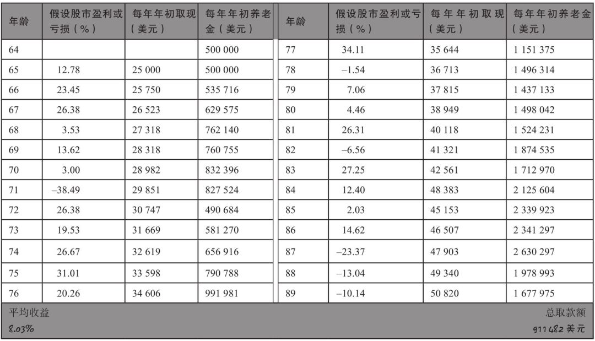
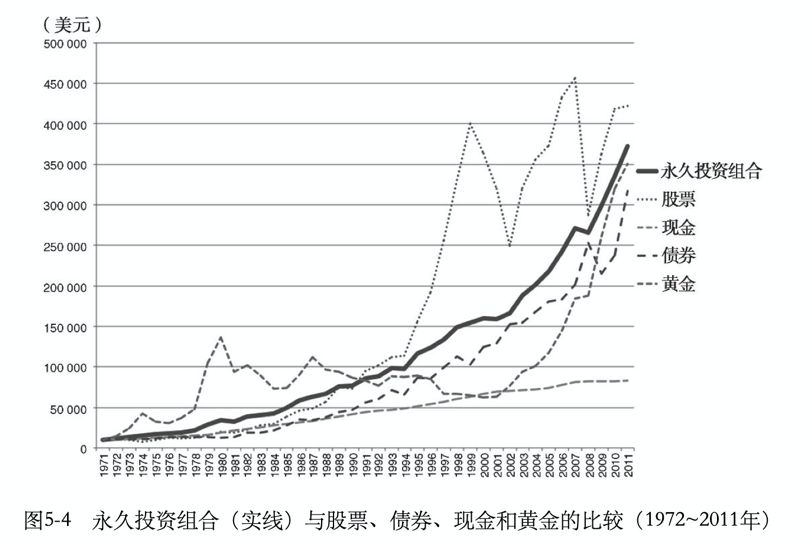

# 认真考虑了财务自由如何退休的问题

**发布时间**: 2020-01-22 06:00:00

**原文链接**: [http://mp.weixin.qq.com/s?__biz=MzUzNjE3NzQ3Nw==&mid=2247485754&idx=1&sn=e2d3d1855321c363898f76093bad01f8&chksm=fafb7710cd8cfe069e141e597244d413891c4555fe2e87cbb69824ba79647db9bd13ffa2b80e#rd](http://mp.weixin.qq.com/s?__biz=MzUzNjE3NzQ3Nw==&mid=2247485754&idx=1&sn=e2d3d1855321c363898f76093bad01f8&chksm=fafb7710cd8cfe069e141e597244d413891c4555fe2e87cbb69824ba79647db9bd13ffa2b80e#rd)

---

先说两句最近的热点，看了新闻肺炎病毒还真挺吓人的，给大伙提个醒。

**传染病防控的三个路径，控制传染源、切断传播路径、保护易感人群。** 个人能做的主要就是后两个，能不出门最好还是别出门了，出门记得好好戴口罩、注意多洗手，保护好抵抗力较弱的家人，平时也多注意锻炼身体。春节能宅家里就宅着，打游戏、看电影啥的不也挺爽，少瞎做。

本来想多写两句，后来想想还是打住了，你们在国内了解的信息肯定比我多。等我反应过来要给家人买口罩的时候，发现清一色全断货了。还有货的只剩正八经的防毒面具，我纠结了三秒钟还是没下单，这么大个东西套头上就算买了他们也不会戴的……

……

说回正文，这几天我读到了一份关于财务自由退休的试算，读完以后心里咯噔一下，有那么一点点慌。

以前我们在估算财务自由所需要的时间时，为了方便计算一般都是按照线性的平均收益率来计算。比如年化收益 10%，虽然现实中不可能是稳定的每年 10%，但是计算中还是按照这个节奏来考虑，不然计算太复杂。

按照这个线性的计算结果，年化收益率 10% 就意味着我们每年从账户里面支取不超过 10% 的本金，我们就是实现财务自由了。

但是，看了这份新的计算，**当把市场的波动也考虑进去的时候，有些东西就有点变化了。影响最大的因素不再是市场的长期平均收益率，而是财务自由退休以后几年的实际收益。** 这个计算对比了财务自由以后，市场先下跌、再上涨，和先上涨、再下跌，两种情况。

假如退休以后刚好赶上好年景，市场连续几年大幅度上涨，这是没有问题的。即使每年从账户支取生活费，账户的净值依然越来越高。比如这个表里的计算，平均年化收益 8%，每年支取 5%，即使后面来一轮大跌也没啥问题，10 几年后，账户净值妥妥破百万，越花钱越多。

有本在台湾出版的畅销书《不上班，也有钱》里面的作者，满仓指数基金，就刚好是这种情况。他们 2013 年开始财务自由，正好赶上了美股前所未有的超长大牛市，财务自由以后的生活相当富足。

**但是，等我们把市场行情的波动倒转过来，如果市场先下跌再上涨，那可就麻烦了。**

比如还是上面的行情走势，但是在财务自由以后市场先是大跌，然后再上涨，结果…… 83 岁的时候，我们钱花完了…… 人还在呢，钱花完了……

稍微想想也不难理解，假如账户净值跌去 50%，我们还是按照原来净值的 10% 来支取，账户就只剩 40%，**相当于实际提取了 20% 资产** 。就算后面市场行情变好，市场重新涨上来，但是由于前期账户支取过多、透支严重，能够用于增长的本金比例也大幅下降。

看到这里顿时觉得心好慌，本来计划好的财务自由，本金也积累到了，到底能不能真自由，或者说自由能不能持续，居然还是要看天吃饭。

这事我能忍？所以就有了下面这些思考。

……

认真考虑了这个问题——财务自由退休以后钱到底应该从哪里来？假如从账户支取，那怎么管理账户才能让财务自由更加可持续，别来一场大跌就和自由说再见了，那叫哪门子自由……

别说我最后还是找到了两条非常可行的路。

第一条，就是我之前写过的，[通过股息制造现金流](https://mp.weixin.qq.com/s?__biz=MzUzNjE3NzQ3Nw==&mid=2247484782&idx=1&sn=7f9201205ffb5abca041d57feaa94663&scene=21#wechat_redirect)，股息收入不会影响我们持有的投资份额，相对稳定，而且增长也很客观。

但是现实中股息也有缺点，熊市市场低迷的时候股息率比较高，比如这轮钻石底 2018 年的时候，能有个 4%，500 万本金就是至少 20 万的现金流。但是等到牛市末期的时候，股息率也有可能掉到 1%。因为股息的数额是相对稳定的，市场大幅上涨以后股价变高了，股息率自然就反比跌落。这个时候，同样 500 万本金，可能只拿到 5 万现金流，那还玩啥啊？

我前面写过[几个朋友顺利自由](https://mp.weixin.qq.com/s?__biz=MzUzNjE3NzQ3Nw==&mid=2247485489&idx=1&sn=a4d7a389b79f2897668875dec973941f&scene=21#wechat_redirect)，也是因为时间点选得好，刚好在钻石坑附近。

但我是不相信自己能有这么好命的，根据我的预期，我自己的本金增长大概率是到本轮牛市末尾才能到达目标。到时候吃股息是肯定不够用的。

**所以必须想办法消灭市场波动，避免大幅回撤，没有大幅回撤就没有了前面说的那些难题** ，最好把 10% 收益的曲线拉成一条直线。

现实中当然做不到这么完美，不然就牛X大发了。但是却有个近似的方案——资产配置策略，通过分散投资在基本不影响长期收益的情况下降低波动，避免大幅回撤，这事已经经过多年的检验，真实有效。

但是我还不知足，因为我比较懒，不想做啥复杂操作、也不想去判断市场（关键是也没这个能力）。所以这个资产配置最好还得够省事。

所以这段时间我都在研究「被动资产配置」策略，就是那种**资产比例完全固定，只需要每年再平衡一次。** 固定比例就省得自己纠结和判断，每年做个再平衡最多一两个小时就完事了，还是很符合我的躺赚策略的。

之前我研究过永久组合（股票、国债、黄金、现金四等分），这货的走势大概是这样 👇，相当稳。但是由于现金比例过高，**对收益率有一定影响，预期收益要从 9.5% 降到 8.2%。** 所以我给永久组合的定位是紧急备用金，不适合大资金投入。

再后来我就盯上了达里奥的简化版「全天候」（完整版我是没戏了，1 亿美元才刚够个门票）。正好找到了一张回测图，回测起点是美国 2000 年的互联网泡沫崩溃时期，从那以后的 3 年时间里，美股市场跌去了 47%。但是全天候的走势一直比较稳健，在经济危机的时候也只是小幅下跌。

而且全天候组合在保证低回撤的情况下，对于长期收益影响比较小，预期年化还能给到 9.5% 左右。决定就是它了。

 _PS：这张图也要辩证地看，只看这张图里你可能会觉得资产配置太牛了，跑赢这么多。其实长期并不是这样。就像前面说的，资产配置不能增加收益，只是把收益平滑了。如果放在市场大涨的时候，被动资产配置策略就是大概率跑输市场的。_

写到这里基本就算稳了，等我的账户净值增长到接近财务自由目标的时候，我就把自己的国际账户全部换成永久组合（作为备用金）+全天候的策略，不用再担心上面说的账户缩水问题，一下觉得心安了。

关于全天候组合的具体配置，网上相关解读有不少，感兴趣的小伙伴也可以读读《钱：七步打造终身收入》这本书。下面这个配图是全天候的配置比例：

最后也得说一下被动资产配置策略的局限：

  * 资产配置策略并不能提高收益，其价值在于降低波动，对收益多少还是有些影响（不到一个百分点）；

  * 这个策略主要适合国际账户，里面很多投资品种比如长期国债、大宗商品，在国内 A股 不好投资。（需要国际账户的小伙伴，后台菜单有二维码）

国内投资也不用遗憾，国内我还是坚定不移地跟老相好——长赢指数计划 和 主动基金，这俩是比资产配置更难得的瑰宝，谁投谁知道。

这两年因为各种各样的原因，主动基金名声不太好，一副要被指数基金吊打的熊样。但是事实上我自己的主动基金账户 2019 年收益 50+%，还是稳稳跑赢大盘。所以别瞧不起主动基金，投资这事儿还是得独立思考。

……

最后还有个事，还记得我之前 9 月写过的兴全合宜吗？这货的封闭期 1 月 23 日就结束了，当初的折价率是 4.6%。我刚刚去看了一下，折价还有 1%。这段时间累计跑赢沪深300大约 3%，等折价彻底消失就是大约 4% 的超额收益，这波折价算是吃着了。

我自己打算等封闭期结束了就调仓回来。过去这几个月我也是担惊受怕，就怕自己判断错了把大伙给坑了，好在最后结局不错，松了一口气。幸亏我没去写股评，这就点小心脏还真经不起折腾，老老实实回去躺赚吧。