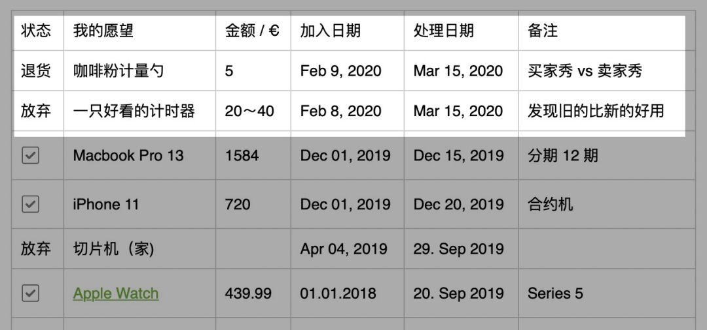

# 被股神点拨了一下 | 财务自由实证 #12

**发布时间**: 2020-03-15 13:23:03

**原文链接**: [http://mp.weixin.qq.com/s?__biz=MzUzNjE3NzQ3Nw==&mid=2247485940&idx=1&sn=15b29ba0d8c1f2ab71e4da58a2520b44&chksm=fafb77decd8cfec8bf4d8be41ece6c1704b6e967cefe10620e7c5d38c452ea3292391132d69b#rd](http://mp.weixin.qq.com/s?__biz=MzUzNjE3NzQ3Nw==&mid=2247485940&idx=1&sn=15b29ba0d8c1f2ab71e4da58a2520b44&chksm=fafb77decd8cfec8bf4d8be41ece6c1704b6e967cefe10620e7c5d38c452ea3292391132d69b#rd)

---

先把这期的实证写完，这期关于财富变迁的思考在文末。

你们可能注意到了，最近这两期实证发的比平时晚一点，都在 10 日左右。我平时的银行和信用卡账单都是在 7 日左右到，以前为了赶每月初发实证，给记账带来了不小的麻烦。所以就推到了每月月中发实证，还望大伙理解哈～

### 财务自由实证第 12 期

为了方便新朋友阅读，简单重复一下实证的目标和方法，老朋友可以跳过这一节。

这个系列实证是我个人财务计划的公开，目标——工资理财实现财务自由，F.I.R.E （Financial Independence and Early Retirement）。不追求大富大贵，但求能够不再担心生计问题，更有底气**把时间“浪费”在美好的事物上，放心做那些自己喜欢，却不一定能够养活自己的事情。**

有兴趣参考这个实证的朋友建议先看看之前的引导篇，[#0 | 制定你自己的财务自由计划](https://mp.weixin.qq.com/s?__biz=MzUzNjE3NzQ3Nw==&mid=2247484500&idx=1&sn=c04c3de1a1231bef25bb4cda773c00ff&scene=21#wechat_redirect)、[和我一起财务自由](https://mp.weixin.qq.com/s?__biz=MzUzNjE3NzQ3Nw==&mid=2247484480&idx=1&sn=258e8dd4976c7d3c324ed89b90904d14&scene=21#wechat_redirect)，对于理解实证会有很大帮助。

我给自己定下的目标是 30 岁前积累 500 万人民币金融资产。

## 本期实证内容

当前财务自由计划完成度 54.64%（当前资产 ÷ 目标资产），上个月完成度是 56.3%。因为这个月海外市场大跌，本来的浮盈又变成浮亏了，数了一下，这一波小亏了 15 万，还好没少数个零…… 

### 预算及储蓄

2020 年度依然沿用 2019 年的预算计划，每个月 2100 欧元的预算。

注：预算节余或者超支会累加到下个月的预算中。这个预算和开支图包括了我们生活的**每一笔开支，包括意外开支** 。下图是我们的具体预算分配，也会根据实际情况进行调整，但是总额上限 2100 欧元是固定不动的。

> 财富的积累就是把宏大的目标拆成可执行的每个小目标，财务自由始于最初简单的预算制定和储蓄。

### 愿望清单

我觉得自己已经抠出天际了…… 上个月本来计划好好的要奖励一下自己，然后临到购买和收到货又反悔了 😂。在一个现在好多东西都订阅制，需要买东西的次数越来越少了，我数了一下现在的一些订阅，微信读书、各种新闻杂志、Mac Setapp 软件包，基本涵盖了我自己的各种需求。

PS：愿望清单用的是印象笔记，每次都有问，所以专门提一下。

### 我自己的投资策略

过去一个月的投资操作，**赶上海外市场崩了，冲进去加了点德国和中国的指数基金（海外市场，非 A 股）。**

这段时间我重新整理了一下主要投资策略，供大家参考。**个人观点，后面的收益主要还是仰仗中国和德国市场给点力了。**

注：其中永久组合主要是为了更好地利用紧急备用金，我个人建议是永久组合大约为备用金的 2～4 倍，剩下的部分尽最大可能投入到长期投资当中（除了三年内要用的钱，不过这部分我没有）。

……

这两天读完了 2020 年度的巴菲特至股东信，有个意外收获，把之前关于财富变迁的很多碎片化思考都穿起来了。**更加坚定了我所选择的这条路** 。

先说我之前的两个碎片化观察：

**房产长期来看属于抗通胀资产** 。抗通胀的潜台词就是，当整体低利率低通胀时，房产的表现大概率不会像过去之前那个好。在几个比较长历史的市场中，房价的涨幅基本和 CPI 同步。

**在利率下行周期（现在就是），社会的贫富差距会变大** 。下面是一张美国家庭的统计图 👇，从 1980 年开始，富裕家庭和底层家庭之间的差距越来越大了。同时富裕家庭中，股票投资比例更高。

这次巴菲特致股东信里面提到，**在低利率时期，股票投资的收益要领先于债券等利率相关的投资品** 。虽然房产不属于债券，但长期收益率却是和通胀相关的。

这样一来就把上面的几个判断穿起来了，低利率时期股票投资的收益要领先于其他投资品，股票投资的占比会直接影响到未来一段时间的财富变迁。上面这张图里，富裕家庭的股票投资比例要显著高于其他群体。

未来十几年财富的机会大概率会在股市，这也是现在比较主流的共识，我在 2018 年曾经写过一次（[原文在这](https://mp.weixin.qq.com/s?__biz=MzUzNjE3NzQ3Nw==&mid=2247484235&idx=1&sn=db65c7354e544132d39e2d5655b5908a&scene=21#wechat_redirect)），只不过当时没把经济周期、房产这些要素关联起来，现在补上了。

对于像咱们这样的普通投资者，参与股票市场赶上这波财富增长的顺风车，最实际的途径还是基金。

但是吧，本来说得好好的，结果过去这一周美股大跌小伙伴们又慌了。你们回去看看上面那张财富变迁的图，这次分离是从 1980 年开始的，到现在一直持续了 40 年，现在这才哪到哪。我又画了张灵魂画作，你们体会一下是不是这个道理，到底想要哪个大伙自己做决定。

