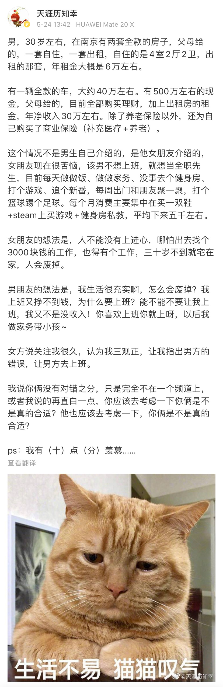

# 攒下 1000 万 + 1 套房，可我还是不敢自由

**发布时间**: 2020-05-27 07:00:00

**原文链接**: [http://mp.weixin.qq.com/s?__biz=MzUzNjE3NzQ3Nw==&mid=2247486354&idx=1&sn=8761ce4560981d891d46e4edc2c5663a&chksm=fafb75b8cd8cfcae68e468341688478a6ef0159496790590bb02aef17fd695445c6f649a0ff1#rd](http://mp.weixin.qq.com/s?__biz=MzUzNjE3NzQ3Nw==&mid=2247486354&idx=1&sn=8761ce4560981d891d46e4edc2c5663a&chksm=fafb75b8cd8cfcae68e468341688478a6ef0159496790590bb02aef17fd695445c6f649a0ff1#rd)

---

一个真人真事。

我前几周不是访谈过一位已经财务自由大半年的小伙伴嘛，后来那篇文章下另一位读者留言分享了一下自己的财富状况。别说还蛮接近的，不完全一样但也差不多一个量级。**但重点是，两个人当下的心态却完全不同** ，这位读者明显焦虑得多，工作压力山大，攒下不少家产依旧迟迟不敢松懈。

我就很好奇问他为什么这么焦虑，焦虑从哪来？按照我们大部分人的想象，资产到这个量级往往心态都挺不错的，不一定都去自由了，但也不至于焦虑呀。后来聊着聊着，就谈到投资收入和孩子未来的教育开支问题。

我试着问了一下，既然这么担忧教育开支，那么有没有大概了解过应该多少钱？提早开始准备。他是这么回复我的

> 主要焦虑在于两娃的开销，但是在 18 岁之前**总的开销没算过** ，因为不知道要怎么个投入法，**感觉是个无底洞** 。

后来我又换了个角度，问问他怎么看投资理财被动收入的。

> **完全没确定感** ，感觉完全靠运气，个人运气 + 国运大势。

所以他迟迟不敢松懈，总希望再多赚一点、再多一点底气，但是这条路很可能根本没有终点。

我们有时候会安慰自己，没事儿，再坚持一下，等赚够多少钱就如何如何。**但很多问题的根源可能并不在于钱多钱少，而在于对钱的控制力。** 尤其是在最近读了《每周工作 4 四小时》里面的一句话：

> 拥有很多的金钱和能像百万富翁一样地真正享受生活，根本就是两回事。

原本我们是为了生活得更幸福、更快乐，所以选择积累财富。但是不知怎么地，积累财富却变成了最终的目标。

……

说起这个，前两天我读了一条特别有意思的微博，贴过来

感情问题我没啥发言权，所以他俩合适不合适我是不知道了。

**就是想问问大伙，看到这个小伙的生活，有没有觉得一丝丝羡慕？** 反正我是老羡慕了。努力好多年奔着的终点，结果是人家生活的起点。

看着这个小伙的故事，再联想前面那位读者对于养娃的焦虑，**我忍不住有个设想，你们帮我看看合理不？**

现在的普遍观点是，养孩子非常贵、绝不能输在起跑线，从生娃到大学毕业要个一两百万的成本。咱们就估计高一点，要 200 万吧。

那我现在反过来考虑，我有娃，我也有 200 万，**但是我不给他花** 。

至于养娃嘛，吃的、用的都买最普通的，便宜够用就行。

学校就选最省钱、最普通的，最好能离家近点。平时也不用上什么补习班、兴趣班了，练习册钱也省了。别人学习的时候咱想玩就玩，也别管什么起不起跑线的。

你要是想学习我就亲自教教你，水平赶不上重点学校老师，但是估计也差不了太多。

平时生活里，假如表现对理财有点兴趣，我就把自己的投资知识教给他；假如不感兴趣，我就把这些知识偷偷教给他。

**反正总的来说就是怎么便宜怎么来。**

但是另外一面呢，我拿着这 200 万自己投资去，**等他大学毕业了，当初那 200 万也增值到 886 万了。** （资本市场长期收益，**扣除通货膨胀以后** ，大约年化 7%，按照 22 岁大学毕业计算。这是比较保守的估计，我觉得自己的实际投资收益应该还不止这个数。）

等他毕业开始工作以后，我留下当初的 200 万，**剩下 686 万作为他的财务自由本金，当作成人礼送给他。让他没有后顾之忧的追求自己想要的生活或者梦想** ，成为上面微博里面那种让别人羡慕的孩子。

生娃前我有 200 万，穷养不花啥钱，娃大学毕业了我还有 200 万。我白捡了个娃，娃白捡了个财务自由，我这个推理逻辑没毛病吧？

那现在问题来了，我们跳出家长的角色，**作为一个孩子，如果能够重新选择投胎机会，A、B 两个选项**

A：一路用好的、吃好的、一路补习、重点，赢在起跑线上，毕业出来再自己白手起家奋斗；

B：一路平平淡淡，起跑线上就被人“干趴下”，毕业以后带着几百万重新思考自己的兴趣和爱好。但至少终生不再焦虑体面生活。

作为孩子，诚实地说，你们想选哪个？所谓的赢在起跑线，所谓的不能被人落下，到底是家长们想要的生活，还是孩子们的真实渴望呢？是不是其实养孩子也不是非那么贵不可？