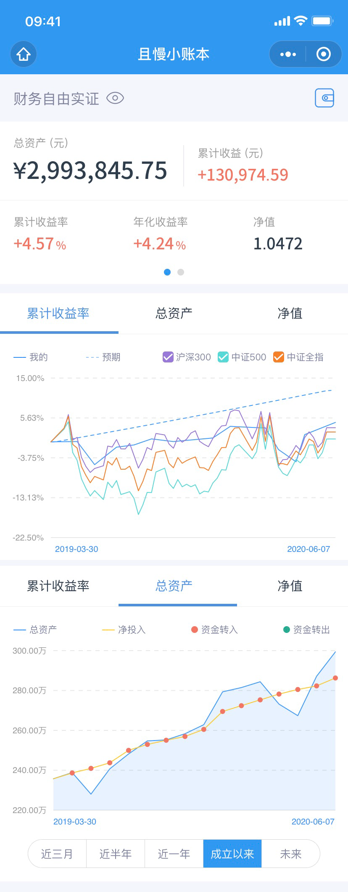
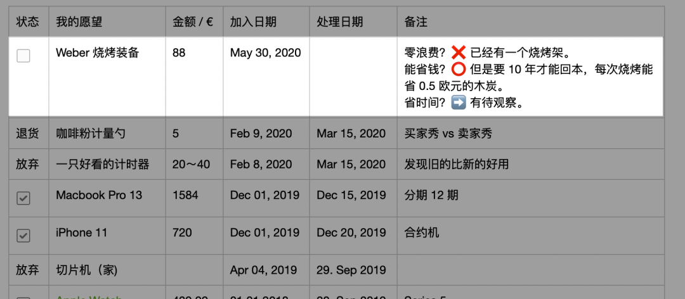

# 暗爽，“钱多到花不完” | 财务自由实证 #15

**发布时间**: 2020-06-08 07:00:00

**原文链接**: [http://mp.weixin.qq.com/s?__biz=MzUzNjE3NzQ3Nw==&mid=2247486395&idx=1&sn=e3fafab1d9bed3540f422283e83103ff&chksm=fafb7591cd8cfc870f8f3ba567d11d40110b587468dd4a9e9af82e0ab19d4a4b16bd85a30618#rd](http://mp.weixin.qq.com/s?__biz=MzUzNjE3NzQ3Nw==&mid=2247486395&idx=1&sn=e3fafab1d9bed3540f422283e83103ff&chksm=fafb7591cd8cfc870f8f3ba567d11d40110b587468dd4a9e9af82e0ab19d4a4b16bd85a30618#rd)

---

这个系列实证是我个人实盘财务计划，目标——工资理财实现财务自由，F.I.R.E （Financial Independence and Early Retirement）。不追求大富大贵，但求能够不再担心生计问题，更有底气**把时间“浪费”在美好的事物上，放心做那些自己喜欢，却不一定能够养活自己的事情。**

有兴趣参考这个实证的朋友建议先看看之前的引导篇，[制定你自己的财务自由计划](https://mp.weixin.qq.com/s?__biz=MzUzNjE3NzQ3Nw==&mid=2247484500&idx=1&sn=c04c3de1a1231bef25bb4cda773c00ff&scene=21#wechat_redirect)、[和我一起财务自由](https://mp.weixin.qq.com/s?__biz=MzUzNjE3NzQ3Nw==&mid=2247484480&idx=1&sn=258e8dd4976c7d3c324ed89b90904d14&scene=21#wechat_redirect)，对于理解实证会有很大帮助。

**我给自己定下的目标是 30 岁前积累 500 万人民币金融资产。**

### 计划进度

当前财务自由计划完成度 59.88%（当前资产 ÷ 目标资产），距离及格线只差那么一咪咪啦，希望 6 月行情稍微给点力，一举突破 60 分及格线。

### 预算及储蓄

2020 年度依然沿用 2019 年的预算计划，每个月 2100 欧元的预算。预算节余或者超支会累加到下个月的预算中。这个预算和开支图包括了我们生活的**每一笔开支，包括意外开支** 。下图是我们的具体预算分配，也会根据实际情况进行调整，但是总额上限 2100 欧元是固定不动的。

> 财富的积累就是把宏大的目标拆成可执行的每个小目标，财务自由始于最初简单的预算制定和储蓄。

### 愿望清单

最近这段时间有点上瘾烧烤，所以看上了一个 Weber 的炭烤装备 😆，放入愿望清单考察中。就是这货 👇

我正在用上次[文章中](https://mp.weixin.qq.com/s?__biz=MzUzNjE3NzQ3Nw==&mid=2247486379&idx=1&sn=d4ee2278fb3b81100b2857259cdf3bee&scene=21#wechat_redirect)想出的「致命三问」衡量中：

> 零浪费？❌ 不符合，因为我其实已经有一个烧烤架了，就是不那么好用。
> 
> 能省钱？⭕️ 能，但是算了一下，要 10 年才能回本，每次烧烤能省 0.5 欧元的木炭，不构成理由……
> 
> 省时间？➡️ 目测会比原来的烧烤架效率一些，但是能有多好用还有待观察。

### 我自己的投资策略

和上个月相比没啥大的变化，唯一的区别就是利用余闲的现金仓位开始尝试港股打新，增加一部分现金收益。前面研究了一两个星期，研究很靠谱。

因为还有工作，**理财投资选择躺赚为主，日常做的操作很少** 。除了定投以外，也就是市场大幅波动的时候会找一些比较确定性的机会。具体的投资平时断断续续都有提，历史文章里找得到。

* * *

5 月我干了一件**时薪价值 1.3 万** 的事儿，到现在还暗爽不已。上周我写过一篇关于「[优化开支约等于副业创收](https://mp.weixin.qq.com/s?__biz=MzUzNjE3NzQ3Nw==&mid=2247486379&idx=1&sn=d4ee2278fb3b81100b2857259cdf3bee&scene=21#wechat_redirect)」的文章，其实就是受这件事启发。

经过认真反思我发现自己对移动办公其实是一种伪需求，所谓的「必须在路上解决的任务」对我来说其实并不存在，移动办公并不是个高效解决方案（仅对我个人而言）。然后再一看也太已经用了七八年的旧电脑，我就打起了主意。

认真诚恳地促膝长谈半个小时，我把刚买了半年的笔记本电脑断舍离给也太了。（咳咳，再加上 7 个月待还的分期，折合人民币 6700 元）

以前我的每月预算 230 欧元扣除手机、电脑和手表的分期付款，还剩超可怜的 33 欧。省掉了电脑的分期付款以后，**可支配收入瞬间暴涨 5 倍到了 153 欧元** ，这感觉，太特么爽了，有种钱多得花不完的感觉，幸福感爆棚。原来钱多得花不完，也不见得本金量就得有多大，「只要够饿，水煮鸡肉也可以是人间美味」。

也太半价得了一台准新电脑，我自己预算涨了 5 倍，快乐就这么凭空产生了。

只是省掉了一笔开支浪费居然给我带来这么大的解脱，实属意外，也给了我一个很深刻的感悟——**幸福感不仅仅来自消费，也来自还没有消费掉的预算和本金** 。我们总说有钱才有选择权，这句话可能只对了一半，大手大脚花钱那不叫选择权，**没花掉的钱才叫选择权** ，我们做出的选择越多，剩下的选择权就越少。

以前我总觉得免息分期是白赚利息差薅羊毛，但如今我正重新思考这件事儿。**以后我会控制分期还款额度不要超过预算的一半** ，甚至更低。表面上免息分期赚了点利息差，但赔掉的却是我们消费的底气，这点利息远远值不起这个价钱。