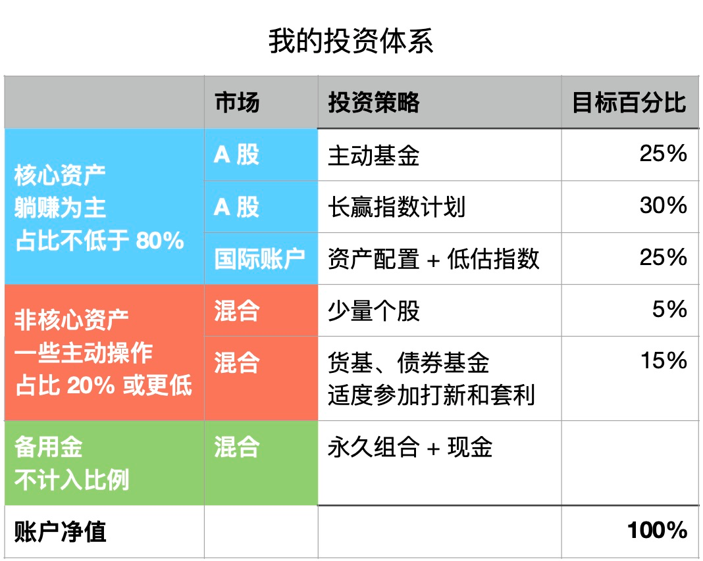

# 一笔稳赚的投资 ｜ 财务自由实证 #17

**发布时间**: 2020-08-06 06:59:01

**原文链接**: [http://mp.weixin.qq.com/s?__biz=MzUzNjE3NzQ3Nw==&mid=2247486745&idx=1&sn=874846714bda44489d8f8a7635781d12&chksm=fafb7333cd8cfa25f354ad7cb41373d2ab603ac7ac705ade9feceab939190a9ba1cc0607ca31#rd](http://mp.weixin.qq.com/s?__biz=MzUzNjE3NzQ3Nw==&mid=2247486745&idx=1&sn=874846714bda44489d8f8a7635781d12&chksm=fafb7333cd8cfa25f354ad7cb41373d2ab603ac7ac705ade9feceab939190a9ba1cc0607ca31#rd)

---

> PS：尴尬，上一期的编号错了，不是 17 应该是 16。但是公众号不能修改标题只能将错就错，这一期才是真 17……

这个系列实证是我个人实盘财务计划，目标——工资理财实现财务自由，F.I.R.E （Financial Independence and Early Retirement）。不追求大富大贵，但求能够不再担心生计问题，更有底气**把时间“浪费”在美好的事物上，放心做那些自己喜欢，却不一定能够养活自己的事情。**

有兴趣参考这个实证的朋友建议先看看之前的引导篇，[制定你自己的财务自由计划](https://mp.weixin.qq.com/s?__biz=MzUzNjE3NzQ3Nw==&mid=2247484500&idx=1&sn=c04c3de1a1231bef25bb4cda773c00ff&scene=21#wechat_redirect)、[和我一起财务自由](https://mp.weixin.qq.com/s?__biz=MzUzNjE3NzQ3Nw==&mid=2247484480&idx=1&sn=258e8dd4976c7d3c324ed89b90904d14&scene=21#wechat_redirect)，对于理解实证会有很大帮助。

**我给自己定下的目标是 30 岁前积累 500 万人民币金融资产。**

### 计划进度

当前财务自由计划完成度 73.37%（当前资产 ÷ 目标资产），相比上个月增加 9 个百分点，自 2019 年 3 月起，累计收益率 24%，浮盈 71.7 万。

### 预算及储蓄

2020 年度依然沿用 2019 年的预算计划，每个月 2100 欧元的预算。预算节余或者超支会累加到下个月的预算中。

> 财富积累就是把宏大的目标拆成可执行的每个小目标，财务自由始于最初简单的预算制定和储蓄。

2020 年度计划每月平均开支 2100 欧元，目前为止实际平均开支 1985 欧元。

这个预算和开支图包括了我们生活的**每一笔开支，包括意外开支** 。下图是我们的具体预算分配，也会根据实际情况进行调整，但是总额上限 2100 欧元是固定不动的。

### 愿望清单

【暂时为空，没啥特别想买的】

### 我自己的投资组合

因为还有工作，**理财投资选择躺赚为主，日常做的操作很少** 。除了定投以外，主要就是平时打打新、套套利，再就是市场大幅波动的时候会找一些比较确定性的机会。具体的投资我会在平时的文章和知识星球里提及，这里就不再赘述啦。

### 一笔稳赚的投资

之前我给大伙分享过一篇[不同年龄里分别最赚的三笔投资](https://mp.weixin.qq.com/s?__biz=MzUzNjE3NzQ3Nw==&mid=2247486477&idx=1&sn=6e93a98529b12726ef38c14f903511f3&scene=21#wechat_redirect)，里面提到 30 岁最赚的投资之一——和家人坦诚“谈钱”，统一战线、获得理解和支持。

刚好最近有好几位读者告诉我，他们的财务自由计划也顺利得到了家人的支持，迈进一大步。开心之余也来一起分享两个我自己的经历。

第一次是说服也太和我一起努力财务自由计划，这是能有今天的基本前提。**能两个人一起存钱效率远不止 2 倍那么简单，相互鼓励、相互监督，往往是 1+1 >> 2 的。**（“>>”这个数学符号你们还记得啥意思不？）

第二次就是和家里父母说明自己的计划，获得了一笔“外部融资”。我估算了一下，**这次谈钱给我的财务自由计划大约省下了 3 年的时间，如果这笔钱让我自己赚，还得再攒 3 年。**

获得家人支持真的很重要，非要说个程度的话，我觉得价值介于“血赚”和“暴富”之间。

……

经常有读者问我应该怎么和家人谈钱。毕竟谈钱还是有点尴尬，经常是还没张嘴自己就怂了，要么就是好不容易说出来却惨遭拒绝。

我总结了三个对我很有帮助的经验，供大伙参考一下。

> 先把事儿认真做成，再低调、不经意（别得瑟）地让家人知道。

“谈”并不一定要张嘴，做比说有效，有时候真[不用说太多](https://mp.weixin.qq.com/s?__biz=MzUzNjE3NzQ3Nw==&mid=2247485585&idx=1&sn=fe423f3260e0b6a59947e6cad6c5ae00&scene=21#wechat_redirect)，**在“钱”这个话题上没有傻子，只有装睡的人** 。

> 谈钱是个长跑，不是拿到钱就搞定了。****

就像我即使在公众号里写不下一百次「要长期投资、风雨无阻」，但市场下跌大伙还是要忍不住求按摩，其实家人也一样需要“按摩”，需要定期更新信息。我的实证不仅仅你们在看，我的家人也在看。**我也是后来才发现，实证刚好也是个极好的“谈钱”形式。**

> 账目算清楚有利于家庭和谐。****

我以前在讲预算的时候和大伙分享过，给家人设置分开的家庭预算，把帐算清楚有利于家庭和谐。有的读者可能觉得，算账太伤感情了。切实不是，谁花多、谁花少并不伤，完全平均是不可能的，**最伤的是相互猜忌，都觉得对方花得更多……**

……

以前看过一篇文章分析巴菲特的投资收益，里面就提到股神这么好的历史业绩里有相当一部分都是来自伯克希尔哈撒韦保险业务带来的大约 1.6 倍**无风险** 杠杆。如果去掉这部分杠杆，股神的收益也要打一定折扣。

这样的机会我们虽然不能复制，但回头想想，家人的支持不也是一种变相的无风险杠杆吗？

当你获得了另一半的支持，杠杆就变成了 2；再获得家里人的支持，杠杆可能会变成 3 甚至更高。这也是一笔稳赚的投资。

但是最重要的，赶紧努力让自己配得上这一切，**只有长期收益为正的时候，杠杆才有价值。**