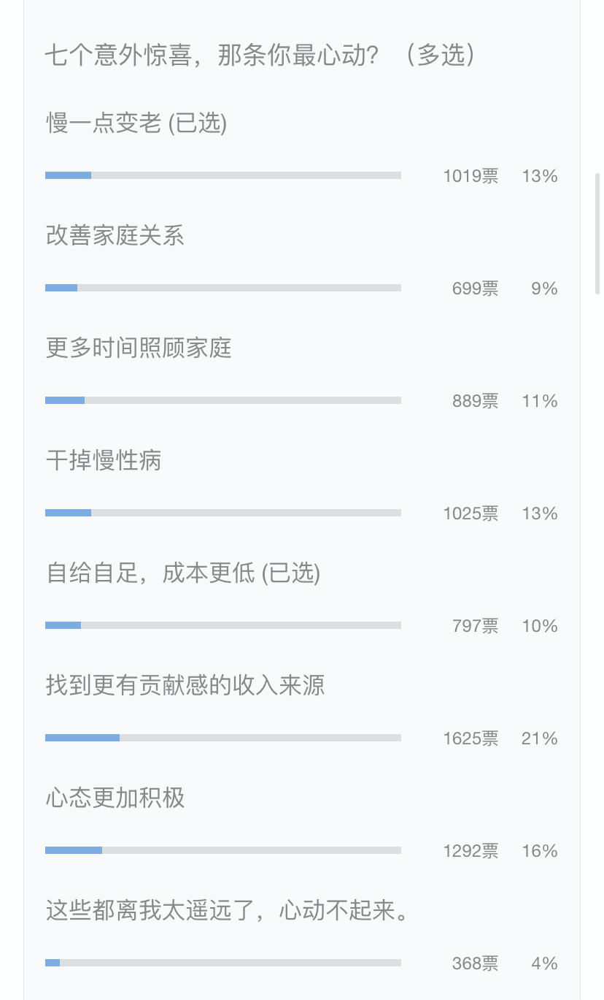

# 践行财务自由这几年，被误解最多的三件事儿

**发布时间**: 2020-08-10 07:19:09

**原文链接**: [http://mp.weixin.qq.com/s?__biz=MzUzNjE3NzQ3Nw==&mid=2247486763&idx=1&sn=7bac6097b2e2cfe5c973d6870e3e435f&chksm=fafb7301cd8cfa1704d0b04bed4d1703247ad5852ce7553bec9fafa4020c8ed7a59f80e40c49#rd](http://mp.weixin.qq.com/s?__biz=MzUzNjE3NzQ3Nw==&mid=2247486763&idx=1&sn=7bac6097b2e2cfe5c973d6870e3e435f&chksm=fafb7301cd8cfa1704d0b04bed4d1703247ad5852ce7553bec9fafa4020c8ed7a59f80e40c49#rd)

---

从践行财务自由这条路开始，就注定要面对各种各样的疑惑，毕竟这代表了一个全新却恰恰最容易被误解的看待生活和未来的角度。

渴望一夜暴富的人觉得这是一条钱生钱的捷径，而坚信只有上班才靠谱的人则认为这是一条通向懒惰、坐吃山空的路。

从开始写财务自由实证和相关思考，前前后后也回答了上千条提问。我整理了三个最常被问到，也常常被误解的事儿。

### 理财投资、践行财务自由是一条通向财富的捷径

「是不是还有哪些我不知道的不用费力、等待和本金就能致富的捷径？」也许有吧，但事实上践行财务自由这条路并不符合，理财并不是一条致富捷径。

不管是中国还是欧美，创造财富的主要力量都是劳动收入，占比 70% 以上（来自香帅老师《钱从哪里来》）。靠谱且**可复制** 地赚取第一桶金的方式只有一个——努力工作、踏实储蓄，可惜这条路常常被忽视。

> 走到人生的十字路口，基本每一次我都知道哪条路是正确的，但我从来不走。知道为什么吗？因为那条路太特么难了！
> 
> ——《闻香识女人》

财务自由计划能让我们的努力更有方向感、更有效率，但计划不能代替努力本身。**劳动收入决定了我们财富的绝对位置，财富收入则决定了我们的生活方式和心态。**

我们只能获得与当前努力程度相匹配的自由，但财务自由终将改变我们看待生活问题的态度和可选的生活方式，帮助我们解决生活的焦虑，离幸福更近一点。

### 过去这几年收益都没达到年化 10% 这个目标，实现目标难了

从 2019 年公开财务自由实证后的 1 年里，计划进度可以用龟速来形容，一年多里没取得啥可观的收益。

“按理说”，十年计划每年应该完成进度的 10%，但直到今年三月在十年计划已过近 80% 之时，我的资产却只达到目标的 59%。所以经常被问到「按照这样的进度真能实现自由目标吗？」

按照线性思维，从过去几个月或者几年的短期历史来推断未来走势，财务自由计划的目标确实很难兑现了。

但谁想到 2020 年 6、7 两个月，资产进度直接从 59% “暴涨”到了 74%，完成了“原本”一年半才能走完的目标。对于线性思维这是难以理解的跳跃，但**这恰恰就是资本市场的常态。**

资本市场的长期收益比较明确，但短期却不可预测，耐心真的很重要。资本市场的游戏规则是这么玩的——**今天的努力明天不一定有收获，后天也不一定有收获，没准大后天也没有。** 虽然这不符合线性思维希望的，今天投资明天就看到成果。但你始终知道，收获总会到来，等得越久、收获越大，「横有多长、竖就有多高」。

资本市场并不线性，确实也有可能我的十年计划已经走完却依旧没能达到自己的目标。但我知道，目标达成可能会迟到，但从不会缺席。

### 你的目标只定了 500 万，明明还能赚更多，年纪轻轻就退休太可惜了……

自由以后就一定会放弃努力、退休享受生活吗？刚好上周请大家投票了最心动的几项自由意外惊喜 👇

选择更有贡献感的收入来源和更积极的生活态度得票最高，而这两个都和享乐无关。**财务自由只是生活中一个标杆式的里程碑，但从不是生活的终点。** 仅代表从这一刻起我们拥有了最基本的选择权。

什么是收入，收入是社会对你所创造的贡献的褒奖。最有利于创造价值、获取财富的路，就是选择一条与你自己个人价值观和能力相匹配的方向。而迫于生计压力所选择的工作方式，往往并不符合这个标准。所以活得自由一定意味着财富之路到此为止吗？我看未必，也许会离财富更进一步呢。

但这已经不是重点了。毕竟拥有几百万和能像百万富翁一样生活并不是一回事儿，赚钱不是目标，积累财富并最终活得自由才是。赚钱确实没有止境，但赚钱从不是生活的唯一。

……

还有一条算不上误解，但也是经常被问到的

> 目前大部分财务自由成功案例都是来自欧美国家，这在中国行得通吗？

十多年前在海外践行财务自由所面临的质疑和现在国内很像，而如今至少在欧美的财经领域，这样的生活方式已经越来越被认可。越来越多的成功者让大家意识到这个方案的可行性。

**新的观点和生活方式就像牛市一样，总是在反对声中渐渐兴起的。**  而当大部分人姗姗来迟意识到某件事儿真正的价值时，早已有人在这里守候多时。很喜欢张潇雨老师的一条人生信念，和大伙分享一下：

> 无论如何定义「成功」，能达到这个状态的人都是极少数。所以一个人无法通过做大多数人都在做的事达成成功。

更何况我们自由的目标之一就是选择遵从本心、活出内在价值，一点点外在质疑和误解又何妨呢？