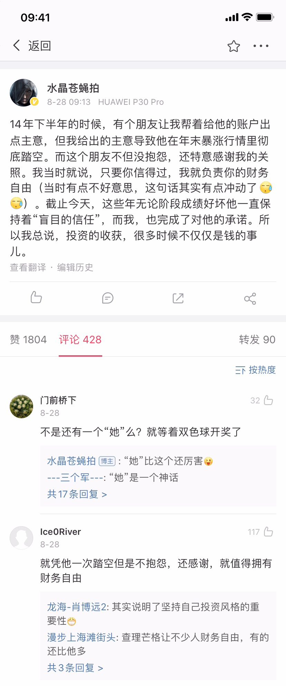

# 财务自由实证 #18.1｜遇到一件有点感慨的事儿

**发布时间**: 2020-09-09 07:00:00

**原文链接**: [http://mp.weixin.qq.com/s?__biz=MzUzNjE3NzQ3Nw==&mid=2247486962&idx=1&sn=e6c81a965c1243b956f83bcc0b040ed8&chksm=fafb73d8cd8cfacee84f9562b2fd192f2d1787ff79d56ae15f6d773115279c8606c3c8101c48#rd](http://mp.weixin.qq.com/s?__biz=MzUzNjE3NzQ3Nw==&mid=2247486962&idx=1&sn=e6c81a965c1243b956f83bcc0b040ed8&chksm=fafb73d8cd8cfacee84f9562b2fd192f2d1787ff79d56ae15f6d773115279c8606c3c8101c48#rd)

---

这个系列实证是我个人实盘财务计划，目标——工资理财实现财务自由，F.I.R.E （Financial Independence and Early Retirement）。不追求大富大贵，但求能够不再担心生计问题，更有底气**把时间“浪费”在美好的事物上，放心做那些自己喜欢，却不一定能够养活自己的事情。**

有兴趣参考这个实证的朋友建议先看看之前的引导篇，[制定你自己的财务自由计划](https://mp.weixin.qq.com/s?__biz=MzUzNjE3NzQ3Nw==&mid=2247484500&idx=1&sn=c04c3de1a1231bef25bb4cda773c00ff&scene=21#wechat_redirect)、[和我一起财务自由](https://mp.weixin.qq.com/s?__biz=MzUzNjE3NzQ3Nw==&mid=2247484480&idx=1&sn=258e8dd4976c7d3c324ed89b90904d14&scene=21#wechat_redirect)。另外这几个资源对于大家理解实证会有很大帮助。

  * [我的躺赚投资体系](https://mp.weixin.qq.com/s?__biz=MzUzNjE3NzQ3Nw==&mid=2247486954&idx=1&sn=1a264382008a0153ce9247ebfcc94243&scene=21#wechat_redirect)

  * [一文打包三年干货](https://mp.weixin.qq.com/s?__biz=MzUzNjE3NzQ3Nw==&mid=2247486721&idx=2&sn=f5d11516a6b1f19a06ce2fb03b6706e6&scene=21#wechat_redirect)

  * [我的第一本书，整理财务自由方法论](https://mp.weixin.qq.com/s?__biz=MzUzNjE3NzQ3Nw==&mid=2247486809&idx=1&sn=8a80c493837ee044c5d55e0a423507d2&scene=21#wechat_redirect)

**我给自己定下的目标是 30 岁前积累 500 万人民币金融资产。**

* * *

加更一篇思考，这个月的实盘数据在 👉 [这里（#18）](https://mp.weixin.qq.com/s?__biz=MzUzNjE3NzQ3Nw==&mid=2247486921&idx=1&sn=79f0d9a6a7fc5b468751ddab706c2c30&scene=21#wechat_redirect)。

最近有个小事儿挺感慨的。某读者给我留言，说自己不敢定投了，看我依旧还在坚持，就让我把自己的定投交易截图发给他，他才敢继续定投……

我还一度纠结要不要发来着，后来还是决定，不发。说到底每个人自己的本金只能自己负责，别人帮得了一时、帮不了一世。

但是这就让我反思一个问题，基民们平时常问的一句话——「有没有牛基推荐一个？」。仿佛有了牛基就能稳稳地赚钱，真是真是这样吗？

我以前给大家分享过两个结论，分别来自两位我特别喜欢的基金经理，A 股的朱少醒（14 年 18 倍）和美股的彼得林奇（13 年 27 倍）。

朱少醒在 2017 年的一篇访谈里曾经表示过：

> Q：有没有算过，你的持有人有多少是赚钱的。
> 
> A：跟别的公司、别的基金差不多，赚钱比例一大半，还有一小半是不赚钱的，但是赚大钱的比例不高，需要一直拿着。

富达基金也曾经披露过一个数据——投资了彼得林奇的麦哲伦基金的投资者，平均收益是负数。

一面是牛逼到爆炸的基金收益，一面是看着可怜的基民赚到手的钱。再想到前面这位读者给我的留言，真心感慨——**一只基金或者策略收益高不高是一回事儿，你能不能从中赚到钱则是另外一回事儿。**

拿得住才是前提。

### 喜欢/认可/信任

大部分投资者买入一只基金凭的是「喜欢」，但想要真的从一只基金中赚到高额收益靠的往往是「信任」，有信任才拿得住。

**喜欢** ，只要基金或者基金经理有吸引你的亮点，你就可以很喜欢。“看你赚的不错，跟你混了，信你”。但是赔钱的时候，时刻准备跳车。

**认可** ，喜欢并为了这个基金或者基金经理拒绝别的选择，这才是认可。

而**信任** ，我不但喜欢你的优点，也接纳你的缺点，因为我知道盈亏同源。最后抓住机会赚到大钱的，总是这么一群人。

贴一张“苍老师”的微博，信任的典范（苍老师是私募经理，基金、跟投、私募道理都差不多）

### 信任的背后，价值观认同

不仅仅是投资赚钱，信任也是财务自由的基础。**如果连个真心信任的基金经理都没有，你怎么敢放心撒丫子出去享受自由呢？**

以至于我后来在星球发过一条小感慨（假公济私，再悄悄推一下星球 ）

后来我有幸找到了一段更为精彩的表达——**信任的背后，是价值观认同** 。

偶然读到了张坤在半年报中分享的观点，对信任的理解又深了一层。

> 一个投资人不论采用何种方法，必然在某些时期面临业绩的落后。我的体会是，一个投资人选择何种投资方法，并不是这种方法在出彩时多灿烂，而是在这种方法阶段性失灵时仍能坦然面对，并且晚上睡得香。
> 
> 这一点，很大程度取决于投资人的性格和价值观。
> 
> ……只有持有人自己的投资体系和价值观与管理人匹配，才能做到持有基金的久期和基金持有股票的久期基本匹配。

赚钱的背后是拿住牛基，拿住的背后是信任，信任的背后则是价值观的相互认同。而理解价值观的重点就是反向思考，知道自己的投资什么时候会“悲剧”。

> 任何长期有效的投资方法，短期必然间歇性失灵。如果短期一直有效，会导致大量的人采用该方法，从而导致该方法长期失效。

如果你想不明白一笔投资会在什么时候失效，那大概率离失效就不远了。就像在赌桌上，如果你不知道韭菜是谁，那大概率就是你。没有不会失效的投资，也没有找不到韭菜的赌局。

### 「信任」二字值千金

选到一只牛基可能没大家想的那么难，我分享个思路——打开天天基金，找到那些**成立超过十年** 的基金，再从里面找**历史业绩比较好** ，**基金经理变动不频繁** 的基金，或者反过来从基金经理的历史业绩来找。虽然不能保障每个都靠谱，但是靠谱的比例显著高于市场平均。

但这只是个开始，只是慢慢征途的第一步。

第二步，你得研究明白这个基金经理在什么时候会不如意，甚至“被人唾弃”。因为任何长期有效的策略必然会有短期失效。

第三步，接纳和信任，在别人开始唾弃的时候，你能坚定不移地和基金经理站在一起，一同被世人所唾弃。

这样，离可持续地赚钱和自由才真的不远了。