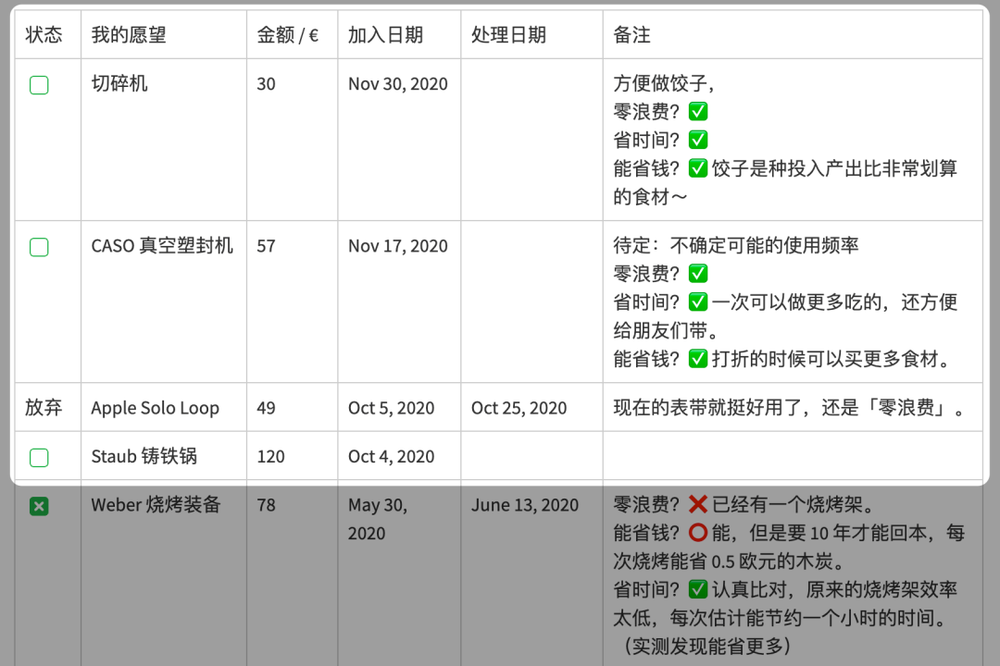

# 财务自由实证 #21｜能解决的焦虑又多了一个～

**发布时间**: 2020-12-01 06:00:18

**原文链接**: [http://mp.weixin.qq.com/s?__biz=MzUzNjE3NzQ3Nw==&mid=2247487384&idx=1&sn=954614701f36f81fcc451789428a3c9f&chksm=fafb71b2cd8cf8a4f8cbe6322ee2007c9da379a9243eb1dff9b61d287dc0d1d1facb52ebb476#rd](http://mp.weixin.qq.com/s?__biz=MzUzNjE3NzQ3Nw==&mid=2247487384&idx=1&sn=954614701f36f81fcc451789428a3c9f&chksm=fafb71b2cd8cf8a4f8cbe6322ee2007c9da379a9243eb1dff9b61d287dc0d1d1facb52ebb476#rd)

---

这个系列实证是我个人实盘财务计划，目标——工资理财实现财务自由，F.I.R.E （Financial Independence and Early Retirement）。不追求大富大贵，但求能够不再担心生计问题，更有底气**把时间“浪费”在美好的事物上，放心做那些自己喜欢，却不一定能够养活自己的事情。**

有兴趣参考这个实证的朋友建议先看看之前的引导篇，[制定你自己的财务自由计划](https://mp.weixin.qq.com/s?__biz=MzUzNjE3NzQ3Nw==&mid=2247484500&idx=1&sn=c04c3de1a1231bef25bb4cda773c00ff&scene=21#wechat_redirect)、[和我一起财务自由](https://mp.weixin.qq.com/s?__biz=MzUzNjE3NzQ3Nw==&mid=2247484480&idx=1&sn=258e8dd4976c7d3c324ed89b90904d14&scene=21#wechat_redirect)。这里还有两个资源对于大家理解实证会有很大帮助。

  * [一文打包三年干货](http://mp.weixin.qq.com/s?__biz=MzUzNjE3NzQ3Nw==&mid=2247487328&idx=1&sn=333c62100747204ee4148273c7e7a70a&chksm=fafb714acd8cf85c4405c09f7dacdbc4d5f6dd936de41e626c29e7e8da6789659ca81b6cf379&scene=21#wechat_redirect)

  * [我的第一本书，整理财务自由方法论](https://mp.weixin.qq.com/s?__biz=MzUzNjE3NzQ3Nw==&mid=2247486809&idx=1&sn=8a80c493837ee044c5d55e0a423507d2&scene=21#wechat_redirect)

**我给自己定下的目标是 30 岁前积累 500 万人民币金融资产，** 根据资本市场的历史收益情况，这笔钱相当于平均每年 50 万的“睡后收入”。

### 计划进度

当前财务自由计划完成度 83.4%（当前资产 ÷ 目标资产），相比于上个月增加 5.8 个百分点。目前投资累计收益率 33.85%，浮盈 105 万。

### 预算及储蓄

「因上努力，果上随缘」，虽然收益数字看着漂亮，但其实只是投资路上一个不可控的结果，真正值得我们关注的应该是控制预算，踏实储蓄。

**主业努力多赚钱、践行预算少浪费、不被短期波动干扰坚持投资才是一切的根源。**

为了保证储蓄率，我们家每年会制定一次家庭年度预算，2020 年度依然沿用 2019 年的预算计划，每个月 2100 欧元的预算。预算节余或者超支会累加到下个月的预算中。

> 财富积累就是把宏大的目标拆成可执行的每个小目标，财务自由始于最初简单的预算制定和储蓄。

2020 年度计划每月开支 2100 欧元，目前为止实际平均开支 1920 欧元。

这个预算和开支图包括了我们生活的**每一笔开支，也包括意外开支** 。下图是我们的具体预算分配，也会根据实际情况进行调整，但是总额上限 2100 欧元是固定不动的。

### 愿望清单

[愿望清单](https://mp.weixin.qq.com/s?__biz=MzUzNjE3NzQ3Nw==&mid=2247484651&idx=1&sn=ab38b1ea6008b5bb1b9148c43f3f315f&scene=21#wechat_redirect)和[“致命三问”](https://mp.weixin.qq.com/s?__biz=MzUzNjE3NzQ3Nw==&mid=2247486379&idx=1&sn=d4ee2278fb3b81100b2857259cdf3bee&scene=21#wechat_redirect)是我非常喜欢的两个工具。想买一个东西先不要急着剁手，放进愿望清单里缓冲一下，思考优先级，再根据预算行动。

可以砍掉不少无用的消费，并给真正需要或者喜欢的东西留下了更多的预算。改善生活的同时，反而降低了总开销。

我比较推荐的工资到手后的优先级顺序：

  1. 储蓄/投资，**先储蓄投资再消费** ；

  2. 活着，房租水电，基本生活；

  3. 愿望清单里的重要项目；

  4. 其他杂七杂八的。

我这个月的愿望清单 👇。新增了两个小玩意，但是考虑到临近年末可能用钱的地方比较多，决定先缓缓～

### 我的投资组合

我给大伙分享过基金经理谢治宇的基金买入策略——啥也别管，有钱就买。我自己的买入策略一直也差不多，有钱就买点，带着「囤」资产的心态，少去合计短期的涨跌。

2020 年 8 月的状态

投资没啥变化，我的躺赚思路你们也知道的，没操作才是正常，可能很久都不会动一次。唯一不同的可能就是收益的数字有波动，最近又涨了一点。

* * *

最近好多人都在讨论延迟退休这个话题，借着这个背景，我要再和大家安利一下财务自由计划了

突然发现财务自由能够解决的问题又多了一个，有点加量不加价的感觉呢。

先说一下延迟退休这件事儿，传统“转移支付”模式的退休金缩水其实在各个国家都是个大趋势。

> 所谓「转移支付」就是，还在工作的人上缴的养老保险用来发放现在的退休金，等我们老了，则指望未来年轻人上缴的养老保险。

但毕竟人的寿命越来越长、领退休金的人越来越多；而生育率逐年降低，“给池子蓄水”的人却越来越少，延迟退休其实也是个无奈之选。

对个人来说，能彻底解决延迟退休或者退休金缺口的，也就只有我们自己的储蓄了，所以为养老投资是绕不过去的，以后大概率会越来越重要。

……

说回到财务自由，其实财务自由和养老投资背后是一回事儿——攒一大笔钱，以后花，只不过程度不一样。

养老投资是一直攒钱、投资到退休，然后争取在死掉之前别花光。

**而你把攒钱的速度加快，开始的年龄提前，收益在理性范围内增加，最后达到一个钱花不完的程度不就是财务自由了。**

如果反正都要解决退休的问题，反正都要积累财富，何不再多考虑一个程度，干脆试试财务自由呗？没有什么比这个更能解决退休延迟的焦虑了～

我知道每次写这个都会有很多人质疑——财务自由可行吗？

以前我也经常和别人辩论，但是后来渐渐发现这个讨论其实意义没有我想得大，因为我们总能找出无穷多导致自己不能自由的风险。

所以这次我决定换个思路，复习一下高中数学的极限法——假设失败的情况，假如我们攒够了一笔财富到头来却依然没能自由，那会发生什么呢？

但我想来想去，这好像也没啥损失呢？

因为就算失败了，积累下的财富和途中获得的投资技能依然是实打实的，账上多出几百万还是比没有钱强很多。**生活总有各种苦难，可能导致攒了钱也没法自由的意外风险永远存在。**

A：我们运气不好，这种风险真的发生了，最终遗憾没能自由、继续搬砖。那我要问了，如果手里没钱，情况会更好吗？大概率只会更糟糕。

B：万一这种风险压根没发生呢？

**有的时候思考赔率比思考概率有意义** ，如果一件事儿成功了收益无限，失败了却没啥损失，那我们要关注的点就不是什么可行性，而是如何开始和解决问题。

  * 财务自由：[我的财务自由实证](http://mp.weixin.qq.com/s?__biz=MzUzNjE3NzQ3Nw==&mid=2247487209&idx=1&sn=27c73bd58f89083eccc351845cafa598&chksm=fafb70c3cd8cf9d5aa78e41d6ecd01434c461dacf037558d00e7914e58b8afdcabfd25b1cf15&scene=21#wechat_redirect)

  * 干货汇总：[一文打包三年干货（第三版）](http://mp.weixin.qq.com/s?__biz=MzUzNjE3NzQ3Nw==&mid=2247487328&idx=1&sn=333c62100747204ee4148273c7e7a70a&chksm=fafb714acd8cf85c4405c09f7dacdbc4d5f6dd936de41e626c29e7e8da6789659ca81b6cf379&scene=21#wechat_redirect)

  * 抵御风险：[11 月保险方案参考](http://mp.weixin.qq.com/s?__biz=MzUzNjE3NzQ3Nw==&mid=2247487285&idx=1&sn=e3d45fa6d01fbabbb21320d9b8474225&chksm=fafb711fcd8cf809793f64a4888c08d26c1ded321b478aace6f867297fd2a69424e74ae56d8a&scene=21#wechat_redirect)