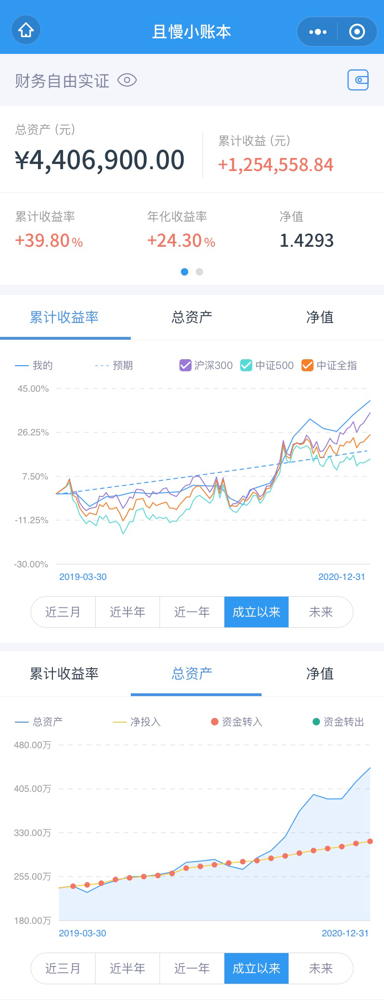
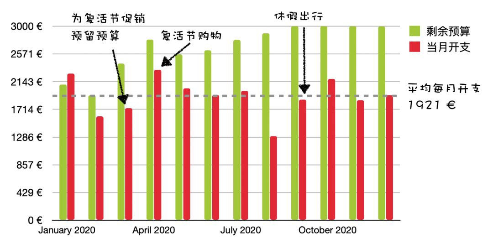
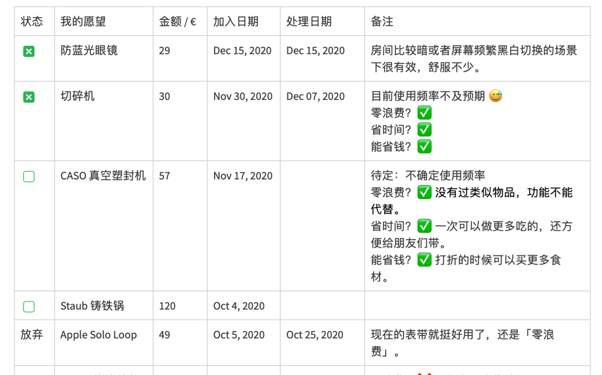
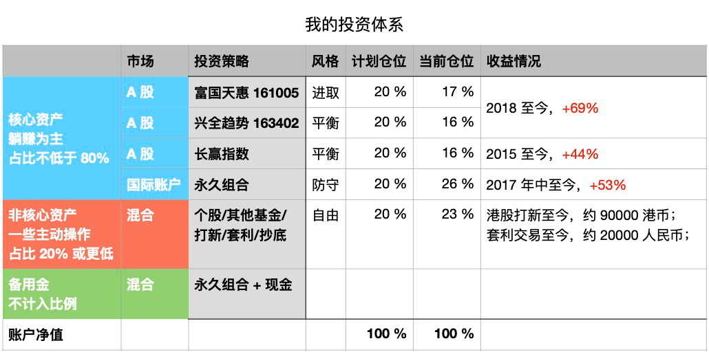

# 财务自由实证 #22｜2020 年最满意的一份报告

**发布时间**: 2021-01-04 05:59:57

**原文链接**: [http://mp.weixin.qq.com/s?__biz=MzUzNjE3NzQ3Nw==&mid=2247487525&idx=1&sn=0961f93f62f9eb09b943443c2919e192&chksm=fafb6e0fcd8ce719164fb8e8f4598fdb4c680d5aa02a808129b0b31c13da678d398206585146#rd](http://mp.weixin.qq.com/s?__biz=MzUzNjE3NzQ3Nw==&mid=2247487525&idx=1&sn=0961f93f62f9eb09b943443c2919e192&chksm=fafb6e0fcd8ce719164fb8e8f4598fdb4c680d5aa02a808129b0b31c13da678d398206585146#rd)

---

这个系列实证是我的个人实盘财务计划，目标——工资理财实现财务自由，F.I.R.E （Financial Independence and Early Retirement）。不追求大富大贵，但求能够不再担心生计问题，更有底气**把时间“浪费”在美好的事物上，放心做那些自己喜欢，却不一定能够养活自己的事情。**

有兴趣参考这个实证的朋友建议先看看之前的引导篇，[制定你自己的财务自由计划](https://mp.weixin.qq.com/s?__biz=MzUzNjE3NzQ3Nw==&mid=2247484500&idx=1&sn=c04c3de1a1231bef25bb4cda773c00ff&scene=21#wechat_redirect)、[和我一起财务自由](https://mp.weixin.qq.com/s?__biz=MzUzNjE3NzQ3Nw==&mid=2247484480&idx=1&sn=258e8dd4976c7d3c324ed89b90904d14&scene=21#wechat_redirect)。这里还有两个资源对于大家理解实证会有很大帮助。

  * [一文打包三年干货](http://mp.weixin.qq.com/s?__biz=MzUzNjE3NzQ3Nw==&mid=2247487328&idx=1&sn=333c62100747204ee4148273c7e7a70a&chksm=fafb714acd8cf85c4405c09f7dacdbc4d5f6dd936de41e626c29e7e8da6789659ca81b6cf379&scene=21#wechat_redirect)

  * [我的第一本书，整理财务自由方法论](https://mp.weixin.qq.com/s?__biz=MzUzNjE3NzQ3Nw==&mid=2247486809&idx=1&sn=8a80c493837ee044c5d55e0a423507d2&scene=21#wechat_redirect)

  * [我的一篇干货访谈](http://mp.weixin.qq.com/s?__biz=MzUzNjE3NzQ3Nw==&mid=2247487473&idx=1&sn=10a891429291e78dea82b4df34e773f3&chksm=fafb71dbcd8cf8cdb15f114d6637bc6476a2803f9f0803dcbb4d91c1e68b5cc706c3dc55358b&scene=21#wechat_redirect)

**我给自己定下的目标是 30 岁前积累 500 万人民币金融资产，** 根据资本市场的历史收益情况，这笔钱相当于平均每年 50 万的“睡后收入”。

### 计划进度

当前财务自由计划完成度 88%（当前资产 ÷ 目标资产），相比于上个月增加 4.6 个百分点。

我的本轮计划大约开始于 2017 年，从 2019 年 4 月公开实证，实证目前投资累计收益率 39.80%，浮盈 125 万。

### 预算及储蓄

「因上努力，果上随缘」，虽然收益数字看着漂亮，但其实只是投资路上一个不可控的结果，真正值得我们关注的应该是控制预算，踏实储蓄。**主业努力多赚钱、践行预算少浪费、不被短期波动干扰坚持投资才是一切的根源。**

决定财务自由的不是收入的高低，而是最后能留下多少。

为了保证储蓄率，我们家每年会制定一次家庭年度预算，2020 年度依然沿用 2019 年的预算计划，每个月 2100 欧元的预算。预算节余或者超支会累加到下个月的预算中。

> 财富积累就是把宏大的目标拆成可执行的每个小目标，财务自由始于最初简单的预算制定和储蓄。

2020 年度计划每月开支 2100 欧元，全年实际平均开支 1921 欧元，超额完成任务。

这个预算和开支图包括了我们生活的**每一笔开支，也包括意外开支** 。下图是我们的具体预算分配，也会根据实际情况进行调整，但是总额上限 2100 欧元是固定不动的。

### 愿望清单

[愿望清单](https://mp.weixin.qq.com/s?__biz=MzUzNjE3NzQ3Nw==&mid=2247484651&idx=1&sn=ab38b1ea6008b5bb1b9148c43f3f315f&scene=21#wechat_redirect)和[“致命三问”](https://mp.weixin.qq.com/s?__biz=MzUzNjE3NzQ3Nw==&mid=2247486379&idx=1&sn=d4ee2278fb3b81100b2857259cdf3bee&scene=21#wechat_redirect)是我非常喜欢的两个工具。想买一个东西先不要急着剁手，放进愿望清单里缓冲一下，思考优先级，再根据预算行动。

可以砍掉不少无用的消费，并给真正需要或者喜欢的东西留下了更多的预算。改善生活的同时，反而降低了总开销。

我比较推荐的工资到手后的优先级顺序：

  1. 储蓄/投资，**先储蓄投资再消费** ；

  2. 活着，房租水电，基本生活；

  3. 愿望清单里的重要项目；

  4. 其他杂七杂八的。

我这个月的愿望清单 👇。

### 我的投资组合

我在[上周的文章](http://mp.weixin.qq.com/s?__biz=MzUzNjE3NzQ3Nw==&mid=2247487512&idx=1&sn=2023c3ba36c7ec80060da5a1a02de459&chksm=fafb6e32cd8ce724bd96d4b5ca42b86377b99b879bad869458e407b202220a9fd304c381c33c&scene=21#wechat_redirect)中汇总了最新的投资情况，图片直接贴过来了 👇

2021 年 1 月的状态

投资没啥变化，我的躺赚思路你们也知道的，没操作才是正常，可能很久都不会动一次。唯一不同的可能就是收益的数字有波动，最近又涨了一点。

### 2020 年最得意的一份报告

最近不少 App 或者平台都在汇总各种 2020 年度报告，有一份报告我看完以后贼自豪——供电商发来的年度电费结算，里面附的一张对比统计图 👇

德国的两口之家一年平均用电量是 3440 度，一人独居一年用电 2050 度。我和也太一年才用了 1595 度。居然比一个人独居的情况还少了近 500 度，而且还是在我们经常在家做菜的情况下（没通天然气）。

德国这边电费很贵，平均一度电 0.3～0.5 欧元，汇率 1:8，折算下来相当于一年多攒近 3000 人民币。

我们俩平时也没有特别注意省电之类的，也许是当初搬进来照明换了全套 LED 的功劳？再不然就一定是我们已经把勤俭持家的习惯内化进了日常生活

“投资收益跑赢 XX% 的投资者”这种数据看完固然会觉得高兴，但我更愿意关注的反而是这类“开支低于 XX% 的家庭”这些报告。毕竟超额收益不一定能长久持续，总有运气成分，可能今年跑赢明年就跑输了，但控制开支对财富积累的贡献却持续有效。

经常有小伙伴问我，财务自由的本金怎么攒？

我的经验是，从开支入手比从收入入手要容易。别的不说，光是通过避免各种不必要的浪费就已经可以多积累不少本金了，更何况还有不少置办以后提升生活质量还能省钱的物件。

关注这些，一方面提高我们的财富积累速度，另一方面降低了财务自由的门槛，更重要的，生活往往也更舒服了。

理财有个很重要的技能常常被忽视——**花更少的钱，却能获得更多幸福的能力，** 在我看来这甚至比投资赚钱更重要。

  * 财务自由：[我的财务自由实证](http://mp.weixin.qq.com/s?__biz=MzUzNjE3NzQ3Nw==&mid=2247487384&idx=1&sn=954614701f36f81fcc451789428a3c9f&chksm=fafb71b2cd8cf8a4f8cbe6322ee2007c9da379a9243eb1dff9b61d287dc0d1d1facb52ebb476&scene=21#wechat_redirect)

  * 干货汇总：[一文打包三年干货（第三版）](http://mp.weixin.qq.com/s?__biz=MzUzNjE3NzQ3Nw==&mid=2247487328&idx=1&sn=333c62100747204ee4148273c7e7a70a&chksm=fafb714acd8cf85c4405c09f7dacdbc4d5f6dd936de41e626c29e7e8da6789659ca81b6cf379&scene=21#wechat_redirect)

  * 抵御风险：[12 月保险方案参考](http://mp.weixin.qq.com/s?__biz=MzUzNjE3NzQ3Nw==&mid=2247487422&idx=1&sn=b0df31c289e7df85deb4322324034d11&chksm=fafb7194cd8cf88241afef3a0eb51a4f073dd9526a9ee1f2e4f374a131b54dd6a0a1782ac027&scene=21#wechat_redirect)

……

对啦，还要提个醒，最近重疾险旧定义调整，我整理的推荐里面可以保定期到 70 岁的[如意甘霖]()会在明天晚上 12 点下架「保到 70 岁」这个选项。有需要的小伙伴注意下哦，上面的链接「方案参考」有我给大家的具体建议。

新年第一周，一起加油呀～