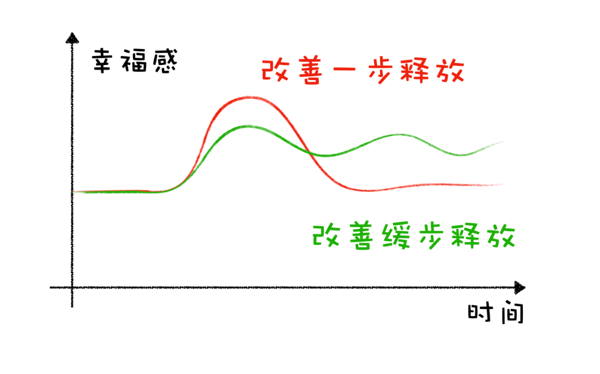

# 嘿，我又悟出来一个快乐凭空产生的新思路

**发布时间**: 2021-01-12 05:59:00

**原文链接**: [http://mp.weixin.qq.com/s?__biz=MzUzNjE3NzQ3Nw==&mid=2247487572&idx=1&sn=12096b40525018dae60e4cb48447e1cf&chksm=fafb6e7ecd8ce768c586c16493600768a9ed1c5d5f49f5f0c2257db3a291fe9ccd20dcba9f5d#rd](http://mp.weixin.qq.com/s?__biz=MzUzNjE3NzQ3Nw==&mid=2247487572&idx=1&sn=12096b40525018dae60e4cb48447e1cf&chksm=fafb6e7ecd8ce768c586c16493600768a9ed1c5d5f49f5f0c2257db3a291fe9ccd20dcba9f5d#rd)

---

最近在看一本书叫《洞见》，英文直译叫“佛学为什么是真的”。不过大伙别被名字吓到哈，我不是来跟大伙聊佛学的。

作者原本是研究进化心理学领域的，这里面谈到了一些心理方面的东西，比如我们为什么会开心、为什么会焦虑，很实用。**被启发了一个可行的、快乐凭空产生的新思路，而且还有心理学基础。**

有个现象估计你们都或多或少注意到了——快乐总难持续，我们永不满足。

比如我们涨了工资，开始几个月会很兴奋，但很快又会趋于平淡，然后等待下一次加薪。

比如赚了 100 万，开始会非常满足，但很快又会得考虑怎么赚到 1000 万。

这些都是写在我们基因中的（太坏了），进化心理学揭示了关于快乐的三个真相：

  1. 实现目标能够带来快乐；

  2. 快乐不能持久；

  3. 我们渴望快乐。

  

放在一起我们可以理解为，**幸福快乐来自于当前生活改善的过程，不断实现一系列小目标，而不是当前的绝对生活水平** 。

  

收入虽低、但一直持续增长、储蓄不断增加的小伙伴，很可能比收入高很多但不断下降的小伙伴更容易幸福。

“过上 XX 生活就能开开心心”，现实是这样的生活不存在。

……

刚刚看到这部分时我觉得挺颓然的，经过基因这么设计，我不成了妥妥的工具人嘛？为了所谓的快乐必须拼命往上爬，更讽刺的是可能反而因此更不快乐。

但我后来想到个东西。

不知道你们有没有听说过一类药叫「缓释胶囊」，就是降低药物的代谢速度，延长作用时间，疗效更好。

这个概念我们可以搬过来呀。「缓释」操作用在花钱和财务自由这个问题上。

既然生活改善带来的快乐不能持久，得持续改善才行。那我能不能像缓释胶囊一样，把改善缓慢释放，一次放一点、然后一直快乐呢？

我画了张图，两条线分别代表一次释放和缓慢释放的快乐 👇

我和也太去年曾经一起瞎想过一把，财务自由达成后的生活怎么一步步改善生活最合理？钱花在什么地方效率最高？

我们后来形成了一致的结论：

  * 先释放自由，专心感受自己决定节奏的生活。预算上则注意一些，还是保持财务自由努力过程的低开支节奏；

  * 等大半年过去，自由生活成为习惯，作为俩吃货再释放一部分餐饮预算，又能开心小半年；

  * 然后就是各种生活上的安排，一步一步来……

简而言之就是**手里有牌，但不一次性打完，一波一波慢慢来。** 等到牌打得差不多了，生活一定又会有了新的变化等待我们探索。

这样一来不就避免了财务自由“可能只管半年”的尴尬，快乐又凭空产生了。

没想到现在居然刚好用上了，找到了理论基础。

……

不仅仅是对财务自由，就是日常生活这个思路能用的地方也同样很多。

当我们升职加薪可以应付更高消费的时候，保持预算缓步增长，会不会带来的幸福感比一次到位更持久？

当我们置办新家的时候，在不影响生活的前提下，享受性的物件一样一样置办，感受家里越来越舒服的这个过程，会不会比一次性买齐更开心？

小伙伴们的生活一定是会不断进步的，会积累更多财富、会有越来越足的选择底气。**面对惊喜、面对进步，在行动上我们也许可以考虑慢几步。** 把一次改善拆成几次缓慢释放，获得的幸福反而会更多。

进化心理学说了，带来幸福的不是绝对的生活水平，而是生活不断改善的过程，也就是当下。别把手里的牌一次性打光，慢慢来。每天前进一小步，一样可以很开心。（而且还能攒下更多本金，快乐又翻倍了～）

  * 财务自由：[我的财务自由实证](http://mp.weixin.qq.com/s?__biz=MzUzNjE3NzQ3Nw==&mid=2247487384&idx=1&sn=954614701f36f81fcc451789428a3c9f&chksm=fafb71b2cd8cf8a4f8cbe6322ee2007c9da379a9243eb1dff9b61d287dc0d1d1facb52ebb476&scene=21#wechat_redirect)

  * 投资实盘：[十年之约](http://mp.weixin.qq.com/s?__biz=MzUzNjE3NzQ3Nw==&mid=2247487547&idx=1&sn=0034f4608a935b280fa2ed305c03d393&chksm=fafb6e11cd8ce7073def3eb0fc42a8bda6b79e823f74c38466f4fe7a0af0ea2e12c19117a9f5&scene=21#wechat_redirect)

  * 抵御风险：[12 月保险方案参考](http://mp.weixin.qq.com/s?__biz=MzUzNjE3NzQ3Nw==&mid=2247487422&idx=1&sn=b0df31c289e7df85deb4322324034d11&chksm=fafb7194cd8cf88241afef3a0eb51a4f073dd9526a9ee1f2e4f374a131b54dd6a0a1782ac027&scene=21#wechat_redirect)

  * 干货汇总：[一文打包三年干货（第三版）](http://mp.weixin.qq.com/s?__biz=MzUzNjE3NzQ3Nw==&mid=2247487328&idx=1&sn=333c62100747204ee4148273c7e7a70a&chksm=fafb714acd8cf85c4405c09f7dacdbc4d5f6dd936de41e626c29e7e8da6789659ca81b6cf379&scene=21#wechat_redirect)