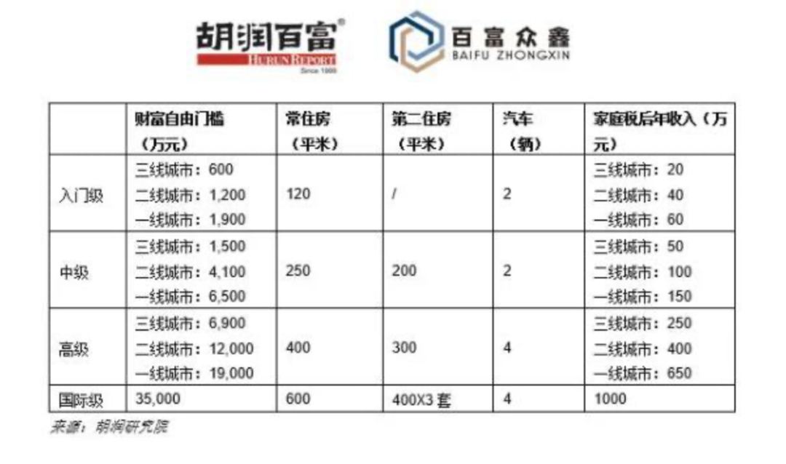

# 胡润说财务自由得 1900 万，但我觉得用不了这么多

**发布时间**: 2021-04-02 06:59:00

**原文链接**: [http://mp.weixin.qq.com/s?__biz=MzUzNjE3NzQ3Nw==&mid=2247488134&idx=1&sn=24296c1d2e0e93f853bcb9b260258e49&chksm=fafb6caccd8ce5ba4a4cd87bb07f39ed25fc521be8fa8ecbf1093ceb5bd95612b31087a5e19d#rd](http://mp.weixin.qq.com/s?__biz=MzUzNjE3NzQ3Nw==&mid=2247488134&idx=1&sn=24296c1d2e0e93f853bcb9b260258e49&chksm=fafb6caccd8ce5ba4a4cd87bb07f39ed25fc521be8fa8ecbf1093ceb5bd95612b31087a5e19d#rd)

---

本来今天应该发 3 月实证数据的，其实我都已经写完了。但赶上胡润更新「2021 年财务自由门槛」，很多伙伴都在问。这个话题比我的实证数字有意义，所以临时“插播”一篇，第 #25 期实证下周再发（偏不告诉你们我上个月亏了多少钱 

下面这张图是胡润计算的 2021 财务自由门槛：

具体数字我先不评价，给大家讲两个我写作这 4 年，遇到印象很深的两位伙伴：

第一位小伙伴：每次和他聊起来都能感受到无边焦虑，聊的都是理财如何不踏实，不知道什么时候就会亏回去；不喜欢现在的工作但不知道自己想做什么；生活到处要用钱，养娃就是无底洞，一刻都不敢懈怠。

第二位小伙伴：完全的反面，都是讲自己理财以后心态如何变好，“不再焦虑自己的工资涨不涨、父母生病、自己养老这些琐事儿”。有更多精力去学习和尝试，发现更多生活的乐趣。

大家觉得哪个小伙伴更接近「财务自由」这个结果呢？

**我觉得后者。**

**但根据“财富自由门槛”的说法，应该是前者。** 因为充满焦虑的第一位小伙伴光本金就有 8 位数，这还没算房子和车子。而生活淡定的第二位小伙伴才刚刚开始自己的财务计划（具体有多少钱我没问，但从刚刚开始自己的财务计划来看，数量级应该远小于前者）。

所以我不仅要问，财富真的能衡量自由吗？

……

我不是给大家灌「你有钱但你不快乐」这种没营养的鸡汤，数据为证，[有钱就是快乐](http://mp.weixin.qq.com/s?__biz=MzUzNjE3NzQ3Nw==&mid=2247487861&idx=1&sn=0bd446b224c7c0333ed70b72e529bcc1&chksm=fafb6f5fcd8ce649eda6e330e22df2c87981ed46fa6cdb844317787e5adeeaa67f0af5adcd18&scene=21#wechat_redirect)。

但我想说，这只是一半的真相。

我自己在财务自由这条路上努力了很多年，真正给生活带来改变的并不是财务自由计划积累下的本金，而是我们在这一路上努力带来的收获。

我有多少收入、有多少钱，这很重要，我们不能用爱发电。

但更有意义的是**我们如何用这笔钱创造一份不论老板发飙、公司倒闭、还是生病住院、股市大跌都能源源不绝的收入** 。这才叫收入的「自由」。

我能花多少钱、过怎样的生活，这也很重要，不然赚钱图个啥。

但更有意义的是**无论别人在买什么、在做什么，我们都知道“我想要什么”，而不是让别人告诉我们“你应该要什么、住什么样的房子、开什么样的车”** 。这才叫消费的「自由」。

胡润总结的这个数据还是有点参考性的，至少它能帮我们衡量「财富」。

但我们不能忘了，「财富自由」，这是四个字。

……

对于真正想要追求财务自由的伙伴们来说，太关注所谓的“财务自由门槛”会让我们走上一条歧途——**觉得自己不自由是因为钱还不够多，只要赚够了 XXX 万所有问题都会自动解决** 。

但现实是反过来的，不是有了自由才能解决问题，而是我们每解决一个问题，离自由就更近一步。而且我们会发现，很多问题其实并不用钱就能解决。

客观的财富自由门槛是不存在的，我也没法告诉大家“你应该有多少钱”。我虽然给自己定了 500 万的财务自由目标，但这是我的目标，不是你的。

> 
> 
> 财务自由计划不是一场比赛，每个人都有自己的节奏和自己的目标。毕竟只有你自己才能为自己的生活负责。
> 
> ——第 18 期财务自由实证

但我非常确定一件事儿，当我们真正走上这条路，开始提升投资水平、探索消费真相，我们会发现自由的门槛比当初想得要低得多。

而对于只管脑补的旁观者来说，财务自由多少钱都是不够的。

  * 财务自由：[我的财务自由实证之路](http://mp.weixin.qq.com/s?__biz=MzUzNjE3NzQ3Nw==&mid=2247487937&idx=1&sn=cc921674f4d0f509f30a5a499035ded2&chksm=fafb6febcd8ce6fd227b19c5d1a3d684da7345a586439fa135467c65408fa41ad80b6e8a5055&scene=21#wechat_redirect)

  * 投资实盘：[十年之约，躺赚不难](http://mp.weixin.qq.com/s?__biz=MzUzNjE3NzQ3Nw==&mid=2247487926&idx=1&sn=0529d358b079746cf711171a631b50b4&chksm=fafb6f9ccd8ce68a6012102a7ecd7450db610b8032e5d473dd7ea96f350a65f198815ae72f5e&scene=21#wechat_redirect)

  * 抵御风险：[3 月保险方案参考](http://mp.weixin.qq.com/s?__biz=MzUzNjE3NzQ3Nw==&mid=2247487994&idx=1&sn=97854e54a511194f8531d3ae3126ea74&chksm=fafb6fd0cd8ce6c67b003888c107b1ee6c3d7f4d1c41d5efd3c61925508f2609a88050b11fa0&scene=21#wechat_redirect)

  * 干货汇总：[一文打包三年干货（第四版）](https://mp.weixin.qq.com/s?__biz=MzUzNjE3NzQ3Nw==&mid=2247488095&idx=1&sn=45424a8e39b9a6c2cc99561a11c35b1c&scene=21#wechat_redirect)