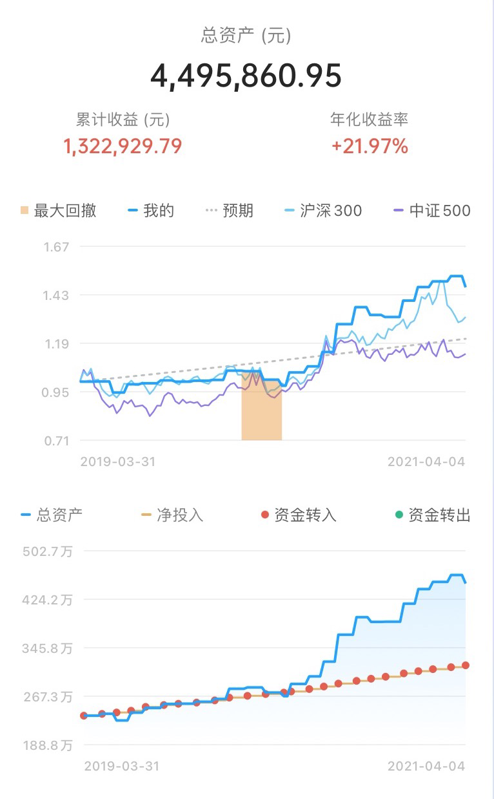
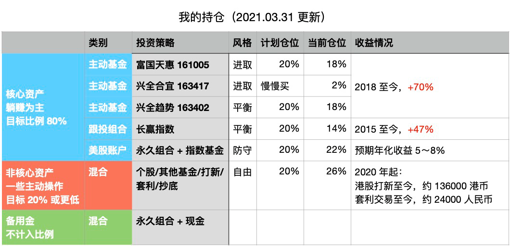

# 财务自由实证 #25 | 头一回，亏出了天上掉馅饼的错觉……

**发布时间**: 2021-04-06 06:59:00

**原文链接**: [http://mp.weixin.qq.com/s?__biz=MzUzNjE3NzQ3Nw==&mid=2247488160&idx=1&sn=4f1a048f6020b95f1ed3da5dfc97be13&chksm=fafb6c8acd8ce59cff4c5516c2f5fdf392a86131666626ecfe78aed2543fe558a4cb42334c5e#rd](http://mp.weixin.qq.com/s?__biz=MzUzNjE3NzQ3Nw==&mid=2247488160&idx=1&sn=4f1a048f6020b95f1ed3da5dfc97be13&chksm=fafb6c8acd8ce59cff4c5516c2f5fdf392a86131666626ecfe78aed2543fe558a4cb42334c5e#rd)

---

财务自由一直是我个人优先级最高的财务目标，从懵懵懂懂到制定具体的财务计划，再到如今渐渐靠近终点，已经走了五六年。

为了能够更加透明、中立地证实普通人财务自由的可能性，从 2019 年开始我决定公开自己的财务进度，成为这个系列内容——财务自由实证。

我的目标——工资理财实现财务自由。**不追求大富大贵，但求能够不再纠结生计这些琐碎问题，在重大选择面前获得更多的人生选项，不再瞻前顾后****。**

有兴趣参考这个实证的朋友建议先看看之前的引导篇，[制定你自己的财务自由计划](https://mp.weixin.qq.com/s?__biz=MzUzNjE3NzQ3Nw==&mid=2247484500&idx=1&sn=c04c3de1a1231bef25bb4cda773c00ff&scene=21#wechat_redirect)、[和我一起财务自由](https://mp.weixin.qq.com/s?__biz=MzUzNjE3NzQ3Nw==&mid=2247484480&idx=1&sn=258e8dd4976c7d3c324ed89b90904d14&scene=21#wechat_redirect)。这里还有两个资源对于大家理解实证会有很大帮助。

  * [一文打包三年干货](http://mp.weixin.qq.com/s?__biz=MzUzNjE3NzQ3Nw==&mid=2247488095&idx=1&sn=45424a8e39b9a6c2cc99561a11c35b1c&chksm=fafb6c75cd8ce563f01eec601299a9f0db2e2d3d93ed0d9bc9ec6da5193751b4aa727ffa453f&scene=21#wechat_redirect)

  * [我的第一本书，整理财务自由方法论](https://mp.weixin.qq.com/s?__biz=MzUzNjE3NzQ3Nw==&mid=2247486809&idx=1&sn=8a80c493837ee044c5d55e0a423507d2&scene=21#wechat_redirect)

  * [我的一篇干货访谈](http://mp.weixin.qq.com/s?__biz=MzUzNjE3NzQ3Nw==&mid=2247487473&idx=1&sn=10a891429291e78dea82b4df34e773f3&chksm=fafb71dbcd8cf8cdb15f114d6637bc6476a2803f9f0803dcbb4d91c1e68b5cc706c3dc55358b&scene=21#wechat_redirect)

**我给自己定下的目标是 30 岁前积累 500 万人民币金融资产，**  根据资本市场的历史收益情况，这笔钱对我来说大致可以每年产生 50 万的“睡后收入”，足够支撑我选择自己想要但收入也许没那么稳定的理想生活。（大家可以参考我的思考和感悟，但不一定要参考“我”的目标，要找到“你”的目标）

### 计划进度

当前财务自由计划完成度 89.92%（当前资产 ÷ 目标资产），相比于上个月减少 3 个百分点。

我的本轮计划开始于 2017 年，从 2019 年 4 月开始公开实证。实证以前的本金 + 收益共同作为初始本金记录，实证开始后截至目前累计收益率 46.68%，年化收益率 21.97%，浮盈 132 万。

（投资收益的记录工具说明[在这](http://mp.weixin.qq.com/s?__biz=MzUzNjE3NzQ3Nw==&mid=2247487794&idx=1&sn=b9db83140ef56b777315a5e415954736&chksm=fafb6f18cd8ce60eeebe855dcd793f173a5589e51657877fb9e8a2fff629eeb17688a40e2766&scene=21#wechat_redirect)）

### 预算及储蓄

「因上努力，果上随缘」，收益是「果」，**主业努力多赚钱、践行预算少浪费、不被短期波动干扰坚持投资才是一切的根源。**

为了保证储蓄率，我们家每年会制定一次家庭年度预算，2021 年度依然沿用 2019、2020 年的预算计划，每个月 2100 欧元的预算。预算节余或者超支会累加到下个月的预算中。

> 财富积累就是把宏大的目标拆成可执行的每个小目标，财务自由始于最初简单的预算制定和储蓄。

这个预算和开支图包括了我们生活中**  除了下面备注部分提到的一次性大额开销外的每一笔开支，也包括旅行、医疗和意外开支等等**。下图是我们的具体预算分配，也会根据实际情况进行调整，但是总额上限 2100 欧元是固定不动的。

2019 年 3 月实证至今没有计入预算的部分：

  * 2021 年 2 月春节公众号发给大家的红包；

  * 2021 年我们会买房，首付、中介费、税费这些也不会算进来，但是杂费和月供会全部算进预算。

### 愿望清单

[愿望清单](https://mp.weixin.qq.com/s?__biz=MzUzNjE3NzQ3Nw==&mid=2247484651&idx=1&sn=ab38b1ea6008b5bb1b9148c43f3f315f&scene=21#wechat_redirect)和[“致命三问”](https://mp.weixin.qq.com/s?__biz=MzUzNjE3NzQ3Nw==&mid=2247486379&idx=1&sn=d4ee2278fb3b81100b2857259cdf3bee&scene=21#wechat_redirect)是我非常喜欢的两个工具。想买一个东西先不要急着剁手，放进愿望清单里缓冲一下，思考优先级，再根据预算行动。

可以砍掉不少无用的消费，并给真正需要或者喜欢的东西留下了更多的预算，改善生活的同时，反而降低了总开销。**这两个工具的目标不是为了尽可能少花钱，而是在不超出预算的前提下，买到自己真正喜欢的东西** 。

我比较推荐的工资到手后的优先级顺序：

  1. 储蓄/投资，先储蓄投资再消费；

  2. 活着，房租水电，基本生活；

  3. 愿望清单里的重要项目；

  4. 其他杂七杂八的。

我的当前愿望清单 👇

### 我的投资组合

继续躺赚，具体大家请看最新一期[十年之约系列](http://mp.weixin.qq.com/s?__biz=MzUzNjE3NzQ3Nw==&mid=2247488125&idx=1&sn=ff30274378ecda929a39a28a03a113ba&chksm=fafb6c57cd8ce5412744701e1c0995a20c24ed2562a4e868693cd5792a3f31d90efc3983bf70&scene=21#wechat_redirect)，更完整一些。

### 数数亏了多少钱

过去这一两个月市场行情真心可以用“鬼哭狼嚎”来形容，好多基金回撤 20% 以上。所以我原本都估计着实证可能得少个 50 万左右，已经做好了心理准备，结果一算数字……

居然“只亏”了 16 万，一瞬间甚至觉得自己赚了

担心算错了，又检查了一遍，确实没毛病。后来又查到了上个月的主动基金收益走势图，才发现问题的关键：

我的实证数据每个月更新一次，避开了市场的最高点和最低点，所以看财务自由实证感受到的市场波动要小很多，主观感觉就是亏得少了。

如果每天看行情这波要看着自己的资产缩水 10%，但假如每个月才看一次行情，才下跌 4%。是不是顺便验证了一个道理——**少看行情更不容易焦虑**

感觉有点好笑。

上次我给大伙分享好朋友卖房子的经历，“赚钱的买卖，卖出了割肉的感觉”。我倒好，因为原先的预期很低，但实际亏损比预期少很多，反而“亏钱亏出了天上掉馅饼的感觉”

**带来痛苦的不是现实如何，而是现实与预期的差距** ，看来学点心理学还是有用的，管理好预期很重要～

……

说到「预期」，想到之前看过不少兴全合宜基金经理谢治宇的访谈，他喜欢反复强调一个词——合理的回报预期。

我看过很多遍，但最近才想明白，我们很多人可能低估了这个词真正的信息量。

平时常跟大伙说，我对投资收益的预期是年化 10%，这个预期是合理的，但「合理的回报预期」远不止一个数字这么简单。

财务自由实证写到现在刚好两年，大伙对实证的看法在第一年和第二年很不一样：

  * 第一年我经常收到的留言是「不是说预期年化 10% 吗？怎么看你 1 年了也没赚啥钱？」

  * 第二年的留言就变成了「怎么回事，记得刚刚开始的时候才 200 多万，“突然”就变成了 400 多万？有什么秘密？」

**会有这类疑问往往都是在投资的预期上出了问题** 。给大家举两个 10% 年化收益背后的例子：

1、假如前 3 年市场跌了 30%，那么后面两年市场怎么走才刚好 5 年年化 10% 呢？

答案是，如果后两年**涨 130%** ，刚好年化 10%。

所以如果市场在短短一年中翻倍，我不会感到意外。虽然 130% 和 10% 这个数字看起来差别很大，但它们是一回事儿。

2、那假如前 3 年市场涨了 90%，那么后面两年市场怎么走才能刚好 5 年年化 10% 呢？

答案是，后面两年下**跌 15%** ，刚好年化 10%。

所以如果市场在一段时间里波澜不惊，我也会觉得可以接受。

……

「合理的收益预期」并不是死盯着一个长期收益的数字，比如 10%，**还包括根据过去的行情反向校准自己的心态** 。

过去几年市场的实际收益越差，对于未来的收益预期越要调高；市场的实际收益越好，我们越要降低未来的预期。

放在一起，才是合理的。

（再提醒一下，管理自己的预期，但不要预测市场，这很重要）

  * 财务自由：[我的财务自由实证之路](http://mp.weixin.qq.com/s?__biz=MzUzNjE3NzQ3Nw==&mid=2247487937&idx=1&sn=cc921674f4d0f509f30a5a499035ded2&chksm=fafb6febcd8ce6fd227b19c5d1a3d684da7345a586439fa135467c65408fa41ad80b6e8a5055&scene=21#wechat_redirect)

  * 投资实盘：[十年之约，躺赚不难](http://mp.weixin.qq.com/s?__biz=MzUzNjE3NzQ3Nw==&mid=2247488125&idx=1&sn=ff30274378ecda929a39a28a03a113ba&chksm=fafb6c57cd8ce5412744701e1c0995a20c24ed2562a4e868693cd5792a3f31d90efc3983bf70&scene=21#wechat_redirect)

  * 抵御风险：[3 月保险方案参考](http://mp.weixin.qq.com/s?__biz=MzUzNjE3NzQ3Nw==&mid=2247487994&idx=1&sn=97854e54a511194f8531d3ae3126ea74&chksm=fafb6fd0cd8ce6c67b003888c107b1ee6c3d7f4d1c41d5efd3c61925508f2609a88050b11fa0&scene=21#wechat_redirect)

  * 干货汇总：[一文打包三年干货（第四版）](https://mp.weixin.qq.com/s?__biz=MzUzNjE3NzQ3Nw==&mid=2247488095&idx=1&sn=45424a8e39b9a6c2cc99561a11c35b1c&scene=21#wechat_redirect)