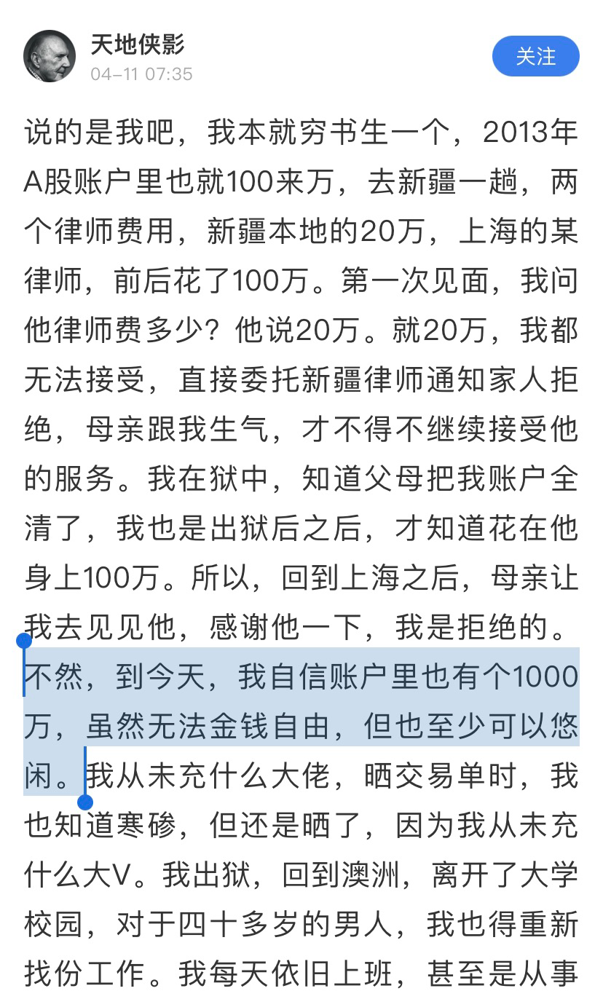
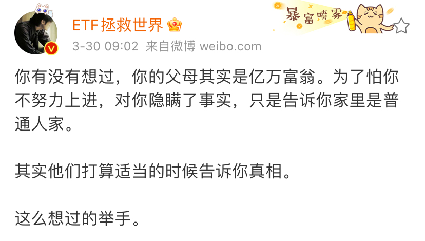

# 当年的第一笔本金

**发布时间**: 2021-04-14 07:00:00

**原文链接**: [http://mp.weixin.qq.com/s?__biz=MzUzNjE3NzQ3Nw==&mid=2247488208&idx=1&sn=a0b6cc3af73a5b4f32502d6067497a35&chksm=fafb6cfacd8ce5ec1052fa887c21460da4e2da971d28245c3b5e8ff7474771d86988bf1b96e5#rd](http://mp.weixin.qq.com/s?__biz=MzUzNjE3NzQ3Nw==&mid=2247488208&idx=1&sn=a0b6cc3af73a5b4f32502d6067497a35&chksm=fafb6cfacd8ce5ec1052fa887c21460da4e2da971d28245c3b5e8ff7474771d86988bf1b96e5#rd)

---

刷雪球的时候看到一篇天地侠影发的帖子。

科普一下背景，天地侠影第一次出名是因为质疑上市公司财务造假，后来吃了官司被关了 1 年半。第二次出名是最近又质疑牧原股份财务造假，又火了一把……

不过我读的这篇帖子讲的不是分析财务问题，而是回顾当时的亲身经历和选择：

总结起来就是：

  * 天地侠影本人觉得律师费太贵，想算了，这样至少钱还留着。

  * 但家人不干，不顾一切也要帮他，把股票全卖了找律师。

最后看守所没少蹲，钱也没剩下。当时是 2013 年，后来 A 股走出 3 次行情，一大两小，赚 10 倍看缘分，但赚 5 倍一点不夸张。好好的一笔本金就这么给霍霍没了

看完好堵得慌…… 然后我又想到了两个领域的事儿

……

第一个，是医疗。

假如不幸身患绝症，有两种治疗方案：

  * A：保守治疗，像往常一样生活，享受最后的时光，接受生命终结；

  * B：不顾一切地投入，虽然治疗过程很痛苦、会花很多钱，但生命可以延长几个月。

如果病人自己愿意选 A，有多少病人的家属会尊重他的选择，而不是替他决定 B 呢？**很多痛苦不是病人不能接受，而是家人不肯放手。**

……

第二个，是教育。

前两天我听了一篇播客，讲第一批被鸡的娃长大成人了，他们怎么看待成长的经历。

那篇播客没有讲到钱的角度，但我听完就在想，**等这些孩子后面进入社会、开始对金钱有了概念，再回头算算过去这些年自己身上投入的财富，他们会怎么看待这个选择呢？**

我不是当事人，没法回答这个问题，也不能评定对错。但我觉得这可以成为一个更加理性的角度。

之前看过方丈关于教育的看法——**在教育上不计后果地投入，本质上不是孩子自己的需求，而是为了缓解家长的焦虑** 。

……

我自己对教育有三个看法：

  1. 教育的不确定性很大，常常会像天地侠影的律师费一样，投入巨大，但并不能改变什么；

  2. 即使只是最普通的教育，只要孩子积极、乐观、健康，一样也能过得很好、很幸福；

  3. 如果一笔钱不花出去，而是积累下来投资，我很确定 20 年后这是一笔巨大的财富。

所以我宁可这么选：**只要保证孩子 不要因为家庭原因变成问题儿童，能健健康康地成为普通人，就算是教育成功了。余下的资源我更倾向直接传承财务，而不是去拼教育。**

讲一段我自己的经历吧，其实我就是这么长大的。

我爸妈的教育理念一向是健康快乐比天大，其他顺其自然就好了。

小升初，当地三所初中，爸妈和我讨论后选了排第三的（“排第三”比“倒第一”好听点

）。因为离家近，走路 5 分钟，每天中午还能回家吃饭。

上学期间，不只是别的家长，连班主任都经常打电话到家里，建议家人让我去上各种补习班。但家人一直拒绝，到最后班主任甚至阴阳怪气地挤兑我妈「哎呀，你家理念太“优秀”了，咱也教不了呀……」

所以我们家一直是比较另类的，在教育上没多花什么钱。

倒也不是爸妈不舍得花，而是他们总会问我，问我想要什么，然后尊重我的意见（但攀比不行，一票否决）。小孩真心想要的东西往往花不了多少钱，昂贵的是大人的欲望。

小时候我妈经常说「你帮家里省了“老鼻子”钱了（就是非常多的意思），将来这些都给你」。

**后来这些钱变成了我大学期间接触投资的第一笔本金，连带着收益一起成为财务自由之路的起点。**

其实这笔钱就金额来讲倒是没多少，工作以后我们三五年也攒得出来，但重要的是这笔钱出现的时间——让我有机会在开始工作“人生钱”之前体会到“钱生钱”的意义。

所以我和也太开始工作赚到的第一笔收入就选择了投资，而不是消费。假如我先习惯了工作花钱的生活，想要再回来省钱、储蓄、财务自由，难度就要大得多了。

……

分享这段我自己的经历倒不是为了说服大家什么，只是作为一个不同的角度——**不参加鸡娃内卷，未必就没有出路。**

要我选的话，我决定往 👇 这个方向努力一下，当这种父母

天地侠影的官司、孩子的教育和家人的医疗，在我看来本质上是同一种冲突——当事人的真实需求 vs 家人的心理焦虑。

我们之所以不喜欢「我是为你好」，是因为这常常不是我们当事人真正的需求，只是缓解家人自己的焦虑而已。

那么当有一天我们成为别人的家人时，也许就要多想一步，**我为别人做的这个选择，到底是 ta 的真实需求，还是我自己的焦虑呢？**

这个思考也许不能解释「第一笔本金」是怎么来的，但能解释很多应有的「第一笔本金」是怎么没的。

  * 财务自由：[我的财务自由实证之路](http://mp.weixin.qq.com/s?__biz=MzUzNjE3NzQ3Nw==&mid=2247487937&idx=1&sn=cc921674f4d0f509f30a5a499035ded2&chksm=fafb6febcd8ce6fd227b19c5d1a3d684da7345a586439fa135467c65408fa41ad80b6e8a5055&scene=21#wechat_redirect)

  * 投资实盘：[十年之约，躺赚不难](http://mp.weixin.qq.com/s?__biz=MzUzNjE3NzQ3Nw==&mid=2247488125&idx=1&sn=ff30274378ecda929a39a28a03a113ba&chksm=fafb6c57cd8ce5412744701e1c0995a20c24ed2562a4e868693cd5792a3f31d90efc3983bf70&scene=21#wechat_redirect)

  * 抵御风险：[3 月保险方案参考](http://mp.weixin.qq.com/s?__biz=MzUzNjE3NzQ3Nw==&mid=2247487994&idx=1&sn=97854e54a511194f8531d3ae3126ea74&chksm=fafb6fd0cd8ce6c67b003888c107b1ee6c3d7f4d1c41d5efd3c61925508f2609a88050b11fa0&scene=21#wechat_redirect)

  * 干货汇总：[一文打包三年干货（第四版）](https://mp.weixin.qq.com/s?__biz=MzUzNjE3NzQ3Nw==&mid=2247488095&idx=1&sn=45424a8e39b9a6c2cc99561a11c35b1c&scene=21#wechat_redirect)