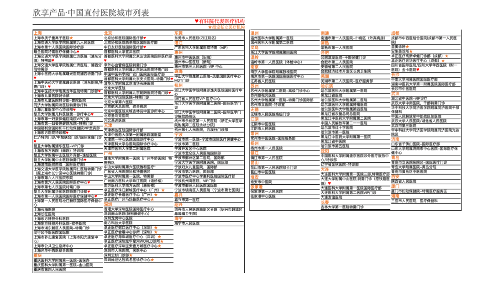

# 自从经历过生病住院，我一直在琢磨这俩事儿

**发布时间**: 2021-04-16 06:58:39

**原文链接**: [http://mp.weixin.qq.com/s?__biz=MzUzNjE3NzQ3Nw==&mid=2247488225&idx=1&sn=e648a31f4b01d60a41fab46fcc3fbd5b&chksm=fafb6ccbcd8ce5dd0a375ebdbc15f1bccb361435117426dda9437cea96e3ddaa2d1bf0a1e4d0#rd](http://mp.weixin.qq.com/s?__biz=MzUzNjE3NzQ3Nw==&mid=2247488225&idx=1&sn=e648a31f4b01d60a41fab46fcc3fbd5b&chksm=fafb6ccbcd8ce5dd0a375ebdbc15f1bccb361435117426dda9437cea96e3ddaa2d1bf0a1e4d0#rd)

---

自从上回阑尾炎住院我一直在琢磨个事儿。我是个挺能折腾的人，又比较惜命，平时读健康和医疗方面的内容总会感觉自己好像哪哪都有病，所以有事儿、没事儿常在医生那报到。

但以前看医生的时候常常就算有家人、朋友陪同，也会觉得很烦。这次生病，住院 3 天全程就我一个人，因为新冠控制也太连医院大门都没进去，却一点没觉得焦虑，最后还写了一份「[探店体验](http://mp.weixin.qq.com/s?__biz=MzUzNjE3NzQ3Nw==&mid=2247488057&idx=1&sn=4b674d59c8ac2883cd6c26c54b57ebe4&chksm=fafb6c13cd8ce5053b3d6c6e026bb765f49985fa9d47bf6ceaae3d061cd249d36bcc68385572&scene=21#wechat_redirect)」。

所以我就在琢磨，相比于之前，是哪些改变促成了我心态的这些变化。

……

住院期间正好有个小伙伴问过我关于财务自由的心态问题：

> 他攒够了 500 万，还有房，生活开销也蛮低的。但是总觉得心虚，觉得被动收入不稳定，问我有没有类似的恐惧。

当时正好在医院里，就拿住院的情况作了对比：

上班收入虽然稳定，但并不安全。比如生病住院，假如一住就是一两个月，上班的收入很可能就不稳定了，说没就没。

但反过来投资收入虽然不稳定，行情好收益多，行情差可能还要赔点。但投资收益反而是最安全的，不管我人在哪、在干啥，都不会影响到长期的被动收入。

想明白了就会发现，这反而是普通人能接触到的最安全的收入。

后来我就在想，貌似整个住院期间都没有被收入问题困扰过，就是专心配合医生治疗，才能把住院当做一次短暂的休假。

**也许是财务自由潜移默化改变了我对收入的看法，越来越能放下收入的焦虑。**

……

还有另一个因素我猜测影响更大——**整个住院期间我没有被要求做过选择** 。

德国这边的看病惯例是按照你保险的承担范围安排治疗（全民强制医保），除非保险不管或者你主动要求，一般不会再额外问。

所以看病几乎没有选择题。

假如医生给我来一遍：「你想住单人间还是多人病房，分别价格是……」「手术分普通和微创，价格分别是……」「我们医院有营养配餐，A、B、C、D 几个套餐……」

在当时生病那个状态下，医生要是给我来这么一串问题，没准我也分分钟就懵逼了。做选择往往是最磨人的。

而从头到尾就是医生给我安排应该干什么，解释手术流程，讲医院管饭，我就只要配合着「嗯嗯嗯」，就好了，就很淡定。

然后我就突然想到，**是好像就是自助餐的同款快乐嘛** 。交一次钱，后面只管吃就行了

碰巧真人体验了一回「**保险直付** 」：

> 医院与保险公司合作，入院直接确定你的保险覆盖范围、安排治疗，出院后医院和保险公司结算。病人只管平时交保费，后续基本不再操心。

是不是还挺像医疗自助餐的？

……

后来我就在琢磨着，国内现在保险直付服务大概能做到什么程度。毕竟爸妈还在国内，我和也太指不定啥时候会回国，算是提前调研 Plan B 了。

特别巧的是，我出院后没几天，在好多平台和作者那里都读到一款中端医疗险「[欣享人生]()」的介绍，讲的也是保险直付。齐欣小伙伴他们也有代理，我拿到了第一手资料，也趁热乎研究了一下，分享出来供大伙参考（有经验的小伙伴可以留言区说说，如果我有讲不对的地方麻烦指正）。

国内的保险直付流程一般是这样的：

  1. 入院以前跟医院和保险公司确认，核对保险的具体政策和覆盖范围；

  2. 安排治疗，**最好是入院以前就和保险公司沟通、确认好治疗方案** ；

  3. 出院前签个字，如果有免赔和自付的部分付清，剩下的医院直接和保险公司结算。

很多讲保险直付的文章都是强调不需要先付钱再报销，省事儿。

但经过这一波住院体验，我有点不一样的感触。**我觉得保险直付最大的价值不在于付钱这个过程简单，而在于医院也知道你的保险政策和覆盖范围，可以帮你安排经济上合适的治疗方案，帮我们省去选择的焦虑** 。不用再自己纠结哪个项目能报销、哪个不能，假如不能报销那我怎么办，要花多少钱啥的。

解放选择的焦虑，专心考虑治病，这是我认为保险直付的最大价值。

不过现在保险直付的缺点也挺明显的：

1、贵，支持直付的主要是中高端医疗险。以我为例（28 岁），普通医疗险一年保费几百；中端医疗险，比如[欣享人生]()，可以直付 + 报销公立医院 VIP，保费要上千；高端医疗险，再加上海外医疗，就上万了。

2、目前支持直付的医院有限，每个保险都有具体的名单，大致能覆盖到 3 线城市。我截了一部分欣享人生的覆盖医院供大伙参考，点开放大看（意外发现之前考察的[财务自由备选三线城市](http://mp.weixin.qq.com/s?__biz=MzUzNjE3NzQ3Nw==&mid=2247488045&idx=1&sn=c42b199248d7301f8013bfd39169afbd&chksm=fafb6c07cd8ce511ea771eaa672faf7e7e3addc4694da9e49e6852b5679a795020db3243c92c&scene=21#wechat_redirect)也在里面，三线也可以有好医疗的～）

假如自己所在城市正好有支持直付的合作医院，保费上也承担得起，那这笔钱我觉得还挺值的，看病体验会好很多。

以上就是我的研究，有过相关经历的小伙伴也可以在留言区说说自己的体验～

……

这次住院经历收获了另一个看保险的视角。

以前我对保险的理解就是，生什么病、赔多少钱，性价比最重要。但真经历过一次住院，我发现**保险和财务自由有个很相似的地方，都是解决我们对钱和选择的焦虑** 。只不过财务自由解决对收入的焦虑，而保险解决的是对开销的焦虑。

所以有时候不能只盯着“划算”来看，不能只想着利益最大化，同时也要考虑如何在承受范围内尽可能降低自己的焦虑。

  * 财务自由：[我的财务自由实证之路](http://mp.weixin.qq.com/s?__biz=MzUzNjE3NzQ3Nw==&mid=2247487937&idx=1&sn=cc921674f4d0f509f30a5a499035ded2&chksm=fafb6febcd8ce6fd227b19c5d1a3d684da7345a586439fa135467c65408fa41ad80b6e8a5055&scene=21#wechat_redirect)

  * 投资实盘：[十年之约，躺赚不难](http://mp.weixin.qq.com/s?__biz=MzUzNjE3NzQ3Nw==&mid=2247488125&idx=1&sn=ff30274378ecda929a39a28a03a113ba&chksm=fafb6c57cd8ce5412744701e1c0995a20c24ed2562a4e868693cd5792a3f31d90efc3983bf70&scene=21#wechat_redirect)

  * 抵御风险：[3 月保险方案参考](http://mp.weixin.qq.com/s?__biz=MzUzNjE3NzQ3Nw==&mid=2247487994&idx=1&sn=97854e54a511194f8531d3ae3126ea74&chksm=fafb6fd0cd8ce6c67b003888c107b1ee6c3d7f4d1c41d5efd3c61925508f2609a88050b11fa0&scene=21#wechat_redirect)

  * 干货汇总：[一文打包三年干货（第四版）](https://mp.weixin.qq.com/s?__biz=MzUzNjE3NzQ3Nw==&mid=2247488095&idx=1&sn=45424a8e39b9a6c2cc99561a11c35b1c&scene=21#wechat_redirect)