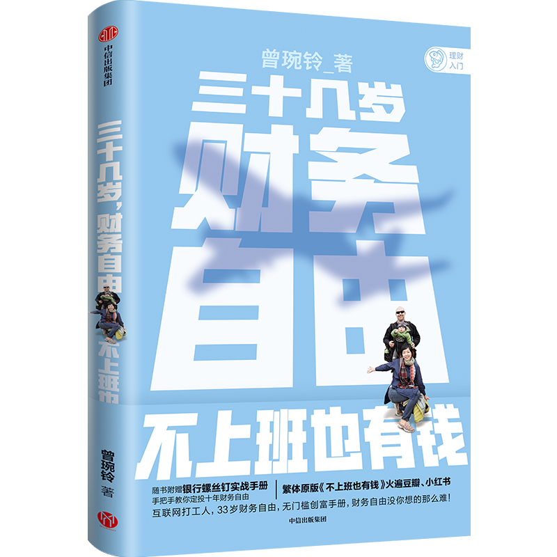

# 跟大伙说个特别开心的事儿

**发布时间**: 2021-04-19 06:58:39

**原文链接**: [http://mp.weixin.qq.com/s?__biz=MzUzNjE3NzQ3Nw==&mid=2247488239&idx=1&sn=ac80da35bab1e5e657b0056f9e597745&chksm=fafb6cc5cd8ce5d3afad63d8dab3f6c62fbb02d8e3c34e0fa37b000b462e1eb91547ed905e31#rd](http://mp.weixin.qq.com/s?__biz=MzUzNjE3NzQ3Nw==&mid=2247488239&idx=1&sn=ac80da35bab1e5e657b0056f9e597745&chksm=fafb6cc5cd8ce5d3afad63d8dab3f6c62fbb02d8e3c34e0fa37b000b462e1eb91547ed905e31#rd)

---

财务自由领域有一本书我从 2 年前就在和大家推荐了——《不上班，也有钱》——好奇后台搜了一下，居然已经累积推荐了 12 次 

最近这本书的简体中文版终于上了，我还有幸给这本书写了推荐语，印在这本书的封底上。简体中文版封面和封底长这样：

好开心，也算是我对奋斗在财务自由路上同行伙伴们的一点贡献吧～

……

作者是比较早期的财务自由践行者了，**和她老公一起努力 10 年实现了财务自由，然后开始环球之旅。后来他俩生了娃，带着娃接着环球旅行** （再后来貌似还生了二胎，看来第一个体验不错哈……）

这本书从他们刚刚毕业、债务缠身的状态开始写，一直写到他们自由后有了第一个娃，带着小 baby 继续环球旅行的经历，非常经典的财务自由故事。

除了他们努力实现财务自由的点滴，我最喜欢他们**经历 08 年美国经济危机时的感悟** （来自繁体版，简体版可能会有略微不同）：

投资一定有风险，从开始投资到现在，我和老 J（作者老公）经历了好几次所谓的股灾。中国股灾、全球股灾、台湾股灾…… 总是每几年就会来一次，每次新闻都会不断地播放股市崩盘的可怕消息。

我们家 99% 的退休金都放在美股 ETF，所以只要指数暴跌，光账目就会损失我们一家 4～5 年的生活费。遇到这么紧急的状况怎么办？当然要马上处理！

我们的处理方式是：关掉电视，饭照吃，觉照睡。

我们被股灾吓了好几次，偶尔会损失几万美元，遇到大事件更是一晚上 10 万美元就不见了。

但是，他们终究会慢慢回来…… 这些指数包含的公司，依旧在做研发、依旧有新品上市，依旧有利润、依旧会发股息。

当股市再度疯狂下跌的时候，我们唯一的改变就是把手上多余的现金，趁便宜再多买一些。下次你们听到身旁的人都喊着「股灾」的时候（尤其是连平常都不讨论投资的朋友们也在讨论的时候），或许就是认真考虑捡便宜的好时机。

……

这段我在去年 3 月份疫情爆发的时候提过一次。没想到一年过去了，放在现在还是一点都不违和，妥妥地好内容穿越时间～

不过之前也有小伙伴和我提过，说他们的投资也太简单了吧？就买指数基金，就这？

我们确实不能直接照搬他们的投资方法。美股是个非常高效的市场，指数基金买入并持有，这已经是个人最好的投资方法，很难有其他投资稳定超越指数基金的回报。

在国内并不是这样。指数基金买入并持有，更合适没有太多投资经验的新手阶段。但在此基础上也有很多放大收益的方法，比如指数基金参考估值低买高卖，或者换成比较靠谱的主动基金长期持有，收益可以更进一步。

但是**方法有区别，投资背后的心态和认知是共同的，并没有什么区别** 。很多时候投资就是很简单的，我自己的投资其实也只是换成了「就买主动基金？就这？」

……

我也遇到过一些小伙伴读完以后得出一个结论——他们能财务自由都是因为他们有 XX 优势，而我没有这些……

确实，每个人的方法必然都有独特但不适合他人学习的地方，比如不是每个人都愿意像作者一样为了省钱自己种菜，也不是每个人的目标都是环游世界。

我们不可能完全照搬别人的选择，因为这是人家的生活。

更值得参考的是作者做出种种选择的原因——**什么事是别人觉得重要的，什么才是我自己发自内心在乎的** 。

多关注他们如何思考，如何面对生活中的抉择，如何为了自己的财务自由目标做取舍，往往更能给我们启发。别忘了，我们每个人也都拥有某项作者不曾拥有的优势。

《不上班，也有钱》再次推荐给大家，这次所有书店都买得到的了～

另外，中信小伙伴还帮我们申请到了全网最低的 4.8 折折扣，有效期到 4 月 30 日，喜欢纸质书的小伙伴们戳这个二维码可以跳转 👇

  * 财务自由：[我的财务自由实证之路](http://mp.weixin.qq.com/s?__biz=MzUzNjE3NzQ3Nw==&mid=2247487937&idx=1&sn=cc921674f4d0f509f30a5a499035ded2&chksm=fafb6febcd8ce6fd227b19c5d1a3d684da7345a586439fa135467c65408fa41ad80b6e8a5055&scene=21#wechat_redirect)

  * 投资实盘：[十年之约，躺赚不难](http://mp.weixin.qq.com/s?__biz=MzUzNjE3NzQ3Nw==&mid=2247488125&idx=1&sn=ff30274378ecda929a39a28a03a113ba&chksm=fafb6c57cd8ce5412744701e1c0995a20c24ed2562a4e868693cd5792a3f31d90efc3983bf70&scene=21#wechat_redirect)

  * 抵御风险：[3 月保险方案参考](http://mp.weixin.qq.com/s?__biz=MzUzNjE3NzQ3Nw==&mid=2247487994&idx=1&sn=97854e54a511194f8531d3ae3126ea74&chksm=fafb6fd0cd8ce6c67b003888c107b1ee6c3d7f4d1c41d5efd3c61925508f2609a88050b11fa0&scene=21#wechat_redirect)

  * 干货汇总：[一文打包三年干货（第四版）](https://mp.weixin.qq.com/s?__biz=MzUzNjE3NzQ3Nw==&mid=2247488095&idx=1&sn=45424a8e39b9a6c2cc99561a11c35b1c&scene=21#wechat_redirect)