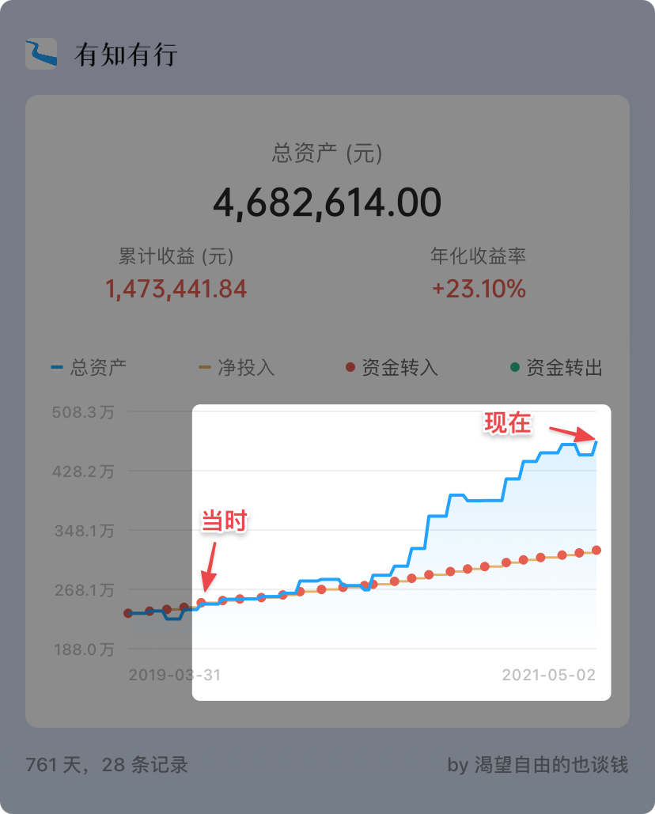

# 深夜回访，感慨万千

**发布时间**: 2021-05-06 06:59:00

**原文链接**: [http://mp.weixin.qq.com/s?__biz=MzUzNjE3NzQ3Nw==&mid=2247488369&idx=1&sn=a17ecd214b558ada02b2b122f6bce397&chksm=fafb6d5bcd8ce44d6dcaec537dec6c3a0224fdd723ff5f03ca4af36a96a5eb0e6e169f8230a8#rd](http://mp.weixin.qq.com/s?__biz=MzUzNjE3NzQ3Nw==&mid=2247488369&idx=1&sn=a17ecd214b558ada02b2b122f6bce397&chksm=fafb6d5bcd8ce44d6dcaec537dec6c3a0224fdd723ff5f03ca4af36a96a5eb0e6e169f8230a8#rd)

---

经常会有小伙伴从 4 年前的第一篇文章从头翻公众号历史。我在这里记录了自己财务自由的大部分历程，偶尔被点评“像在坐时光机”。

2019 年 8 月的文章，最近收到一条来自“两年后”的回访：

我在最初财务自由实证里做过一次估算：

> 每年存下 30 万，年化收益 10%，十年就能积累到 500 万
> 
> （假如目标是 100 万，就是每年存 5 万；目标是 200 万，就是每年 10 万。同比缩放）

但走到 2019 年那会儿，距离目标日期还有 3 年，实证却还差 250 万。**相当于剩下每年要增长 83 万，这和当初的 30 万储蓄额放在一起显得特别吓人** 。

“还能实现吗？”连也太都这么问我……

我后来做了个任务拆解：

  1. 当前储蓄节奏，3 年能存下 90 万，那 250 万的缺口还剩 160 万；

  2. 160 万看着数字挺大，但相比于当时的 250 万本金，其实就是 60+% 的收益。

所以看起来很难的任务，仔细算下来，只要后面 3 年间能赶上一波行情，达到 60% 左右的收益，目标就差不多了。

……

2 年后的今天大家已经知道结局了（👇 每个红点是一个月）

现在的财务自由进度比当时增长了 220 万，相当于每年 110 万，甚至还比「每年 83 万」还超额完成了目标。

  * 股市行情在 1 年后才来，让我们多积累了一年本金；

  * 行情比预期还要给力一些，很可能现在还没走完；

  * 我们的工作也有了积极的改变，储蓄也相应增加；

  * ……

**很多乍一看可怕的目标，拆解下来其实没那么吓人。**

比如「攒下 100 万」，虽然数字挺大，但拆下来也就是每年储蓄 6 万，坚持投资 10 年，很容易实现。

再比如对当时我们来说吓人的「3 年要赚 250 万」。但拆下来发现，只要保持节奏，等待 60% 的收益，有时候就是一波行情的事儿。

不要被目标的数字吓倒。换个角度，小心拆解，问题很可能没有那么难。

……

关于钱总有种说法「钱是赚出来的，不是省出来的」。

前半句我同意，但我想用自己的经历反驳半句，钱也是省出来的。

当时我的判断现在回头看是正确的——估值不高，行情随时可能到来——这是我「赚到的」钱。

但**假如 2 年前，我有一样的判断、一样的赚钱本事，但没有前面几年努力积累下的 250 万呢** ？

同样的经历，换个起点，资产也就增加个 70～80 万。

但加上这份积累，资产增加 220 万，几乎是 3 倍。这不正是「省出来的」钱嘛。

投资机会固然诱人，赚钱确实很重要，但「机会 x 本金」才是我们最后的收益，如果本金是 0，机会就没有意义。

赚钱和省钱同样重要，当下的省钱，就是未来赚钱的起点。

这也是我喜欢财务自由理念的一个原因——**ta 把省钱和赚钱变成了同一件事儿。过去的每一次努力，多积累下的每一分财富，都会在未来持续发挥价值。**

> 工作赚钱 x 坚持储蓄 x 长期投资 = 财务自由

缺失任何一项，结果都可能是零。

  * 财务自由：[我的财务自由实证之路](http://mp.weixin.qq.com/s?__biz=MzUzNjE3NzQ3Nw==&mid=2247487937&idx=1&sn=cc921674f4d0f509f30a5a499035ded2&chksm=fafb6febcd8ce6fd227b19c5d1a3d684da7345a586439fa135467c65408fa41ad80b6e8a5055&scene=21#wechat_redirect)

  * 投资实盘：[十年之约，躺赚不难](http://mp.weixin.qq.com/s?__biz=MzUzNjE3NzQ3Nw==&mid=2247488125&idx=1&sn=ff30274378ecda929a39a28a03a113ba&chksm=fafb6c57cd8ce5412744701e1c0995a20c24ed2562a4e868693cd5792a3f31d90efc3983bf70&scene=21#wechat_redirect)

  * 抵御风险：[4 月保险方案参考](https://mp.weixin.qq.com/s?__biz=MzUzNjE3NzQ3Nw==&mid=2247488304&idx=1&sn=4a3fae5dcdad16e61efb1cd03324c10c&scene=21#wechat_redirect)

  * 干货汇总：[一文打包三年干货（第四版）](https://mp.weixin.qq.com/s?__biz=MzUzNjE3NzQ3Nw==&mid=2247488095&idx=1&sn=45424a8e39b9a6c2cc99561a11c35b1c&scene=21#wechat_redirect)

PS：回到两年前的传送门——“[越来越乐观了](https://mp.weixin.qq.com/s?__biz=MzUzNjE3NzQ3Nw==&mid=2247484909&idx=1&sn=3eb32b631bdcbb6667bee623b7610e6b&scene=21#wechat_redirect)”

PPS：希望“节后综合征”的小伙伴们看完这篇也能感觉好一些，毕竟工作可是公式的第一环。开工大吉～