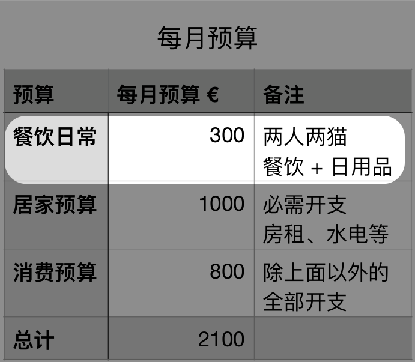

# 最近省钱贼有瘾……

**发布时间**: 2021-05-14 06:59:00

**原文链接**: [http://mp.weixin.qq.com/s?__biz=MzUzNjE3NzQ3Nw==&mid=2247488431&idx=1&sn=67dfc7aea9354a382f6f3e6a925259ab&chksm=fafb6d85cd8ce493178d3a37e3579ad4608686c9896139e7a77f4b086704def53581578af184#rd](http://mp.weixin.qq.com/s?__biz=MzUzNjE3NzQ3Nw==&mid=2247488431&idx=1&sn=67dfc7aea9354a382f6f3e6a925259ab&chksm=fafb6d85cd8ce493178d3a37e3579ad4608686c9896139e7a77f4b086704def53581578af184#rd)

---

过去这一周我们家过得跟“荒野生存挑战”似的。

起因是这样的：前段时间大意了，发现的时候这个月的开销进度已经远远超过时间进度。我俩算了一下，**为了把餐饮超支补回来，后面一个星期只能花 15 欧。折合人民币 116 块，两个人，一个星期……  **哈，顿时来了斗志

我们家餐饮方面的开销一直做得还不错。

以前上大学的时候我看过一份统计数据，德国学生时期的人均餐饮开销就已经达到每月 300 欧元了。而我们家用这个预算搞定了家里两口人 + 两只猫的餐饮，还包括超市里买的各种日用品，一直吃得蛮好的。

之前我给大伙分享过一些实现预算的[日常操作](http://mp.weixin.qq.com/s?__biz=MzUzNjE3NzQ3Nw==&mid=2247487617&idx=1&sn=5e70fe6c25223a3623a139f014501f13&chksm=fafb6eabcd8ce7bd2269662f04b49165e7a3ff95429ec85fd620fc5c628c85e83ace370d1919&scene=21#wechat_redirect)，比如如何在买菜和杜绝浪费的思路上下手。

但也经常有小伙伴问到“那如果已经超支了怎么办？咋往回补？”

说说我们的操作思路，供大伙参考（最后我俩还真完成了目标，贼有成就感

……

1、平时也要注意收集一些省钱、营养又好吃的菜谱，等没钱的时候就搬出来

说来还挺意外的，**最省钱的大杀器居然是包饺子和包包子** ，好处不要太多：

  * 原料便宜，不挑食材，随便找什么肉和菜组合起来都不会太差，简单粗暴，榨干冰箱存货的一把好手；

  * 饺子一次包 4～6 人份，吃完剩下冻起来，需要的时候直接拿出来煮，还挺方便的；

  * 很容易分工合作、流水线作业，可以当成家庭集体活动，做菜、谈感情都不耽误

想想还挺好笑的，十几年前的印象还是逢年过节才舍得吃顿饺子，不知道从什么时候起，变成了现在没钱才吃饺子。虽然嘴上说物价上涨如何如何，但不能否认生活水平还是肉眼可见地变好。

……

2、禁止无关人等独自前往超市

额，说的就是我了，虽然方便但买菜总买贵，场面太尴尬…… 富裕的时候可以拿钱换时间，但贫穷的时候还是要拿时间换钱的。

……

3、挖空心思把家里已有的存货用起来，**这个是重点**

钱够用的时候一想到缺啥总是买买买，不愿意动脑。现在没钱了，脑子反而变灵活了

我们从存货里面找到了各种被遗忘的干货、罐头、冷冻食材之类的，然后想办法把他们组合起来。就很像居家版的生存挑战——寻找一切可以利用的资源，解决生存问题。

结果发现能吃的东西总比预想的多。

听起来好像有点惨，但还真不是。有本书叫《俭省》专门研究过，**适度的资源匮乏反而能增加创造力和生活乐趣** 。

资源越是充足，我们越懒于创新。创新往往不是资源堆出来的，而是在资源不足的时候想办法解决问题，利用已有资源更高效地解决问题。

每到这种时候我们家的伙食水平反而还能再好一点点。而且原料有限，一个星期菜色都很难重样。

关键是一周过完家里还变干净了，清了一大批“垃圾”。盘点下来总共花了 14.65，刚好达标。

感觉还不错呢，打算再保持一段时间，争取再创造点盈余出来。

……

关于生活有个说法：

> 生活本身并没有意义，所有的意义都是人主观赋予的。

其实省钱和控制预算这件事儿也一样。

我们可以把 ta 看做是一次苦难，抱怨物价上涨，纠结钱不够花。但我们也可以把这样的经历看做是挑战游戏的隐藏 Boss，或者一次居家生存尝试，乐在其中。

关键要看我们当下如何给这件事儿赋予意义。

全家人一起面对困难，寻找资源，解决问题，不也挺好的，过程中反而还总有各种意外惊喜。

如果最后有幸实现目标，我们有满满的成就感。而就算遗憾没能完成，也从不妨碍我们认真享受当下。

我觉得这个看待省钱的心态比省钱的方法更重要，这才是好点子的源泉。

  * 财务自由：[我的财务自由实证之路](http://mp.weixin.qq.com/s?__biz=MzUzNjE3NzQ3Nw==&mid=2247488358&idx=1&sn=4539d162ecbf8852b1f21b48b6ed0812&chksm=fafb6d4ccd8ce45abb0a6ff587bfbc076e8541431cb2b3a6d9a16eb65e40a9d19b03cb847aaa&scene=21#wechat_redirect)

  * 投资实盘：[十年之约，躺赚不难](http://mp.weixin.qq.com/s?__biz=MzUzNjE3NzQ3Nw==&mid=2247488336&idx=1&sn=2c936784a75fead04a415bb5d2313b29&chksm=fafb6d7acd8ce46c3029fcb690c9f2721bc54580c91e237e2690fff3ab80571d338940d6339c&scene=21#wechat_redirect)

  * 抵御风险：[5 月保险方案参考](http://mp.weixin.qq.com/s?__biz=MzUzNjE3NzQ3Nw==&mid=2247488419&idx=1&sn=04d49205e98b2ee8d1b44f7d27198cba&chksm=fafb6d89cd8ce49f80e3eee3156494433a8aacc994f43e3d505066cebf01b82d4f0cbb9f6bfb&token=1303282749&lang=zh_CN&scene=21#wechat_redirect)

  * 干货汇总：[一文打包三年干货（第四版）](https://mp.weixin.qq.com/s?__biz=MzUzNjE3NzQ3Nw==&mid=2247488095&idx=1&sn=45424a8e39b9a6c2cc99561a11c35b1c&scene=21#wechat_redirect)