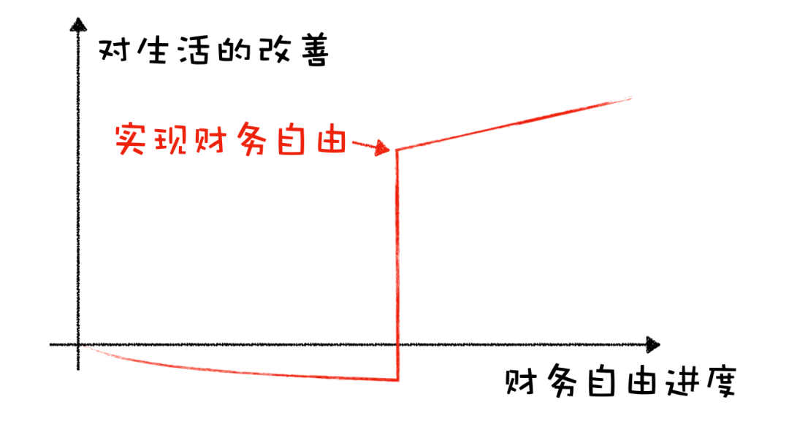

# 画了两张图，给那些焦虑财务自由太久远的伙伴们

**发布时间**: 2021-05-25 06:53:18

**原文链接**: [http://mp.weixin.qq.com/s?__biz=MzUzNjE3NzQ3Nw==&mid=2247488513&idx=1&sn=0076af5c363b0578ab3787a69e26bf32&chksm=fafb6a2bcd8ce33d9c214853ef047585058d8aba1fed5b1dfe2c57bc891ed5088908fa5d32e2#rd](http://mp.weixin.qq.com/s?__biz=MzUzNjE3NzQ3Nw==&mid=2247488513&idx=1&sn=0076af5c363b0578ab3787a69e26bf32&chksm=fafb6a2bcd8ce33d9c214853ef047585058d8aba1fed5b1dfe2c57bc891ed5088908fa5d32e2#rd)

---

很多人以为的财务自由是这样的

长达数年为财务自由不断努力，克制当下的开支和消费，最后终于得逞所愿、改变生活。

有点像「憋大招」，总想着憋个大的，但也容易把自己憋伤、半途而废。如果我们总这么思考问题，就难免感叹「财务自由好遥远，当下好辛苦……」

但财务自由的进程也可以是这样的 👇

……

昨天给大家分享了一篇财务自由访谈，除了嘉宾 Collins，主持人也讲了自己的经历。  

> 我想财务自由就是因为现在的工作太悲催了，我讨厌这个工作，尤其是想到以后可能 30 年都要干这行（不少小伙会有同感吧～
> 
> 但当我认真考虑过财务自由，当我发现自己能通过工作收入达成财务自由以后我的心态一下就变了，后来甚至有点享受这份工作。
> 
> 我发现自己讨厌的其实不是工作本身，而是焦虑自己没有找到一条可靠的上升通道。

想起来，在我更新自己的[财务自由实证进度](http://mp.weixin.qq.com/s?__biz=MzUzNjE3NzQ3Nw==&mid=2247488358&idx=1&sn=4539d162ecbf8852b1f21b48b6ed0812&chksm=fafb6d4ccd8ce45abb0a6ff587bfbc076e8541431cb2b3a6d9a16eb65e40a9d19b03cb847aaa&scene=21#wechat_redirect)、一步步达成目标的过程中，总会有小伙伴很激动地给我留言「明明不是我的钱，怎么感觉比自己赚了还开心…… 看着有瘾……」

我会不会也只是帮大家确认了这样一条可靠的上升通道呢？**找到一条可复制的上升途径，甚至比上升本身更有意义。**

「未来」的规划也可以成为解决「当下」焦虑的工具，帮我们更好专注当下、解决问题。快乐 + 1

……

但可能有的小伙伴会想，合着就算是心理按摩嘛？

还真不是，这背后其实是一个很有价值的做事方式。

项目管理上有个词——最小可交付单元——别担心哈，看着有点吓人，其实超级好懂。

假设我们要造一辆车给客户，第一种交付的方式 👇 先造轮子，再造底盘，再组装，最后成为车。

这样的做事方式有个问题，**一辆车从设计到生产出来得 5～10 年，客户等不起，中间一直“unhappy”** 。而且万一发现生产出来东西和自己想得不一样，为时已晚（像不像憋大招版的财务自由？

所以就有了第二种思维方式 👇 先造个滑板，然后在这个基础上升级成滑板车，再升级成自行车、摩托车，最后变成汽车。

客户一直有东西用，快乐 + 1。

能持续看见工具的进化和体验提升，快乐 + 2。

有问题持续反馈，确保最后的成品和自己预期一致，快乐 + N……

这样持续交付的迭代产品就是最小可交付单元。

项目管理如此，而财务自由不也是个人生的大项目嘛，只不过客户和开发商都是我们自己而已。

重点在于**别总想着憋大招，别总想着「熬」和「等」。多想想自己「未来」要做成的事儿，能顺便解决哪些「当下」的问题。**

好的产品经理应该持续满足用户，而好的财务自由计划也同样可以持续改变当下。

财务自由所需要的种种技能和资本，投资能力、被动收入、理性消费、保险筹备、自由本金，这些都是最小可交付单元，随便一个拿出来都足够改变当下，何必等到“憋”成财务自由以后呢？

……

现在很多产品宣传时常会用到“医用级”、“航空级”这样的说法，意思是材料够放心，连医用、航空都行，日常使用当然更给力。  

那财务自由的很多方法不也是这样嘛，比如投资理财，如果连财务自由都足够达成，解决日常的投资理财就更不在话下。是不是以后也能加个名号，我以后写的就是「财务自由级投资理财」、「财务自由级生产力技巧」和「财务自由级 blabla」了

哈哈，开个玩笑。

其实还是上面那件事儿，只不过思考的方式反过来——

**生活中有很多问题不管我们是否自由都早晚要解决，我们常常只需要多想一步，从众多方法里面选那个同时也适用财务自由的就好** 。

……

除了“憋大招”之外，我们至少还有两个额外的选择：

一种自上而下，先想财务自由需要什么，再想哪些技能和资本当下就能用上，立即改善。

另一种自下而上，先解决身边的困难，但优先考虑那些财务自由以后也能用的。如果问题解决了就“顺便”自由。

不管哪一种，都不需要以当下的等待和煎熬为代价。

  * 财务自由：[我的财务自由实证之路](http://mp.weixin.qq.com/s?__biz=MzUzNjE3NzQ3Nw==&mid=2247488358&idx=1&sn=4539d162ecbf8852b1f21b48b6ed0812&chksm=fafb6d4ccd8ce45abb0a6ff587bfbc076e8541431cb2b3a6d9a16eb65e40a9d19b03cb847aaa&scene=21#wechat_redirect)

  * 投资实盘：[十年之约，躺赚不难](http://mp.weixin.qq.com/s?__biz=MzUzNjE3NzQ3Nw==&mid=2247488336&idx=1&sn=2c936784a75fead04a415bb5d2313b29&chksm=fafb6d7acd8ce46c3029fcb690c9f2721bc54580c91e237e2690fff3ab80571d338940d6339c&scene=21#wechat_redirect)

  * 抵御风险：[5 月保险方案参考](http://mp.weixin.qq.com/s?__biz=MzUzNjE3NzQ3Nw==&mid=2247488419&idx=1&sn=04d49205e98b2ee8d1b44f7d27198cba&chksm=fafb6d89cd8ce49f80e3eee3156494433a8aacc994f43e3d505066cebf01b82d4f0cbb9f6bfb&token=1303282749&lang=zh_CN&scene=21#wechat_redirect)

  * 干货汇总：[一文打包三年干货（第四版）](https://mp.weixin.qq.com/s?__biz=MzUzNjE3NzQ3Nw==&mid=2247488095&idx=1&sn=45424a8e39b9a6c2cc99561a11c35b1c&scene=21#wechat_redirect)