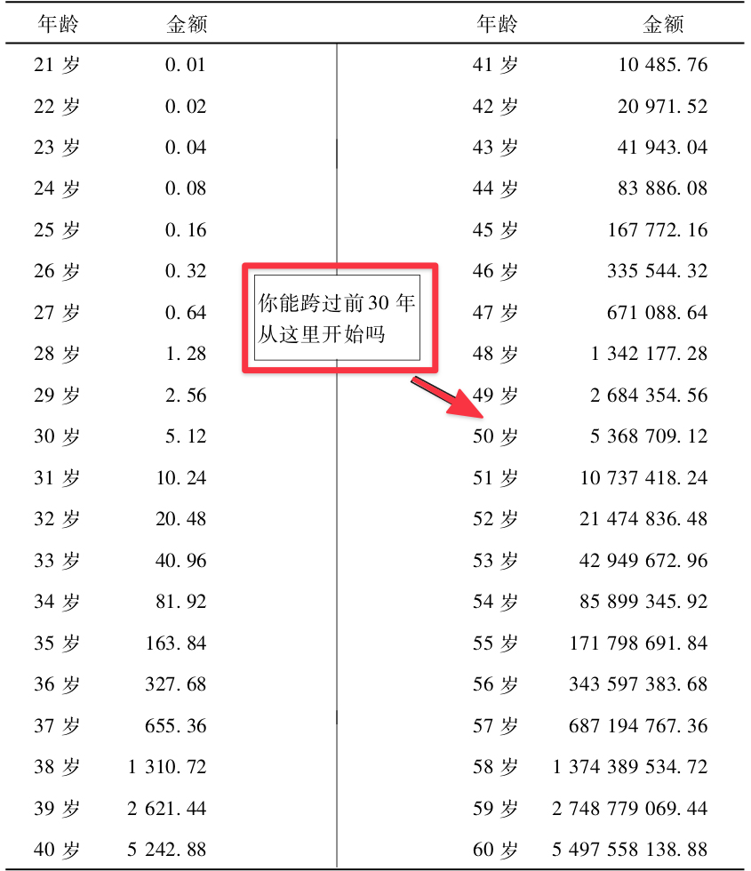

# 开挂的人生

**发布时间**: 2021-08-04 06:59:00

**原文链接**: [http://mp.weixin.qq.com/s?__biz=MzUzNjE3NzQ3Nw==&mid=2247489110&idx=1&sn=bee043aefe7b2d4ea6a6e58f647b29d0&chksm=fafb687ccd8ce16a3fed34c2bf2d92ec46d436796e0677d3951b126a295988a49846f29910b4#rd](http://mp.weixin.qq.com/s?__biz=MzUzNjE3NzQ3Nw==&mid=2247489110&idx=1&sn=bee043aefe7b2d4ea6a6e58f647b29d0&chksm=fafb687ccd8ce16a3fed34c2bf2d92ec46d436796e0677d3951b126a295988a49846f29910b4#rd)

---

前段时间在网上看了个段子。

有个农民给地主打工，地主说我给你每个月一石米。农民最近正好学习了复利的知识，说“我有一个大胆的想法，你第一天给我 1 颗米，第二天 2 颗，第三天 4 颗，第四天 8 颗，每过一天就翻一倍，怎么样？”

好像是个很老套的展开了，别着急，重点来了。

地主想这农民傻了吧，要这么少，然后就答应了。 **后来农民坚持了七天终于饿死了** ……

时间是复利的朋友，但有时候时间也会是我们的敌人，因为我们不能永生。网上经常有各种关于理财的故事，比如每天存下 1 元钱，坚持 50 年，到时候就有多少多少。但这个故事告诉了我们另外一面——**那个时候，我们都老了** 。

昨天给大伙推荐的《百万富翁快车道》里面有一张图，很精辟 👇 假设从 1 分钱开始每年翻倍

**复利是时间的朋友，但我们最好能把前面的几十年压缩在 10 年之内，** 这才算是开挂的人生。

攒下财务自由本金的时间应该尽可能快，但怎么实现 ta 呢？

……

关于这本书的留言中，既有比较悲观的看法：

> 这本书之前很早就买过，作者着重强调的是找一条快车道（意指创业），看完后对比下自己如此普通平庸，只能在慢车道上了 😂

但也有小伙伴发现了问题：

> 按照作者的说法，你的（工资理财）财富自由之路是他并不推崇的慢车道。但显然你实现的速度比他书里的慢车道的速度快得多，为什么？
> 
> （书中慢车道是 50 年，快车道是 7 年，我自己的财务自由之路原计划是 10 年）

很多人看完这本书想到的快车道，第一个就是创业。慢车道，首当其冲就是上班攒钱。但仔细思考大伙会发现，作者并没有说过上班就一定是慢车道，创业就一定是快车道。

如作者所说，如果创业赚了很多钱，但业务越大，自己的自由时间反而越少，那这也是条慢车道。那反过来呢？

即使是上班攒钱，只要能在 10 年之内把钱积累下，只要越到后面自己的自由时间越多，那这不也是一条快车道吗？

**平凡的上班、攒钱、年老退休被认为是慢车道，这是建立在一个习惯之上** ——每个月只拿 10% 的收入去交养老金，然后按照 5% 的收益积累等退休。

但平凡的事儿做到极致，也可以不平凡。

如果每个月不是存下 10% 的收入，而是存下一半、70% 甚至更多呢？如果我们不是每年仅仅 5% 的收益，而是得到[年化收益 10% 的投资收益](http://mp.weixin.qq.com/s?__biz=MzUzNjE3NzQ3Nw==&mid=2247488904&idx=1&sn=df82b96fcede392249995ea728d1c888&chksm=fafb6ba2cd8ce2b4100cb43171126a08ed4f8754f286d93a5dfb7ed5a23236559805af754022&scene=21#wechat_redirect)甚至更高呢？

那即使是上班，我们也能**把漫漫的五十年历程压缩在十年之内** ，这还是慢车道吗。

……

表面看来，攒钱理财财务自由和快车道是完全不同的思路。

但事实上他们背后的理念是一回事儿，快车道有 **12 条** 行为准则，而每一条都可以一一对应 👇

早早开始攒钱积累本金不是为了花掉，而是为了后期形成被动收入，以此支付生活，获得自由，获得选择权（5、10）。在财务自由这条路上，我们投入越多，不但在金钱上更富足，**而且** 自由时间会更充裕（9）。

关注投资带来的被动收入，而不是期望一夜暴富（6）。合理利用杠杆，如果投资收益能够超越负债利率，比如房贷，那负债就应该越晚还越好（1）。但要注意风险，优先关注现金流（7），而不是一味追求资产增值。能变现、能带来现金流的才叫资产，拒绝单纯的纸面财富。

但也不要在投资上浪费过多时间（2），而是寻求躺赚，留下时间专注主业、关注生活、不断成长（3）。

选择工作要关注收入，但更要关注时间和隐形成本，毕竟没花掉的钱才能变成我们的财富（8），[最赚钱的职业](https://mp.weixin.qq.com/s?__biz=MzUzNjE3NzQ3Nw==&mid=2247486433&idx=1&sn=89d0c834bc1336c8097f3633b9413059&scene=21#wechat_redirect)其实很低调。

不要总去焦虑通胀、危机和可能的意外，因为不管时代如何变化，新的躺赚方法永远不会缺席（4）。

不要太在乎别人在说什么，关注自己的梦想、关注自己的财富（12）。当别人都在找理由证明自己为什么攒不下钱、赚不到收益时，逆行积极寻找方法、解决问题，塑造自己的生活（11）。

这就是一条快车道。

快车道和慢车道的区别并不在于上班还是创业，开始钱多还是钱少，而是这条路最终通往何处。

我这么说可能有点王婆卖瓜了，毕竟自己就是坚定的财务自由践行者，但我只是在用行动为自己的观点投票。我真心认为这就是一条最贴近大众的开挂之路，谁说慢车就不能驶上快车道呢。

  * 财务自由：[我的财务自由实证之路](https://mp.weixin.qq.com/s?__biz=MzUzNjE3NzQ3Nw==&mid=2247488577&idx=1&sn=c910a52823d48f75834bec14b4d8934f&scene=21#wechat_redirect)

  * 投资实盘：[十年之约，躺赚不难](https://mp.weixin.qq.com/s?__biz=MzUzNjE3NzQ3Nw==&mid=2247489056&idx=1&sn=51157a511a403aaacb7be0282c1b32b2&scene=21#wechat_redirect)

  * 抵御风险：[7 月保险方案参考](http://mp.weixin.qq.com/s?__biz=MzUzNjE3NzQ3Nw==&mid=2247489074&idx=1&sn=4a4ea1c6490d89828694ebf1f023c8b5&chksm=fafb6818cd8ce10ee61a1e1f0cf85e43fd3d9901ad4077c60595f6f0b441e43f744f8741d530&scene=21#wechat_redirect)

  * 干货汇总：[一文打包三年干货（第四版）](https://mp.weixin.qq.com/s?__biz=MzUzNjE3NzQ3Nw==&mid=2247488095&idx=1&sn=45424a8e39b9a6c2cc99561a11c35b1c&scene=21#wechat_redirect)