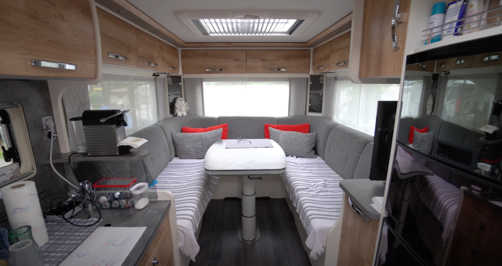
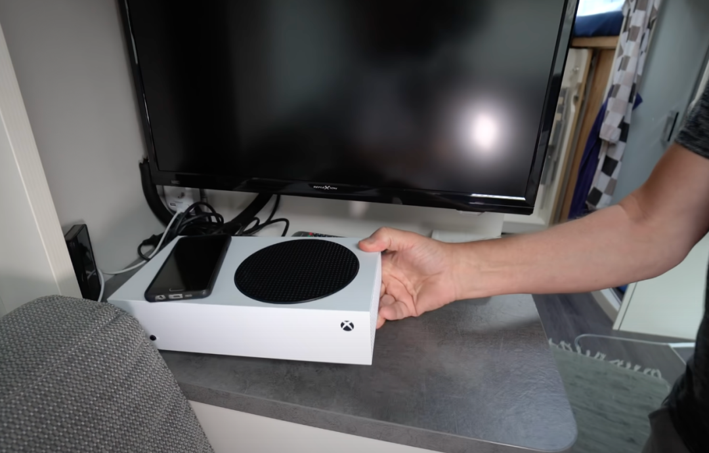

# 有点酷

**发布时间**: 2021-08-18 07:00:00

**原文链接**: [http://mp.weixin.qq.com/s?__biz=MzUzNjE3NzQ3Nw==&mid=2247489208&idx=1&sn=db818a9099c303d0ca9dc294faadd7a5&chksm=fafb6892cd8ce1840142725bd2071717b454a4d5e999c4091846e7c0ed94d0ff91e7e3078b04#rd](http://mp.weixin.qq.com/s?__biz=MzUzNjE3NzQ3Nw==&mid=2247489208&idx=1&sn=db818a9099c303d0ca9dc294faadd7a5&chksm=fafb6892cd8ce1840142725bd2071717b454a4d5e999c4091846e7c0ed94d0ff91e7e3078b04#rd)

---

最近视频网站总给我推荐一些“奇奇怪怪”的生活方式，可能是因为之前准备房车出游时看了太多相关视频吧

我被安利了其中一篇，一对德国的退休夫妇，把房子卖了搬到房车里边生活边游玩，已经过了两年半，有点开脑洞。

虽然我自己并没打算搬进房车里住（还是家里舒服 ），但看完他们的生活方式还是挺受启发的，能想明白不少问题。

先贴几张采访时的视频截图，他们的房车算是比较大的。

↓ 沙发 + 厨房，在车尾

↓ 浴室 + 卧室，在车头

他们的两个子女都已经成家生娃了，房车上只是他们两个人生活，舒适度还是相当可以的。

这对夫妇都已经 60 多岁了，采访就是上个月的事儿，他们已经在房车上生活了两年半。

……

我就特别好奇完全生活在房车上的人会有哪些不一样的生活细节，结果没想到**最方便的居然是帮子女带娃。**

他们把房子卖掉、搬上房车以后看望子女和朋友都轻松很多，不用被动地等别人来找自己。想去看望子女、需要带娃啥的就直接把车开过去，还不耽误自己日常生活。

如果赶上假期干脆直接把娃拉走几个星期，玩完再带回来，子女彻底解放。这样的爷爷奶奶是不是有点酷 

↑ 老头还很心机地在 Xbox 上留了不少孙子爱玩的游戏  

……

我没打算搬去房车上住，但访谈也是看得挺上头。

当我们想象房车生活时，实际上也是在换一个视角重新看待房子。当房子不再是“不动产”，可以到处移动时，可以获得很多不一样的解决问题的思路。

真正改变问题的倒不是房车本身，而是生活在房车上的人有**更大的****生活舒适区** 。

然后我想了一下自己，我的舒适区就要稍微小一些，我觉得躺在家里才最舒服；而这对夫妇他们的舒适区延伸到了房车上。

那当我们都想要旅行时，我承担的代价就会更大，我要承担旅行的开销 + 家的开销，双重代价。

而他们的生活成本就减半只剩下旅行开销。**舒适区越大，解决问题会更简单** 。

之前给大伙提过很多次《不上班也有钱》的作者 Winnie，她和老公环球旅行，后来还生了两个娃，财务自由本金也才 100 万美元，按照 4% 的方式提取一年开销也才折合 30 多万人民币。

现实中能负担得起这样开销的人不少，想要环球旅行的人也挺多，但真正迈出这一步的人却寥寥无几。因为大家的舒适区有着很大的区别。

在访谈里，主持人也问到很多人都会提到的顾虑，退休生活在房车上，以后万一生病、养老咋办。

老头说，他们算了笔账，结果发现卖掉房子旅行在路上，日常的开销和生活在房子里是差不多的，所以他们“实际上没有什么可损失的”。如果真的生病了，或者玩累了，那就再把房车卖了，回归正常传统的生活。**只要选择是可逆的，我们的焦虑就会少很多。**

然后主持人开玩笑说，那一直玩给孩子的遗产不就没了。老头拍拍桌子，“我们这不正坐着呢嘛？” 

特喜欢他们印在车尾的话 ↓

Lebe deinen Traum. Träume nicht dein Leben. 

过上梦想的生活，不要梦想过上的生活。

……

挺佩服那些愿意走在路上的人，舒适区的疆域更大。

如果我们只能建立起一片很小的舒适区，如果只有自己的房子才能叫“家”，其他任何地方都不行，那可供我们选择的生活方式就会非常有限，承担的代价就会非常高。

而如果我们的心理疆域足够拓展到家以外的地方，甚至拓展到全国，那面对问题拥有的选择就要多得多，成本也要低得多。

很多走上财务自由之路的小伙伴，包括我自己，都有渐渐发现需要用钱的地方反而越来越少了。

我开个脑洞，有没有可能是财务自由的过程同样也在扩大我们在财务上的舒适区呢？我们发现自己能够接受的生活方式和选择越多，解决问题也会变得更加容易。

PS：视频来源是德国博主 @german television

  * 财务自由：[我的财务自由实证之路](https://mp.weixin.qq.com/s?__biz=MzUzNjE3NzQ3Nw==&mid=2247488577&idx=1&sn=c910a52823d48f75834bec14b4d8934f&scene=21#wechat_redirect)

  * 投资实盘：[十年之约，躺赚不难](https://mp.weixin.qq.com/s?__biz=MzUzNjE3NzQ3Nw==&mid=2247489056&idx=1&sn=51157a511a403aaacb7be0282c1b32b2&scene=21#wechat_redirect)

  * 抵御风险：[7 月保险方案参考](http://mp.weixin.qq.com/s?__biz=MzUzNjE3NzQ3Nw==&mid=2247489074&idx=1&sn=4a4ea1c6490d89828694ebf1f023c8b5&chksm=fafb6818cd8ce10ee61a1e1f0cf85e43fd3d9901ad4077c60595f6f0b441e43f744f8741d530&scene=21#wechat_redirect)

  * 干货汇总：[一文打包三年干货（第四版）](https://mp.weixin.qq.com/s?__biz=MzUzNjE3NzQ3Nw==&mid=2247488095&idx=1&sn=45424a8e39b9a6c2cc99561a11c35b1c&scene=21#wechat_redirect)