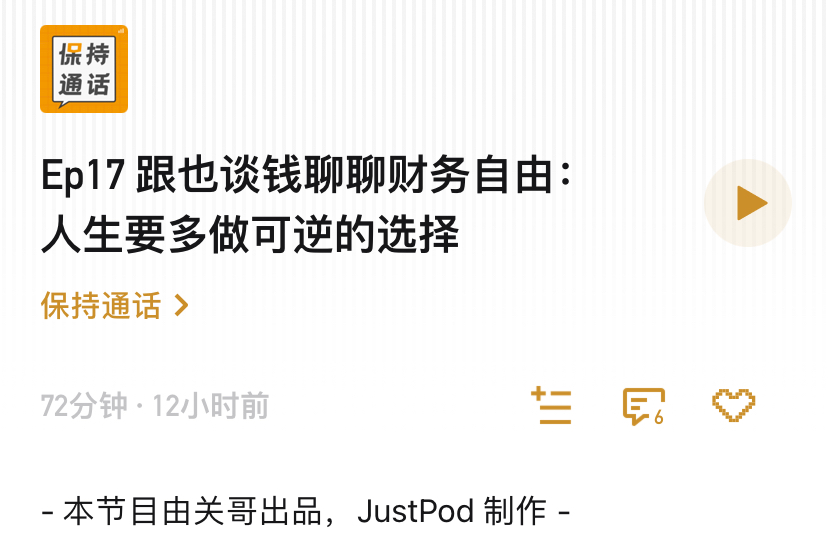

# 作客一期播客～

**发布时间**: 2021-09-08 06:59:16

**原文链接**: [http://mp.weixin.qq.com/s?__biz=MzUzNjE3NzQ3Nw==&mid=2247489401&idx=1&sn=a613497a5d6fdc3325d0424b9a78063e&chksm=fafb6953cd8ce045481121812b61b04f62dfe09a07b785991fc4cdd679bc9af13665d4c0ce62#rd](http://mp.weixin.qq.com/s?__biz=MzUzNjE3NzQ3Nw==&mid=2247489401&idx=1&sn=a613497a5d6fdc3325d0424b9a78063e&chksm=fafb6953cd8ce045481121812b61b04f62dfe09a07b785991fc4cdd679bc9af13665d4c0ce62#rd)

---

最近我去参加了一期小伙伴关哥的播客《保持通话》 ↓（链接在文末）

聊了好多财务自由路上这些年的经历和思考，比如：

  * 当初怎么走上的财务自由这条路？

  * 为什么选了 500 万这个财务自由目标？钱够吗？

  * 计划开始的第一笔本金怎么来的？

  * 怎么同时兼顾攒钱速度和生活品质？

  * 多去关注失败而不仅仅是成功的故事，如果能先从别人的失败中总结，自己就不用亲自经历一遍了。

  * 投资，时间和收益率那个更重要？

  * 财务自由以后怎么保障财务安全?

  * 人在德国的“奇葩”保险（彩蛋）

  * ……

正好这次播客聊到了一个平时公众号经常会被问到，但我却很少回答的问题。作为今天的内容，展开说说我的看法。

公众号过往的每一期财务自由实证，我都会被问到同一个问题，**财务自由计划最开始时本金有多少** 。每一期，毫无例外，而且经常不止一条，光这周我就又被问了 5 次。

但实话实说，我不太喜欢这个问题，每次被问到心里甚至都会忍不住咯噔一下 ……

我是碰巧属于运气比较好的一类人，上学时最开始实践投资的本金是找爸妈要的。在认真和家人沟通过以后，我提前支取了原计划给我的买房钱，和前几年的投资收益一起组成了我的财务自由“第一笔本金”。

但我发现，每当回答了这个问题以后，随之而来的下一句感叹就是——果然财务自由就是需要一大笔初始本金，没有钱不能自由。

这个时候我就会觉得特别惋惜，因为明明第一笔本金对财务自由而言不是必须的，为此我后来还有过一次专门的计算分析，“[不靠初始本金完成财务自由](http://mp.weixin.qq.com/s?__biz=MzUzNjE3NzQ3Nw==&mid=2247488884&idx=1&sn=840d596e2867e383644e3fd26a0631de&chksm=fafb6b5ecd8ce248ddcceee8678986285693de8181269bad008a4f063e71208f9e5aa6923428&scene=21#wechat_redirect "不靠初始本金完成财务自由")”。

但当我说出这笔本金时，很多人还是会先被这个数字吸引，即使我后面一再解释，他们还是会被这笔钱干扰思维，没法再听进去后面的方法和数字了。本能实现财务自由的人可能又少了一个。（正好昨天小伙伴留言科普了，这叫“前摄抑制”，先获得的信息会抑制后面的信息和思考）

所以在发现这个结果以后，我就宁可回避此类问题了，尤其是避免在只能写最多百字的文章留言里。只会在一些比较系统的长文中，或者是和小伙伴们的访谈中可以展开具体聊的时候，才会偶尔谈到当初第一笔本金的数字和来源。

实现财务自由**重要的不是初始本金，而是我们后续持续赚钱的能力** 。

如果我们能够凭自己的实力持续创造收入，那也必定能给自己再赚下第二笔、第三笔，初始本金只是个没那么重要的起点。

而如果我们没有这个能力，那就算运气得来的钱也终将凭实力重新亏回去。

我眼中的财务自由方法，本质上应该是一条不靠运气的致富之路。按照没有“彩票”的方式规划未来，按照较差的预期来准备规划，开始行动，我们最终反而都能抓住专属于自己的那份运气。

……

大家感兴趣的话可以来听听这期播客，最后借用关哥写在介绍的那句话：

他实现财务自由的契机，是从读一本书开始的。那么，希望本期的内容也可以成为大家实现财务理想的一个契机。Enjoy～

👇