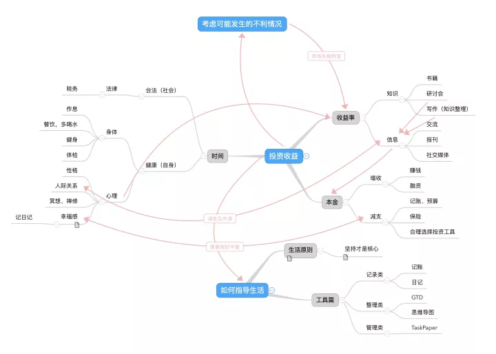

# 财务自由路上，如何获得家人的支持？

**发布时间**: 2021-10-13 07:00:00

**原文链接**: [http://mp.weixin.qq.com/s?__biz=MzUzNjE3NzQ3Nw==&mid=2247489601&idx=1&sn=d996ea73f914cd4b03ce84c1d9262861&chksm=fafb666bcd8cef7db13adf0046bf1618b4d0487ab3744a38f0764d21c1161747b69f1e8ac8b3#rd](http://mp.weixin.qq.com/s?__biz=MzUzNjE3NzQ3Nw==&mid=2247489601&idx=1&sn=d996ea73f914cd4b03ce84c1d9262861&chksm=fafb666bcd8cef7db13adf0046bf1618b4d0487ab3744a38f0764d21c1161747b69f1e8ac8b3#rd)

---

财务自由路上，家人的支持会是我们最大的助力。假如没有也太支持，我估计自己压根就自由不了；而假如没有父母支持我们，我们的计划可能也要延迟很多很多年。

怎么在这条路上获得家人的支持，也是大伙平时经常问到的问题

我整理了一下过往的经历和思考，聊聊这个话题，希望能给大伙一些参考。

实际上我们家也不是一开始就有一致的财务自由目标，我们也曾经大手大脚花过钱，也经常会因为钱的问题争执不下。答案也是在沟通和磨合中逐渐清晰的。

但在解释如何沟通之前，可能得先说说——

### 什么时候「不」适合请家人支持自己

一个现实——即使是最亲近的人，**当我们表达一些新奇的想法时，他们也常常会泼冷水** 。

但不要抱怨他们，这是人的一种本能，我们会排斥那些陌生而且身边没人在做的事儿。

> 开始时，人们拒绝相信一件新奇的事。
> 
> 之后，人们开始希望能做到。
> 
> 然后，他们看到那件事确实有人可以做。
> 
> 最终，那件事做成了。
> 
> 所有人开始问，为何这件事几个世纪了都没人去做？
> 
> —— 弗朗西斯·霍奇森·伯内特

当我们刚刚有了一个新想法（比如看了我的文章突然发现原来普通人也能财务自由

），**这个时候其实最不应该请家人支持自己** 。

我之前给大伙分享过 SPANX 这个品牌的[创业故事](https://mp.weixin.qq.com/s?__biz=MzUzNjE3NzQ3Nw==&mid=2247486790&idx=1&sn=c80b2e93d6a5f181ea87a7372b6643ea&scene=21#wechat_redirect)

> 现在这家公司的创始人现在是十亿美元的身家，福布斯给的排名是美国白手起家女性中财富排名 23 位。
> 
>

她在开始创业时有个细节——除了商业伙伴以外，她没有向身边任何一位朋友和亲人透露过自己的计划和想法

> I kept the idea from my friends and family for a year knowing that out of love, they might prevent me from taking a risk.
> 
> （我没有把想法告诉身边的人，因为我知道他们可能会反对我冒险。）

当我们的想法还非常脆弱时，我们会特别在意别人的负面评价。所以我们总会急于为自己辩护，而不是认真思考一件事儿的可行性以及怎么把事儿做成，或者急于证明自己是对的而关注短期利益、损害长期利益。最后这件事儿反而更难做成了。

创业如此，财务自由也是如此。

……

第二个不适合请家人支持的阶段，是当我们在家人眼里的形象还不能理性消费、投资赚钱时。

我们心中都有一个对他人的基于过往经历的评价：

  * 一个人如果从来都是月光，投资永远都在回本的路上，那当他表示自己要财务自由的时候没人会相信；

  * 但如果一个人一直以来消费都非常有计划，投资上也有自己的方法和体系，当他表示自己要财务自由时，大家会觉得理所应当。

**我们在家人心中的「可信度」比沟通技巧更能影响沟通结果** 。所以在成功“刷新”自己在家人心中的形象之前，不要贸然去谈财务自由，看起来真的很不靠谱 😂

刷新印象这里有个心理学技巧——用提问的效果比陈述要好。我给大伙举个例子：

“我最近想攒攒钱，不想总是这么月光了，你当初是咋攒钱的，给我讲讲呗？”。“你还想着攒钱啦？好现象。我给你讲，我们当年……” 这就不错。

但假如是“我要开始攒钱了，你看我现在已经攒了……”，得到的回答反而可能是“小样儿，我看你能坚持多久”。

提问和生活上细节的改变，往往是最有效的，越刻意效果反而越不好。但也要注意，你在凝视深渊的时候，深渊也在凝视你，**不要过度追求这些技巧** ，最重要的依然是「我」和真心。

还在上学的小伙伴也许可以参考我当时的经历，[学生时代如何管钱](https://mp.weixin.qq.com/s?__biz=MzUzNjE3NzQ3Nw==&mid=2247484100&idx=1&sn=5f8d6fcf118362eb12ce160132eda73e&scene=21#wechat_redirect)——我上大学时家里是一次给一年的钱，然后撒手不管，学费、生活费、日常消费全都自己拿主意，自己管好自己的钱。事后想想，这可能也算是我建立可信度的第一步。

渡过这两个阶段，我们才适合开始请求家人的支持。

### 正式沟通前，先问自己一个问题

我们先来思考一下：

> 当我在工作上要给老板准备一次汇报，说服老板一件事儿，需要做多久的准备工作？

答案可能是几个小时，可能是几天，有可能更久。但这个数字本身不重要的，重要的是，即使是在工作上有如此多交集的老板，我们想要沟通一个问题都要准备这么长的时间。

而家人比老板更重要，财务自由比工作更有意义，我们应该为此留出多长的时间？

很多时候我们只是预期着自己说一句话，家人就应该理解自己、支持自己。

但这真的太难了，我们至少应该按照一次工作汇报的用心程度来准备和家人的沟通。

……

不知道有没有小伙伴还记得张图 👇 这是我在 2017 年发过的一张计划拆解图（好像当时公众号关注还没过 1000 呢

）

这张图其实就是我当初准备和家人沟通计划的素材之一。

我写了一篇大约 5000 字的计划，讲自己打算如何实现财务自由目标，需要做出哪些努力，需要付出什么，哪里希望家人支持我。

然后我先把这篇文章发给爸妈，再视频通话带着他们一段一段地往下读，解释我的意思和计划。

我在 17 年写的这篇文章 👉 [解析那些帮你提高收益的小习惯 ](https://mp.weixin.qq.com/s?__biz=MzUzNjE3NzQ3Nw==&mid=2247483775&idx=1&sn=8105696d033a0172540d1b0f4eecfb23&chksm=fafb7f55cd8cf643da1ccb9df6727e2c121b220d5edb40035251f8e5fd141938421cd47ed1eb&scene=21#wechat_redirect)，就是**从这个计划书修改过来的，大伙需要的话也许可以参考** 。

要用心准备。

而且和家人沟通的时候要注意，应该是带着向家人「解释、科普」财务自由这种生活方式的心态，多沟通，最好不要带着「说服」的态度。多讲自己打算做什么，打算如何实现目标，少讲自己为什么“一定会成功”。

这也是自己加深对财务自由理解的机会，[讲给别人听](http://mp.weixin.qq.com/s?__biz=MzUzNjE3NzQ3Nw==&mid=2247488597&idx=1&sn=f55ed5e19b2c004382a79b72621a2fd8&chksm=fafb6a7fcd8ce36920debc857db49876997c5d6fc30bf00a6ada967930247489a55734d29a15&scene=21#wechat_redirect)是一种最高效的学习途径，没有之一。

建立信任、用心准备，这是两个要素，但还不够。

### 说服家人的，其实不是道理

舒尔茨当初创立星巴克去融资时，一位投资人事后评价大意是这么说的「其实你当时讲的商业计划、市场规模我都没听懂，但我在你的眼神中看到了你的激情和信心」。

都这么多年过去了，也太最近头一回告诉我，其实当初我们开始财务自由计划的时候，她根本就没信我们会成功

。她只是觉得我当时做这件事儿非常有热情，再加上就算没成功也没什么损失（毕竟还攒下好多钱）。没想到如今真的自由就在眼前……

今年 7 月的时候，我特别兴奋地给大伙分享了一篇文章「[我 将 自 由](http://mp.weixin.qq.com/s?__biz=MzUzNjE3NzQ3Nw==&mid=2247488909&idx=1&sn=74c33a53392fe53e3da89df938772207&chksm=fafb6ba7cd8ce2b12287f696b5a63515fbab5108ca986392506e5deb81b56d43bb7270b2f9c0&scene=21#wechat_redirect)」，事后很多小伙伴都留言表示没看懂 😂 如果是往常，这样的文章留言肯定会翻车，但这篇文章我印象最深的留言是「没什么具体问题想留言的，就是单纯被这种“想通了”，迫不及待分享给大家的快乐感染惹」

很多时候，我们靠的其实不是讲道理和数据，而是我们对这件事儿的热情和信心。

而热情和信心有一个很重要的标准——**即使别人都不同意，这件事儿我也会做下去，而且我已经正在做了** 。

这里刚好和前面给大家分享的“刚刚有想法的时候，不要急于和家人分享”的道理是互通的。如果我们真的会做这件事儿，真的有热情，没有家人的支持其实我们也会做。而如果没有热情，就算家人催着我们财务自由，我们也只会觉得自己是被逼的。

我和也太在有财务自由计划之前也没少因为开销问题拌嘴，我总觉得她花的多，她觉得我买东西浪费，谁也不服谁。就这么过了 4、5 年。一起定预算、财务自由，当时完全不敢想。

但**自从我先开始给自己制定预算、攒钱投资、规划未来，一切就又变得那么顺理成章** 。

佛学上有句话叫“境随心转”，我是这么理解的——当我们自己的思维方式发生改变，我们自己的情绪也会随之改变，而我们的情绪会影响到周围的环境，也让它们随之改变。

决定事情结果的常常不是别人，而是我们自己。

……

如何请家人支持自己的财务自由计划？我的思路总结起来：

  1. 先自己默默努力，建立信心，确定真的能做这件事儿；

  2. 再改变自己，我们的变化会随之影响到周围的环境和看法；

  3. 最后再与家人沟通，但过程要用心准备。先别问自己想得到什么，先想自己应该付出什么。

但是，必须承认，即使是这样依然不能确保万无一失，最后我们依然需要一点运气——有愿意平等交流、接纳新鲜事物的家人是一种幸运，这也会直接影响我们沟通的效率和结果。

但我们不应该纠结于这样的外因，这只是最后要考虑的。

关注自己能控制的事儿，接纳我们不能控制的。至少在考虑运气问题之前，我们应该先足够用心，让自己的付出和努力配得上我们所希望的运气。

希望这篇思考有帮到困惑的小伙伴们，自由路上与大家共勉。

  * 财务自由：[我的财务自由实证之路](https://mp.weixin.qq.com/s?__biz=MzUzNjE3NzQ3Nw==&mid=2247489561&idx=1&sn=eee6eed522c1c1f363f61de8a5ca770e&chksm=fafb6633cd8cef25202abb2b0c6ec0f129d28635a2f290f3c349f1396922e225ac47a2b966c5&token=1248363838&lang=zh_CN&scene=21#wechat_redirect)

  * 投资实盘：[十年之约，躺赚不难](https://mp.weixin.qq.com/s?__biz=MzUzNjE3NzQ3Nw==&mid=2247489056&idx=1&sn=51157a511a403aaacb7be0282c1b32b2&chksm=fafb680acd8ce11cdf839a7a4f723a6ff90ca98da744406ea495d17a2889ec8430edcc0e48ca&scene=21#wechat_redirect)

  * 抵御风险：[9 月保险最推荐](http://mp.weixin.qq.com/s?__biz=MzUzNjE3NzQ3Nw==&mid=2247489516&idx=1&sn=1c155047e5f36ca461dcc0e42b2c43be&chksm=fafb69c6cd8ce0d05953ab94b169b841ef82fc0709a145dcf64d277b0453ebdafbdfbefa1eff&token=1118106382&lang=zh_CN&scene=21#wechat_redirect)

  * 干货汇总：[一文打包三年干货（第四版）](https://mp.weixin.qq.com/s?__biz=MzUzNjE3NzQ3Nw==&mid=2247488095&idx=1&sn=45424a8e39b9a6c2cc99561a11c35b1c&scene=21#wechat_redirect)