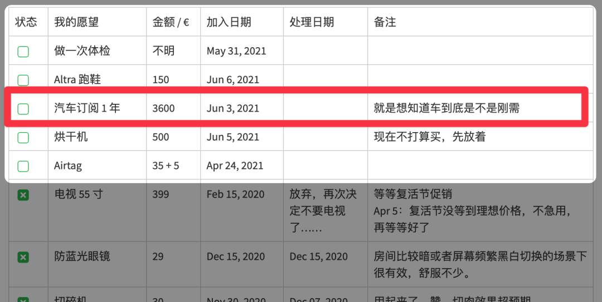

# 又是一笔大钱……

**发布时间**: 2021-10-19 07:00:00

**原文链接**: [http://mp.weixin.qq.com/s?__biz=MzUzNjE3NzQ3Nw==&mid=2247489637&idx=1&sn=343e4ab78f77dad074722627c53f8049&chksm=fafb664fcd8cef599919e5e3d2dbdcb210f0eecf37b275d4fcea7ecc53d9e14e97526872ad8e#rd](http://mp.weixin.qq.com/s?__biz=MzUzNjE3NzQ3Nw==&mid=2247489637&idx=1&sn=343e4ab78f77dad074722627c53f8049&chksm=fafb664fcd8cef599919e5e3d2dbdcb210f0eecf37b275d4fcea7ecc53d9e14e97526872ad8e#rd)

---

昨天有小伙伴问了我一个问题——**怎么考虑要不要买车？**

这个问题可以展开聊聊，也是我这些年一直纠结的一件事儿。

先是财务自由计划开始的几年我不想买车。

再是想着，自己没买过车，就判断自己不需要车是不是太武断了？我又把订一年车写进了愿望清单，觉得可以尝试一下。

但是再后来，一趟旅行回来我又不想买车了 😂。因为发现好像只是平时出去玩，租车更划算一些。结论就变来变去……

关于买车的考虑中最让我介意的是养车的真实开销。

我算了一笔账，发现这个数字比第一印象要高出不少。**一辆 20 万左右的新车，一个月带来的真实开销都快赶上贷款 200 万买房的月供+水电物业了。**

  * 养车的开销大约 3700 元每月；

  * 房子的开销大约 5200 元每月。

这么一比，买车一下就不香了，这个问题就在我们家反复搁置。

**需要说明** ：我上面计算的是德国的情况，国内可能不完全一样。但我觉得关于是否买车背后的思路是共通的，主要想和大伙唠唠我关注的几个点 👇

……

我喜欢把养车的**全部开销折算到平均每个月来思考** 。

如果只关注平时花出去的钱，我们第一个想到的养车成本可能是油钱、停车、保养这些看得见的开支，却很容易忽视一个大头，**车子本身的折旧贬值** 以及不经常出现的大笔意外开支。

我发现这个隐形成本才是养车开销的主要部分。

不过具体算养车开销还是相当费劲的事儿，折旧、维修、冬季胎、停车费、油钱、过路费等等等，要考虑的细节实在太多了。

好在后来我在这个问题上也找到了一个**“抄作业”** 的方法

现在有不少提供车辆长租的公司，已经给出了车子除油钱、停车以外全包的价格，像折旧、保险、税、保养、轮胎等等的价格全都包含在里面。那就只要抄这个作业，最后的数字就很接近答案了，毕竟租车公司算价格肯定是非常认真全面的～

比如这辆福特 Focus 带上选装配置后德国售价大约折合 21 万人民币 👇 除油钱、停车全包一个月是 389 欧元（新车）

虽然这里面肯定还有**租车公司自己的利润** ，不全是成本。但考虑到租车公司的毛利普遍不高，而且他们拿车还比普通消费者有价格优势，两两相抵，这里我就忽略了。

这个价格就可以作为我们买新车折算到每个月的真实成本。

再按照通常一年 1.5 万公里算油钱和停车费（德国汽油和停车比较贵），估算出来差不多就是一个月 500 欧的开销（折合人民币大约 3700 元）

这是我估算养车成本的思路，成本的大头常常是来自那些我们不容易注意到的开支。

把这些钱都算起来，**又****是一笔大钱** 。

所以每当考虑到养车的这个数字，我都会我自己这个问题：

> 如果这笔钱真的非花不可，我还有没有比买车更好的去处？

我总能发现很多。

如果买车是为了改善通勤体验，那能不能干脆把这部分钱直接花在房租或者月供上，换一个能走路上下班的住处？干脆通勤都省了。

如果是为了更舒服的生活，同样的钱，把家的面积变大，或者日常消费预算更高，会不会带来幸福感更大？

因为总能发现比买车更能改善生活的选择，买车就不断给其他生活选项让步。

……

当然啦，大伙也可以不同意我的结论，毕竟**这个计算只能代表我自己的情况** 。

比如大伙买车成本可能更低，比如二手车就贬值更少；也可能有免费的充电福利省了“油钱”，使用成本更低。

再比如大家对买车是刚需，车子带来的改善是其他消费不可比拟的。

再比如可能所在城市的房价比较贵、利息比较高，就算是这笔钱放在房子上也是杯水车薪，不如买车了。

这些都会影响最后的结论，也许大家考虑完会发现买车才是最明智的决定。就连我自己，以后生活变了这个问题的结论也可能会改变。

分享这篇思考，其实不是想讨论买车到底值不值，毕竟大家生活情况区别太大。但我觉得不管生活情况如何变化，考虑买车背后的思路和关注点却是不变的——**我们要有成本意识，关注一项选择背后的真实成本。**

每一笔消费都有无穷多支持它的理由，但值得思考的是，这笔消费能给「我」带来什么？

每一笔消费都能给生活带来改善，但重点是，我要为这个改善支付多少成本？收获是否大于付出？

每一笔消费都能给生活注入更多的幸福感，但问题是，如果这笔钱非花不可，我还有没有更好的选择？

思考这几个问题的过程，可能比最终的答案更加重要。

  * 财务自由：[我的财务自由实证之路](https://mp.weixin.qq.com/s?__biz=MzUzNjE3NzQ3Nw==&mid=2247489561&idx=1&sn=eee6eed522c1c1f363f61de8a5ca770e&chksm=fafb6633cd8cef25202abb2b0c6ec0f129d28635a2f290f3c349f1396922e225ac47a2b966c5&token=1248363838&lang=zh_CN&scene=21#wechat_redirect)

  * 投资实盘：[十年之约，躺赚不难](https://mp.weixin.qq.com/s?__biz=MzUzNjE3NzQ3Nw==&mid=2247489056&idx=1&sn=51157a511a403aaacb7be0282c1b32b2&chksm=fafb680acd8ce11cdf839a7a4f723a6ff90ca98da744406ea495d17a2889ec8430edcc0e48ca&scene=21#wechat_redirect)

  * 抵御风险：[9 月保险最推荐](http://mp.weixin.qq.com/s?__biz=MzUzNjE3NzQ3Nw==&mid=2247489516&idx=1&sn=1c155047e5f36ca461dcc0e42b2c43be&chksm=fafb69c6cd8ce0d05953ab94b169b841ef82fc0709a145dcf64d277b0453ebdafbdfbefa1eff&token=1118106382&lang=zh_CN&scene=21#wechat_redirect)

  * 干货汇总：[一文打包三年干货（第四版）](https://mp.weixin.qq.com/s?__biz=MzUzNjE3NzQ3Nw==&mid=2247488095&idx=1&sn=45424a8e39b9a6c2cc99561a11c35b1c&scene=21#wechat_redirect)