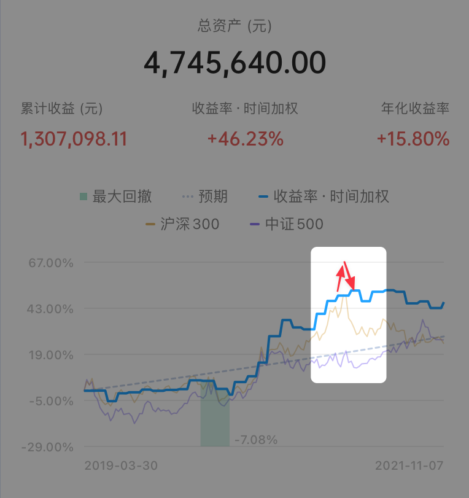

# 完美错过……

**发布时间**: 2021-11-05 06:00:00

**原文链接**: [http://mp.weixin.qq.com/s?__biz=MzUzNjE3NzQ3Nw==&mid=2247489784&idx=1&sn=719f45e492bb1d4663fcc35cd330accc&chksm=fafb66d2cd8cefc46517242a5d4989de8024ac25e63e644a3f96fad5b6303d09fd17a20b649f#rd](http://mp.weixin.qq.com/s?__biz=MzUzNjE3NzQ3Nw==&mid=2247489784&idx=1&sn=719f45e492bb1d4663fcc35cd330accc&chksm=fafb66d2cd8cefc46517242a5d4989de8024ac25e63e644a3f96fad5b6303d09fd17a20b649f#rd)

---

这个星期更新我的[财务自由实证进度](http://mp.weixin.qq.com/s?__biz=MzUzNjE3NzQ3Nw==&mid=2247489724&idx=1&sn=f35a86009ce54b0b887a07a38161331e&chksm=fafb6696cd8cef80f6c60b5151865d01bd8084462ff1e93c8666a368f46c4b69bc071bb5b32e&scene=21#wechat_redirect)时，有小伙伴留言问到：

> （在财务自由历程的记录中）总资产和投入本金在中间有一个大的跳跃，原因是什么呢？是投资收益吗？

我说，因为 2020 年正好赶上了公募基金的行情。投资收益往往不是线性增长的，常常几年的投资，大部分收益却来自其中几个月。有点三年不开张、开张吃三年的感觉。所以“闪电劈下来的时候，一定要保证自己在场”。

但后来又有小伙伴问我，不对呀，同是 2020 年，我 2020 年 10 月开始定投，为什么到现在收益还是负数？

小伙伴的这个疑问正好说出了我真正想表达的东西。

我在自己实证的收益图上标了两个日期和一条线 👇 它们可能比“三年不开张，开张吃三年”更直观一些

  * 如果从 2020 年 5 月开始到今天，我的收益是 30.95%

  * 但如果从 2020 年 9 月开始数到今天，收益就骤降到了 6.85%。再加上上涨时我们常常越涨、买得越多，推高持仓成本，很可能就会变成小伙伴口中的“定投到今天收益还是负数”。

前后只差了短短 4 个月，但结果却可能差了非常多，完美错过……

……

大家别误会我的意思哈，我不是在证明自己有多厉害，我的收益比各路大佬和很多读者差远了。

我也不是想说 2020 年 10 月买入不明智，回到当时我也不知道未来会涨会跌，这段时间我也从未停止定投 👇

我想和大家说的，是投资上「错过」的代价。

财务自由实证到现在我写了 32 个月，眼看着快 3 年了，看着自己的实证账户盈利从 0 到 130 万，而**其中近 100  万是来自 2020 年 5～9 月这 4 个月的时间**。如果去掉这几个月，那这一路的收益会因此骤减到只剩零头，财务自由计划可能也要因此延迟 3 年。

错过这 4 个月，换来的不是再等 4 个月，而是可能重新再等 3 年。

每逢赶上行情不好，几个月甚至一年以上市场不涨反跌时，总会有人问我，你怎么不走呢？为什么不等到行情好了再重新回来投资呢？

我说，我不能，因为这是我们为了实现财务自由全部的钱，**我经不起错过的代价** 。闪电劈下来时，我必须保证自己在场。

……

但又有人问我，投资长期持有确实能抓住上涨，那下跌不也全挨了吗？

确实，我今年的账户回撤就挺大的。实证图上可能看起来不明显，这是因为实证一个月才记录一次，如果补上 2 月 15 日中间的数据，应该看起来是这样的：

抓住上涨常常就要承受下跌，但我愿意接受这个结果。

雪球创始人方三文有句总结我挺认同的——资产市场的长期规律不是涨跌波动，而是永远上涨。

我们投资长期看来赚的不是股市涨跌的钱，而是社会进步、经济发展的钱，经济发展带来的效益最终会体现在资本市场这个“晴雨表”上。

所以虽然全挨了下跌，但只要能抓住上涨依然能获得还不错的回报。

……

但我又会被问，选对了投资长期持有那确实赚钱了，但问题是选错了投资呢？你怎么知道自己选的就是能够长期持有的投资？

老实说，我不知道。

但我知道，**长期持有虽然不能让坏投资变成好投资，但追涨杀跌却会让这些好投资也变成坏投资** 。

选定投资长期持有，这虽然不是个满分答案，也许只有 80 分。但我也不会因此而去选一个在我看来只有 40 分甚至 0 分的回答。

但长期持有到头来发现投资是错的，这个代价我同样不能承受，所以在长期持有的基础上还要加上**均衡分散、不懂不做** 。

资产市场是长期上涨的，而公募基金又能创造超额收益（只投我懂的），所以这里好投资的比例总是大于坏投资的（均衡分散）。

人总会犯错，但只要持有的投资中正确的资产多过错误的，一样也能赚到钱。

……

投资时我们应该**把自己的预期放低一些** 。当我们说长期持有、均衡分散、不懂不做时，并不是说「只要如何如何就一定能赚钱」。

不管任何投资都不能永远上涨，大部分时间都是波澜不惊而不是惊心动魄。重要的是，不要错过随时可能发生的上涨。

不管任何投资都不能保证 100% 正确，投资本就是与错误同行。重要的是，确保“正确”带来的收益大过“错误”导致的损失。

投资没有完美的策略，没有「只要……就……」，我们常常只能在有限的认知下做出不完美的选择。

但至少我们可以先试着寻找这些不完美的相遇，因为它们总要好过完美的错过。

  * 财务自由：[我的财务自由实证之路](http://mp.weixin.qq.com/s?__biz=MzUzNjE3NzQ3Nw==&mid=2247489724&idx=1&sn=f35a86009ce54b0b887a07a38161331e&chksm=fafb6696cd8cef80f6c60b5151865d01bd8084462ff1e93c8666a368f46c4b69bc071bb5b32e&scene=21#wechat_redirect)

  * 投资实盘：[十年之约，躺赚不难](https://mp.weixin.qq.com/s?__biz=MzUzNjE3NzQ3Nw==&mid=2247489056&idx=1&sn=51157a511a403aaacb7be0282c1b32b2&chksm=fafb680acd8ce11cdf839a7a4f723a6ff90ca98da744406ea495d17a2889ec8430edcc0e48ca&scene=21#wechat_redirect)

  * 抵御风险：[10 月保险最推荐](https://mp.weixin.qq.com/s?__biz=MzUzNjE3NzQ3Nw==&mid=2247489650&idx=1&sn=8b6dac6029e58ab8fe7986a5e56eec7f&chksm=fafb6658cd8cef4ea1877c9be84752465473220cd1a731103dd1c840f648a8ac3688f6c62fdb&token=61702604&lang=zh_CN&scene=21#wechat_redirect)

  * 干货汇总：[一文打包三年干货（第四版）](https://mp.weixin.qq.com/s?__biz=MzUzNjE3NzQ3Nw==&mid=2247488095&idx=1&sn=45424a8e39b9a6c2cc99561a11c35b1c&scene=21#wechat_redirect)

**风险提示** ：本文不构成投资建议，只是我个人投资心路历程的记录，分享出来与大家一起交流。投资最终还是要独立决策，毕竟我也可能是错的。

PS：找题图的时候果断选了这张 👇 投资就像从水面的倒影和波光中推测世界的真相。没人知道完美答案，但每个人有都在从过往的认知和经验中做出自己的选择。

与同路小伙伴们共勉。