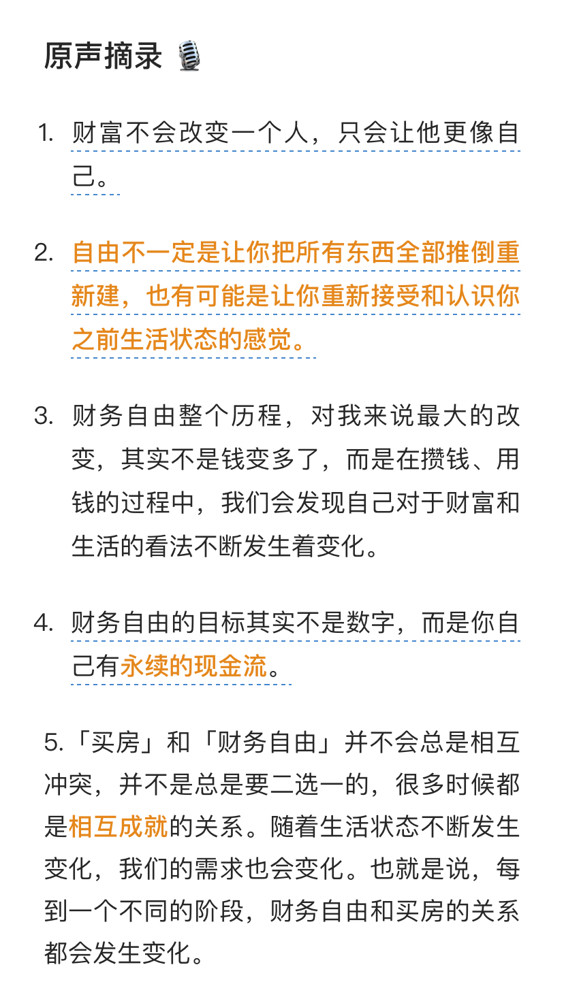
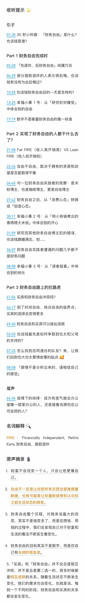
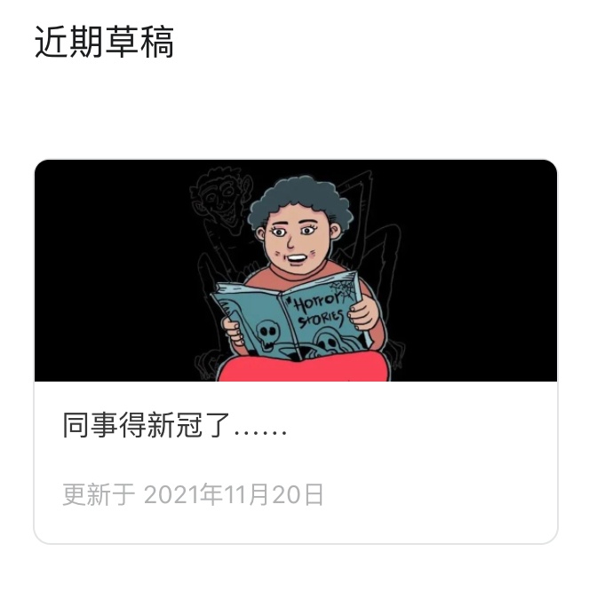

# 新录一期播客，上热播榜了～

**发布时间**: 2022-02-23 10:40:07

**原文链接**: [http://mp.weixin.qq.com/s?__biz=MzUzNjE3NzQ3Nw==&mid=2247490122&idx=1&sn=f984c9f5d4d10b524f6784b3d9ca9579&chksm=fafb6460cd8ced76fa703a90aa8271681b03dfe0010ad9daba8a7707478bb5c8cf1a59447e70#rd](http://mp.weixin.qq.com/s?__biz=MzUzNjE3NzQ3Nw==&mid=2247490122&idx=1&sn=f984c9f5d4d10b524f6784b3d9ca9579&chksm=fafb6460cd8ced76fa703a90aa8271681b03dfe0010ad9daba8a7707478bb5c8cf1a59447e70#rd)

---

我最近（又）录了一期播客 ✌️

2020 年的时候，我收到了一次有知有行“知行小酒馆”栏目伙伴们的文字访谈邀请，[如何着手制定财务自由计划](http://mp.weixin.qq.com/s?__biz=MzUzNjE3NzQ3Nw==&mid=2247487473&idx=1&sn=10a891429291e78dea82b4df34e773f3&chksm=fafb71dbcd8cf8cdb15f114d6637bc6476a2803f9f0803dcbb4d91c1e68b5cc706c3dc55358b&scene=21#wechat_redirect)。

一年多过去，现在的知行小酒馆栏目已经不仅有文字，还加入了语音播客，而我的自由计划也顺利进入了下一阶段。

我们又一次“坐”在一起，聊了聊这一两年的感悟，录了一期播客。后来小伙伴告诉我这期播客还连续两天分别登上了小宇宙最热榜的第三和第四

  

大伙可以在小宇宙和有知有行找到这期播客，小宇宙的链接扫 👇 二维码，有知有行的链接在这里 👉 https://youzhiyouxing.cn/n/materials/1175

附上小伙伴整理的内容摘要，方便大伙收听：

……  

今天这篇**具体聊聊其中一个对我影响很大的经历吧** ，发生在 3 个月前。  

其实当时我在公众号后台写过一篇文章，想要分享这个亲身经历。但写完以后因为各种各样的原因，一直没有发出来（可能是潜意识觉得还不适合吧）。

后来时间一点点过去，跳出当时的负面情绪，我能用更理性的视角来看待这次的经历了。

 

我直接复制粘贴了当时的部分草稿，当时心情真够遭的 👇

> 德国这第三波疫情真的是太猛了，每日新增确诊已经飙到了 6 万+（全国人口才 8000 万），几乎**每天千分之一** 的人确诊。
> 
>

> 
> 如果说之前的两波只是屏幕上的数字，最近这一波我们生活中真的感受到了。
> 
> 也太同个办公室的同事得新冠了……
> 
> 而且，不止一个……
> 
> 而且，还有一个就在他邻桌……
> 
> 而且，这还没完，更无语的是老板还拒绝员工 Home Office。坚持说居家办公效率太低，要求全公司照常上班，甚至还要出差。
> 
> 得知这个消息，当天中午也太就果断抱着电脑回家了。

再后来…… 也太成了全公司唯一一个被批准居家办公的员工。

再后来，我们才知道，更新的德国卫生防疫保护法 IfSG 其实早已规定，雇主有义务满足雇员居家办公，而网上不少帖子都在抱怨雇主不执行怎么办。幸运的是，那个时候我们已经坐在家里。

再后来，一直劝我们不要辞职、不理解财务自由的朋友亲戚，渐渐开始反过来支持我们的想法，甚至劝我们“要不别干了……”

再后来，时间 3 个月过去，就在上周，老板还同意了也太长期远程工作，包括我们搬到二线城市以后。

事后我们才发现，这次意外成了后来一连串惊喜的起点。

### 反脆弱

塔勒布在《反脆弱》中有个观点我很喜欢——你不需要预测未来，你只需要建立一个系统，让自己能够**从意外中获得收益而不是亏损** ，这就足够让自己的投资、生活和事业不断向前：

  * 脆弱：被意外所伤

  * 强韧：不被意外所影响

  * 反脆弱：从意外中获益，“杀不死我们的会让我们更强大”

塔勒布把反脆弱的核心总结为「选择权」，当变化出现时，你有权利拒绝自己不想要的，只选择有利于自己的变化（option 在投资上还指期权，也正是塔勒布最拿手的投资工具）

但如何在生活中构建这样一个系统呢？初读《反脆弱》时我觉得很困惑，但后来再次翻开时，我却惊喜地发现自己已经有了这样一个体系。

财务自由，[通过被动收入支付生活，通过主动收入继续扩展财富](http://mp.weixin.qq.com/s?__biz=MzUzNjE3NzQ3Nw==&mid=2247488909&idx=1&sn=74c33a53392fe53e3da89df938772207&chksm=fafb6ba7cd8ce2b12287f696b5a63515fbab5108ca986392506e5deb81b56d43bb7270b2f9c0&scene=21#wechat_redirect)，这不正是一种生活中的选择权。

当被动收入上出现意外时，比如股灾、危机，我们可以利用主动收入带来的“无限本金”持续抄底，加速积累。等待危机过去，坚持买入的我们就会成为赢家，就像 2018、2020 年所做的那样。这是主动收入带给被动收入的反脆弱。

那么被动收入应该如何带给主动收入反脆弱呢？从理论上我知道这一定行得通，但依旧好奇 ta 会在现实中如何展开。

没想到最终我居然在自己的经历上找到了答案——**面对变化我们可以更轻松地抉择和放下，不再因为害怕失败而死守工资不敢放手，最后错失改变的机会** 。

听过一位伙伴分享的 HBO 的经验，大意是我们之所以成功，是因为我们不会因为一部剧的成败而影响公司收入，所以能够放手创新和尝试。

这也是同一种思路吧。

### 补全又一块拼图

事后我和也太还聊起过一个话题。

当我们在保持着较低的开销、努力积累财富时，每天看到收入相仿的同事们开着好车、用着新款电子产品、背着奢侈品包包、天天点外卖，有几个瞬间，感性上我们还是会有一丝丝犹豫，“我们要不要也考虑一下？”

而这份犹豫也因为这次意外烟消云散，ta 帮我们看到了另一个事实——开着好车、穿着名牌，这些会让我在随时可能得新冠的办公室中工作时，甚至还要被派去出差时心情更好、更开心一些吗？

不会，与健康和自由比起来，它们根本不重要。

> 我们应该优先升级自己的自由，而不是生活方式。
> 
> 生活水平低于其收入水平的人们享受着一种自由，这种自由是那些忙于改善生活方式的人们无法理解的。
> 
> 我们创造财富就是为了自由，仅此而已。而不是去买毛皮大衣，不是去开法拉利，不是去驾驶游艇，也不是去乘坐湾流飞机环游世界。那些东西很快就会变得无聊和愚蠢。它（财富）是关于你如何成为你自己。
> 
> —— Naval Ravikant 不靠运气致富

去年我还给大伙分享过一篇访谈：

> 主持人问：有什么能分享给大伙的建议吗？
> 
> Jim Collins：有一个建议，尤其是分享给年轻人。有的人可能运气很好，一毕业就找到了一份专业对口、前景不错、自己还喜欢的工作。
> 
> 当我和他们说攒下一笔财富获得自由时，他们常会说「没事儿，我超爱我的工作，我先干 ta 40 年」。
> 
> 但这只是现在的情况，40 年间会发生很多事儿，我们会变化，工作会变化，我们的老板也会变化。
> 
> 就像前面说的，不是让大家有钱就立马掀桌子，而是当这些变化到来时，给自己留有一个谈判的空间。
> 
> —— [原文传送门](https://mp.weixin.qq.com/s?__biz=MzUzNjE3NzQ3Nw==&mid=2247488500&idx=1&sn=e70e6a56438f0bd2c07fccae670ceaa5&chksm=fafb6ddecd8ce4c831c66d0b78e80a716e55ed379c8e7f29f50275b50c3781416f5eaba66160&scene=21#wechat_redirect)

一个观念，从“头脑”上知道，到“身体”上认同，还差着很远。能够真正跨越这段距离，补全思维上的这块拼图，这可能才是我们收获的最大一笔财富。

而以上的种种都源自那天中午，也太有没有抱着电脑走出办公室的底气。

  * 财务自由：[我的财务自由实证之路](https://mp.weixin.qq.com/s?__biz=MzUzNjE3NzQ3Nw==&mid=2247490076&idx=1&sn=cf81411060ab42696da51c918eb7ac4b&chksm=fafb6436cd8ced20d62d9ba69d958e20071186ee4705a65fdd459c6751caef7a039025a5caf7&scene=21#wechat_redirect)

  * 投资笔记：[十年之约，躺赚不难](https://mp.weixin.qq.com/s?__biz=MzUzNjE3NzQ3Nw==&mid=2247490066&idx=1&sn=723253cb2f6d1e592fb3219736e3c5f8&chksm=fafb6438cd8ced2e366e8de162a1c77fde1102900c62ee47198d82b0f92128aea8e084b82184&scene=21#wechat_redirect)

  * 抵御风险：[2 月保险最推荐](https://mp.weixin.qq.com/s?__biz=MzUzNjE3NzQ3Nw==&mid=2247490100&idx=1&sn=cb5e3dbb81be90af3efc2dcc14687ca6&chksm=fafb641ecd8ced08b49d8fa87e04f192d8c756ddccca8366d2ce5d8dba1c7ec169da2df95a3a&scene=21#wechat_redirect)

  * 干货汇总：[财务自由路上应该了解的每一个问题](http://mp.weixin.qq.com/s?__biz=MzUzNjE3NzQ3Nw==&mid=2247489926&idx=1&sn=eac357cebcbfd7250828cdda88d9f122&chksm=fafb67accd8ceebaa1e750f129714bb000be9720a990a70c6fba6fc52fd3712014a58d699d6e&scene=21#wechat_redirect "全都安排好了，财务自由路上我们需要了解的每一个问题 原创")