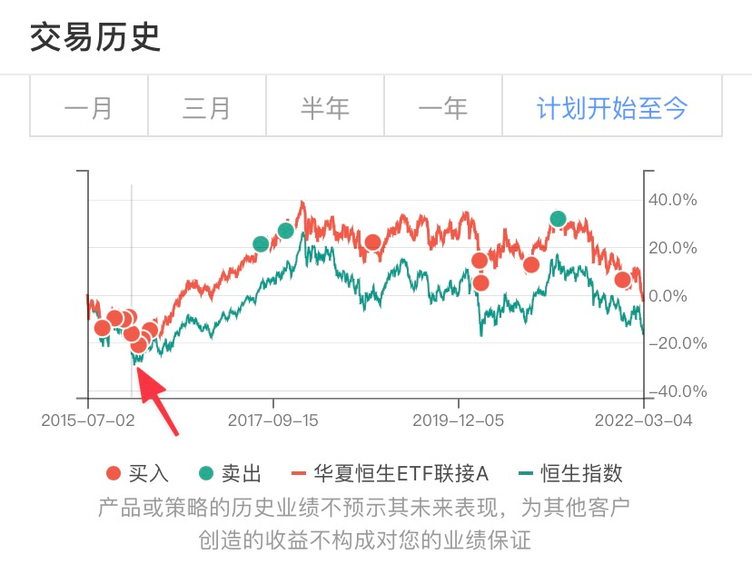
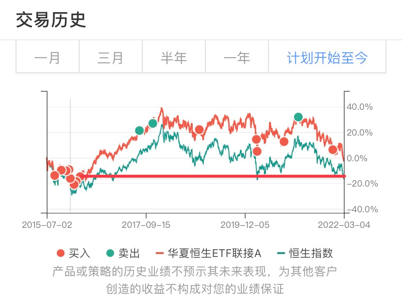

# 上一轮底部错过了，如今再给一次机会呢？

**发布时间**: 2022-03-08 08:46:44

**原文链接**: [http://mp.weixin.qq.com/s?__biz=MzUzNjE3NzQ3Nw==&mid=2247490154&idx=1&sn=8c1cd1e5a9beb6342d9ee1320aadbda7&chksm=fafb6440cd8ced56d25b5cc1c791dd07c72f5f520b4cb4863af946d43a7ec0d6579bade4d984#rd](http://mp.weixin.qq.com/s?__biz=MzUzNjE3NzQ3Nw==&mid=2247490154&idx=1&sn=8c1cd1e5a9beb6342d9ee1320aadbda7&chksm=fafb6440cd8ced56d25b5cc1c791dd07c72f5f520b4cb4863af946d43a7ec0d6579bade4d984#rd)

---

突然想写点东西，于是我就爬上来了 

最近读到隔壁孟大 2018 年 3 月的一篇文章《（市场动荡） [可以先卖掉再买回来吗](https://mp.weixin.qq.com/s?__biz=MzIzNTQ4ODg4OA==&mid=2247483898&idx=1&sn=8617ea0c49d7ccc98d005427334460e6&scene=21#wechat_redirect)？》。当时正值中美贸易摩擦，大家忧心忡忡，很多人问能不能先卖出避险。

孟大则把时间拨回了 2016 年的港股。

> 跟车（长赢）晚的朋友们经常抱怨没法买到赚钱最多的“恒生”或者“上证50”。
> 
> 可不妨回到 2016 年的 1 月，“熔断”、“人民币崩溃”、“索罗斯做空香港”、“香港边缘化”，耳边充斥着都是这样的新闻，那时候你想的是不是 “我可以先卖掉躲一躲吗？”。

然后，巧了，昨天一早打开手机，正好看到长赢又一次发车恒生的提醒（德国有时差哈，你们应该是下午）。

我翻出了长赢过往的交易记录，在上面找出了 2016 年 1 月的时间点，以及现在的位置 👇

上次港股的大幅买入时机是 2016 年，人们耳边充斥的是那样的负面新闻。

而如今港股又一次接近了当初的价格，再往下一点就可能给我们这些错过的伙伴们一次补票的机会 👇

现在，我们耳边充斥的又是哪些负面新闻呢？

而我们有没有又在纠结“能不能先卖出避险”呢？

……

**并非给大家投资建议** 。

港股的底部会在何处，作为一个普通人我实在无从判断。所以我才把大部分钱交给基金经理和主理人，选择跟投躺赚。

虽然长赢是我跟投最久、体会最深的跟投组合，但也同样并非推荐。主理人 E 大多次表示过了，他不建议新伙伴再跟，很多东西很难买到当初的价格了。

更想和大家分享的是——

我们在上涨行情中回看当时最便宜的底部，总会觉得满眼都是机会，可恨自己怎么没抓住。

但当我们真的身处底部时，**往往越是便宜，看到的场面反而越是绝望** ，甚至反思自己为什么没有早点跑。

……

在我看来，投资者分三类：

  1. 自己给自己管钱的；

  2. 自己给别人管钱的；

  3. 请别人给自己管钱；

大部分时间里，我是第 3 类，这也是绝大部分在读文章的伙伴们的状态。

作为第 3 类最普通的投资者，我们能决定的事并不多，我们不能决定基金经理买什么，也不能决定基金经理什么时候买，更不可能决定市场行情的变化。

所以我们才要花那么大的力气去寻找让自己放心的基金经理和主理人，观察他们的理念和操作，还要有耐心等待时间检验真伪、查缺补漏，以期待找到那位值得自己托付财富的主理人。

我们能决定的事儿很少。但是，我们却偏偏又掌握着最为致命的“一票否决权”。

如果真正的机会出现时，满眼望去尽是绝望时，我们慌了，一票否决，起身跑路。那前面所做的一切又有什么意义呢？

### 如果你开始质疑当初的主理人

不管市场的底部在哪，底部总有一个特征——这个时候我们的账户常常会浮亏，甚至大幅度亏损。

进而我们会开始怀疑，“当初选择的主理人还值得信任吗？”

这个时候也不能光靠喊口号「信任基金经理，信任主理人」。

刚好上周就有小伙伴在知识星球问我：

> 之前头脑一热上车了医疗白酒以及买了恒越核心，中邮还有港股。。现在亏了20%了，这种时候是应该继续加仓呢还是忍痛割肉呢 🥺🥺

我整理了一下自己面对账户亏损的思路，也许能给有同样困惑的伙伴们一些参考。我会这样审视自己的投资 👇

### 1\. 先回顾当初的买入理由

首先，我会回顾自己当初的买入理由。就我自己的投资经历而言，主要有四种：

1、跟投躺赚：把钱交给值得信任的主理人或者基金经理，然后长期持有。这样的投资，不管涨跌我都会持续买，除非用钱基本不会考虑卖出；

2、捡便宜：一些低估的指数。这样的投资，下跌以后就变得更便宜了，跌了我会想买更多（但在买之前，我会先想清楚仓位上，[留出犯错的空间](https://mp.weixin.qq.com/s?__biz=MzUzNjE3NzQ3Nw==&mid=2247490132&idx=1&sn=20769492328392a06e9c82e6dc9ebc11&scene=21#wechat_redirect)）

3、觉得要涨：比如行情来了，那买入之前我会设置一个明确的止损点（当时的习惯是 7%，不过现在基本不做这类趋势型的投资了），跌倒这个位置果断止损，如果上涨了，则跟着不断提高止损的位置；

4、套利：这个亏损概率很小，而且万一亏了也没机会补救，直接认错退出就好了。

其实大部分情况，当我回顾完当初的买入理由心里就有数了。

**我们会怀疑、会紧张焦虑，其中一个很大的原因是认知偏误中的「近因效应」** ，即最近发生的事儿在我们注意力中所占的比例是过大的（之前和[大家分享过](https://mp.weixin.qq.com/s?__biz=MzUzNjE3NzQ3Nw==&mid=2247489424&idx=1&sn=88c79942b5af47409cbdb5134f581497&chksm=fafb69bacd8ce0ace5a3d085bf8ea8ab7a8503eb3c1864ffbe254976c6be5e81d6ee2a1776f1&token=1920808340&lang=zh_CN&scene=21#wechat_redirect)）

当你身边的朋友做了一件让你特别气愤的事情时，那一瞬间你满脑子想的可能都是他如何对不起你，而不是过往 99 次对你的帮助，即使 99 远远大于 1。

当下，乌俄在我们的认知中可能会占到 50% 以上的份额，以至于让我们忘记了，乌俄的 GDP 全球占比加起来才 2%。

投资也是这样。

当我们通过回顾来降低近因效应带来的偏误，帮我们想起主理人过往面对的比这还要复杂、困难得多的局面，那个答案可能就自然浮现了。

虽然有时候光是回顾是不够的，但回顾依然能够帮助我们提升决策的质量。

### 2\. 是真的吗？

但在回顾中我们可能会发现当初的买入理由不成立了。但别急着下结论，多问一句“是真的吗？”

当初我跟投躺赚买了主动基金，觉得一直拿着就行了。结果到了 2021 年，当初的顶流基金经理大面积跑输市场，当时最普遍的观点是「大规模基金不行了」。

但我研究之后发现并非如此，基金规模对基金收益确实是有影响的，但这个影响却被严重夸大了。并非规模的问题，只是市场风格轮动而已。

所以回到问题 1，我又可以继续安心持有。

再后来经过几个月的市场调整（主要是 5 月到 9 月），顶流经理们的收益表现基本回归正常（和偏股基金平均收益基本持平），有的又重新开始出现超额收益。

不过**很多****时候，我们的分析能力是有限的，一些问题确实真假难辨** 。

这个时候我会去观察一些我信任的投资者的观点。比如今天文章的开头，我用的依然是这个思路（前面 GDP 的数据则是来自有知有行的伙伴们）。不一定要事事自己纠结，很多问题，比我们更牛的人已经准备了更好的答案 

更有意思的是，我们平时只要小心地处理好自己应该关注谁、应该关注哪些信息，在需要时答案往往就会自动被送到我们身边。比如上面我说的这些，没有一样是我自己费力搜索才找到的，ta 们都像一连串巧合一样发生了。

读孟大的微博 ➡️ 看到过去文章链接 ➡️ 碰巧长赢发车 ➡️ 找到长赢过往数据，与之并行的是有知有行伙伴们推送的对过往的复盘。

而大家在此时此刻读到我的这篇文章，不也同是这种巧合 

### 3\. 真的改变了

有时候，负面信息有可能就是真的，或者我们真的犯了错，或者事实发生改变。有可能我们选择了一位主理人，而他如今不再适合我们。

比如当初抱团买基金的基民，他们会觉得某位基金经理就是神，他管的基金能只涨不跌（尤其是过去 3 年的历史业绩确实也做到了），所以他觉得这个基金可以只买不卖。但后来抱团瓦解，想法破灭，发现基金经理也是个会亏钱的“普通人”，甚至还可能“道德败坏”（打引号的哈）。

或者有时候是事实发生了变化，比如[董承非就真的这么离职了](https://mp.weixin.qq.com/s?__biz=MzUzNjE3NzQ3Nw==&mid=2247489693&idx=1&sn=809f67f0fa9f455bf81096d7e47d42d6&chksm=fafb66b7cd8cefa14558388037ba6133149c0329bc1d18d51bf563f1fc9436028746754b4652&token=1920808340&lang=zh_CN&scene=21#wechat_redirect)。

这个时候，我们当初买入的理由就彻底发生了变化，这常常也是离开的一个重要标准。

但这个时候我们首先应该做的，**不是去考虑如何纠正错误，而是去思考自己当初为什么犯错，应该如何更新自己的投资体系才能让自己规避下次的类似错误** 。

我以前买基金的时候，经常管不住手在上涨行情中买得太早、太多，或者被一位基金经理暂时的表现所吸引，没有考虑清楚可能的逆风时期。

所以我后来更新了自己的投资决策流程——一笔新增的躺赚投资，最好要等到主理人逆风，甚至是别人在喷他的时候，我们再来认真考虑要不要大力买入。

先更新自己的决策流程，然后再去考虑行动。把困扰自己的问题重新再决策一遍，最后该做什么，不该做什么，也就清楚了。

以上就是我自己的思考流程，希望能对大家有用。

### 如果再给一次机会

作为一个“请别人帮自己管钱”的普通人，对我们而言，最重要的是对主理人的了解和信任。

不过，也因为我们只是普通人，我们依然会怀疑、会困惑，也同样会选错人。

但面对这些，最重要的却不是马上改变决策，“一票否决”，而是去更新自己做出决策的方式和体系。

上一轮行情、上一次机会我们慌了、错过了，那就是错过了，遗憾也不会带来改变。

重要的是，如果机会再一次摆在我们面前，过去这些年我们的成长、我们的变化，足够支撑我们做出不同的选择吗？

  * 财务自由：[我的财务自由实证之路](https://mp.weixin.qq.com/s?__biz=MzUzNjE3NzQ3Nw==&mid=2247490076&idx=1&sn=cf81411060ab42696da51c918eb7ac4b&chksm=fafb6436cd8ced20d62d9ba69d958e20071186ee4705a65fdd459c6751caef7a039025a5caf7&scene=21#wechat_redirect)

  * 投资笔记：[十年之约，躺赚不难](https://mp.weixin.qq.com/s?__biz=MzUzNjE3NzQ3Nw==&mid=2247490132&idx=1&sn=20769492328392a06e9c82e6dc9ebc11&chksm=fafb647ecd8ced688d8c0e1816cdb83e7139b5638af65ad7f9a2b8ebf898c6bca639dfe56cdc&token=1186910043&lang=zh_CN&scene=21#wechat_redirect)

  * 抵御风险：[2 月保险最推荐](https://mp.weixin.qq.com/s?__biz=MzUzNjE3NzQ3Nw==&mid=2247490100&idx=1&sn=cb5e3dbb81be90af3efc2dcc14687ca6&chksm=fafb641ecd8ced08b49d8fa87e04f192d8c756ddccca8366d2ce5d8dba1c7ec169da2df95a3a&scene=21#wechat_redirect)

  * 干货汇总：[财务自由路上应该了解的每一个问题](http://mp.weixin.qq.com/s?__biz=MzUzNjE3NzQ3Nw==&mid=2247489926&idx=1&sn=eac357cebcbfd7250828cdda88d9f122&chksm=fafb67accd8ceebaa1e750f129714bb000be9720a990a70c6fba6fc52fd3712014a58d699d6e&scene=21#wechat_redirect "全都安排好了，财务自由路上我们需要了解的每一个问题 原创")

**风险提示** ：本文不构成投资建议，只是我个人投资中的观察和思考。大伙参考为主，投资最终还是要独立决策，毕竟我也可能是错的。