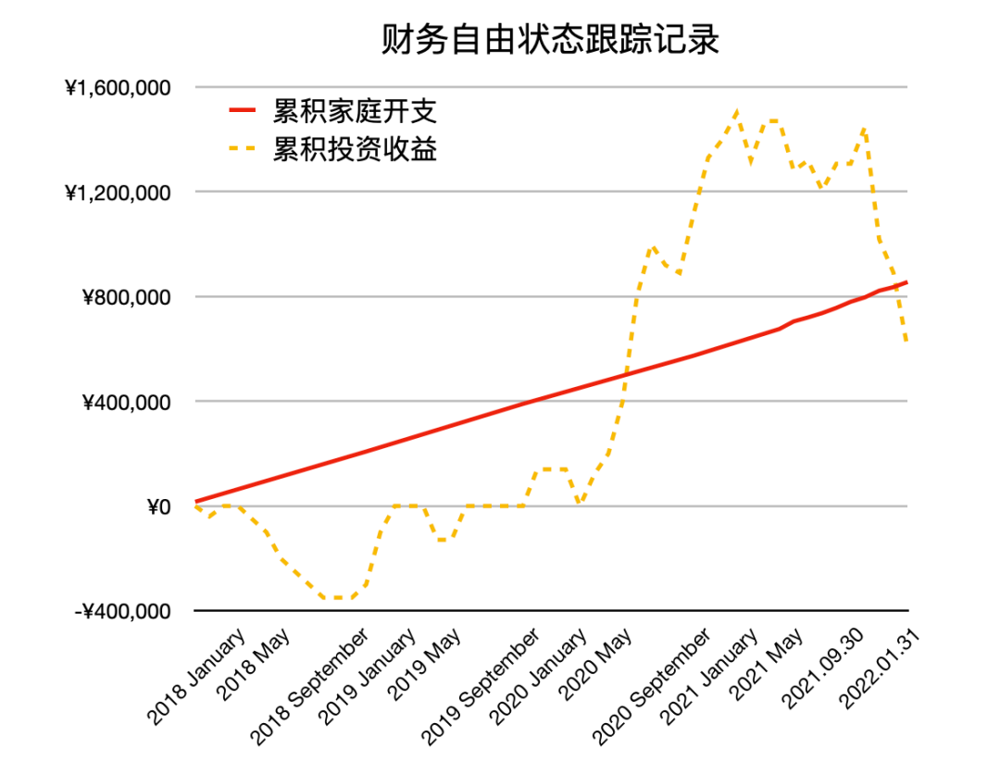

# 头一回亏这么多钱…… | 财务自由实证 #37

**发布时间**: 2022-04-01 11:30:01

**原文链接**: [http://mp.weixin.qq.com/s?__biz=MzUzNjE3NzQ3Nw==&mid=2247490203&idx=1&sn=5fd642e1543efda4dd50ffbd710c1e99&chksm=fafb64b1cd8ceda7888c0ece222c27873027b2eee3b3df4f4fb50861fa97810cf812087b2307#rd](http://mp.weixin.qq.com/s?__biz=MzUzNjE3NzQ3Nw==&mid=2247490203&idx=1&sn=5fd642e1543efda4dd50ffbd710c1e99&chksm=fafb64b1cd8ceda7888c0ece222c27873027b2eee3b3df4f4fb50861fa97810cf812087b2307#rd)

---

**普通人通过工资理财也能实现财务自由** ，这是这些年我一直在践行的理念。从最初懵懵懂懂到 2017 年制定具体的财务计划，再到如今渐渐靠近终点，已经走了五六年。

为了能够更加透明、中立地实证普通人财务自由的可能性，从 2019 年开始我决定公开自己的财务进度，成为这个系列内容「财务自由实证」

不追求大富大贵，但求能够不再纠结生计这些琐碎问题，在重大选择面前获得更多的人生选项，不再瞻前顾后。

有兴趣参考这个实证的朋友建议先看看之前的引导篇，[制定自己的财务自由计划](https://mp.weixin.qq.com/s?__biz=MzUzNjE3NzQ3Nw==&mid=2247484500&idx=1&sn=c04c3de1a1231bef25bb4cda773c00ff&scene=21#wechat_redirect)、[一起财务自由](https://mp.weixin.qq.com/s?__biz=MzUzNjE3NzQ3Nw==&mid=2247484480&idx=1&sn=258e8dd4976c7d3c324ed89b90904d14&scene=21#wechat_redirect)。以往的干货精华也都有汇总 👇

  * [全都安排好了，自由路上我们会遇到的每一个问题](http://mp.weixin.qq.com/s?__biz=MzUzNjE3NzQ3Nw==&mid=2247489926&idx=1&sn=eac357cebcbfd7250828cdda88d9f122&chksm=fafb67accd8ceebaa1e750f129714bb000be9720a990a70c6fba6fc52fd3712014a58d699d6e&scene=21#wechat_redirect)

  * [我的第一本书，整理财务自由方法论](https://mp.weixin.qq.com/s?__biz=MzUzNjE3NzQ3Nw==&mid=2247486809&idx=1&sn=8a80c493837ee044c5d55e0a423507d2&scene=21#wechat_redirect)

  * [一期访谈](http://mp.weixin.qq.com/s?__biz=MzUzNjE3NzQ3Nw==&mid=2247487473&idx=1&sn=10a891429291e78dea82b4df34e773f3&chksm=fafb71dbcd8cf8cdb15f114d6637bc6476a2803f9f0803dcbb4d91c1e68b5cc706c3dc55358b&scene=21#wechat_redirect)和[一期播客](http://mp.weixin.qq.com/s?__biz=MzUzNjE3NzQ3Nw==&mid=2247489401&idx=1&sn=a613497a5d6fdc3325d0424b9a78063e&chksm=fafb6953cd8ce045481121812b61b04f62dfe09a07b785991fc4cdd679bc9af13665d4c0ce62&scene=21#wechat_redirect)聊聊我的经历和观念

我给自己定下的目标是 30 岁前积累到**  家庭年度开支的 10 倍**，作为创造被动收入的本金。依靠这些本金实现长期 10+% 的年化投资收益就可以实现财务自由，不再依赖上班工资生活，有底气去选择自己真正想做的事儿。

（我的具体目标数字是 500 万，但**这个数字大家没必要参考** ，还是要以自己的生活开销为准）

财务自由路上一些重要节点：

  * 2017 年，计划正式开始，同年获得家人的认可和支持；

  * 2018 年，A 股熊市大跌，出现“钻石坑”机会；

  * 2019 年，开始财务自由公开实证（就是现在大家看到的这个系列）；

  * 2020 年，新冠股灾，自由之路上的又一个关键机会；

  * 2021 年，[自由目标基本达成](http://mp.weixin.qq.com/s?__biz=MzUzNjE3NzQ3Nw==&mid=2247489120&idx=1&sn=e5c5bf6d51914c212c228bc6f42346dc&chksm=fafb684acd8ce15c27cd508a67d57573f4acbeced75f805ef271b4efcf42cf54b363e5f93fcf&scene=21#wechat_redirect)，开始向新的节奏过渡；

  * 2022 年，遭遇自由后的第一次账户大幅回撤，但也是港股 6 年后的又一次钻石坑，期待后续……

### 实证账户更新

注：记账工具为[有知有行](http://mp.weixin.qq.com/s?__biz=MzUzNjE3NzQ3Nw==&mid=2247487794&idx=1&sn=b9db83140ef56b777315a5e415954736&chksm=fafb6f18cd8ce60eeebe855dcd793f173a5589e51657877fb9e8a2fff629eeb17688a40e2766&scene=21#wechat_redirect)，每次都有小伙伴问。

为了跟踪财务自由状态的**可持续情况** ，[从第 30 期开始](http://mp.weixin.qq.com/s?__biz=MzUzNjE3NzQ3Nw==&mid=2247489372&idx=1&sn=2118934ef05d930f50d2510ff6642cb1&chksm=fafb6976cd8ce06042f2bb8d1ed950a95262d11451fe116440e1ff84ca49c6fdae8a5d664a6d&scene=21#wechat_redirect)我琢磨出了一个新的工具——同时跟踪「累积家庭开支」和「累积被动收入（投资收益）」曲线。关注两条线的趋势变化，如果投资收益曲线长期趋势在家庭开支上方，就说明这个状态是可持续的 ↓ 这是最新记录

财务自由的投资和被动收入虽然看起来性感，但「因上努力，果上随缘」，本金和收益只是自由路上的「果」，**主业努力多赚钱、理性消费少挥霍，以此积累本金，再加上不被短期涨跌干扰、坚持投资才是背后的「因」** 。

投资复利只是我们获得被动收入的方式，而不是致富的秘密。

在财务自由实证的最初两年，我写得最多的也不是如何投资，而是如何**少在投资上花时间** ，好能多花时间关注主业，同时理性控制开销，尽快攒钱。

假如有 10 万本金，就算投资翻倍也才赚了 10 万。而投资翻倍极其困难，巴菲特的年化收益也才 20%。相比之下，在职场上努力提升，让收入再增加 10 万则要靠谱得多。

对财务自由而言，投资做到 80 分足矣，剩下的精力还是应该关注赚钱和省钱。

### 头一回亏这么多钱……

论账户下跌的百分比，现在还没有 2018 年幅度大。但论浮亏的绝对金额，这应该我从投资以来亏得最多的一次了。

我问自己，有啥感觉？

一方面，看到下跌时带来的各种便宜买入的机会，让自己的新钱能够以更低的成本积累资产，买到便宜货，这是件很开心的事儿。

但另一方面，回头清点账户看到自己的“总资产”不可避免地减少了，心里还是会有点郁闷。也太也跟我念叨，唉，这不一年上班白干了嘛……（幸好还只是一年 😂）

之前和关哥录[那期播客](http://mp.weixin.qq.com/s?__biz=MzUzNjE3NzQ3Nw==&mid=2247489401&idx=1&sn=a613497a5d6fdc3325d0424b9a78063e&chksm=fafb6953cd8ce045481121812b61b04f62dfe09a07b785991fc4cdd679bc9af13665d4c0ce62&scene=21#wechat_redirect)时关哥问我，这些年写财务自由实证的感觉如何？

我说，感觉到自己的情绪会被明显放大。

看到实证数字的上涨，目标不断临近，再听到小伙伴们的祝贺，会更兴奋，更容易忘乎所以；下跌时，也是因为实证，反过来负面情绪也会更多。

但也是因为这样，我更意识到一件事儿。

对投资的种种思考，也许并不能帮我们完全放下情绪。再次遇上下跌、再次遇上危机，我们可能依然会感到郁闷，遭遇各种各样的负面情绪。

但我们却能学会识别、隔离或是利用这样的情绪，[尽量避免情绪传到到投资的动作上](https://mp.weixin.qq.com/s?__biz=MzUzNjE3NzQ3Nw==&mid=2247490172&idx=1&sn=d371a6a36847b4a3b42089fd7d5799ac&scene=21#wechat_redirect)，而不是被负面情绪牵着走。

郁闷过后，继续往前看。

就像之前几年实证账户不断上涨时，每一期我都会和大家重复的：

> 财务自由的投资和被动收入虽然看起来性感，但「因上努力，果上随缘」，本金和收益只是自由路上的「果」，主业努力多赚钱、理性消费少挥霍，以此积累本金，再加上不被短期涨跌干扰、坚持投资才是背后的「因」。

投资赚钱是为了更好地生活，不管是高潮、还是低谷，最后总要回到生活上。

### “偶遇”一批不愿退休的人

最近我有个挺触动的经历，跟大伙唠唠～

我常去的那家兽医诊所这个月要关门了，医生今年 70 岁，终于决定退休，比法定退休年龄 65 岁晚了 5 年。

这是我在德国这几年遇上的第三次医生退休了，第一次是牙医，第二次是家庭医生，这是第三次。

德国的医疗体系和国内不太一样，德国大部分医生都是自己开诊所，属于自由职业，而不是在医院工作（就和韩剧《海岸城恰恰恰》里面女主开的那种一样

）。

而且病人就医也一律先去诊所，诊所解决不了的疑难杂症或者大手术，再或者半夜急诊这种，才允许去医院。生病直接去医院是不收的，必须要出示医生的转诊单。

从体验上来说，最大的区别可能就是**每次生病我们看的都是同一位医生，一看就是很多年** 。医生会很了解你的状况，熟门熟路，就像这家我最常去的兽医诊所，打电话一报宠物的名字医生就大概知道我想问啥了（哦哦，对了，今年我和也太养了一条边牧，去兽医的次数又明显增加）。

所以每次遇上医生退休都不适应好一段时间……

……

后来我们闲聊，医生说，她已经连续好多年没休过假了，这下可以好好休息一下了。

我说，不过这也说明你很享受这份工作啊，有份自己喜欢的工作，属于自己的诊所，想想也很幸福。

她说，是呀，要不然我怎么可能一直干到 70 岁，这家诊所我已经开了 34 年。

我心里暗暗算了一下，德国医生都是博士毕业，毕业差不多就快 30 岁了。往回算，刚刚开始工作没几年就开了这家诊所，然后一干就是半辈子。

我赶上过三次医生退休，发现他们退休年龄都明显比标准退休年龄晚。

去年退休的家庭医生已经年近 80 了，听说是本来退休了，但又回来再干了十几年。而且接任诊所的医生看起来也有 70、80 了，还在继续看病……

……

为啥他们不愿意退休呢？

我代入想了想，发现了一件挺奇妙的事儿。

说起“长期”，“几十年”，我们常常第一个反应是“哦，这好难”。

但换个视角，**有没有可能长期其实比短期更容易呢、更幸福呢？**

从短期“每天”的角度看，医生的工作是咨询、治病、开药，和一般上班无异。

但如果从几十年的角度呢？却不再是把工作简单地重复几十年。

如果是很长期的医患关系，还会看着当初来看病的小朋友逐渐长大成人，最后组建自己的家庭，甚至给他们的孩子继续看病…… 看着来看病的同龄人和自己一样一点点变老，但你们可能都还记得对方年轻时的样子…… 想想就挺幸福。

看短期的，我们看到的可能只是不断的重复；但看长期，看到的却是相互陪伴，一起成长。

而且新病人和新医生的短期组合，开始总是免不了摩擦和不信任。但如果是长期呢？长期关系带来的信任感天然就能解决很多不必要的麻烦。

再加上德国医生的诊所大多是自己的，是完全属于自己的一份事业，如果是我的话，可能也会不愿意退休……

……

聊起财务自由，我们常说“自由是当你不想做一件事儿时可以不做”，“财务自由的意义在于不用仅仅为了钱，不得不去完成对人生没什么意义的任务”。

但是在获得自由以后，在能够拒绝不想做的事儿以后，我们又不免会想，那我想做的事儿是什么呢？不去做没意义的任务，那究竟哪些任务是我擅长的、有意义的呢？

我从德国医生这里受到了不小的启发，对我来说，可能是这几个字——**关注真正属于自己的长期关系，解决一个个具体的问题。**

可能有的小伙伴会问，上哪找像德国医生这样的工作？

老实说，我也不知道。但我记得这句话：

> 影响幸福感的，主要的是我们做事儿的方式，其次才是我们在做的事儿。
> 
> ——《活在当下》

仔细想想，其实每项任务都有长期关系和短期关系（不一定是和人的，也可能是事本身，比如钱），也都有笼统的问题和具体的问题。

重要的还是我们自己选择的方式。

就像大家在读的公众号，追求短期效果的号主不在少数，不少人说国内的媒体环境就是浮躁。但在这样的环境之下，我们不也建立起了这样的长期关系。这份实证我写了 3 年，公众号我写了快 5 年，大家看着我的生活一步步向前，我也在见证着大家的成长。

笼统的问题，还是具体的问题，也依然是我们自己的选择。老实说，今天这篇写完我就感觉有点不具体，可能会是一篇「恩，说得挺有道理」，然后放下手机，生活没有一丝变化的文章。以后我会尽量少写，还是多关注具体的问题。

关注点和做事儿的方式，可能比在做的事儿更重要。我会从这个角度去进一步考虑一下自己的生活和工作。

以上一点最近的思考，分享给大家。

最后。感觉挺好玩的一件事儿，很多人开始关注财务自由可能都是因为想退休，至少我当初就是这样。但这条路到最后，却可能会通往一条让我们不想退休的事业。

  * 财务自由：[我的财务自由实证之路](https://mp.weixin.qq.com/s?__biz=MzUzNjE3NzQ3Nw==&mid=2247490076&idx=1&sn=cf81411060ab42696da51c918eb7ac4b&chksm=fafb6436cd8ced20d62d9ba69d958e20071186ee4705a65fdd459c6751caef7a039025a5caf7&scene=21#wechat_redirect)

  * 投资笔记：[十年之约，躺赚不难](https://mp.weixin.qq.com/s?__biz=MzUzNjE3NzQ3Nw==&mid=2247490195&idx=1&sn=780a14510603bad6a4c96eafebb65c8f&chksm=fafb64b9cd8cedafa3c339c19b013598d83d0110b3add3a6e85df75c7eb3f4a6487a27383571&scene=21#wechat_redirect)

  * 抵御风险：[2 月保险最推荐](https://mp.weixin.qq.com/s?__biz=MzUzNjE3NzQ3Nw==&mid=2247490100&idx=1&sn=cb5e3dbb81be90af3efc2dcc14687ca6&chksm=fafb641ecd8ced08b49d8fa87e04f192d8c756ddccca8366d2ce5d8dba1c7ec169da2df95a3a&scene=21#wechat_redirect)

  * 干货汇总：[财务自由路上应该了解的每一个问题](http://mp.weixin.qq.com/s?__biz=MzUzNjE3NzQ3Nw==&mid=2247489926&idx=1&sn=eac357cebcbfd7250828cdda88d9f122&chksm=fafb67accd8ceebaa1e750f129714bb000be9720a990a70c6fba6fc52fd3712014a58d699d6e&scene=21#wechat_redirect "全都安排好了，财务自由路上我们需要了解的每一个问题 原创")