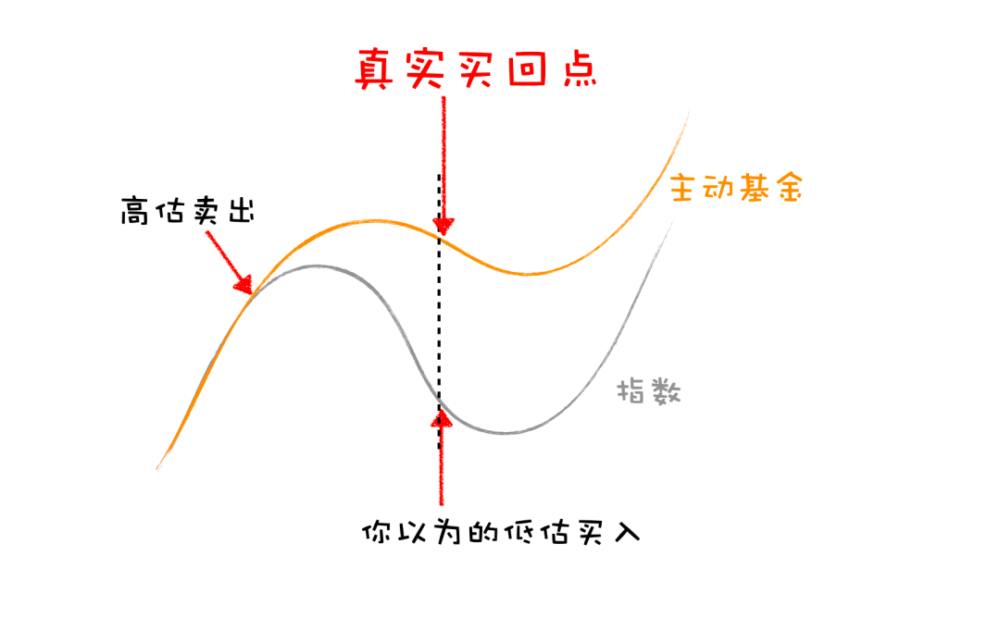
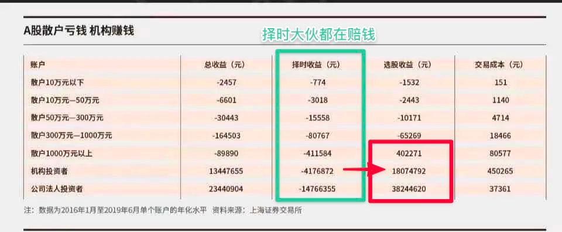

# 止盈

**发布时间**: 2022-04-19 09:51:02

**原文链接**: [http://mp.weixin.qq.com/s?__biz=MzUzNjE3NzQ3Nw==&mid=2247490214&idx=1&sn=571185c8582093dd300c6f54c939a12b&chksm=fafb648ccd8ced9a5f11ab500d86def4ea769b547bb5df6551ffe49aa131926bb0b4483ae7d8#rd](http://mp.weixin.qq.com/s?__biz=MzUzNjE3NzQ3Nw==&mid=2247490214&idx=1&sn=571185c8582093dd300c6f54c939a12b&chksm=fafb648ccd8ced9a5f11ab500d86def4ea769b547bb5df6551ffe49aa131926bb0b4483ae7d8#rd)

---

> 当我们通过投资赚到了 1000 元时，家人会为我们的收益感到高兴。
> 
> 但当我们投资先是赚了 3000 元，然后亏损 1500，最后赚到 1500 元时，家人会为我们多赚的 500 而开心嘛？
> 
> 很可能不会了，更多的反而是一种后悔：为什么你没有在 3000 元时卖出呢？

这是我在一两年前作为旁观者写下的一段观察。

但当我作为参与者，看到这样的经历真实发生在自己身上的时候，感受又有些不同。

我在投资中的一个理念——**以跟投躺赚为思路的投资，我不会止盈，因为这样长期收益更高** ——始于我在两年前做过的一次回测。

当时我用自己了解相对较多的三只基金做了回测，结果发现，如果在过去 07 年和 15 年的股市行情中，我们在高估时期止盈，等到市场低估再买回来，收益不但不会增加，反而会减少。比如：

> （15 年行情）市场温度计达到 70 度高估止盈，回到 30 度低估买回。
> 
>   * 基金 A，你将错失 67 个百分点收益；
> 
>   * 基金 B，你将错失 65 个百分点收益；
> 
>   * 基金 C，你将错失 67 个百分点收益；
> 
> 

> 
> ……为什么会这样？我画了一张图，主动基金止盈里面最大的 bug 在于（长期来看）基金经理是有超额收益的 👇，你买回来的成本更高了。
> 
> 
> 
> ——当时的原文：[ 世界观崩了，主动基金不止盈 ](https://mp.weixin.qq.com/s?__biz=MzUzNjE3NzQ3Nw==&mid=2247486846&idx=1&sn=ad27f2cc2e88fc8b982ab66a3cf3bc6a&scene=21#wechat_redirect)

最近这段时间我又补充了一个新的数据，**如果不是某只牛基，而是全市场所有偏股混合基金的平均值呢？** 这样更能排除运气的因素。

最后的结论依然不变——止盈，低估再买回来，会让我们错过 33% 的收益。

如果一笔投资是以信任某位主理人为基础，比如选择主动基金就是信任背后的基金经理，选择指数组合就是信任背后的主理人，那么长期来看收益最高的方式就是不折腾，长期持有，把决定权交给基金经理或者主理人。

虽然这样我的投资账户会相比于止盈遭遇更大的回撤，但如果有个平行世界，那个世界里的我在高估时期止盈了基金，等着低估再买回来。那最终，还是这个世界的我积累下的资产更多。

所以在这类投资中，不止盈，这是我不会妥协的部分。

……

但是在这次的回撤中，我也真实地感受到了家人的焦虑与不安。

负面情绪是一种提醒，赚钱本是为了幸福、快乐，但如果赚钱的过程反而带来了更多的焦虑和不开心，也许就说明有些地方是值得优化和改进的。

于是我开始思考，也许在止盈和减仓之外，有哪些方法可以帮助我们在**不牺牲长期收益的前提下，降低回撤带来的焦虑** 呢？

### 改变思路，以买代卖

私募经理冯柳有一个观点对我启发很大，这个观点我以前也在文章中给大家[分享过几次](https://mp.weixin.qq.com/s?__biz=MzUzNjE3NzQ3Nw==&mid=2247489478&idx=1&sn=18dd1c9a3428b04a2d18c0aadea670f1&chksm=fafb69eccd8ce0fa6ed644fc087e72bc829bee7e1a8dff757b7658fb97a3176f0d987f2e4770&scene=21#wechat_redirect)——

> 他在采访时提到自己在投资上会保持满仓。
> 
> 即使对于专业投资者而言，纠结卖出也是个极度消耗心力的任务，这需要我们判断这笔投资后面是涨是跌。
> 
> 而且事实证明，不管是散户还是专业投资者，大部分人都做不好这件事儿。之前给大家分享过这张上交所的统计图 ↓
> 
> 
> 
> 但如果保持满仓，问题就会变简单。择时卖出问题就会变成选择投资的问题，通过发现更好的投资来把不再符合自己预期的投资替换掉。
> 
>   * 预测一笔投资未来是涨是跌，这非常难；
> 
>   * 但把问题换成两笔投资更看好哪个，虽然依旧不容易，但至少难度明显下降了 ↓
> 
> 

从这个角度出发，我才后知后觉地发现原来我关注的几位回撤比较低的主理人也在用类似的思路：

比如 2015 年的牛市泡沫，他们退出股市并不仅仅是因为股市高估，更是因为发现了低估的分级 A。

再比如 2021 年核心资产泡沫，也有不少小伙伴是因为发现了低估的可转债机会从而躲过下跌。

通过「买入」来取代「止盈」，也许会是一个不错的思路。

于是带着这个启发，我试着改变了一下提问的方式。**不再是“现在高估了，要不要止盈”，而是问自己“如果现在有泡沫，有高估，哪些主理人会更擅长呢？”**

这样一来就把止盈问题变成了买入问题。

前面我和大伙写道，以偏股混合基金平均收益为参考，如果我们高估时期止盈，低估再买回来，反而会错过 33% 的收益。

重点部分👇

那如果高估时我们不是止盈，而是把手里的基金换成回撤稍低、上涨还有收益的平衡型混合基金呢，等低估时期再换回偏股混合基金呢？

结果非常巧合，他们在从 2015 年 2 月市场进入高估，到 2018 年 2 月市场重回低估的这段时间里，收益居然同为 33%。我后来也测试了几种不同的调仓时间点，发现他们的收益率都很接近，基本只有个位数的差异。

这个思路并不会损失主动基金长期持有的收益。

但同时期回撤却明显减少了：

  * 偏股混合基金在 15 年牛市过后平均回撤为 37%；

  * 平衡混合基金在这段时间的回撤缩小到了 25%；

改善还是挺明显的。

而如果要通过减仓或者止盈把回撤从 37% 降低到 25%，我们最终会因此而错过 10% 的收益，甚至还可能更多。

### 如果我错了呢？

而且这个思路还有个比较吸引我的地方——容错率更高。

我们回看过往的投资数据会发现，往往越是牛市末期，市场涨幅越大。2015 年就是个非常极端的例子，这轮行情持续了 3 年，但其中一半的涨幅都发生在最后的 3 个月。

选择止盈和减仓，我们操作的容错率很低，早几个月、晚几个月结局会非常不同。时间早了，大部分收益都错过了，晚几个月，可能市场都跌完了。

「高估时要止盈」这句话说起来很有道理，但一个现实问题就是**大部分人对高估的判断是有巨大误差的** 。

但如果把思路换成「如果现在有泡沫，那么哪位主理人在过往泡沫中表现更符合我的预期？」，就能减少这个误差的影响。这样一来我们从未退出市场，即使事后证明我们看错了，当时没有泡沫，我们也不会错过长期收益。

这是我对躺赚跟投思路的一次迭代。

### 收益没增加，那这有啥用？

之前读 E 大干货合集时记下的一句话，如今我理解更深了一些：

> 保证自己在大牛市中吃饱吃好的同时，在等待牛市的过程中不会饿死或者悲观到放弃理想。

以前做投资，我对回撤并不是特别在意，更关注收益数字。如果有一笔新投资的预期收益和我已有的投资一样，但中间的回撤要小一些，我可能会懒得折腾，反正长期持有到头来结果都一样嘛。

但如今这个看法在一点点转变，尤其是当我不仅仅在管自己的钱，也在管家人的那一份时。

也许长期来看几种投资方式的预期收益并不会有很大的区别，但这个前提却是真正做到长期。但意外总会发生，如果发生意外，我们突然在市场底部需要用钱呢？或者我们真的悲观到放弃理想，结果就会有巨大的不同。

这些年我对止盈的看法发生过两次明显的转变：

1、最开始，我和大部分人一样，觉得投资应该止盈，止盈才能留住收益。

2、但后来我渐渐发现，大部分止盈操作短期来看确实留住了利润，但却因此错过了更大的长期收益。这与我止盈的初衷背道而驰，那还不如不止盈。

3、再到现在，我注意到了控制回撤还有止盈之外的方法。以此为目标，也可以在不牺牲长期收益、不犯大错的前提下，试着降低账户的回撤，降低焦虑。可以着手为下一次牛市扩充武器库了。

一点思考，供大家参考。

  * 财务自由：[我的财务自由实证之路](https://mp.weixin.qq.com/s?__biz=MzUzNjE3NzQ3Nw==&mid=2247490203&idx=1&sn=5fd642e1543efda4dd50ffbd710c1e99&chksm=fafb64b1cd8ceda7888c0ece222c27873027b2eee3b3df4f4fb50861fa97810cf812087b2307&scene=21&cur_album_id=1319255999014043648#wechat_redirect)

  * 投资笔记：[十年之约，躺赚不难](https://mp.weixin.qq.com/s?__biz=MzUzNjE3NzQ3Nw==&mid=2247490195&idx=1&sn=780a14510603bad6a4c96eafebb65c8f&chksm=fafb64b9cd8cedafa3c339c19b013598d83d0110b3add3a6e85df75c7eb3f4a6487a27383571&scene=21#wechat_redirect)

  * 抵御风险：[3 月保险最推荐](https://mp.weixin.qq.com/s?__biz=MzUzNjE3NzQ3Nw==&mid=2247490182&idx=1&sn=6c938097564f69085efd1822e6b88edb&chksm=fafb64accd8cedba0b2ac5be06f7b67c496f42d85e0fbd6552f1bdf38949dd06ddaba42b60fe&token=636161175&lang=zh_CN&scene=21#wechat_redirect)

  * 干货汇总：[财务自由路上应该了解的每一个问题](http://mp.weixin.qq.com/s?__biz=MzUzNjE3NzQ3Nw==&mid=2247489926&idx=1&sn=eac357cebcbfd7250828cdda88d9f122&chksm=fafb67accd8ceebaa1e750f129714bb000be9720a990a70c6fba6fc52fd3712014a58d699d6e&scene=21#wechat_redirect "全都安排好了，财务自由路上我们需要了解的每一个问题 原创")

**风险提示** ：本文不构成投资建议，只是我个人投资中的观察和思考。大伙参考为主，投资最终还是要独立决策，毕竟我也可能是错的。