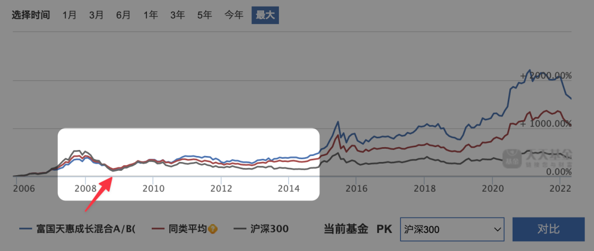

# 还有多久能重回新高

**发布时间**: 2022-04-20 15:58:02

**原文链接**: [http://mp.weixin.qq.com/s?__biz=MzUzNjE3NzQ3Nw==&mid=2247490223&idx=1&sn=900754a68983d0982b01bd5eaf89db1e&chksm=fafb6485cd8ced935d4ed2db07c34da894b37315e7b41bd1ee1d7ac656da5165ae39dac68da8#rd](http://mp.weixin.qq.com/s?__biz=MzUzNjE3NzQ3Nw==&mid=2247490223&idx=1&sn=900754a68983d0982b01bd5eaf89db1e&chksm=fafb6485cd8ced935d4ed2db07c34da894b37315e7b41bd1ee1d7ac656da5165ae39dac68da8#rd)

---

有的小伙伴在问「亏了这么多，应该怎么办？」，有的小伙伴在问「现在跌了这么多，是不是到 all in 的时候了？」。

我自己的实证账户收益最高时曾到过 140 万，现如今已经缩水到了 60 万。人总有一种期待——当我看过高处的风景以后，总会怀念上面的景色，我也不免好奇，我的账户收益数字何时能够重回新高？

这些问题也许在今天的文章中都能找到答案。

先和大家说个最简单粗暴的数据，我找了偏股混合基金的平均收益数据：

  * 重回 2007 年的高点是在 2014 年，用了**  7 年**；

  * 重回 2015 年的高点是在 2020 年，用了**  5 年**；

不知道大伙看到这个数字有啥感想，我的感觉，比以为的要长。

而且不仅如此，如果市场再来一波 2015～2020 这几年的走势，即使我们是在 2015 年股灾结束后的最低点买入，看起来非常完美的时机了对吧？那等到真正开始赚钱也要大约 3～4 年的时间，中间市场会有相当长的横盘时间 👇

昨天的文章下面不少小伙伴留言提到自己在补仓中，我自己也在持续定投。

所以我就有些好奇，我们的补仓和定投会持续降低成本，那它们会不会帮助我们更早获得正收益呢？

结果我发现有些遗憾，这样的情况下，**虽然他们确实能够提前账户回正的时间，但幅度却比预期小** ，前后只能提前个小半年（在 2015～2020 年的情况下，后面还会提到另一种情况）

补仓的意义更多在于当上涨到来时，获得更大的收益，但却不一定能够把收益提前，这是我们要注意的。

所以**不论市场多便宜都要记得，只用闲钱投资，不管是买入还是补仓都是如此** 。确保自己等得起这么长的时间，不会倒在黎明前。

我先说的是比较糟糕的情况，咱们平常心，放低预期。

……

可能很多本来跃跃欲试的小伙伴一看这个数字顿时心里拔凉，一个想法随之而来——既然行情有可能好几年后才来，那是不是先别投资了，等以后再说。

所以我们现在换个时间，来看看 2007～2015 年的情况 👇

结果反过来了：

  * 如果我们在下跌后低点买入，短时间内就能获得近乎翻倍的收益，明显提前账户回正的时间；

  * 如果我们打算等一等，等到的反而是随后 3～4 年再没什么明显的涨幅。

而且像这样市场短时间大幅上涨的例子还不少，比如最近的 2020 年 7 月，我亲身经历更深有体会。市场涨起来就是几天的事儿，7 月 7 日大家还在讨论是不是牛市，10 天之后这波上涨已经结束了…… 👇

等来的未必是“机会”，也可能是“错过”。

有心的小伙伴可能已经发现了，决定性的因素就是闪电啥时候批下来。投资是个概率问题，到底市场会像 2015 年以后那样先趴窝几年再上涨，还是像 2007 年那样快速反弹然后再趴窝几年，亦或者来一轮长牛，我们并不能知晓。

……

回看完过往数据的两个想法，供大伙参考：

1、不是闲钱的钱，比如生活备用金、买房钱、结婚钱这种，不管市场多便宜都不要一时冲动拿去长期投资，这是原则。

当下我们常常会觉得这些原则太过死板，不够变通，但事后却会倍感庆幸。

给大家分享一个我自己的经历。我在 2021 年初为了准备 2 年以后的买房首付时变现了不少投资，因为他们不再是闲钱了。在当时那个市场环境下我是觉得些许遗憾，觉得会错过不少收益，但现在回头看看，遗憾反而变成了庆幸。

原则之所以是原则，就是因为 ta 不应该因为我们的主观判断而改变。

2、但如果确认是闲钱，我会该买就买，不等。我们换个角度再看看这张图 👇

实际上我们不管是早买还是晚买，成本相差不会太多，都是在这轮上涨的山脚下。早买在当时短期看起来虽然是不明智的，但长期来看却帮我们积累了更多低位的筹码。

“熊市看收益率，牛市要看本金”，决定收益量级的不是收益率的那点区别，而是我们低位投入本金的数量。带给我们收益的也不仅仅是牛市，更是我们在熊市中的持续播种。

在最坏的情况下要能活下来，和遇到最好的情况能不后悔，同等重要。

  * 财务自由：[我的财务自由实证之路](https://mp.weixin.qq.com/s?__biz=MzUzNjE3NzQ3Nw==&mid=2247490203&idx=1&sn=5fd642e1543efda4dd50ffbd710c1e99&chksm=fafb64b1cd8ceda7888c0ece222c27873027b2eee3b3df4f4fb50861fa97810cf812087b2307&scene=21&cur_album_id=1319255999014043648#wechat_redirect)

  * 投资笔记：[十年之约，躺赚不难](https://mp.weixin.qq.com/s?__biz=MzUzNjE3NzQ3Nw==&mid=2247490195&idx=1&sn=780a14510603bad6a4c96eafebb65c8f&chksm=fafb64b9cd8cedafa3c339c19b013598d83d0110b3add3a6e85df75c7eb3f4a6487a27383571&scene=21#wechat_redirect)

  * 抵御风险：[3 月保险最推荐](https://mp.weixin.qq.com/s?__biz=MzUzNjE3NzQ3Nw==&mid=2247490182&idx=1&sn=6c938097564f69085efd1822e6b88edb&chksm=fafb64accd8cedba0b2ac5be06f7b67c496f42d85e0fbd6552f1bdf38949dd06ddaba42b60fe&token=636161175&lang=zh_CN&scene=21#wechat_redirect)

  * 干货汇总：[财务自由路上应该了解的每一个问题](http://mp.weixin.qq.com/s?__biz=MzUzNjE3NzQ3Nw==&mid=2247489926&idx=1&sn=eac357cebcbfd7250828cdda88d9f122&chksm=fafb67accd8ceebaa1e750f129714bb000be9720a990a70c6fba6fc52fd3712014a58d699d6e&scene=21#wechat_redirect "全都安排好了，财务自由路上我们需要了解的每一个问题 原创")

**风险提示** ：本文不构成投资建议，只是我个人投资中的观察和思考。大伙参考为主，投资最终还是要独立决策，毕竟我也可能是错的。