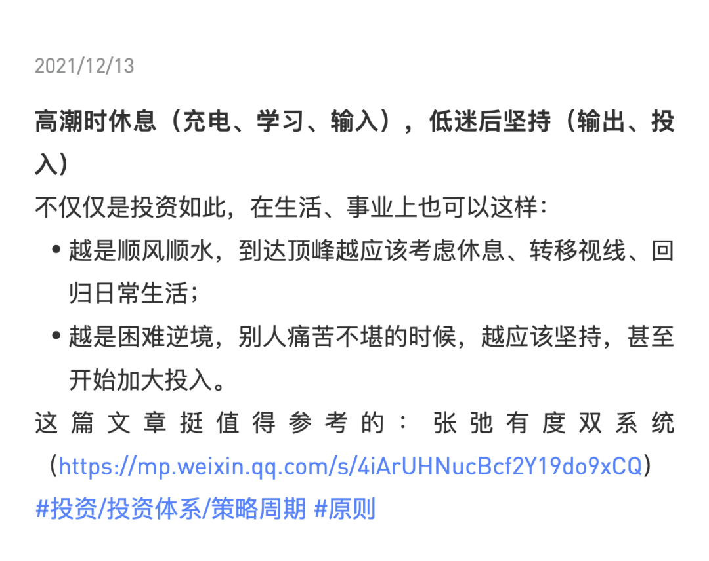

# 高潮时休息，低迷后坚持

**发布时间**: 2022-04-27 10:19:05

**原文链接**: [http://mp.weixin.qq.com/s?__biz=MzUzNjE3NzQ3Nw==&mid=2247490276&idx=1&sn=16f08e192fbed25a8c09a3d22ed24a90&chksm=fafb64cecd8cedd8ad00b12cd1bb03e10e1eea6f6a18924e90b70ff9db4af5f93d33a4a26c07#rd](http://mp.weixin.qq.com/s?__biz=MzUzNjE3NzQ3Nw==&mid=2247490276&idx=1&sn=16f08e192fbed25a8c09a3d22ed24a90&chksm=fafb64cecd8cedd8ad00b12cd1bb03e10e1eea6f6a18924e90b70ff9db4af5f93d33a4a26c07#rd)

---

最近市场行情不好，我时常收到大伙这样的留言：

> 现在亏了 20%、30%，很难受，应该怎么办？

这样看着账户下跌的体验我感同身受，我自己的账户目前也在面临大幅回撤，看着账户从最高点慢慢抹去 7 位数的收益。这张实证图还只是前 3 个月的数字，4 月的诛心一跌还没算进去……

但我觉得这种“难受”真不是靠安慰和按摩就能解决的，我们不妨来看看这个数据：

  * 2019 年，偏股混合基金平均上涨 33.57%（**注意，这都是全体平均值，不是某一只牛基的数据** ，数据来自天天基金）

  * 2020 年，偏股混合基金平均上涨 41.00%

  * 2021 年，偏股混合基金平均上涨 8.18%

  * 今年，基金经理们确实很难，整体亏损是比较痛苦的 -26.92%

看着这几个数字仔细想想，如果我们的账户拿到今天是亏损的，亏损的根源真的是这波下跌吗？

全体偏股基金在今年下跌 30% 以前，已经累计上涨了超过 100%。为什么前面这么高的收益我们没赚到，却唯独扛下了 2022 年的亏损？

为什么在基金大幅上涨以前，在 2018 年，却少有人买呢？

……

2020 年，也就是主动基金开始被广泛关注时，我分享过这样一篇心路历程：

现在，2022 年，情况又一点点回到了 2018 年时的样子。

“为什么在基金大幅上涨以前，在 2018 年，却少有人买呢？”

我们如今所看到的就是答案。

……

昨天的文章有小伙伴留言说：

> 经过董承非离开，心理上好像就不是那么喜欢主动基金了。

跟随多年的董承非离职了，这确实让我开始重视基金经理个人的风险了。但我的结论却相反，看完各种数据后我更喜欢主动基金了，因为我发现主动基金的优势不是来自某一位基金经理，而是这个群体的智慧。

这两天我偶然结识了一位和我同样一直研究主动基金的小伙伴，结果非常震惊地发现，我们俩这些年的思维变迁竟然惊人地相识：

  1. 都是从选择自己信任的基金经理开始；

  2. 到开始一点点意识到均衡配置的意义；

  3. 再到发现整个公募基金行业的收益不仅仅是来自某位基金经理，更是来自整个行业。

在这个过程中，我们对主动基金，对基金经理们的信心变得越来越强。

**投资主动基金的锚，并不是某一位基金经理的认知，而是整个公募基金行业的群体智慧。**

我们投资公募基金所获得的收益，短期看是来自基金经理，但长期来看却是受益于整个公募基金行业。

是这样一个投资哲学——相信基金经理这些专业的人，他们的平均智慧要高于所有投资者（比如你和我）的平均值。

且慢整理过一张统计数据，是偏股型主动基金相比于全市场指数历年来的累积超额收益。几乎每隔几年，基金经理们都会出现一段时间的跑输，上一次正是 2018 年 👇

但随后每一次，基金经理们总会再次积累起更大的超额收益 👇

……

去年底，我的实证账户又一次向收益高点发起了冲击（当然现在知道了，未果），但我自己却不小心生病了，于是决定提前实践 2022 年给自己的计划——不做太多计划，过个间隔年，给自己一个休整思考的时间。

不知道是巧合还是宇宙又一次发来了信号，就在第二个星期，我读到了一个让我很受启发的观点——“高潮时休息，低迷后坚持”，于是写下笔记：

当时我想着，休整过后为低迷时期做好准备。只是实在没想到，仅仅时隔 3 个月，我们就从高潮走到了低迷。

E 大在前天的文章中也分享了他的数据——时隔 3 年半，[A 股再一次走到了“钻石坑”](https://mp.weixin.qq.com/s?__biz=MzIwMTIzNDMwNA==&mid=2653411105&idx=1&sn=ef32e659052a1697cc0939dcd31a680d&scene=21#wechat_redirect)。

回顾基金行业过去这 4 年的收益，我们可能会感慨，如果我在 2018 年大幅买入该多好。时间回不到过去，但历史总会轮回。现在，又是第二个 2018。

是时候为信仰充值了，我会选择坚守，持续投入。我的位置在这里：

如果像过往 20 年的历程一样，低迷过后再回新高，那这份收益一定来自于我们低迷时期的播种与坚持。

……

但我们也不是盲目乐观，[利特伍德奇迹定律](https://mp.weixin.qq.com/s?__biz=MzUzNjE3NzQ3Nw==&mid=2247487512&idx=1&sn=2023c3ba36c7ec80060da5a1a02de459&chksm=fafb6e32cd8ce724bd96d4b5ca42b86377b99b879bad869458e407b202220a9fd304c381c33c&scene=21#wechat_redirect)告诉我们，**长期最好乐观一点，但短期最好悲观一点** 。

长期乐观是因为人们总会解决问题，坏的“奇迹”会被解决，常常是一次性的，而好的奇迹会被发扬光大，不断重复下去，所以社会总在进步。

但短期悲观是因为，虽然我们不知道下一个坏的“奇迹”是什么，何时发生，但 ta 总会发生。

前两天和大家也分享过主动基金的[收益数据](https://mp.weixin.qq.com/s?__biz=MzUzNjE3NzQ3Nw==&mid=2247490223&idx=1&sn=900754a68983d0982b01bd5eaf89db1e&chksm=fafb6485cd8ced935d4ed2db07c34da894b37315e7b41bd1ee1d7ac656da5165ae39dac68da8&token=1999678827&lang=zh_CN&scene=21#wechat_redirect)——低迷不等于立刻就会涨，有时候市场会触底快速反弹，但有时候也可能持续**三五年之久** 。

以下原则按照优先级顺序我会选：

  1. 只用闲钱投资，最好是 3～5 年之内都不会用的。

  2. 保护好自己的现金流（我们一生 7 成的财富会来自“人生钱”，剩下 3 成才是“钱生钱”）

  3. 记得分散好风险。

**按照最差的情况做好准备，最好的情况总会水到渠成。**

  * 财务自由：[我的财务自由实证之路](https://mp.weixin.qq.com/s?__biz=MzUzNjE3NzQ3Nw==&mid=2247490203&idx=1&sn=5fd642e1543efda4dd50ffbd710c1e99&chksm=fafb64b1cd8ceda7888c0ece222c27873027b2eee3b3df4f4fb50861fa97810cf812087b2307&scene=21&cur_album_id=1319255999014043648#wechat_redirect)

  * 投资笔记：[十年之约，躺赚不难](https://mp.weixin.qq.com/s?__biz=MzUzNjE3NzQ3Nw==&mid=2247490195&idx=1&sn=780a14510603bad6a4c96eafebb65c8f&chksm=fafb64b9cd8cedafa3c339c19b013598d83d0110b3add3a6e85df75c7eb3f4a6487a27383571&scene=21#wechat_redirect)

  * 抵御风险：[3 月保险最推荐](https://mp.weixin.qq.com/s?__biz=MzUzNjE3NzQ3Nw==&mid=2247490182&idx=1&sn=6c938097564f69085efd1822e6b88edb&chksm=fafb64accd8cedba0b2ac5be06f7b67c496f42d85e0fbd6552f1bdf38949dd06ddaba42b60fe&token=636161175&lang=zh_CN&scene=21#wechat_redirect)

  * 干货汇总：[财务自由路上应该了解的每一个问题](http://mp.weixin.qq.com/s?__biz=MzUzNjE3NzQ3Nw==&mid=2247489926&idx=1&sn=eac357cebcbfd7250828cdda88d9f122&chksm=fafb67accd8ceebaa1e750f129714bb000be9720a990a70c6fba6fc52fd3712014a58d699d6e&scene=21#wechat_redirect "全都安排好了，财务自由路上我们需要了解的每一个问题 原创")

**风险提示** ：本文不构成投资建议，只是我个人投资中的观察和思考。大伙参考为主，投资最终还是要独立决策，毕竟我也可能是错的。